# Building with the Claude API — Resumen

---

## Unidad 1: Introducción

### Módulo 1: Introducción a Claude y sus Modelos

#### 1.1 La familia de modelos Claude

| Modelo | Inteligencia | Costo | Velocidad |
|---|---|---|---|
| **Claude Opus** | ⭐⭐⭐ Máxima | Alto | Moderada |
| **Claude Sonnet** | ⭐⭐ Alta | Medio | Rápida |
| **Claude Haiku** | ⭐ Moderada | Bajo | La más rápida |

#### Claude Opus
- Altamente inteligente, más caro, mayor latencia
- Ideal para: arquitecturas a gran escala, tareas complejas, planificación estratégica, reasoning avanzado

#### Claude Sonnet
- Fuerte balance entre inteligencia, costo y velocidad
- Ideal para: codificación, documentos, análisis de datos, imágenes, automatización

#### Claude Haiku
- Inteligencia moderada, bajo costo, máxima velocidad
- Ideal para: completado rápido de código, moderación, traducción, Q&A, alto volumen

---

#### 1.2 Cómo elegir el modelo correcto

El eje de decisión es **Inteligencia ←→ Costo/Velocidad**:

| Necesidad | Modelo recomendado |
|---|---|
| Máxima capacidad de razonamiento | Opus |
| Balance entre calidad y eficiencia | Sonnet |
| Velocidad y bajo costo a gran escala | Haiku |

---

### Módulo 2: Ciclo de vida de una solicitud a Claude

Comprender el ciclo de vida completo de las solicitudes ayuda a tomar mejores decisiones arquitectónicas y a depurar problemas con mayor eficacia.

#### 2.1 El flujo de solicitud de cinco pasos

Cada interacción con Claude sigue un patrón predecible con cinco fases:

1. **Solicitud al servidor** — el cliente envía la solicitud a tu backend.
2. **Solicitud a la API de Anthropic** — tu servidor llama a la API.
3. **Procesamiento del modelo** — Claude procesa la entrada y genera la respuesta.
4. **Respuesta al servidor** — la API devuelve el resultado a tu backend.
5. **Respuesta al cliente** — tu servidor envía la respuesta al usuario final.


---

#### 2.2 Por qué necesitas un servidor

**Nunca** se debe llamar a la API de Anthropic directamente desde el cliente:

- Las solicitudes requieren una **clave API secreta**.
- Exponerla en el cliente crea una grave vulnerabilidad de seguridad.
- Cualquiera podría extraerla y hacer solicitudes no autorizadas.

La aplicación cliente envía solicitudes a tu propio servidor, que se comunica con Anthropic usando la clave almacenada de forma segura.

---

#### 2.3 Realizar solicitudes a la API

Puedes usar un SDK oficial (Python, TypeScript, JavaScript, Go, Ruby) o realizar peticiones HTTP directas.

Campos esenciales de cada solicitud:

| Campo | Descripción |
|---|---|
| **API Key** | Identifica tu solicitud ante Anthropic |
| **Model** | Nombre del modelo (ej. `claude-3-sonnet`) |
| **Messages** | Lista con el texto introducido por el usuario |
| **Max tokens** | Límite de tokens que Claude puede generar |


---

#### 2.4 Dentro del proceso de Claude

Una vez recibida la solicitud, Claude procesa la entrada en cuatro etapas:

#### Tokenización
Divide el texto en fragmentos pequeños llamados **tokens** (palabras completas, partes de palabras, espacios o símbolos).

#### Embedding (incrustación)
Cada token se convierte en un **vector**: una lista de números que representa todos los posibles significados de esa palabra. Por ejemplo, "cuántico" puede referirse a:

- Una unidad discreta de magnitud física
- Conceptos de mecánica cuántica
- Algo extremadamente pequeño o subatómico
- Aplicaciones de computación cuántica

#### Contextualización
Claude refina cada vector basándose en las palabras circundantes para determinar el significado más probable en contexto.

#### Generación
Los embeddings contextualizados pasan por una capa de salida que calcula probabilidades para cada posible palabra siguiente. Claude combina probabilidad con aleatoriedad controlada para generar respuestas naturales y variadas. Tras seleccionar cada token, lo añade a la secuencia y repite el proceso.

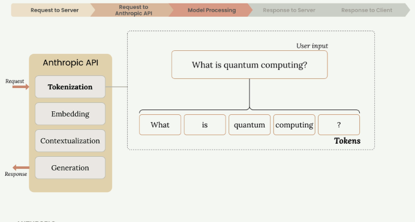
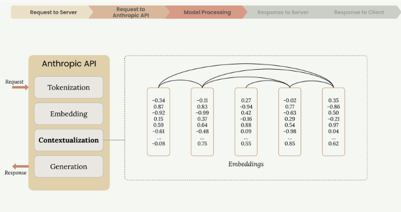

---

#### 2.5 Cuándo Claude deja de generar

Después de cada token, Claude evalúa si continuar:

- **Máximo de tokens alcanzado** — llegó al límite especificado.
- **Final natural** — generó un token de fin de secuencia.
- **Stop sequence** — encontró una frase de parada predefinida.

---

#### 2.6 La respuesta de la API

Cuando termina la generación, la API devuelve una respuesta estructurada con:

- **Message** — el texto generado.
- **Usage** — recuento de tokens de entrada y salida.
- **Stop reason** — motivo por el que terminó la generación.

El servidor reenvía el texto generado a la aplicación cliente, donde aparece en la UI.

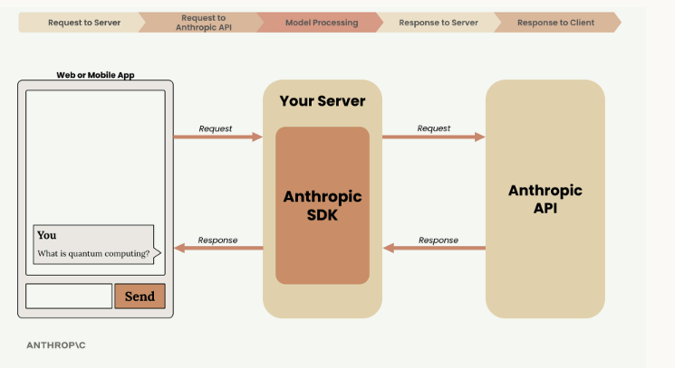

---

#### 2.7 Conclusiones clave

Comprender este flujo permite:

- Diseñar arquitecturas seguras que protejan las claves API.
- Establecer límites de tokens adecuados al caso de uso.
- Gestionar distintos *stop reasons* en la lógica de la aplicación.
- Depurar problemas identificando en qué etapa del flujo ocurren.

---

### Resumen de la Unidad 1: Introducción

Esta unidad establece el vocabulario y la arquitectura conceptual del curso.

| Módulo | Tema | Concepto clave |
| --- | --- | --- |
| **1** | Modelos de Claude | Tres modelos con tradeoffs distintos: Opus (máxima inteligencia, mayor costo), Sonnet (balance calidad/velocidad), Haiku (mínimo costo, máxima velocidad); elegir según complejidad y volumen de la tarea |
| **2** | Ciclo de vida de una solicitud | Flujo de 5 pasos: cliente → backend → API de Anthropic → modelo → respuesta; la clave API nunca se expone al frontend; cada etapa tiene su propio punto de fallo |

**Patrón transversal de la unidad:** la elección del modelo no es cosmética — afecta el costo, la latencia y la calidad de cada respuesta. Dominar cuándo usar Haiku vs Sonnet vs Opus es una decisión de ingeniería que reaparece en todas las unidades siguientes.

---

## Unidad 2: Acceso a Claude mediante API

### Módulo 3: Hacer una solicitud (primera llamada a la API)

Realizar la primera solicitud a la API de Anthropic es sencillo una vez configurado el entorno y comprendida la estructura básica.

#### 3.1 Configuración del entorno

Instalar dependencias en el notebook:

```
%pip install anthropic python-dotenv
```

Crear un archivo `.env` en el mismo directorio para guardar la clave API de forma segura:

```
ANTHROPIC_API_KEY="your-api-key-here"
```

> Esto mantiene la clave fuera del código y evita subirla por accidente al control de versiones. Siempre agrega `.env` a tu `.gitignore`.

Cargar variables de entorno y crear el cliente:

```python
from dotenv import load_dotenv
load_dotenv()          # Lee el archivo .env y carga las variables de entorno (incluida la API key)

from anthropic import Anthropic

client = Anthropic()           # Crea el cliente; toma la API key de la variable de entorno automáticamente
model = "claude-sonnet-4-0"    # Define el modelo a usar en todas las solicitudes
```

---

#### 3.2 La función `create`

La base para enviar solicitudes es `client.messages.create()`. Tres parámetros clave:

| Parámetro | Descripción |
|---|---|
| **model** | Nombre del modelo Claude a usar |
| **max_tokens** | Límite de seguridad para la longitud de la respuesta (no un objetivo) |
| **messages** | Historial de conversación enviado a Claude |

> `max_tokens` es un mecanismo de seguridad: si lo fijas en 1000, Claude se detendrá al llegar a ese número aunque tenga más que decir. Claude **no intenta alcanzar** el límite; simplemente escribe lo que considera apropiado y se detiene si toca el máximo.

---

#### 3.3 Comprender los mensajes

Los mensajes representan la conversación, similar a un chat. Dos tipos:

- **User messages** — contenido que envías a Claude (escrito por humanos).
- **Assistant messages** — respuestas generadas por Claude.

Cada mensaje es un diccionario con un `role` (`"user"` o `"assistant"`) y un `content` (el texto).

---

#### 3.4 Primera solicitud

```python
message = client.messages.create(
    model=model,        # Modelo a usar (definido arriba)
    max_tokens=1000,    # Límite de tokens en la respuesta; Claude se detiene aquí si no terminó antes
    messages=[
        {
            "role": "user",                                              # Quién envía el mensaje
            "content": "What is quantum computing? Answer in one sentence"  # El texto del mensaje
        }
    ]
)
```

Claude procesa la solicitud y devuelve un objeto de respuesta con el texto generado y metadatos.

---

#### 3.5 Extraer la respuesta

El objeto de respuesta trae mucha información, pero normalmente solo necesitas el texto generado:

```python
message.content[0].text
# message.content es una lista de bloques de contenido
# [0] accede al primer (y generalmente único) bloque
# .text extrae el texto generado como string limpio
```

Esto entrega una salida limpia y legible (por ejemplo, una definición de computación cuántica en una sola oración).

Con estas bases puedes empezar a experimentar con distintos prompts y construir interacciones más complejas con Claude.

---

### Módulo 4: Conversaciones de múltiples turnos

#### 4.1 Claude no tiene memoria

Claude **no almacena historial de conversaciones**. Cada solicitud es completamente independiente — no recuerda ningún intercambio anterior.

> Si le preguntas "¿Qué es la computación cuántica?" y luego envías "Escribe otra frase", Claude escribirá sobre algo aleatorio porque no recuerda el contexto previo.

---

#### 4.2 Cómo mantener el contexto

Para que Claude "recuerde" la conversación, tú debes gestionar el estado manualmente:

| Paso | Acción |
|---|---|
| 1 | Mantener una lista acumulativa de mensajes en tu código |
| 2 | Enviar el historial completo con cada nueva solicitud |

#### Flujo de una conversación de varios turnos

1. Enviar el mensaje inicial de usuario a Claude.
2. Tomar la respuesta y agregarla al historial como mensaje `assistant`.
3. Añadir la siguiente pregunta como mensaje `user`.
4. Enviar **todo el historial** en la próxima solicitud.

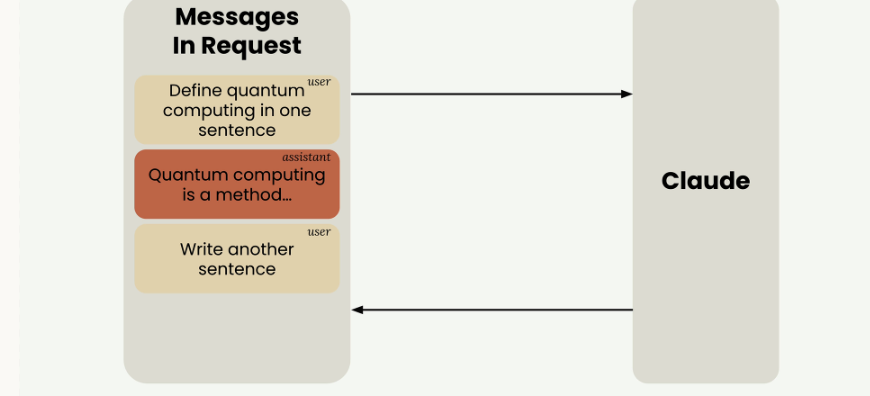

---

#### 4.3 Funciones auxiliares

Para simplificar la gestión del historial:

```python
def add_user_message(messages, text):
    messages.append({"role": "user", "content": text})      # Agrega un turno del usuario al historial

def add_assistant_message(messages, text):
    messages.append({"role": "assistant", "content": text}) # Agrega la respuesta de Claude al historial

def chat(messages):
    message = client.messages.create(
        model=model,
        max_tokens=1000,
        messages=messages,   # Envía el historial completo en cada solicitud
    )
    return message.content[0].text   # Devuelve solo el texto de la respuesta
```

---

#### 4.4 Ejemplo completo

```python
messages = []   # Historial vacío al inicio de la conversación

add_user_message(messages, "Define quantum computing in one sentence")
answer = chat(messages)         # Primera llamada: solo hay un mensaje de usuario

add_assistant_message(messages, answer)          # Guarda la respuesta de Claude en el historial
add_user_message(messages, "Write another sentence")  # Agrega la segunda pregunta

final_answer = chat(messages)   # Segunda llamada: envía los 3 mensajes juntos para mantener contexto
```

Ahora Claude entiende que "Write another sentence" se refiere a la definición de computación cuántica, porque recibe el historial completo.

---

### Módulo 5: System Prompts

#### 5.1 ¿Qué son y para qué sirven?

Los **system prompts** permiten personalizar cómo Claude responde: su tono, rol, restricciones y enfoque. En lugar de respuestas genéricas, obtenés comportamiento adaptado a tu caso de uso.

> **Ejemplo:** Un tutor de matemáticas no debería dar la respuesta directa — debería guiar al estudiante paso a paso. Un system prompt hace exactamente eso.

| Sin system prompt | Con system prompt de tutor |
|---|---|
| Da la solución completa de inmediato | Hace preguntas orientadoras |
| Comportamiento genérico | Rol especializado y coherente |

---

#### 5.2 Estructura básica

```python
system_prompt = """
You are a patient math tutor.
Do not directly answer a student's questions.
Guide them to a solution step by step.
"""
# El system prompt define el rol y comportamiento de Claude para toda la conversación

client.messages.create(
    model=model,
    messages=messages,
    max_tokens=1000,
    system=system_prompt    # Se pasa como parámetro separado, no dentro de messages
)
```

---

#### 5.3 Función de chat flexible

La API de Claude **no acepta `system=None`**, por lo que hay que incluir el parámetro condicionalmente:

```python
def chat(messages, system=None):
    params = {              # Parámetros base que siempre se envían
        "model": model,
        "max_tokens": 1000,
        "messages": messages,
    }
    if system:
        params["system"] = system   # Solo se agrega si se proporcionó (la API no acepta system=None)

    message = client.messages.create(**params)   # ** desempaqueta el diccionario como argumentos nombrados
    return message.content[0].text
```

Uso:

```python
# Sin system prompt
answer = chat(messages)

# Con system prompt
system = "You are a patient math tutor. Guide students step by step."
answer = chat(messages, system=system)
```

Los system prompts son esenciales para que una aplicación de IA se comporte de forma coherente y apropiada a su propósito.

---

### Módulo 6: Temperatura

#### 6.1 ¿Qué es la temperatura?

La **temperatura** es un parámetro decimal entre `0.0` y `1.0` que controla qué tan predecibles o creativas son las respuestas de Claude. Influye directamente en la etapa de **muestreo** del proceso de generación.

> La tokenización y la predicción de probabilidades ocurren igual siempre — la temperatura solo afecta cómo se elige el siguiente token a partir de esas probabilidades.

---


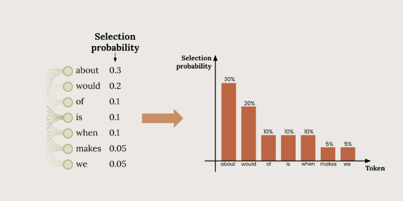

#### 6.2 Cómo afecta la temperatura a las probabilidades

| Temperatura | Efecto |
| --- | --- |
| **Cercana a 0** | Claude casi siempre elige el token más probable → respuestas deterministas |
| **Cercana a 1** | Las probabilidades se distribuyen más uniformemente → respuestas variadas y creativas |

Ejemplo: para el token siguiente a "¿Qué opinas?", Claude puede asignar 30 % a "about", 20 % a "would", 10 % a "of", etc. A temperatura 0.0 siempre elige "about"; a temperatura 1.0 cualquiera de ellos puede ganar.

---

#### 6.3 Temperatura según el tipo de tarea

| Rango | Tipo de tarea | Ejemplos |
| --- | --- | --- |
| **0.0 – 0.3** (baja) | Precisión y consistencia | Respuestas factuales, codificación, extracción de datos, moderación |
| **0.4 – 0.7** (media) | Balance entre calidad y variedad | Resúmenes, contenido educativo, resolución de problemas, escritura creativa acotada |
| **0.8 – 1.0** (alta) | Creatividad y diversidad | Lluvia de ideas, marketing, escritura libre, generación de humor |

---

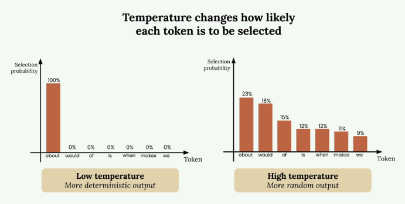

#### 6.4 Agregar temperatura a la función de chat

```python
def chat(messages, system=None, temperature=1.0):   # temperature=1.0 es el valor por defecto
    params = {
        "model": model,
        "max_tokens": 1000,
        "messages": messages,
        "temperature": temperature   # Controla la creatividad: 0.0 = determinista, 1.0 = creativo
    }
    if system:
        params["system"] = system

    message = client.messages.create(**params)
    return message.content[0].text
```

Los únicos cambios respecto a la versión anterior son añadir `temperature=1.0` como parámetro e incluirlo en el diccionario `params`.

---

#### 6.5 Conclusiones clave

- La temperatura **no garantiza** resultados diferentes; solo cambia la probabilidad de obtenerlos.
- Incluso a temperatura alta, Claude puede producir respuestas similares ocasionalmente.
- Ajustar la temperatura al caso de uso específico es más útil que dejarlo en el valor por defecto.

| Situación | Temperatura recomendada |
| --- | --- |
| Necesito respuestas consistentes y objetivas | Baja (0.0 – 0.3) |
| Quiero lluvia de ideas creativa | Alta (0.8 – 1.0) |
| Tarea general equilibrada | Media (0.4 – 0.7) |

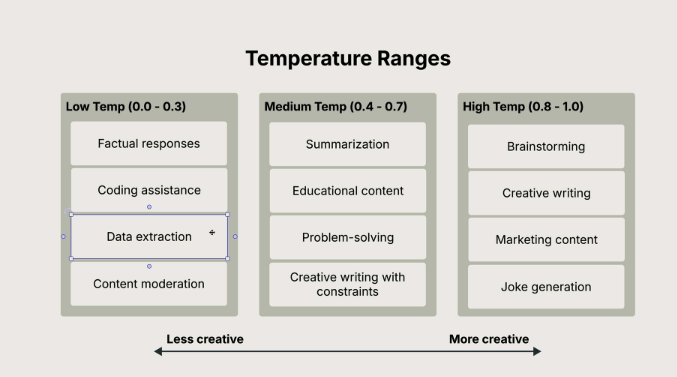

---

### Módulo 7: Transmisión de respuesta (Streaming)

#### 7.1 El problema con las respuestas estándar

En una configuración típica, el servidor espera la respuesta **completa** de Claude antes de enviar algo al cliente. Esto genera una demora de 10 a 30 segundos en la que el usuario no recibe ninguna señal de que algo está pasando.

---

#### 7.2 Cómo funciona el streaming

Con streaming habilitado, Claude envía fragmentos de texto a medida que los genera. Tu servidor puede reenviarlos al cliente en tiempo real, permitiendo que el usuario vea la respuesta aparecer palabra por palabra — igual que en claude.ai.

Todos estos fragmentos son parte de una única solicitud a la API.

---

#### 7.3 Tipos de eventos del stream

| Evento | Descripción |
| --- | --- |
| **MessageStart** | Inicio de un nuevo mensaje |
| **ContentBlockStart** | Inicio de un bloque de contenido (texto, tool use, etc.) |
| **ContentBlockDelta** | Fragmento del texto generado |
| **ContentBlockStop** | El bloque de contenido actual finalizó |
| **MessageDelta** | El mensaje actual está completo |
| **MessageStop** | Fin de la información del mensaje |

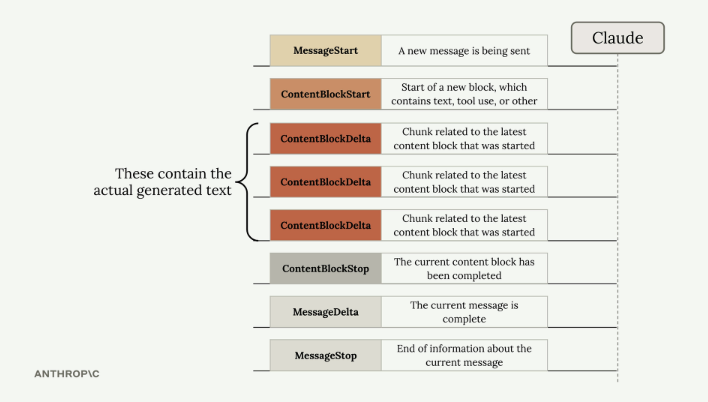

Los eventos `ContentBlockDelta` contienen el texto que se muestra al usuario.


---

#### 7.4 Implementación básica

```python
stream = client.messages.create(
    model=model,
    max_tokens=1000,
    messages=messages,
    stream=True     # Activa el modo streaming: Claude envía fragmentos en lugar de esperar la respuesta completa
)

for event in stream:
    print(event)    # Imprime cada evento raw (incluye metadata, no solo texto)
```

---

#### 7.5 Interfaz simplificada con `messages.stream`

En lugar de parsear manualmente los eventos, el SDK ofrece una interfaz simplificada que extrae solo el texto:

```python
with client.messages.stream(   # Interfaz de alto nivel del SDK; maneja el stream automáticamente
    model=model,
    max_tokens=1000,
    messages=messages
) as stream:
    for text in stream.text_stream:     # Itera solo sobre los fragmentos de texto (filtra el resto de eventos)
        print(text, end="")             # end="" evita saltos de línea entre fragmentos; el texto fluye continuo
```

Esto filtra automáticamente todo excepto el contenido de texto, que es lo que normalmente se necesita para mostrar al usuario.

---

#### 7.6 Obtener el mensaje completo al final

Después del streaming se puede recuperar el mensaje ensamblado completo, útil para guardarlo en base de datos o procesarlo:

```python
with client.messages.stream(
    model=model,
    max_tokens=1000,
    messages=messages
) as stream:
    for text in stream.text_stream:
        pass    # Aquí iría el código para enviar cada fragmento al cliente en tiempo real

    # Una vez terminado el stream, get_final_message() devuelve el objeto Message completo
    # (con el texto ensamblado, uso de tokens, stop_reason, etc.)
    final_message = stream.get_final_message()
```

Esto da lo mejor de ambos mundos: streaming en tiempo real para el usuario y un objeto de mensaje completo para la lógica de la aplicación.

---

### Módulo 8: Datos estructurados

#### 8.1 El problema

Cuando le pides a Claude que genere JSON u otro contenido estructurado, por defecto añade texto explicativo y lo envuelve en bloques de código Markdown:

````markdown
```json
{
  "source": ["aws.ec2"],
  ...
}
```
This rule captures EC2 instance state changes when instances start running.
````

Para aplicaciones donde el usuario necesita copiar el dato directamente (ej. una regla de AWS EventBridge), esto genera fricción innecesaria.

---

#### 8.2 La solución: prefill + stop sequences

Combinar el **prellenado del mensaje del asistente** con **secuencias de parada** permite extraer exactamente el contenido deseado:

```python
messages = []

add_user_message(messages, "Generate a very short event bridge rule as json")
add_assistant_message(messages, "```json")   # Prefill: Claude "cree" que ya empezó un bloque de código

# stop_sequences hace que Claude deje de generar cuando intente escribir el cierre ```
text = chat(messages, stop_sequences=["```"])
```

**Cómo funciona:**

| Paso | Qué ocurre |
| --- | --- |
| 1 | El mensaje de usuario indica qué generar |
| 2 | El prefill hace que Claude crea que ya abrió un bloque de código |
| 3 | Claude continúa escribiendo solo el contenido JSON |
| 4 | Cuando Claude intenta cerrar con ` ``` `, la stop sequence detiene la generación |

El resultado es JSON limpio sin ningún formato adicional.

---

#### 8.3 Procesar la respuesta

La respuesta puede tener saltos de línea sobrantes; `json.loads` con `strip()` los elimina:

```python
import json

clean_json = json.loads(text.strip())
# text.strip() elimina espacios y saltos de línea al inicio y al final
# json.loads() convierte el string JSON en un diccionario Python
```

---

#### 8.4 Más allá de JSON

La misma técnica aplica a cualquier contenido estructurado donde solo se quiere el dato, sin explicaciones:

- Fragmentos de código Python
- Listas con viñetas
- Datos CSV
- Cualquier formato donde Claude envuelva naturalmente el contenido

La clave es identificar el patrón de apertura que Claude usaría y usarlo como prefill y como stop sequence de cierre.

---

### Resumen de la Unidad 2: Acceso a Claude mediante API

Esta unidad construyó las primitivas fundamentales sobre las que se apoya todo el curso.

| Módulo | Tema | Concepto clave |
| --- | --- | --- |
| **3** | Primera llamada a la API | `client.messages.create(model, max_tokens, messages)` — estructura mínima obligatoria; la respuesta incluye `content[0].text` y `stop_reason` |
| **4** | Conversaciones multi-turno | Array `messages` con roles alternados `user`/`assistant`; el historial completo se reenvía en cada solicitud — Claude no tiene memoria propia |
| **5** | System prompts | Parámetro `system` separado del array `messages`; define rol, restricciones y contexto persistente sin ocupar un turno de conversación |
| **6** | Temperatura | Rango 0–1: 0 = determinístico y reproducible, 1 = máxima creatividad; controla la distribución de probabilidad sobre tokens |
| **7** | Streaming | `stream=True` + iteración sobre eventos `message_delta`; permite mostrar tokens en tiempo real sin esperar la respuesta completa |
| **8** | Datos estructurados | Prefill de la respuesta de Claude + stop sequences para extraer solo el dato útil (JSON, CSV, código) sin texto adicional |

**Patrón transversal de la unidad:** todas las primitivas de esta unidad son parámetros de `client.messages.create()`. Dominar ese único punto de entrada — sus parámetros, sus tipos de respuesta y sus modos de operación — es la base técnica de todo lo que sigue en el curso.

---

## Unidad 3: Evaluación inmediata

### Módulo 9: Evaluación de indicaciones

#### 9.1 Ingeniería vs. evaluación de indicaciones

Trabajar con Claude implica dos disciplinas distintas:

| Concepto | Qué es |
| --- | --- |
| **Ingeniería de indicaciones** | Técnicas para redactar mejores prompts (few-shot, XML, etc.) |
| **Evaluación de indicaciones** | Medir la eficacia de los prompts mediante pruebas automatizadas |

La ingeniería te dice *cómo* escribir; la evaluación te dice *qué tan bien* funciona lo que escribiste.

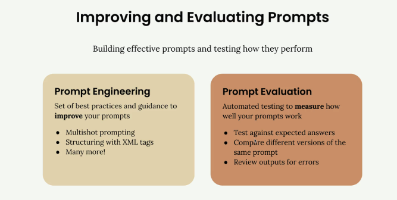

---

#### 9.2 Tres opciones tras escribir una indicación

| Opción | Descripción | Riesgo |
| --- | --- | --- |
| **1** | Probar una sola vez y decidir si es suficiente | Alto — falla ante entradas inesperadas en producción |
| **2** | Probar varias veces y ajustar uno o dos casos borde | Medio — los usuarios siempre encontrarán casos no considerados |
| **3** | Someter la indicación a un proceso de evaluación con métricas objetivas | Bajo — mayor inversión inicial, mucha más confianza en la fiabilidad |

---

#### 9.3 Por qué las opciones 1 y 2 son trampas

Es natural escribir un prompt para una aplicación seria y no probarlo lo suficiente. Los ingenieros tienden a subestimar la variedad de entradas que generarán los usuarios reales. Lo que parece sólido en pruebas limitadas puede fallar rápidamente en producción.

---

#### 9.4 El enfoque de evaluación primero (Opción 3)

Someter la indicación a un proceso de evaluación sistemático permite:

- Identificar debilidades antes de que lleguen a producción
- Comparar objetivamente distintas versiones del mismo prompt
- Iterar con confianza basándose en mejoras medibles
- Construir aplicaciones de IA más fiables

Requiere mayor inversión inicial en infraestructura de pruebas, pero los beneficios en robustez y confiabilidad justifican el esfuerzo.

---

#### 9.5 Flujo de trabajo de evaluación típico

El proceso consta de cinco pasos que se repiten iterativamente:

#### Paso 1 — Redactar una indicación inicial

```python
prompt = f"""
Please answer the user's question:

{question}
"""
```

Esta es la línea de base que se va a medir y mejorar.

#### Paso 2 — Crear un conjunto de datos de evaluación

Reúne ejemplos representativos de las entradas que el prompt recibirá en producción. Pueden ser decenas, cientos o miles de registros. También puedes usar Claude para generarlos.

Ejemplo mínimo:

- "What's 2+2?"
- "How do you make oatmeal?"
- "How far away is the Moon?"

#### Paso 3 — Pasar cada entrada por Claude

Combina cada ejemplo con la plantilla de la indicación y envíalo a Claude para obtener una respuesta por cada registro del dataset.

#### Paso 4 — Calificar las respuestas

Un evaluador (modelo o código) analiza cada par pregunta-respuesta y asigna una puntuación, típicamente del 1 al 10. El promedio da una métrica objetiva de referencia.

Ejemplo:

| Pregunta | Puntuación |
| --- | --- |
| Matemáticas (2+2) | 10 |
| Avena | 4 |
| Distancia a la Luna | 9 |
| **Promedio** | **7.66** |

#### Paso 5 — Modificar la indicación y repetir

Con la métrica de referencia en mano, ajusta el prompt y vuelve a correr todo el proceso. Si la nueva puntuación es más alta, el cambio fue una mejora real.

```python
prompt = f"""
Please answer the user's question:

{question}

Answer the question with ample detail
"""
```

Nueva puntuación promedio: **8.7** → la instrucción adicional mejoró el rendimiento.

---

#### 9.6 La ventaja del enfoque

Este ciclo sistemático elimina las conjeturas de la ingeniería de indicaciones:

- Las comparaciones son numéricas y objetivas
- Siempre se usa la versión con mejor puntuación
- Se puede seguir iterando con confianza en que cada cambio es una mejora medible, no solo una variación diferente

---

#### 9.7 Generación de conjuntos de datos de prueba

#### Objetivo de ejemplo

Construir un evaluador para una indicación que ayude a usuarios a escribir código específico de AWS. Los formatos de salida esperados son:

- Código Python
- Archivos de configuración JSON
- Expresiones regulares

La indicación inicial (v1):

```python
prompt = f"""
Please provide a solution to the following task:
{task}
"""
```

---

#### Generar el dataset con Claude

En lugar de crear los casos de prueba manualmente, se puede usar un modelo rápido (Haiku) para generarlos automáticamente:

```python
def generate_dataset():
    prompt = """
Generate an evaluation dataset for a prompt evaluation. The dataset will be used to evaluate
prompts that generate Python, JSON, or Regex specifically for AWS-related tasks.
Generate an array of JSON objects, each representing a task that requires Python, JSON, or a Regex.

Example output:
[
  {"task": "Description of task"},
  ...
]

* Focus on tasks solvable by a single Python function, JSON object, or regex
* Focus on tasks that do not require much code

Please generate 3 objects.
"""
    messages = []
    add_user_message(messages, prompt)
    add_assistant_message(messages, "```json")  # Prefill para forzar respuesta JSON limpia
    text = chat(messages, stop_sequences=["```"])  # Detiene la generación antes del cierre ```
    return json.loads(text)   # Convierte el string en lista de diccionarios Python
```

> Se usa prefill + stop sequence para extraer el JSON limpio directamente. Si el modelo no soporta prefill, reemplazar por un system prompt que indique devolver solo JSON.

---

#### Guardar el dataset

Una vez generado, se persiste en disco para reutilizarlo en cada ciclo de evaluación:

```python
dataset = generate_dataset()   # Llama a Claude para generar los casos de prueba

with open('dataset.json', 'w') as f:
    json.dump(dataset, f, indent=2)   # indent=2 da formato legible con sangría al JSON guardado
```

Esto crea un archivo `dataset.json` en el mismo directorio del notebook, listo para ser cargado en las siguientes etapas del flujo de evaluación.

---

#### 9.8 Ejecutar la evaluación

El flujo es: dataset → combinar con prompt → enviar a Claude → calificar resultado.

#### Tres funciones principales

**`run_prompt`** — combina el caso de prueba con la plantilla y llama a Claude:

```python
def run_prompt(test_case):
    prompt = f"""
Please solve the following task:

{test_case["task"]}   
"""
    # test_case["task"] inserta la descripción del caso de prueba en la plantilla del prompt
    messages = []
    add_user_message(messages, prompt)
    return chat(messages)   # Devuelve el texto de la respuesta de Claude
```

**`run_test_case`** — ejecuta un caso y califica el resultado:

```python
def run_test_case(test_case):
    output = run_prompt(test_case)
    score = 10  # placeholder — se reemplaza con lógica real de calificación
    return {
        "output": output,
        "test_case": test_case,
        "score": score
    }
```

**`run_eval`** — coordina todo el proceso sobre el dataset completo:

```python
def run_eval(dataset):
    results = []
    for test_case in dataset:
        result = run_test_case(test_case)
        results.append(result)
    return results
```

---

#### Ejecutar y examinar resultados

```python
with open("dataset.json", "r") as f:
    dataset = json.load(f)   # Carga el dataset guardado como lista de diccionarios Python

results = run_eval(dataset)
print(json.dumps(results, indent=2))   # Imprime los resultados formateados con sangría para leerlos fácil
```

Cada objeto de resultados contiene:

| Campo | Descripción |
| --- | --- |
| `output` | Respuesta completa de Claude |
| `test_case` | El caso de prueba original |
| `score` | Puntuación de evaluación (por ahora fija en 10) |

> Procesar un dataset completo con Haiku puede tomar ~30 segundos. La puntuación fija de `10` es un placeholder — la lógica real de calificación se agrega en el siguiente paso.

---

#### 9.9 Calificación basada en modelos

Un evaluador toma la salida del modelo y devuelve una señal objetiva de calidad, generalmente un número del 1 al 10.

#### Tipos de evaluadores

| Tipo | Descripción | Mejor para |
| --- | --- | --- |
| **Código** | Lógica programática personalizada | Longitud, sintaxis, palabras clave |
| **Modelo** | Otro modelo de IA evalúa la salida | Calidad, utilidad, seguimiento de instrucciones |
| **Humano** | Revisión manual | Calidad general, profundidad, relevancia |


---

#### Criterios de evaluación para generación de código AWS

Antes de implementar el evaluador, definir criterios claros:

| Criterio | Evaluador recomendado |
| --- | --- |
| **Formato** — solo Python, JSON o regex, sin explicación | Código |
| **Sintaxis válida** — el código generado compila/parsea | Código |
| **Seguimiento de tarea** — responde directamente lo que se pidió | Modelo |

---

#### Implementar el evaluador por modelo

```python
def grade_by_model(test_case, output):
    eval_prompt = f"""
Eres un revisor experto de código. Evalúa esta solución generada por IA.

Tarea: {test_case["task"]}
Solución: {output}

Devuelve un objeto JSON con:
- "strengths": lista de 1-3 fortalezas clave
- "weaknesses": lista de 1-3 áreas de mejora
- "reasoning": explicación concisa de tu evaluación
- "score": número entre 1 y 10
"""
    messages = []
    add_user_message(messages, eval_prompt)
    add_assistant_message(messages, "```json")

    eval_text = chat(messages, stop_sequences=["```"])
    return json.loads(eval_text)
```

> Pedir `strengths`, `weaknesses` y `reasoning` junto con el puntaje es clave. Sin ese contexto, los modelos tienden a dar puntajes mediocres alrededor de 6 sin mucha variación.

---

#### Integrar la calificación en el flujo

```python
def run_test_case(test_case):
    output = run_prompt(test_case)         # 1. Obtiene la respuesta de Claude
    model_grade = grade_by_model(test_case, output)  # 2. La evalúa con el calificador

    return {
        "output": output,                  # Respuesta original de Claude
        "test_case": test_case,            # Caso de prueba usado
        "score": model_grade["score"],     # Puntaje numérico (1-10)
        "reasoning": model_grade["reasoning"]  # Justificación del puntaje
    }
```

```python
from statistics import mean

def run_eval(dataset):
    results = []
    for test_case in dataset:
        result = run_test_case(test_case)  # Corre y califica cada caso
        results.append(result)

    # Calcula el promedio de todos los puntajes para tener una métrica global
    average_score = mean([result["score"] for result in results])
    print(f"Puntuación promedio: {average_score}")
    return results
```

`mean([result["score"] for result in results])` recorre la lista de resultados, extrae el campo `score` de cada uno y calcula el promedio. Ese número es la métrica de referencia: si al cambiar el prompt el promedio sube, la nueva versión es objetivamente mejor.

La puntuación promedio es la métrica de referencia que se usa para comparar versiones del prompt. Los evaluadores de modelos pueden ser algo variables, pero ofrecen una línea base consistente para medir mejoras.

---

#### 9.10 Calificación basada en código

Mientras el evaluador por modelo mide calidad semántica, el evaluador por código verifica dos aspectos técnicos objetivos:

| Criterio | Evaluador |
| --- | --- |
| **Formato** — solo Python, JSON o regex, sin explicación | Código |
| **Sintaxis válida** — el código parsea correctamente | Código |
| **Seguimiento de tarea** — responde lo que se pidió con precisión | Modelo |

---

#### Funciones de validación de sintaxis

Cada función intenta parsear el texto en su formato correspondiente. Si tiene éxito devuelve 10; si falla devuelve 0:

```python
import json, ast, re

def validate_json(text):
    try:
        json.loads(text.strip())   # Intenta convertir el string a un objeto JSON
        return 10                  # Sintaxis válida
    except json.JSONDecodeError:
        return 0                   # JSON malformado

def validate_python(text):
    try:
        ast.parse(text.strip())    # Intenta parsear el string como código Python
        return 10
    except SyntaxError:
        return 0                   # Error de sintaxis Python

def validate_regex(text):
    try:
        re.compile(text.strip())   # Intenta compilar el string como expresión regular
        return 10
    except re.error:
        return 0                   # Regex inválida
```

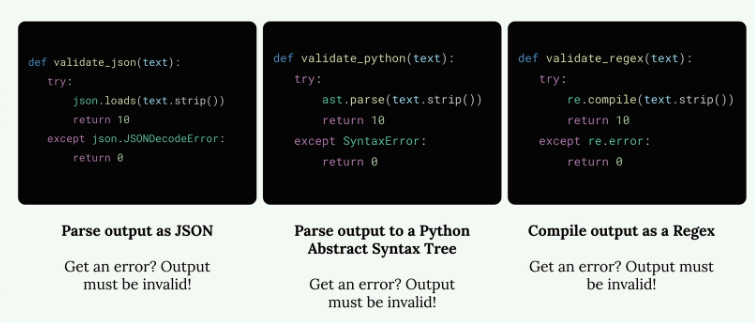

---

#### Agregar el campo `format` al dataset

Para que el evaluador sepa qué validador usar, cada caso de prueba debe incluir el formato esperado:

```python
# Ejemplo de caso de prueba con formato especificado
{
    "task": "Create a Python function to validate an AWS IAM username",
    "format": "python"   # Indica qué validador aplicar: "python", "json" o "regex"
}
```

---

#### Mejorar el prompt para forzar formato limpio

Agregar instrucciones explícitas de formato reduce respuestas con texto explicativo innecesario:

```python
# Instrucciones de formato en el prompt
"""
* Respond only with Python, JSON, or a plain Regex
* Do not add any comments or commentary or explanation
"""

# Prefill genérico para code blocks (sin especificar el lenguaje)
add_assistant_message(messages, "```code")
# Claude interpreta esto como la apertura de un bloque de código y continúa solo con el código
```

---

#### Combinar puntaje de modelo y puntaje de código

```python
model_grade = grade_by_model(test_case, output)
model_score = model_grade["score"]       # Calidad semántica: ¿resuelve bien la tarea?
syntax_score = grade_syntax(output, test_case)  # Corrección técnica: ¿es sintaxis válida?

score = (model_score + syntax_score) / 2   # Promedio simple: ambos criterios tienen igual peso
```

El peso de cada criterio se puede ajustar según el caso de uso. Por ejemplo, si la sintaxis válida es crítica, podría dársele más peso que la calidad semántica.

> La puntuación de referencia no es buena ni mala en sí misma — lo que importa es si mejora al iterar sobre el prompt. El evaluador por código convierte esa medición en algo objetivo y reproducible.

---

### Resumen de la Unidad 3: Evaluación inmediata

Esta unidad introduce el criterio metodológico más importante del curso: medir antes de desplegar.

| Módulo | Tema | Concepto clave |
| --- | --- | --- |
| **9** | Evaluación de prompts | Tres estrategias complementarias: evaluador por código (criterios objetivos y reproducibles), LLM-as-judge (calidad semántica flexible) e híbrido (promedio ponderado de ambos); la puntuación base sirve de referencia para medir mejoras |

**Patrón transversal de la unidad:** un sistema que no se puede medir no se puede mejorar. La evaluación no es un paso final — es un proceso continuo que convierte la ingeniería de prompts en una disciplina empírica en lugar de una práctica de ensayo y error.

---

## Unidad 4: Ingeniería de indicaciones

### Módulo 10: Ingeniería rápida — proceso iterativo

La ingeniería de indicaciones consiste en tomar un prompt existente y mejorarlo sistemáticamente para obtener resultados más fiables y de mayor calidad.

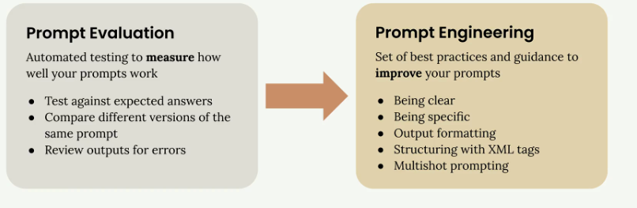

---

#### 10.1 El ciclo de mejora iterativa

| Paso | Acción |
| --- | --- |
| 1 | Definir el objetivo |
| 2 | Escribir una indicación inicial básica |
| 3 | Evaluar con métricas objetivas |
| 4 | Aplicar técnicas de ingeniería |
| 5 | Reevaluar y comparar puntajes |
| 6 | Repetir hasta alcanzar el rendimiento deseado |

Cada iteración debería mostrar una mejora apreciable en el puntaje de evaluación.

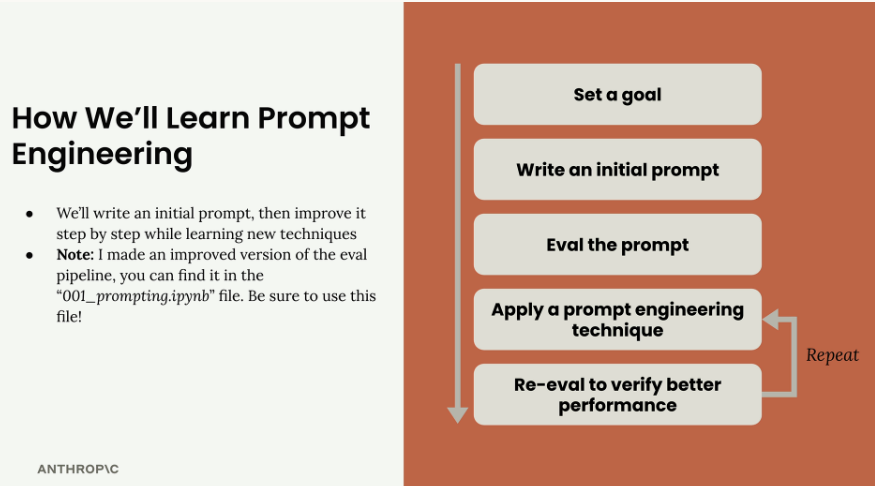

---

#### 10.2 Configurar el evaluador

```python
# PromptEvaluator gestiona la generación del dataset y la calificación
evaluator = PromptEvaluator(max_concurrent_tasks=5)
# max_concurrent_tasks controla cuántas tareas corren en paralelo
# Empezar con 3 para evitar errores de límite de velocidad de la API
```

---

#### 10.3 Generar el dataset de prueba automáticamente

```python
dataset = evaluator.generate_dataset(
    task_description="Write a compact, concise 1 day meal plan for a single athlete",
    prompt_inputs_spec={          # Define qué variables necesita el prompt
        "height": "Athlete's height in cm",
        "weight": "Athlete's weight in kg",
        "goal": "Goal of the athlete",
        "restrictions": "Dietary restrictions of the athlete"
    },
    output_file="dataset.json",   # Guarda el dataset en disco para reutilizarlo
    num_cases=3                   # Mantener bajo (2-3) durante desarrollo para iterar rápido
)
```

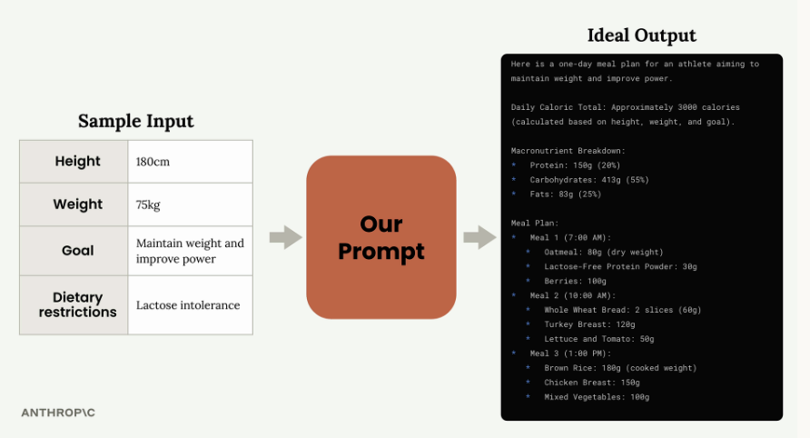

---

#### 10.4 Escribir la indicación inicial (versión naive)

Empezar con algo deliberadamente básico para establecer una línea de base:

```python
def run_prompt(prompt_inputs):
    prompt = f"""
What should this person eat?

- Height: {prompt_inputs["height"]}      # Inserta la estatura del atleta
- Weight: {prompt_inputs["weight"]}      # Inserta el peso
- Goal: {prompt_inputs["goal"]}          # Inserta el objetivo
- Dietary restrictions: {prompt_inputs["restrictions"]}  # Inserta restricciones
"""
    messages = []
    add_user_message(messages, prompt)
    return chat(messages)   # Devuelve la respuesta de Claude sin procesamiento adicional
```

> Una puntuación inicial de ~2.3/10 es normal. El objetivo no es empezar bien, sino **medir la mejora** en cada iteración.

---

#### 10.5 Ejecutar la evaluación con criterios específicos

```python
results = evaluator.run_evaluation(
    run_prompt_function=run_prompt,    # Función que genera la respuesta para cada caso
    dataset_file="dataset.json",       # Dataset con los casos de prueba
    extra_criteria="""
The output should include:
- Daily caloric total
- Macronutrient breakdown
- Meals with exact foods, portions, and timing
"""
    # extra_criteria guía al calificador sobre qué aspectos evaluar específicamente
)
```

El resultado incluye un puntaje numérico y un informe HTML detallado con la justificación del calificador para cada caso de prueba.

---

#### 10.6 Principios clave

- Hacer **un cambio a la vez** para aislar el impacto de cada técnica
- Usar el informe detallado para entender exactamente **dónde falla** el prompt
- La ingeniería de indicaciones es efectiva solo cuando se combina con evaluación objetiva — sin métricas, no se puede saber si un cambio es una mejora real

---

### Módulo 11: Ser claro y directo

La primera línea del prompt es la parte más importante: sienta las bases para todo lo que sigue.

---

#### 11.1 Dos principios clave

| Principio | Qué significa |
| --- | --- |
| **Claridad** | Lenguaje sencillo, sin ambigüedad, que exprese exactamente lo que se quiere |
| **Concisión** | Instrucciones directas, sin rodeos ni contexto innecesario |

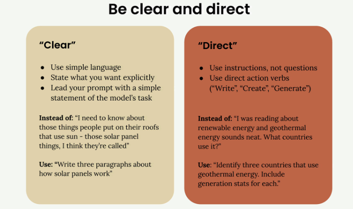

---

#### 11.2 Claridad: decir exactamente lo que se quiere

Empezar con una declaración directa de la tarea, sin ambigüedades.

| En lugar de... | Usar... |
| --- | --- |
| "Necesito saber sobre esas cosas que ponen en los techos que usan el sol..." | "Escribe tres párrafos sobre cómo funcionan los paneles solares." |

---

#### 11.3 Directividad: instrucciones, no preguntas

Comenzar con **verbos de acción** como *Escribir*, *Crear*, *Generar*, *Identificar*.

| En lugar de... | Usar... |
| --- | --- |
| "He estado leyendo sobre energías renovables... ¿qué países usan geotérmica?" | "Identifica tres países que utilicen energía geotérmica. Incluye estadísticas de generación para cada uno." |

---

#### 11.4 Aplicado al ejemplo del plan de comidas

**Versión naive (base):**

```text
What should this person eat?
```

**Versión mejorada:**

```text
Generate a one-day meal plan for an athlete that meets their dietary restrictions.
```

Esta revisión le indica inmediatamente a Claude:

- **Qué acción** tomar → `Generate`
- **Qué crear** → un plan de comidas de un día
- **Para quién y con qué restricción** → un atleta, respetando su dieta

**Resultado:** el puntaje de evaluación pasó de **2.32 → 3.92** con un solo cambio en la primera línea.

> Claude responde mejor cuando se lo trata como un asistente competente que necesita instrucciones claras, no como alguien que tiene que adivinar lo que se quiere.

---

### Módulo 12: Ser específico

Especificar claramente lo que se desea reduce la ambigüedad y guía a Claude hacia resultados más consistentes y de mayor calidad.

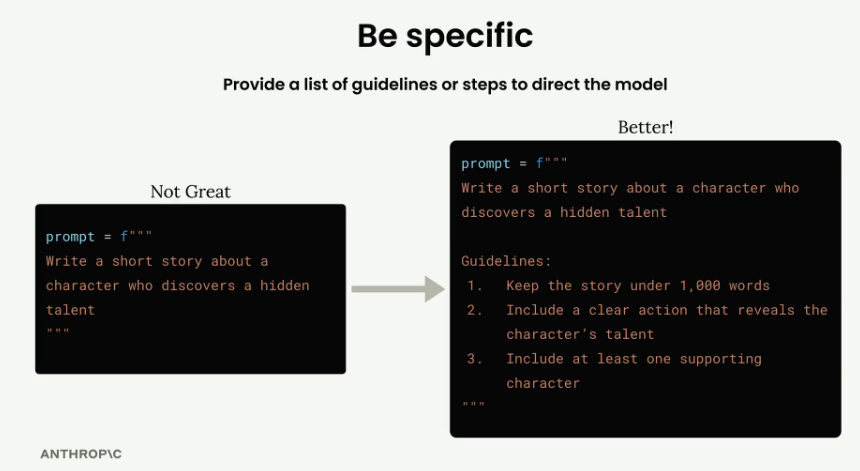

---

#### 12.1 Dos tipos de directrices

| Tipo | Para qué sirve |
| --- | --- |
| **Directrices de calidad de salida** | Controlar longitud, formato, atributos y tono del resultado |
| **Pasos del proceso** | Guiar a Claude para que analice sistemáticamente antes de responder |

Ambos tipos se usan frecuentemente en conjunto en prompts profesionales.

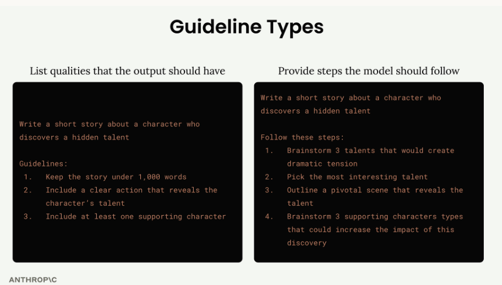

---

#### 12.2 Directrices de calidad de salida

Enumeran las cualidades que debe tener el resultado final. Ejemplos para un plan de comidas:

```text
Guidelines:
1. Include accurate daily calorie amount
2. Show protein, fat, and carb amounts
3. Specify when to eat each meal
4. Use only foods that fit restrictions
5. List all portion sizes in grams
6. Keep budget-friendly if mentioned
```

**Resultado en el ejemplo:** el puntaje de evaluación pasó de **3.92 → 7.86** — más del doble, solo por agregar directrices específicas.

---

#### 12.3 Pasos del proceso

Instrucciones que Claude debe seguir antes de generar la respuesta final. Útiles cuando se quiere análisis sistemático o consideración de múltiples perspectivas.

Ejemplo para una historia:

```text
1. Think of three talents that would create dramatic tension
2. Choose the most interesting talent
3. Describe a key scene that reveals the talent
4. Think of supporting characters that could increase the impact
```

---

#### 12.4 Cuándo usar cada tipo

| Situación | Enfoque recomendado |
| --- | --- |
| Cualquier prompt | Siempre incluir directrices de calidad de salida |
| Resolución de problemas complejos | Agregar pasos del proceso |
| Toma de decisiones o pensamiento crítico | Agregar pasos del proceso |
| Tareas donde Claude debe considerar múltiples perspectivas | Agregar pasos del proceso |

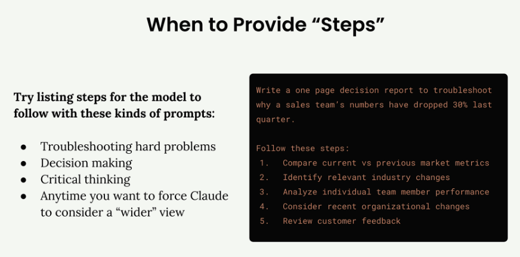

> La especificidad no limita a Claude — le da un objetivo claro al que aspirar, lo que mejora tanto la coherencia como la calidad del resultado.

---

### Módulo 13: Estructura con etiquetas XML

Las etiquetas XML permiten agregar estructura y claridad a los prompts, especialmente cuando se interpolan grandes cantidades de datos o se mezclan diferentes tipos de contenido.

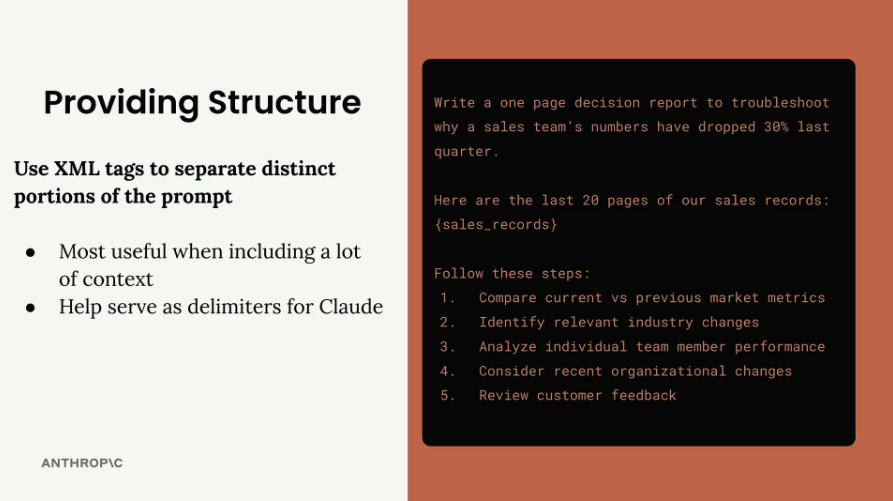

---

#### 13.1 Por qué la estructura importa

Sin delimitadores claros, Claude puede tener dificultades para distinguir entre las instrucciones y los datos que debe analizar. Las etiquetas XML crean límites explícitos entre secciones.

| Sin estructura | Con etiquetas XML |
| --- | --- |
| Instrucciones y datos mezclados | Cada sección claramente delimitada |
| Claude puede malinterpretar el contexto | Claude entiende el propósito de cada bloque |

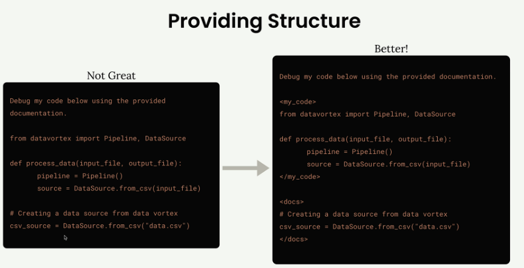

---

#### 13.2 Nombres de etiquetas personalizados

No se necesitan etiquetas XML oficiales — se crean nombres descriptivos según el contenido:

| Etiqueta genérica | Etiqueta descriptiva (preferida) |
| --- | --- |
| `<data>` | `<sales_records>` |
| `<info>` | `<athlete_information>` |
| `<text>` | `<docs>` |

Cuanto más descriptivo el nombre, mejor entiende Claude el propósito de cada sección.

---

#### 13.3 Ejemplo aplicado al plan de comidas

```xml
<athlete_information>
- Height: 6'2"
- Weight: 180 lbs
- Goal: Build muscle
- Dietary restrictions: Vegetarian
</athlete_information>

Generate a meal plan based on the athlete information above.
```

Las etiquetas agrupan todos los datos del atleta como una unidad coherente, dejando en claro qué es contexto y qué es la instrucción.

---

#### 13.4 Cuándo usar etiquetas XML

- Al incluir grandes cantidades de contexto o datos
- Al mezclar diferentes tipos de contenido (código, documentación, datos)
- Cuando los límites del contenido deben ser inequívocos
- En prompts complejos que interpolan múltiples variables

> Las etiquetas XML se vuelven cada vez más valiosas a medida que los prompts se vuelven más complejos. Con prompts simples el impacto es menor, pero en prompts avanzados pueden ser la diferencia entre una respuesta correcta y una confusa.

---

### Módulo 14: Proporcionar ejemplos (few-shot prompting)

Proveer ejemplos de entrada/salida es una de las técnicas más efectivas de ingeniería de indicaciones. Se conoce como **one-shot** (un ejemplo) o **few-shot** (varios ejemplos).

---

#### 14.1 Cómo funcionan los ejemplos

En lugar de describir lo que se quiere con palabras, se **demuestra** directamente con pares de entrada y salida ideal. Esto es especialmente útil para casos ambiguos o difíciles de describir verbalmente.

**Ejemplo:** análisis de sentimiento con sarcasmo

Sin ejemplos, Claude puede interpretar "¡Realmente necesitaba un retraso en el vuelo esta noche! ¡Excelente!" como positivo. Con ejemplos, aprende que el sarcasmo debe clasificarse como negativo.

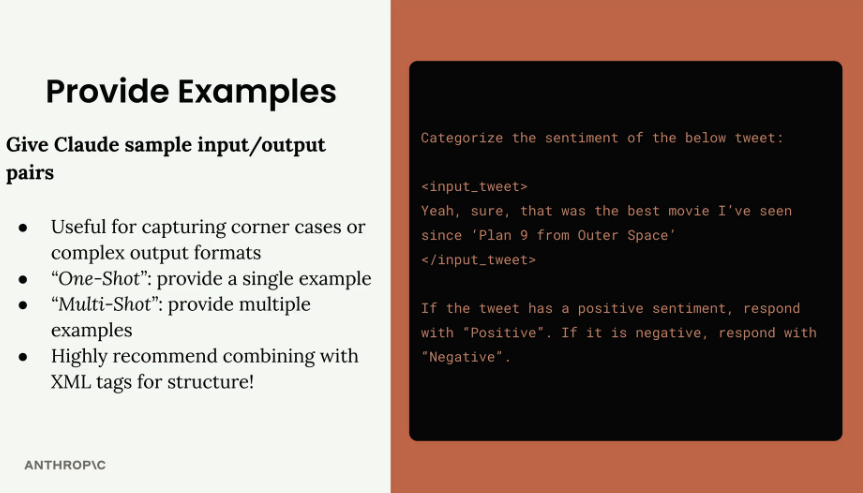

---

#### 14.2 Estructura con etiquetas XML

Los ejemplos deben envolverse en etiquetas XML para que Claude entienda claramente qué es entrada y qué es salida ideal:

```xml
<sample_input>
Oh sure, I really needed a flight delay tonight! Just excellent!
</sample_input>
<ideal_output>
Negative
</ideal_output>
```

---

#### 14.3 Agregar contexto al ejemplo

No basta con dar el par entrada/salida — explicar **por qué** la salida es buena ayuda a Claude a entender el razonamiento, no solo el formato:

```xml
<ideal_output>
[Tu ejemplo de salida aquí]
</ideal_output>

This example is well-structured, provides detailed information
on food choices and quantities, and aligns with the athlete's
goals and restrictions.
```

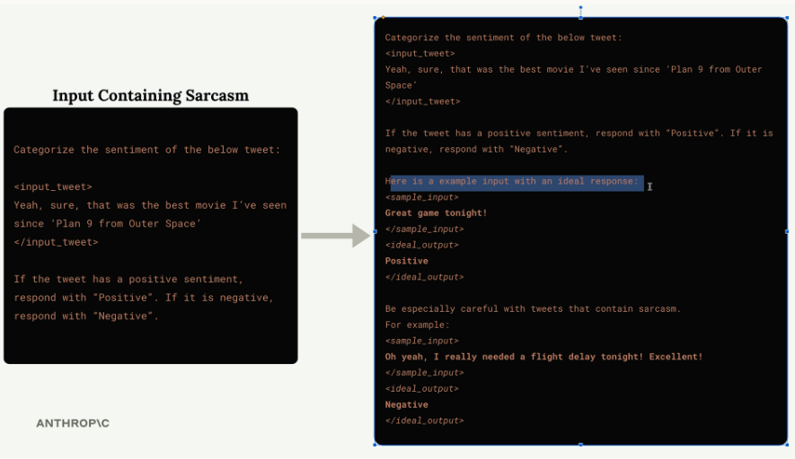

---

#### 14.4 One-shot vs. few-shot

| Tipo | Cuándo usarlo |
| --- | --- |
| **One-shot** (1 ejemplo) | Para establecer el patrón general |
| **Few-shot** (varios ejemplos) | Para cubrir distintos casos borde o mostrar variedad de respuestas válidas |

---

#### 14.5 Cómo encontrar buenos ejemplos

Al correr evaluaciones, buscar los resultados con el puntaje más alto (idealmente 10/10) y usar esos pares entrada/salida como ejemplos en el prompt. Así Claude aprende a partir de sus propias mejores respuestas.

---

#### 14.6 Buenas prácticas

- Usar siempre etiquetas XML para estructurar los ejemplos
- Ser explícito: "Aquí hay un ejemplo de entrada con una respuesta ideal"
- Incluir ejemplos que cubran los casos de fallo más comunes
- Explicar por qué cada ejemplo de salida es considerado ideal
- Usar ejemplos relevantes y específicos para la tarea

> Los ejemplos muestran en lugar de describir. Esto hace los prompts mucho más fiables y ayuda a Claude a entender requisitos sutiles que serían difíciles de expresar solo con instrucciones.

---

### Resumen de la Unidad 4: Ingeniería de indicaciones

Esta unidad desarrolla las cuatro técnicas concretas para comunicarse con Claude de forma efectiva y predecible.

| Módulo | Tema | Concepto clave |
| --- | --- | --- |
| **10** | Proceso iterativo | Ningún prompt es óptimo en la primera versión; el ciclo escribir → evaluar → refinar es la práctica central de la ingeniería de prompts |
| **11** | Claridad y dirección | Claude es literal: instrucciones ambiguas producen resultados ambiguos; usar verbos de acción concretos y evitar el lenguaje indirecto |
| **12** | Especificidad | Definir explícitamente formato, longitud, tono y audiencia esperada; las restricciones reducen la varianza del output |
| **13** | Etiquetas XML | `<etiqueta>contenido</etiqueta>` para separar instrucciones de datos de usuario; evita que Claude mezcle contextos distintos en el mismo prompt |
| **14** | Few-shot prompting | Proveer pares de ejemplo entrada-salida dentro del prompt; más efectivo que describir el formato en prosa, especialmente para formatos no estándar |

**Patrón transversal de la unidad:** la calidad del output de Claude está directamente correlacionada con la precisión del input. Claridad, especificidad, estructura XML y ejemplos son herramientas complementarias — cada una reduce un tipo distinto de ambigüedad que Claude de otro modo resolvería por cuenta propia con resultados impredecibles.

---

## Unidad 5: Tools

### Módulo 15: Introducción al uso de herramientas

Claude es un modelo de lenguaje entrenado con datos hasta cierta fecha. Eso significa que tiene un conocimiento vasto pero estático: sabe mucho sobre el mundo, pero no puede consultar lo que ocurrió ayer, ni saber la temperatura actual en ninguna ciudad, ni acceder a bases de datos privadas. Las **herramientas** (tools) son el mecanismo que resuelve exactamente ese problema: le dan a Claude la capacidad de pedir información en tiempo real y actuar sobre sistemas externos.

La idea clave es que Claude no ejecuta el código — lo solicita. Claude dice "necesito saber la hora actual" y el código de la aplicación es quien ejecuta la función y le devuelve el resultado. Esta separación de responsabilidades es fundamental para entender cómo funciona el sistema.

---

#### 15.1 El problema sin herramientas

Por defecto, ante una pregunta como "¿Qué tiempo hace en San Francisco?", Claude solo puede responder que no tiene acceso a esa información. Esto ocurre porque su conocimiento viene del entrenamiento — que tiene una fecha de corte — y no tiene ninguna conexión con el mundo en tiempo real. Para el usuario, esto es una experiencia frustrante que limita enormemente la utilidad del asistente.

El mismo problema aparece en muchos otros escenarios: consultar el precio de una acción, buscar en una base de datos interna de la empresa, calcular cuántos días faltan para una fecha futura, o configurar un recordatorio. Todos son casos donde Claude tiene la inteligencia para razonar pero le falta acceso a la información o al sistema necesario.

---

#### 15.2 Cómo funciona el uso de herramientas

El protocolo de tools es un ciclo de ida y vuelta entre la aplicación y Claude. Lo importante es entender que Claude no actúa directamente — propone acciones y espera que el código las ejecute:

| Paso | Quién actúa | Qué ocurre |
| --- | --- | --- |
| 1. Solicitud inicial | Aplicación → Claude | Se envía la pregunta del usuario junto con el listado de herramientas disponibles y cómo usarlas |
| 2. Solicitud de herramienta | Claude → Aplicación | Claude decide que necesita datos externos y devuelve una solicitud estructurada indicando qué función llamar y con qué parámetros |
| 3. Recuperación de datos | Aplicación → sistema externo | El código de la aplicación ejecuta la función y obtiene los datos reales |
| 4. Respuesta final | Aplicación → Claude → Usuario | Se envían los datos a Claude con el historial completo; Claude genera la respuesta final en lenguaje natural |

Este ciclo puede repetirse múltiples veces en una sola conversación si Claude necesita encadenar varias herramientas para responder.

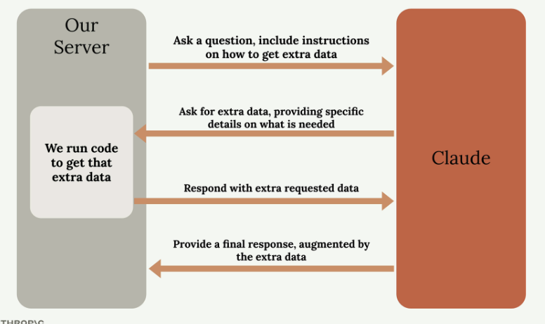

---

#### 15.3 Ejemplo: consulta del clima

Para concretar el flujo, consideremos la pregunta "¿Qué tiempo hace en San Francisco?":

1. La aplicación envía la pregunta + la descripción de una herramienta `get_weather(city)`
2. Claude entiende que necesita datos actuales y devuelve: *"necesito llamar a `get_weather` con `city="San Francisco"`"*
3. El servidor ejecuta la función real, que consulta una API meteorológica
4. La aplicación le devuelve el resultado a Claude (ej. `"18°C, parcialmente nublado"`)
5. Claude integra ese dato en una respuesta natural para el usuario

Claude nunca "sale" a internet — siempre es el código de la aplicación quien hace esa consulta. Claude solo razona sobre los datos que recibe.

---

#### 15.4 Beneficios clave

| Beneficio | Descripción |
| --- | --- |
| **Información en tiempo real** | Claude puede trabajar con datos actuales que no existen en su entrenamiento |
| **Integración de sistemas externos** | Permite conectar Claude con bases de datos, APIs, archivos y cualquier sistema con el que la aplicación pueda interactuar |
| **Respuestas dinámicas** | Cada respuesta puede basarse en el estado real del sistema, no en suposiciones estáticas |
| **Interacción estructurada** | El protocolo define exactamente qué información necesita Claude y cómo pedirla, evitando ambigüedades |

Las herramientas transforman a Claude de una base de conocimientos estática en un asistente dinámico. La clave del diseño es la claridad en la interfaz: Claude sabe qué herramientas tiene disponibles, el código sabe cuándo ejecutarlas, y ambos se comunican mediante un protocolo bien definido.

---

### Módulo 16: Proyecto práctico — sistema de recordatorios

El sistema de recordatorios es el proyecto que guía toda la unidad de tools. Es un caso de uso concreto y cotidiano que ilustra perfectamente cuándo y por qué las herramientas son necesarias.

#### 16.1 Objetivo

Permitir que Claude interprete solicitudes en lenguaje natural como:

> "Pon un recordatorio para mi cita con el médico, es el jueves de la semana que viene"

Y responda con algo como: "De acuerdo, te lo recordaré el jueves 22", habiendo calculado correctamente la fecha a partir de la fecha actual y configurado el recordatorio en el sistema. La complejidad está en que Claude necesita hacer tres cosas que por sí solo no puede hacer bien.

---

#### 16.2 Por qué es un desafío

Claude tiene tres limitaciones concretas que hacen este caso de uso imposible sin herramientas:

| Limitación | Por qué ocurre | Consecuencia |
| --- | --- | --- |
| **Conciencia temporal imprecisa** | Claude conoce aproximadamente la fecha de entrenamiento pero no la hora exacta del momento en que se le consulta | No puede anclar correctamente "el jueves que viene" |
| **Cálculo de fechas poco confiable** | Las operaciones aritméticas con fechas son propensas a errores cuando involucran semanas, meses y años | Puede decir que 177 días después del 1 de enero es una fecha incorrecta |
| **Sin mecanismo de recordatorio** | Claude es un modelo de lenguaje — no tiene acceso a ningún sistema de notificaciones ni persistencia | Aunque calculara bien la fecha, no puede "configurar" nada |

Lo interesante de este proyecto es que **no se puede resolver con prompt engineering**. No importa cómo se le pida a Claude que calcule mejor las fechas — seguirá siendo impreciso. La solución correcta es darle herramientas confiables.

---

#### 16.3 Las tres herramientas a construir

Cada herramienta está diseñada para resolver exactamente una de esas limitaciones:

| Herramienta | Limitación que resuelve | Qué hace |
| --- | --- | --- |
| `get_current_datetime` | Conciencia temporal imprecisa | Provee la fecha y hora exacta en el momento de la llamada |
| `add_duration_to_datetime` | Cálculo de fechas impreciso | Suma duraciones a fechas usando aritmética Python — siempre preciso |
| `set_reminder` | Sin mecanismo de recordatorio | Configura el recordatorio en el sistema con la fecha calculada |

Se implementan en orden de complejidad creciente. Eso permite ver primero el mecanismo básico de tool use con una sola herramienta simple, y luego ir agregando capas hasta llegar a una conversación de múltiples turnos con herramientas encadenadas.

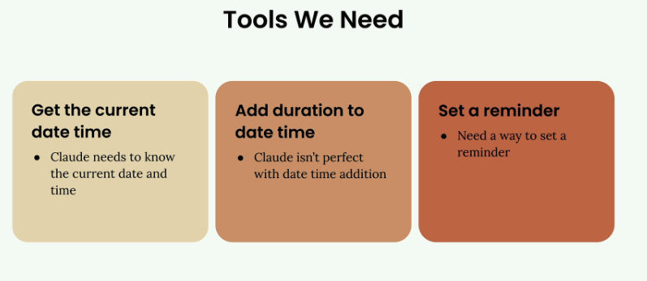

---

#### 16.4 Principio clave

> Cuando el modelo tiene limitaciones, la solución correcta es ampliar sus capacidades con herramientas — no intentar compensar esas limitaciones con ingeniería de prompts.

Este principio vale más allá de los recordatorios: siempre que Claude necesite hacer algo que involucre precisión matemática, acceso a sistemas externos o estado persistente, la respuesta son herramientas.

---

### Módulo 17: Funciones de herramienta

Una **función de herramienta** es una función Python completamente normal — no tiene nada especial en su definición. Lo que la convierte en una herramienta para Claude es el **esquema JSON** que la acompaña (que se ve en el módulo siguiente) y el hecho de que la aplicación la registra como disponible en cada llamada a la API.

Es importante tener claro que Claude nunca ejecuta la función directamente. Claude produce una solicitud estructurada diciendo "quiero llamar a `get_current_datetime` con estos argumentos", y es el código de la aplicación quien realmente la ejecuta y le devuelve el resultado.

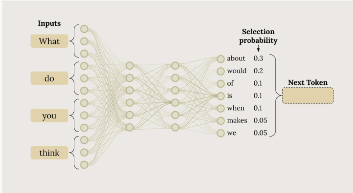

---

#### 17.1 Buenas prácticas al escribir funciones de herramienta

Las funciones de herramienta tienen un requisito especial: sus mensajes de error son leídos por Claude. Eso cambia cómo hay que escribirlos.

| Práctica | Por qué importa |
| --- | --- |
| **Nombres descriptivos** | Claude elige qué herramienta usar basándose en el nombre y la descripción — un nombre claro reduce llamadas incorrectas |
| **Validar entradas** | Si un parámetro obligatorio llega vacío o con un tipo incorrecto, mejor detectarlo temprano y dar un error descriptivo |
| **Mensajes de error legibles** | Claude puede leer el error y reintentar la llamada con parámetros corregidos — un error como `"date_format cannot be empty"` le permite autocorregirse |

La validación es especialmente poderosa: si Claude pasa un argumento inválido y recibe un error claro, puede entender qué estuvo mal y volver a intentarlo con los parámetros correctos. Esto convierte a Claude en un sistema que se autorrecupera de errores parciales.

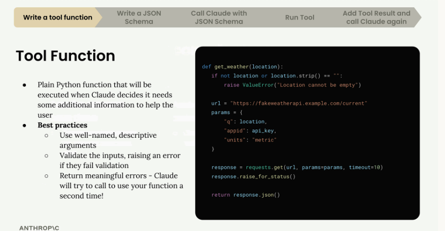

---

#### 17.2 Primera herramienta: obtener fecha y hora actual

Esta función resuelve la primera limitación del sistema de recordatorios: Claude no sabe con certeza qué hora es en el momento de la consulta.

```python
from datetime import datetime

def get_current_datetime(date_format="%Y-%m-%d %H:%M:%S"):
    # Si el formato llega vacío (ej. Claude pasó ""), lanzamos un error claro
    # Claude puede leer este mensaje y reintentar con un formato válido
    if not date_format:
        raise ValueError("date_format cannot be empty")

    # strftime convierte el objeto datetime en un string con el formato especificado
    # El formato usa los códigos de Python: %Y=año, %m=mes, %d=día, %H=hora, %M=minuto, %S=segundo
    return datetime.now().strftime(date_format)
```

El parámetro `date_format` usa los códigos de `strftime` de Python. El valor por defecto devuelve una cadena como `"2024-01-15 14:30:25"`. Claude puede pedirle a la función formatos alternativos según lo que necesite:

```python
get_current_datetime()            # "2024-01-15 14:30:25"  — año-mes-día hora:minuto:segundo
get_current_datetime("%H:%M")     # "14:30"                 — solo hora y minuto
get_current_datetime("%A, %d %B") # "Monday, 15 January"   — día de la semana y fecha larga
```

| Parámetro | Tipo | Descripción |
| --- | --- | --- |
| `date_format` | `str` | Patrón de formato compatible con `strftime`. Tiene valor por defecto, así que no es obligatorio |

---

#### 17.3 Próximos pasos

Tener la función Python es solo la mitad del trabajo. Para que Claude pueda usarla necesita dos cosas más:

1. Un **esquema JSON** que le explique qué hace la función, cuándo usarla y qué argumentos acepta — esto es lo que se ve en el Módulo 18
2. **Registrarla en la llamada a la API** para que Claude la tenga disponible

La separación entre la función y su esquema es intencional: permite cambiar la implementación sin modificar cómo Claude entiende la herramienta, y viceversa.

---

### Módulo 18: Esquemas de herramientas

Tener la función Python no es suficiente — Claude no puede leer código Python. Lo que Claude sí puede leer es un **esquema JSON** que describe qué hace la función, qué argumentos acepta y cuándo usarla. El esquema actúa como un contrato entre Claude y la aplicación: Claude lo lee para decidir si invocar la herramienta, y la aplicación lo usa para validar que Claude la está llamando correctamente.

Una mala descripción en el esquema = Claude usa la herramienta en momentos equivocados o la ignora cuando debería usarla. Por eso la calidad del esquema impacta directamente en la calidad del sistema.

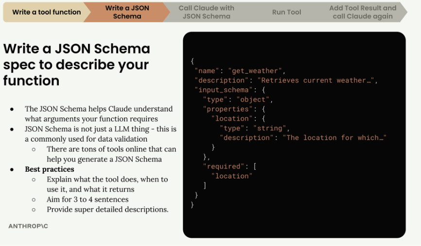

---

#### 18.1 Las tres partes de una especificación de herramienta

Todo esquema de herramienta tiene exactamente tres campos de nivel superior:

| Campo | Tipo | Descripción |
| --- | --- | --- |
| `name` | `string` | Nombre de la función — debe ser claro y descriptivo, idealmente coincide con el nombre de la función Python |
| `description` | `string` | El campo más importante: Claude la lee para decidir si invocar la herramienta. Debe explicar qué hace, cuándo usarla y qué devuelve |
| `input_schema` | `object` | Esquema JSON (formato estándar JSON Schema) que describe los parámetros: tipos, descripciones y cuáles son obligatorios |

El campo `description` es el más crítico. Claude toma decisiones basándose en él — no en el código de la función. Una descripción vaga puede hacer que Claude use la herramienta en situaciones incorrectas.

---

#### 18.2 Cómo escribir descripciones efectivas

Una buena descripción de herramienta responde cuatro preguntas:

- **¿Qué hace?** — la acción principal en una frase
- **¿Cuándo debe usarla Claude?** — los casos de uso específicos que deben activarla
- **¿Qué devuelve?** — el formato y tipo del resultado
- **¿Qué hace cada argumento?** — descripción individual de cada parámetro

Cuanto más específica sea la descripción, menos ambigüedad tiene Claude para decidir cuándo y cómo usarla.

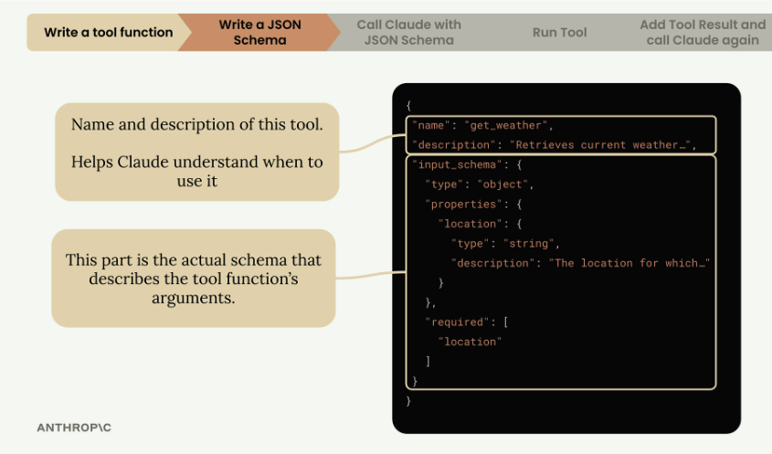

---

#### 18.3 Generar el esquema con Claude

Escribir esquemas JSON a mano es tedioso y propenso a errores. Una alternativa práctica es pedirle al propio Claude que lo genere:

1. Copiar el código de la función Python
2. Pedirle a Claude: *"Write a valid JSON schema specification for tool calling for this function. Follow the best practices listed in the attached documentation."*
3. Adjuntar la documentación oficial de Anthropic sobre tool use como contexto adicional
4. Copiar el esquema generado al código

Esto funciona bien porque Claude entiende tanto la sintaxis de JSON Schema como las convenciones de la API de Anthropic.

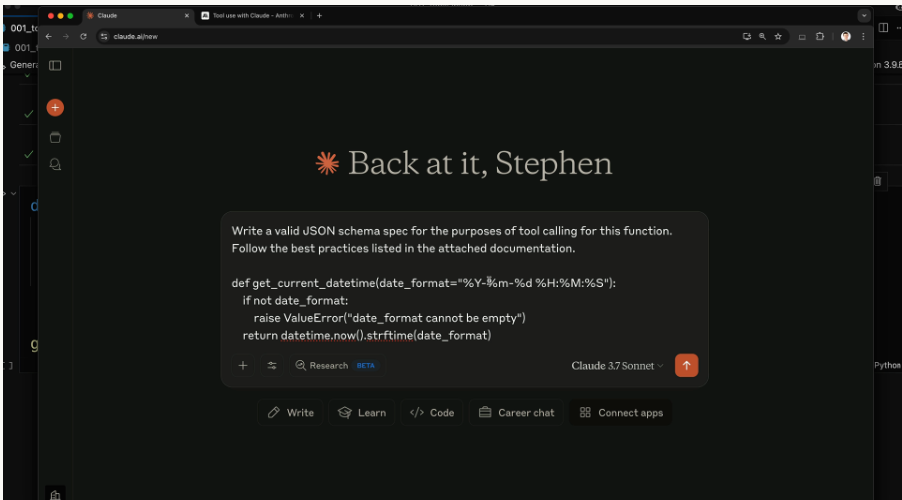

---

#### 18.4 Implementación del esquema

Por convención, el esquema se nombra igual que la función con el sufijo `_schema`. Esto hace explícita la relación entre la función y su descripción para Claude:

```python
def get_current_datetime(date_format="%Y-%m-%d %H:%M:%S"):
    if not date_format:
        raise ValueError("date_format cannot be empty")
    return datetime.now().strftime(date_format)

# Convención: function_name + "_schema" — deja clara la relación entre función y descripción
get_current_datetime_schema = {
    "name": "get_current_datetime",
    # Claude lee esta descripción para decidir cuándo invocar la herramienta
    "description": "Returns the current date and time formatted according to the specified format. Use this when you need to know the current time or date.",
    "input_schema": {
        "type": "object",      # Siempre "object" — los argumentos van como propiedades
        "properties": {
            "date_format": {
                "type": "string",   # Tipo del parámetro que Claude debe pasar
                "description": "A string specifying the format of the returned datetime. Uses Python's strftime format codes. Example: '%Y-%m-%d' for date only.",
                "default": "%Y-%m-%d %H:%M:%S"   # Valor que usa Claude si no especifica otro
            }
        },
        "required": []   # Lista vacía: todos los parámetros tienen valor por defecto, ninguno es obligatorio
    }
}
```

El campo `required` es una lista de nombres de parámetros que Claude **debe** incluir en la llamada. Si está vacío, todos son opcionales. Si un parámetro no tiene `default` pero tampoco está en `required`, Claude puede omitirlo — aunque eso probablemente cause un error en la función.

---

#### 18.5 Agregar seguridad de tipos con `ToolParam`

El diccionario del esquema funciona, pero puede tener errores de tipeo que solo se detectan en runtime. `ToolParam` agrega verificación de tipos en tiempo de escritura:

```python
from anthropic.types import ToolParam   # TypedDict de la SDK de Anthropic

get_current_datetime_schema = ToolParam({
    "name": "get_current_datetime",
    "description": "Returns the current date and time formatted according to the specified format.",
    "input_schema": { ... }
})
# ToolParam no cambia el comportamiento en ejecución
# Pero si el IDE o un type checker detecta que falta un campo requerido, avisa antes de correr el código
```

| Aspecto | Diccionario simple | `ToolParam` |
| --- | --- | --- |
| Comportamiento en ejecución | Idéntico | Idéntico |
| Detección de errores de estructura | Solo en runtime | En tiempo de escritura (IDE/mypy) |
| Uso recomendado | Prototipos rápidos | Código en producción |

---

### Módulo 19: Manejo de bloques de mensajes

Cuando Claude usa herramientas, la estructura de la respuesta cambia de manera fundamental. En una conversación sin herramientas, `response.content` es simplemente texto. Cuando hay herramientas involucradas, `response.content` se convierte en una **lista de bloques**, donde cada bloque tiene un tipo diferente. Entender esta estructura es crucial para poder procesar las respuestas correctamente.

---

#### 19.1 Llamada a la API con herramientas

La diferencia respecto a una llamada normal está en el parámetro `tools`. Al incluirlo, Claude sabe qué herramientas tiene disponibles y puede decidir usarlas:

```python
messages = []
messages.append({
    "role": "user",
    "content": "What is the exact time, formatted as HH:MM:SS?"
})

response = client.messages.create(
    model=model,
    max_tokens=1000,
    messages=messages,
    tools=[get_current_datetime_schema],   # Claude lee estos schemas para decidir qué herramientas invocar
)
# Si Claude decide usar una herramienta, response.stop_reason == "tool_use"
# Si responde directamente, response.stop_reason == "end_turn"
```

---

#### 19.2 Estructura de un mensaje multibloque

Cuando Claude decide usar una herramienta, `response.content` no es un string — es una lista con dos elementos:

| Índice | Bloque | Tipo | Contenido típico |
| --- | --- | --- | --- |
| `[0]` | **TextBlock** | `"text"` | Texto en lenguaje natural explicando lo que Claude va a hacer |
| `[1]` | **ToolUseBlock** | `"tool_use"` | Instrucción estructurada: qué función llamar y con qué argumentos |

El **ToolUseBlock** tiene tres campos internos que son los que el código necesita para ejecutar la función:

| Campo del ToolUseBlock | Descripción |
| --- | --- |
| `id` | Identificador único de esta llamada — se usa después para vincular el resultado con la solicitud |
| `name` | Nombre de la función a invocar, ej. `"get_current_datetime"` |
| `input` | Diccionario con los argumentos que Claude quiere pasar a la función |

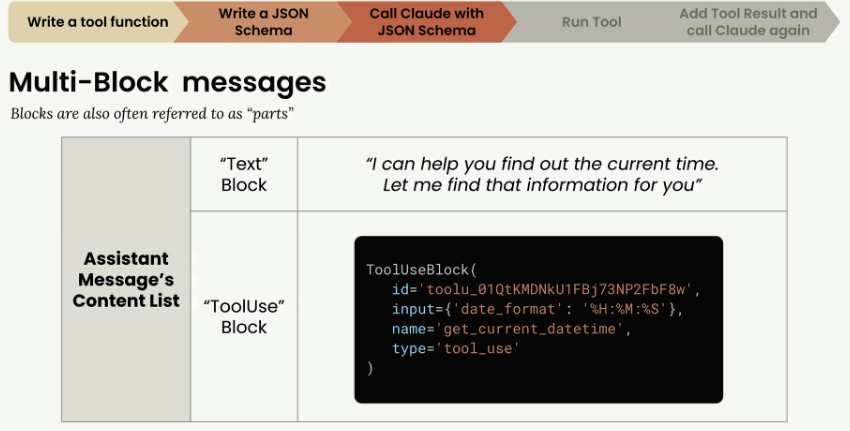

---

#### 19.3 Gestionar el historial con mensajes multibloque

Este es uno de los errores más comunes al implementar tool use. Al guardar la respuesta de Claude en el historial, hay que guardar **toda** la lista de bloques — no solo el texto:

```python
messages.append({
    "role": "assistant",
    # response.content es la lista completa [TextBlock, ToolUseBlock]
    # Si se guardara solo response.content[0].text, el ToolUseBlock se pierde
    "content": response.content
})
# ¿Por qué importa? En la siguiente llamada a la API, el historial debe contener
# el ToolUseBlock con su id. Si ese id no está, la API rechazará el tool_result
# que hace referencia a él — BadRequestError.
```

La regla es simple: cuando Claude responde con una lista de bloques, esa lista completa entra al historial como está.

---

#### 19.4 Flujo completo de uso de herramienta

```text
1. Enviar mensaje del usuario + esquemas de herramientas disponibles → Claude
2. Claude responde: [TextBlock: "Voy a consultar la hora"] + [ToolUseBlock: {name, id, input}]
3. El código lee el ToolUseBlock, extrae name e input, ejecuta la función Python
4. Se construye un bloque tool_result con el resultado y el id de la solicitud
5. Se envía el historial completo (incluyendo tool_result) → Claude
6. Claude genera la respuesta final para el usuario
```

Cada paso es necesario. Si se omite cualquiera — por ejemplo, si se salta el ToolUseBlock del historial o se manda un `tool_result` con el `id` incorrecto — la API devolverá un error.

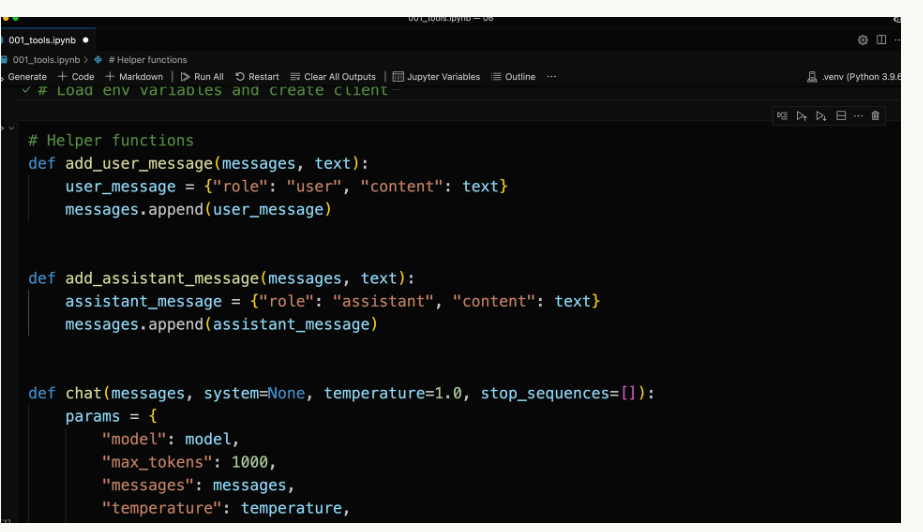

---

#### 19.5 Actualizar las funciones auxiliares

Las funciones `add_user_message()` y `add_assistant_message()` escritas antes de introducir herramientas solo manejaban strings. Para soportar mensajes multibloque hay que actualizarlas para aceptar tanto strings como listas de bloques:

```python
def add_assistant_message(messages, content):
    messages.append({
        "role": "assistant",
        # content puede ser:
        # - un string simple (respuesta sin herramientas)
        # - una lista de bloques [TextBlock, ToolUseBlock] (respuesta con herramientas)
        "content": content
    })
```

La razón por la que el mismo campo `content` puede recibir ambos tipos es que la API de Anthropic acepta ambos formatos: un string es equivalente a una lista con un solo TextBlock.

---

#### 19.6 Apéndice: flujo completo con ejemplos

##### El problema de fondo

Claude es un modelo de lenguaje — no puede ejecutar código ni acceder al mundo real. Si le preguntás "¿qué hora es?", no lo sabe. Los tools son la solución: Claude puede *pedir* que alguien ejecute una función por él, y luego usar el resultado para responder.

---

##### Paso 1 — Definir la función y su schema

Toda herramienta tiene dos partes: la función Python que hace el trabajo, y el schema JSON que le explica a Claude cómo y cuándo llamarla.

```python
from datetime import datetime

def get_current_datetime():
    return datetime.now().strftime("%H:%M:%S")

get_current_datetime_schema = {
    "name": "get_current_datetime",          # Nombre exacto de la función
    "description": "Returns the current time in HH:MM:SS format.",  # Claude decide si usarla basándose en esto
    "input_schema": {
        "type": "object",
        "properties": {}                     # Vacío pero obligatorio — la función no necesita argumentos
    }
}
```

> Si `input_schema` se omite o está malformado, la API devuelve un `BadRequestError 400`. Siempre incluir `"type": "object"` y `"properties"`, aunque estén vacíos.

---

##### Paso 2 — Enviar la pregunta con el menú de tools

Se manda el mensaje del usuario y se adjuntan los schemas. Claude los usa como un menú: decide si invocar alguno o responder directamente.

```python
messages = [{"role": "user", "content": "What is the exact time, formatted as HH:MM:SS?"}]

response = client.messages.create(
    model=model,
    max_tokens=1000,
    messages=messages,
    tools=[get_current_datetime_schema],   # Claude sabe que tiene esta herramienta disponible
)
```

---

##### Paso 3 — Claude responde con dos bloques

`response.content` no es texto simple — es una lista de bloques:

| Bloque | Tipo | Contenido |
| --- | --- | --- |
| `response.content[0]` | `TextBlock` | `"I'll check the current time for you."` |
| `response.content[1]` | `ToolUseBlock` | `{id: "toolu_01...", name: "get_current_datetime", input: {}}` |

Claude se detiene aquí (`stop_reason == "tool_use"`). No puede continuar solo — necesita que el código ejecute la función.

---

##### Paso 4 — Ejecutar la función y construir el historial

Este es el paso más crítico. Hay que:

1. Agregar la respuesta del asistente **con ambos bloques** (no solo el texto)
2. Ejecutar la función real
3. Enviar el resultado como mensaje de usuario con tipo `tool_result`

```python
# 1. Guardar la respuesta completa del asistente — INCLUYE el ToolUseBlock con su id
messages.append({
    "role": "assistant",
    "content": response.content        # ← Nunca usar solo response.content[0].text aquí
})

# 2. Ejecutar la función real
tool_use = next(b for b in response.content if b.type == "tool_use")
result = get_current_datetime()        # "14:32:07"

# 3. Devolver el resultado — el tool_use_id conecta este resultado con la solicitud anterior
messages.append({
    "role": "user",
    "content": [{
        "type": "tool_result",
        "tool_use_id": tool_use.id,    # ← Debe coincidir con el id del ToolUseBlock
        "content": result              # "14:32:07"
    }]
})
```

> Si en el paso anterior se guardara solo el texto y se omitiera el `ToolUseBlock`, la API rechazaría la solicitud porque el `tool_result` hace referencia a un `id` que no existe en el historial.

---

##### Paso 5 — Claude genera la respuesta final

Ahora Claude tiene todo el contexto: la pregunta original, su propio razonamiento previo, y el resultado de la función. Puede responder al usuario de forma natural.

```python
final = client.messages.create(
    model=model,
    max_tokens=1000,
    messages=messages,
    tools=[get_current_datetime_schema],   # Siempre incluir los schemas en llamadas de seguimiento
)
print(final.content[0].text)
# → "The exact time is 14:32:07."
```

---

##### Resumen visual del flujo

```text
Vos      →  Claude     Pregunta + schemas disponibles
Claude   →  Vos        [TextBlock] + [ToolUseBlock: llamar a get_current_datetime]
Vos ejecuta  →         "14:32:07"
Vos      →  Claude     historial completo + tool_result: "14:32:07"
Claude   →  Vos        "The exact time is 14:32:07."
```

---

##### Por qué el historial completo es obligatorio

Claude no tiene memoria entre llamadas. Cada `client.messages.create()` empieza desde cero. El historial que se envía en el paso 5 debe contener:

| Posición | Rol | Contenido |
| --- | --- | --- |
| 1 | `user` | Pregunta original |
| 2 | `assistant` | TextBlock + ToolUseBlock |
| 3 | `user` | Bloque `tool_result` con el resultado |

Sin cualquiera de esos tres elementos, Claude no tiene el contexto suficiente para generar la respuesta final.

---

### Módulo 20: Enviando resultados de la herramienta

Una vez que Claude devuelve un `ToolUseBlock`, el flujo pasa al código de la aplicación: ejecutar la función real y enviar el resultado de vuelta a Claude. Este paso completa el ciclo y le da a Claude la información que necesita para generar su respuesta final.

---

#### 20.1 Ejecutar la función de la herramienta

El `ToolUseBlock` tiene el campo `input` con los argumentos que Claude quiere usar. El operador `**` de Python los desempaqueta como argumentos nombrados de la función:

```python
# response.content[1] es el ToolUseBlock
# .input es un diccionario, ej: {"date_format": "%H:%M:%S"}
tool_block = response.content[1]

# ** desempaqueta el dict como kwargs: equivale a get_current_datetime(date_format="%H:%M:%S")
result = get_current_datetime(**tool_block.input)
```

Si la función no tiene parámetros, `input` será un dict vacío `{}` y `**{}` no pasa ningún argumento — lo cual es correcto.

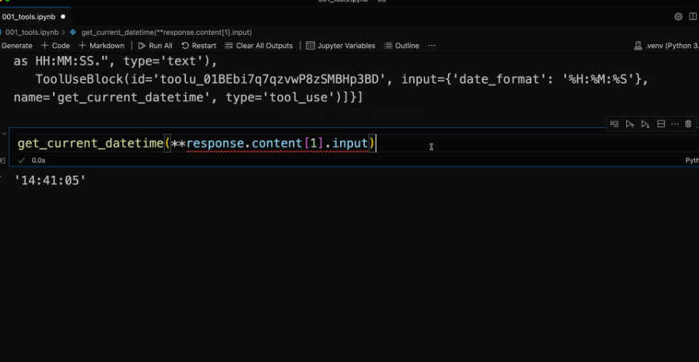

---

#### 20.2 Estructura del bloque de resultado (`tool_result`)

El resultado se envía como un mensaje de usuario con un bloque de tipo `"tool_result"`. El campo más crítico es `tool_use_id`: debe coincidir exactamente con el `id` del `ToolUseBlock` que generó la solicitud. Es así como Claude sabe que este resultado responde a esa solicitud específica.

```python
messages.append({
    "role": "user",
    "content": [{
        "type": "tool_result",
        "tool_use_id": tool_block.id,   # El mismo id que tenía el ToolUseBlock — los vincula
        "content": result,              # El resultado de ejecutar la función (string o JSON serializado)
        "is_error": False               # False = ejecución exitosa; True = la función lanzó una excepción
    }]
})
```

| Propiedad | Tipo | Descripción |
| --- | --- | --- |
| `type` | `str` | Siempre `"tool_result"` — identifica el tipo de bloque |
| `tool_use_id` | `str` | ID del `ToolUseBlock` al que responde. Si no coincide, la API devuelve error |
| `content` | `str` | Resultado de la función. Si es un objeto, serializarlo con `json.dumps()` antes |
| `is_error` | `bool` | `True` si ocurrió una excepción durante la ejecución. Claude puede leer el error y reintentar |

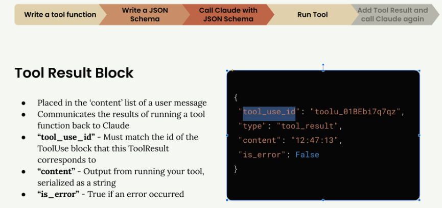

---

#### 20.3 Manejo de múltiples llamadas a herramientas

Claude puede incluir varios `ToolUseBlock` en una misma respuesta cuando las herramientas son independientes entre sí (ej. calcular dos fechas al mismo tiempo). En ese caso, el mensaje de usuario debe contener **un `tool_result` por cada `ToolUseBlock`**, todos juntos en la misma lista:

```python
# Si Claude pidió dos herramientas, el mensaje de resultado tiene dos bloques
messages.append({
    "role": "user",
    "content": [
        {"type": "tool_result", "tool_use_id": id_herramienta_1, "content": resultado_1, "is_error": False},
        {"type": "tool_result", "tool_use_id": id_herramienta_2, "content": resultado_2, "is_error": False},
    ]
})
```

Los `id` únicos de cada bloque permiten vincular cada resultado con su solicitud, sin importar el orden en que lleguen.

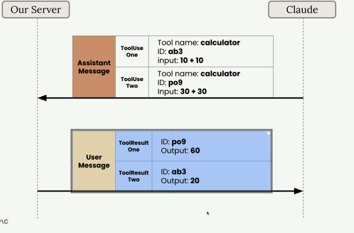

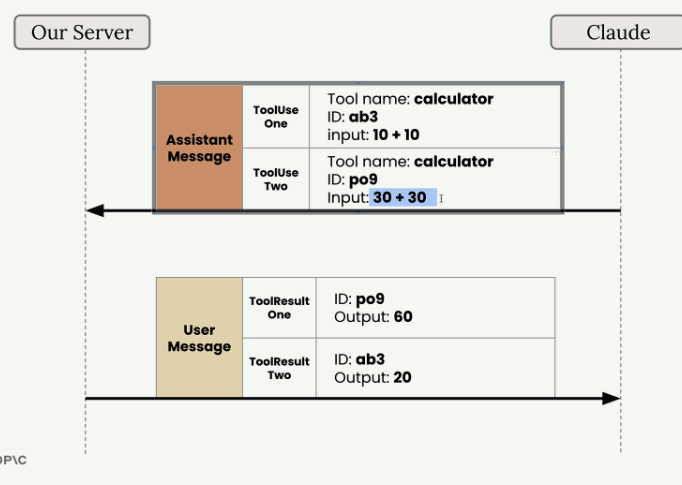

---

#### 20.4 El historial completo en la solicitud de seguimiento

Después de agregar el `tool_result`, el historial tiene exactamente esta estructura antes de hacer la siguiente llamada a la API:

```text
Posición 1  │  role: "user"       │  Pregunta original del usuario
Posición 2  │  role: "assistant"  │  [TextBlock] + [ToolUseBlock] — la respuesta de Claude con la solicitud
Posición 3  │  role: "user"       │  [tool_result] — el resultado de ejecutar la función
```

Este historial completo le da a Claude todo el contexto para generar la respuesta final.

---

#### 20.5 Solicitud final a Claude

La llamada de seguimiento incluye el historial completo y, crucialmente, los esquemas de herramientas de nuevo. Aunque no se espere otra llamada a herramientas, incluir los esquemas es obligatorio: Claude necesita entender las referencias a herramientas que ya aparecen en el historial.

```python
final_response = client.messages.create(
    model=model,
    max_tokens=1000,
    messages=messages,                          # Historial con las 3 posiciones descritas arriba
    tools=[get_current_datetime_schema]         # Obligatorio aunque no se espere otra tool call
)
# final_response.stop_reason == "end_turn" — Claude ya tiene lo que necesita y responde directamente
print(final_response.content[0].text)          # La respuesta final en lenguaje natural
```

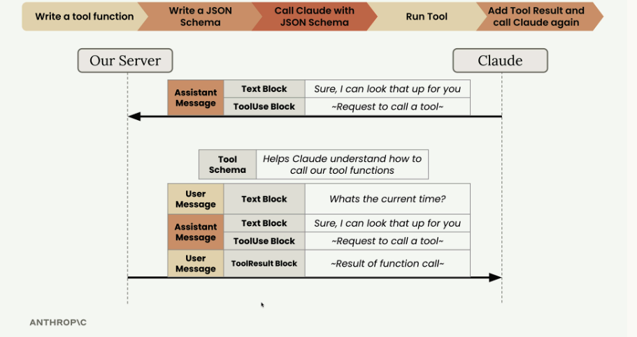

Si se omiten los esquemas en la llamada de seguimiento, la API puede fallar porque el historial contiene referencias a herramientas que la llamada actual no reconoce.

---

### Módulo 21: Conversaciones de varios turnos con herramientas

Hasta ahora el flujo era simple: Claude pide una herramienta, el código la ejecuta, Claude responde. Pero muchas preguntas requieren **varias herramientas en secuencia**, donde el resultado de una es la entrada de la siguiente. Un ejemplo concreto: "¿Qué día será dentro de 103 días?". Para responder, Claude necesita primero saber cuál es la fecha de hoy (`get_current_datetime`), y con esa fecha calcular cuánto es hoy + 103 días (`add_duration_to_datetime`). No puede hacer ambas cosas en un solo turno.

La solución es un bucle que automatiza el ciclo completo: Claude pide herramienta → el código la ejecuta → Claude pide otra herramienta → el código la ejecuta → Claude da la respuesta final.

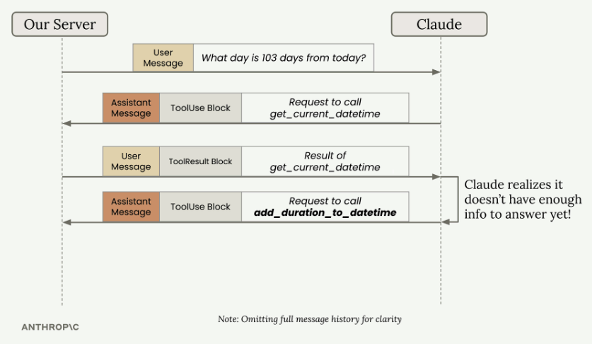

---

#### 21.1 Patrón de múltiples turnos

```text
1. Usuario pregunta: "¿Qué día será dentro de 103 días?"
2. Claude solicita → get_current_datetime (necesita saber la fecha de hoy primero)
3. Servidor ejecuta get_current_datetime() → devuelve "2024-01-15"
4. Claude recibe el resultado y solicita → add_duration_to_datetime(date="2024-01-15", days=103)
5. Servidor ejecuta la función → devuelve "2024-04-28"
6. Claude tiene todo lo que necesita → genera la respuesta final: "El día será el 28 de abril de 2024"
```

Claude no puede hacer ambas operaciones en un solo paso porque cada herramienta depende del resultado de la anterior. El bucle permite manejar esta cadena de dependencias automáticamente.

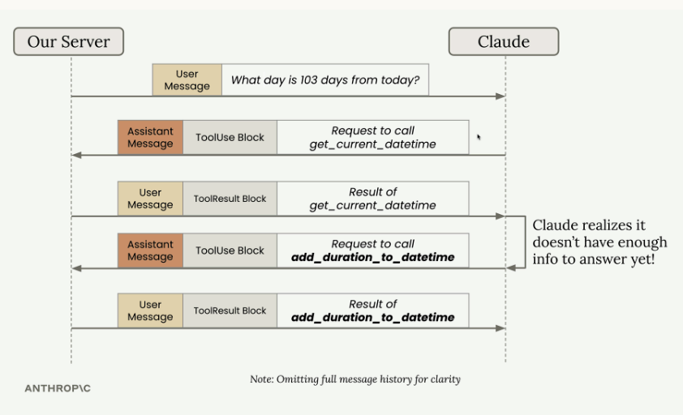

---

#### 21.2 Bucle de conversación

El patrón `while True` con `break` es la forma idiomática de implementar este ciclo. La condición de salida es simple: cuando `stop_reason` ya no es `"tool_use"`, Claude terminó.

```python
def run_conversation(messages):
    while True:
        response = chat(messages)   # Llama a Claude con el historial acumulado hasta ahora

        # Agrega la respuesta completa (TextBlock + posibles ToolUseBlocks) al historial
        add_assistant_message(messages, response)

        # Si Claude no pidió más herramientas, tiene su respuesta final → salir del bucle
        if response.stop_reason != "tool_use":
            break

        # Claude quiere una o más herramientas — ejecutarlas y devolver los resultados
        tool_result_blocks = run_tools(response)

        # Los resultados entran al historial como mensaje de usuario para el próximo turno
        add_user_message(messages, tool_result_blocks)

    # Al salir del while, el último mensaje del asistente es la respuesta final
    return messages
```

El bucle puede iterar cualquier número de veces. Cada iteración agrega dos mensajes al historial: la respuesta del asistente y el `tool_result` del usuario. Cuando Claude finalmente responde sin pedir herramientas, `stop_reason == "end_turn"` y el bucle termina.

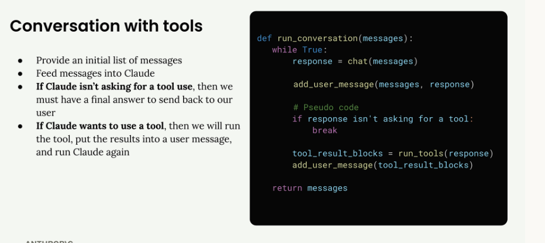

---

#### 21.3 Actualizar `add_user_message` para contenido flexible

```python
from anthropic.types import Message

def add_user_message(messages, message):
    user_message = {
        "role": "user",
        # Si se recibe un objeto Message completo, extrae su contenido; si no, usa el valor tal cual
        "content": message.content if isinstance(message, Message) else message
    }
    messages.append(user_message)
```

| Tipo de entrada | Resultado |
| --- | --- |
| `str` | Se usa directamente como contenido |
| `list` de bloques | Se usa directamente como contenido |
| Objeto `Message` | Se extrae `message.content` |

---

#### 21.4 Actualizar `chat` para soportar herramientas

```python
def chat(messages, system=None, temperature=1.0, stop_sequences=[], tools=None):
    params = {
        "model": model,
        "max_tokens": 1000,
        "messages": messages,
        "temperature": temperature,
        "stop_sequences": stop_sequences,
    }

    if tools:
        params["tools"] = tools       # Solo se agrega si se proporcionaron herramientas

    if system:
        params["system"] = system

    message = client.messages.create(**params)
    return message   # Devuelve el objeto Message completo, no solo el texto
```

> Cambio clave respecto a versiones anteriores: ahora `chat` devuelve el objeto `Message` completo en lugar de solo `message.content[0].text`, para preservar todos los bloques (TextBlock + ToolUseBlock).

---

#### 21.5 Función auxiliar para extraer texto

```python
def text_from_message(message):
    # Filtra solo los bloques de tipo "text" e ignora los ToolUseBlocks
    return "\n".join(
        [block.text for block in message.content if block.type == "text"]
    )
```

| Propiedad del bloque | Descripción |
| --- | --- |
| `block.type` | Tipo del bloque: `"text"` o `"tool_use"` |
| `block.text` | Texto legible (solo disponible en bloques de tipo `"text"`) |

---

#### 21.6 Mejoras clave de esta refactorización

| Mejora | Descripción |
| --- | --- |
| **Gestión flexible de mensajes** | Las funciones auxiliares aceptan texto, listas de bloques u objetos `Message` |
| **Soporte de herramientas en `chat`** | La función puede recibir y transmitir esquemas de herramientas a la API |
| **Objeto `Message` completo devuelto** | Se preservan todos los bloques (TextBlock + ToolUseBlock), no solo el texto |
| **Utilidad de extracción de texto** | `text_from_message()` permite obtener texto legible desde mensajes complejos |

---

### Módulo 22: Implementar múltiples giros

El módulo 21 mostró el concepto del bucle de conversación. Este módulo profundiza en la implementación concreta de cada componente: cómo detectar si Claude quiere una herramienta, cómo procesar varias herramientas en paralelo, cómo manejar errores sin romper el flujo, y cómo agregar nuevas herramientas sin tocar la lógica central.

---

#### 22.1 Detección de solicitudes de herramientas

`stop_reason` es el campo que le dice a la aplicación por qué Claude dejó de generar texto. No es solo un indicador técnico — es la señal de control del bucle:

| Valor de `stop_reason` | Significado | Qué hace la aplicación |
| --- | --- | --- |
| `"tool_use"` | Claude necesita ejecutar una o más herramientas antes de poder continuar | Ejecutar las herramientas y volver a llamar a Claude |
| `"end_turn"` | Claude completó su respuesta — no necesita más información | Salir del bucle y mostrar la respuesta al usuario |
| `"max_tokens"` | Se alcanzó el límite de tokens antes de terminar | Manejar como error o aumentar `max_tokens` |

```python
if response.stop_reason != "tool_use":
    break   # Cualquier stop_reason que no sea "tool_use" significa que Claude terminó
```

---

#### 22.2 El ciclo de conversación

`run_conversation` encapsula el bucle completo: llama a Claude, procesa herramientas, repite hasta tener respuesta final:

```python
def run_conversation(messages):
    while True:
        # Llama a Claude con el historial actual y las herramientas disponibles
        response = chat(messages, tools=[get_current_datetime_schema])
        add_assistant_message(messages, response)   # Agrega la respuesta al historial

        print(text_from_message(response))          # Muestra el texto legible de la respuesta

        if response.stop_reason != "tool_use":      # Si Claude no pide más herramientas, salir del bucle
            break

        tool_results = run_tools(response)          # Ejecuta todas las herramientas solicitadas
        add_user_message(messages, tool_results)    # Devuelve los resultados a Claude

    return messages   # Historial completo con toda la conversación
```

---

#### 22.3 La función `run_tools`

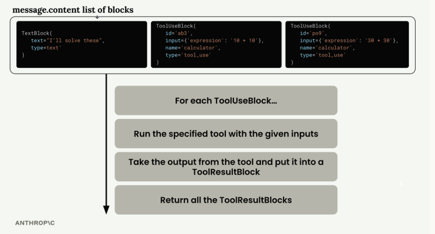

Claude puede pedir varias herramientas en una sola respuesta. `run_tools` filtra todos los bloques de tipo `tool_use` y los procesa uno a uno:

```python
def run_tools(message):
    # Filtra solo los bloques que son solicitudes de herramienta
    tool_requests = [
        block for block in message.content if block.type == "tool_use"
    ]
    tool_result_blocks = []

    for tool_request in tool_requests:
        # Procesa cada solicitud individualmente (ver sección 22.4 y 22.5)
        ...

    return tool_result_blocks   # Lista de bloques tool_result para enviar a Claude
```
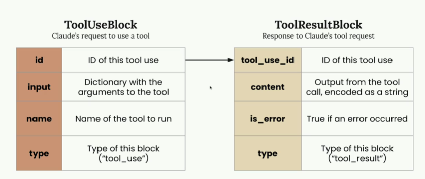
---

#### 22.4 Estructura del bloque de resultado (`tool_result`)

Cada `ToolUseBlock` debe responderse con un bloque de resultado que tenga el mismo `id`. Así Claude sabe qué resultado corresponde a qué solicitud:

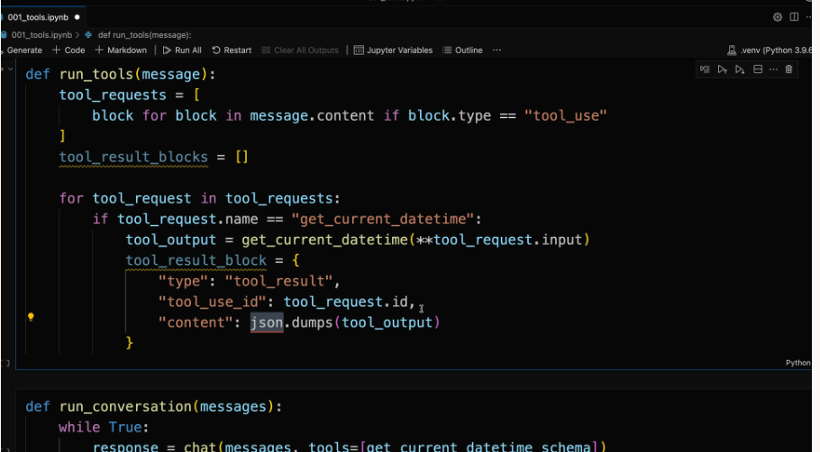

```python
tool_result_block = {
    "type": "tool_result",
    "tool_use_id": tool_request.id,          # Debe coincidir con el id del ToolUseBlock
    "content": json.dumps(tool_output),       # Resultado serializado como string JSON
    "is_error": False                          # False si la ejecución fue exitosa
}
```

| Propiedad | Tipo | Descripción |
| --- | --- | --- |
| `type` | `str` | Siempre `"tool_result"` |
| `tool_use_id` | `str` | ID del `ToolUseBlock` al que responde este resultado |
| `content` | `str` | Resultado de la herramienta serializado como string |
| `is_error` | `bool` | `True` si ocurrió un error; `False` si fue exitosa |

---

#### 22.5 Manejo de errores en la ejecución

Cuando una herramienta falla, igualmente hay que enviar un bloque de resultado a Claude (con `is_error: True`) para que pueda decidir cómo continuar:

```python
try:
    tool_output = run_tool(tool_request.name, tool_request.input)
    tool_result_block = {
        "type": "tool_result",
        "tool_use_id": tool_request.id,
        "content": json.dumps(tool_output),   # Resultado exitoso serializado
        "is_error": False
    }
except Exception as e:
    tool_result_block = {
        "type": "tool_result",
        "tool_use_id": tool_request.id,
        "content": f"Error: {e}",   # Mensaje de error legible para que Claude lo interprete
        "is_error": True            # Señal explícita de fallo
    }
```

> Siempre hay que devolver un bloque de resultado aunque la herramienta falle — omitirlo rompe el flujo de conversación.

---

#### 22.6 Enrutamiento de herramientas escalable

Para soportar varias herramientas, `run_tool` mapea nombres a implementaciones. Agregar una nueva herramienta solo requiere un `elif` adicional, sin tocar el resto de la lógica:

```python
def run_tool(tool_name, tool_input):
    if tool_name == "get_current_datetime":
        return get_current_datetime(**tool_input)    # ** desempaqueta el dict como argumentos
    elif tool_name == "add_duration_to_datetime":
        return add_duration_to_datetime(**tool_input)
    elif tool_name == "another_tool":
        return another_tool(**tool_input)
    # Agregar más herramientas aquí sin cambiar run_conversation ni run_tools
```

---

#### 22.7 Flujo de trabajo completo

| Paso | Quién actúa | Qué ocurre |
| --- | --- | --- |
| 1 | Aplicación → Claude | Se envía el mensaje del usuario con la lista de herramientas disponibles |
| 2 | Claude → Aplicación | Claude responde con texto y/o solicitudes de herramientas (`ToolUseBlock`) |
| 3 | Aplicación | `run_tools` ejecuta cada herramienta y construye los bloques de resultado |
| 4 | Aplicación → Claude | Se envían los resultados como mensaje de usuario |
| 5 | — | Se repite desde el paso 1 hasta que `stop_reason != "tool_use"` |

El historial completo se conserva en cada iteración, lo que permite a Claude basarse en los resultados de herramientas anteriores para dar respuestas exhaustivas a solicitudes complejas.

---

### Módulo 23: Utilizar múltiples herramientas

La belleza del diseño modular de tools es que agregar una nueva herramienta no requiere tocar la lógica central del bucle (`run_conversation`, `run_tools`). Todo lo nuevo se localiza en dos lugares: la lista de schemas que se le pasa a Claude, y el enrutador que despacha las llamadas a las funciones correctas.

---

#### 23.1 Las herramientas que estamos añadiendo

Para el sistema de recordatorios se necesitan tres herramientas complementarias:

| Herramienta | Por qué es necesaria |
| --- | --- |
| `get_current_datetime` | Claude necesita conocer la fecha y hora actuales para calcular fechas futuras |
| `add_duration_to_datetime` | Claude no es confiable para sumar fechas manualmente; la herramienta lo hace con precisión |
| `set_reminder` | Mecanismo para configurar el recordatorio en el sistema |

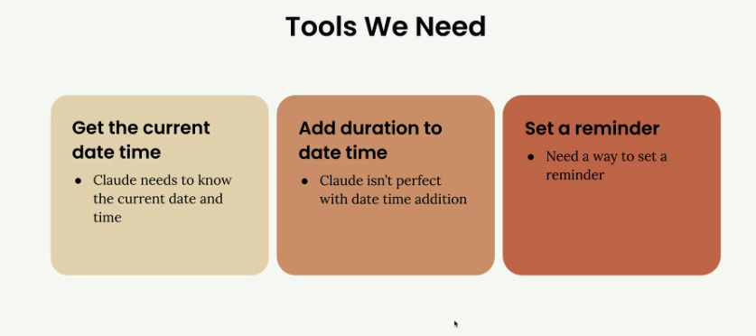
---

#### 23.2 Añadiendo herramientas a la conversación

En `run_conversation`, se pasan todos los esquemas en la lista `tools` para que Claude sepa cuáles tiene disponibles:

```python
response = chat(messages, tools=[
    get_current_datetime_schema,       # Herramienta 1: fecha y hora actual
    add_duration_to_datetime_schema,   # Herramienta 2: suma de duración a una fecha
    set_reminder_schema                # Herramienta 3: configurar el recordatorio
])
```

---

#### 23.3 Actualización del enrutador de herramientas

Se agregan casos `elif` en `run_tool` por cada nueva herramienta. La función actúa como un despachador: recibe el nombre, llama a la función correcta con los argumentos de Claude y devuelve el resultado:

```python
def run_tool(tool_name, tool_input):
    if tool_name == "get_current_datetime":
        return get_current_datetime(**tool_input)        # Desempaqueta los argumentos del dict

    elif tool_name == "add_duration_to_datetime":
        return add_duration_to_datetime(**tool_input)    # Claude pasa fecha base + duración

    elif tool_name == "set_reminder":
        return set_reminder(**tool_input)                # Claude pasa fecha/hora y texto del recordatorio
```

---

#### 23.4 Pruebas de uso de múltiples herramientas

Para verificar que el flujo funciona, se puede usar una solicitud que obligue a Claude a encadenar herramientas:

> *"Configurar un recordatorio para mi cita con el médico. Faltan 177 días para el 1 de enero de 2050."*

Claude resuelve esta solicitud en secuencia:

| Paso | Herramienta usada | Qué hace |
| --- | --- | --- |
| 1 | `add_duration_to_datetime` | Calcula que 177 días antes del 1/1/2050 es el 27/6/2050 |
| 2 | `set_reminder` | Configura el recordatorio para esa fecha calculada |

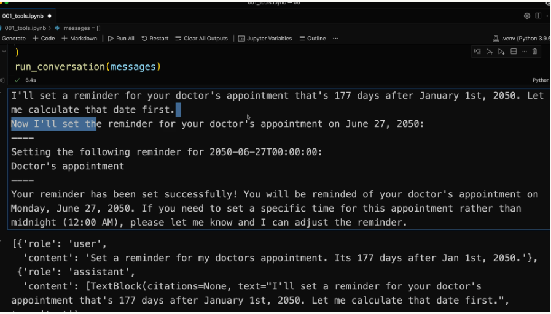

---

#### 23.5 Comprender el flujo de mensajes

Al revisar el historial completo de la conversación se puede ver la estructura de mensajes encadenados:

| Turno | Rol | Contenido |
| --- | --- | --- |
| 1 | `user` | Solicitud original del usuario |
| 2 | `assistant` | TextBlock explicativo + uno o más ToolUseBlocks |
| 3 | `user` | Bloques `tool_result` con los resultados de las herramientas |
| 4 | `assistant` | Mensaje de seguimiento (puede pedir más herramientas o dar respuesta final) |

> Un solo mensaje del asistente puede contener varios bloques simultáneamente: texto explicativo y múltiples solicitudes de herramientas combinadas.

---

#### 23.6 El patrón simple para agregar herramientas

Cada nueva herramienta sigue exactamente el mismo proceso de cuatro pasos:

| Paso | Acción |
| --- | --- |
| 1 | Crear la implementación de la función Python |
| 2 | Definir el esquema JSON de la herramienta |
| 3 | Agregar el esquema a la lista `tools` en `run_conversation` |
| 4 | Agregar un caso `elif` en `run_tool` |

Este enfoque modular permite ampliar las capacidades del asistente sin reestructurar el código existente. Cada herramienta nueva se integra al flujo de conversación y a la lógica de gestión sin modificar lo ya construido.

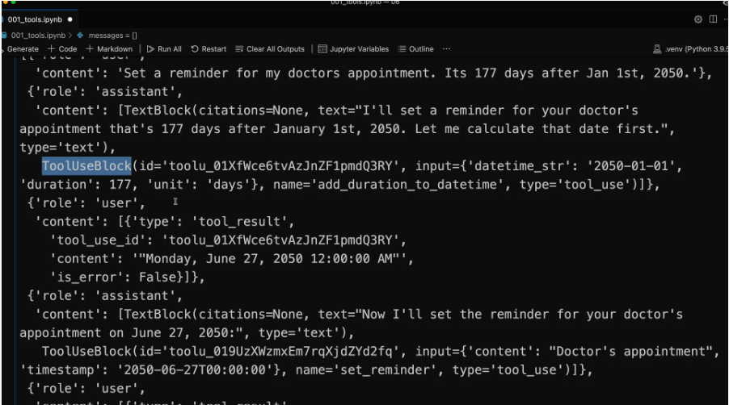

---

### Módulo 24: Llamada de herramienta de grano fino

Cuando se combina streaming con herramientas, aparece una tensión: el streaming existe para dar respuestas en tiempo real, pero los argumentos de las herramientas son JSON que deben estar completos y válidos antes de que el código pueda ejecutar la función. La API resuelve esto con un mecanismo de **buffering y validación** que introduce un compromiso entre velocidad y corrección.

---

#### 24.1 Transmisión de herramientas básicas

Con streaming habilitado, además de los eventos `ContentBlockDelta` del texto normal, aparece un nuevo tipo de evento para herramientas: `InputJsonEvent`.

| Propiedad | Descripción |
| --- | --- |
| `partial_json` | Fragmento de JSON que representa parte de los argumentos de la herramienta |
| `snapshot` | JSON acumulativo construido a partir de todos los fragmentos recibidos hasta el momento |

```python
for chunk in stream:
    if chunk.type == "input_json":
        print(chunk.partial_json)      # Fragmento actual recibido
        current_args = chunk.snapshot  # Argumentos completos acumulados hasta ahora
```

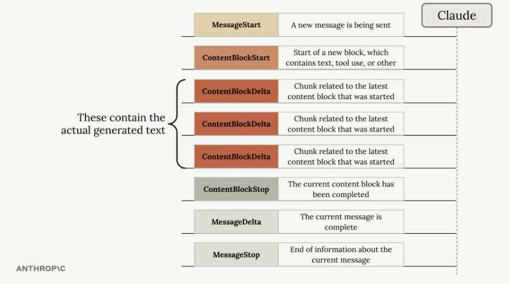
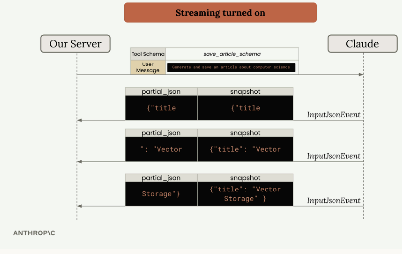
---

#### 24.2 Cómo funciona la validación JSON

La API no envía cada fragmento de inmediato. Almacena en búfer y valida antes de transmitir:

| Paso | Qué hace la API |
| --- | --- |
| 1 | Espera a que se complete el valor de un par clave-valor de nivel superior |
| 2 | Valida ese par contra el esquema de la herramienta |
| 3 | Envía todos los fragmentos almacenados en búfer de ese par de una sola vez |
| 4 | Repite el proceso para cada clave de nivel superior |

```json
{
  "abstract": "This paper presents a novel...",
  "meta": {
    "word_count": 847,
    "review": "This paper introduces QuanNet..."
  }
}
```

> Esto explica por qué con streaming se producen retrasos seguidos de ráfagas de texto: los fragmentos se retienen hasta que hay un par clave-valor completo y válido.

---

#### 24.3 Llamada de herramientas de grano fino

La llamada de grano fino desactiva la validación JSON en la API, entregando cada fragmento tan pronto como Claude lo genera:

| Comportamiento | Validación por defecto | Grano fino (`fine_grained=True`) |
| --- | --- | --- |
| Velocidad de entrega | Con retrasos de búfer | Inmediata, sin espera |
| Validación JSON | Activa en la API | Desactivada — el código debe validar |
| JSON parcial inválido | La API lo corrige o encapsula | Llega tal cual, puede ser inválido |

```python
run_conversation(
    messages,
    tools=[save_article_schema],
    fine_grained=True   # Desactiva la validación en la API; los fragmentos llegan sin retraso
)
```

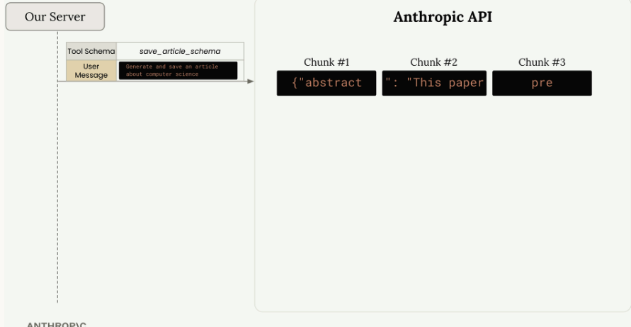

---

#### 24.4 Manejo de JSON no válido

Con grano fino activo, Claude puede generar JSON inválido temporalmente (ej. `"word_count": undefined`). El código debe tolerarlo:

```python
try:
    parsed_args = json.loads(chunk.snapshot)   # Intenta parsear el snapshot acumulado
except json.JSONDecodeError:
    # El snapshot aún no es JSON válido — es normal con grano fino
    print("Received invalid JSON, continuing...")
```

> Sin grano fino, la API detecta este tipo de error y puede encapsular el valor en un string, lo que podría no coincidir con el esquema esperado.

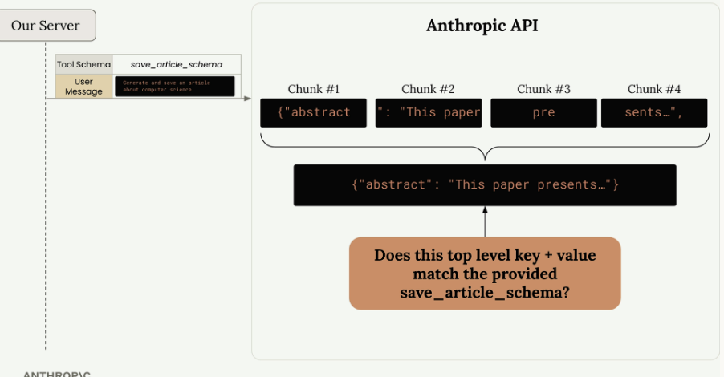 

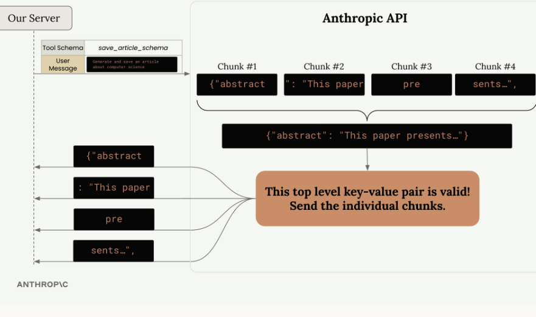
---

#### 24.5 Cuándo utilizar la llamada de grano fino

| Usar grano fino cuando... | Mantener validación por defecto cuando... |
| --- | --- |
| Se necesita mostrar progreso en tiempo real al usuario | La experiencia de usuario no depende de velocidad de fragmentos |
| Se quiere procesar resultados parciales lo antes posible | Se prefiere recibir JSON siempre válido sin lógica adicional |
| Los retrasos de búfer afectan negativamente la UX | El manejo de errores JSON robusto no está implementado |

Para la mayoría de las aplicaciones el comportamiento por defecto con validación es suficiente. La llamada de grano fino es una optimización para casos donde la capacidad de respuesta inmediata es crítica.

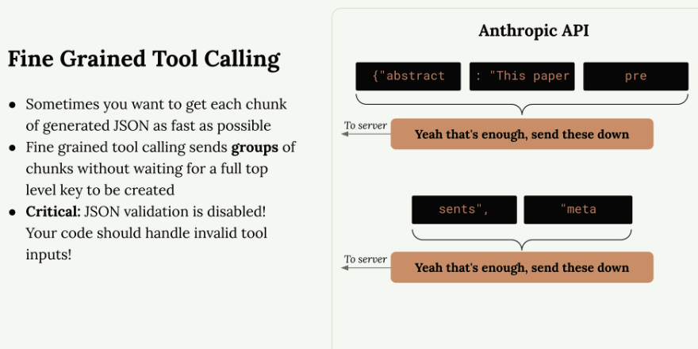

---

### Módulo 25: La herramienta de edición de texto

Hasta ahora todas las herramientas vistas eran **custom**: el desarrollador escribe tanto el esquema como la función Python. La herramienta de edición de texto rompe ese patrón. El esquema ya está integrado en Claude — no hay que escribirlo. Pero la implementación de las operaciones de archivo sí es responsabilidad del desarrollador. Es el caso inverso: Claude sabe qué quiere hacer con los archivos, pero necesita que alguien le provea el código que realmente ejecuta esas operaciones en el sistema de archivos local.

---

#### 25.1 Qué puede hacer la herramienta de edición de texto

| Operación | Descripción |
| --- | --- |
| **Ver contenido** | Muestra el contenido de un archivo o directorio |
| **Ver rango de líneas** | Visualiza un rango específico de líneas de un archivo |
| **Reemplazar texto** | Sustituye texto en un archivo existente |
| **Crear archivos** | Crea nuevos archivos con el contenido indicado |
| **Insertar texto** | Inserta texto en una línea específica de un archivo |
| **Deshacer ediciones** | Revierte las ediciones recientes en un archivo |

---

#### 25.2 Comprender los requisitos de implementación

A diferencia de otras herramientas donde hay que escribir tanto el esquema como la implementación, con el editor de texto el esquema ya está integrado en Claude. Solo se debe implementar el código que ejecuta las operaciones:

| Componente | Herramientas personalizadas | Editor de texto |
| --- | --- | --- |
| Esquema JSON | Lo escribe el desarrollador | Integrado en Claude |
| Implementación de funciones | Lo escribe el desarrollador | Lo escribe el desarrollador |

> Claude sabe cómo solicitar operaciones de archivo, pero el código que realmente las ejecuta (crear, leer, reemplazar, etc.) debe ser provisto por la aplicación.

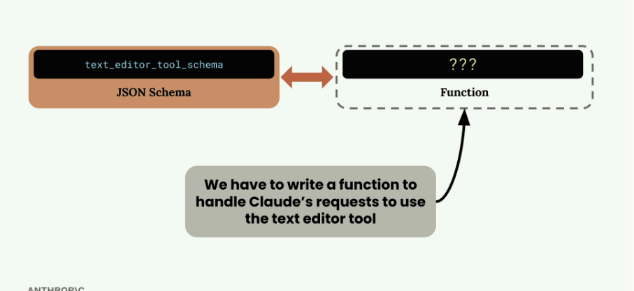

---

#### 25.3 Versiones de esquema

Aunque el esquema principal está integrado, hay que incluir un pequeño fragmento al realizar solicitudes. El esquema exacto depende del modelo utilizado:

```python
def get_text_edit_schema(model):
    if model.startswith("claude-3-7-sonnet"):
        return {
            "type": "text_editor_20250124",   # Versión del esquema para Sonnet 3.7
            "name": "str_replace_editor",
        }
    elif model.startswith("claude-3-5-sonnet"):
        return {
            "type": "text_editor_20241022",   # Versión del esquema para Sonnet 3.5
            "name": "str_replace_editor",
        }
```

| Campo | Descripción |
| --- | --- |
| `type` | Versión del esquema de la herramienta (varía según el modelo) |
| `name` | Nombre fijo de la herramienta: siempre `"str_replace_editor"` |

Claude recibe este pequeño fragmento y lo expande automáticamente en segundo plano a la especificación completa de la herramienta.

---

#### 25.4 Ejemplo práctico

**Lectura y resumen de un archivo:**

> *"Abre el archivo `./main.py` y resume su contenido."*

Claude usará la herramienta para:

1. Ver el archivo con la operación de lectura
2. Leer el contenido completo
3. Generar y devolver el resumen

**Modificación y creación de archivos:**

> *"Abre `./main.py` y escribe una función para calcular pi con 5 dígitos de precisión. Luego crea `./test.py` para probar la implementación."*

Claude usará la herramienta para:

1. Ver el archivo `main.py` existente
2. Reemplazar su contenido con la nueva implementación
3. Crear el archivo `test.py` con las pruebas unitarias correspondientes

---

#### 25.5 ¿Por qué utilizar la herramienta de edición de texto?

| Caso de uso | Por qué la herramienta es valiosa |
| --- | --- |
| Aplicaciones que editan archivos por código | Integración directa sin depender de un editor externo |
| Entornos sin IDE avanzado | Proporciona capacidades de edición donde no hay editor disponible |
| Control preciso sobre el sistema de archivos | Define exactamente cómo Claude interactúa con los archivos de la app |

La herramienta de edición de texto permite replicar gran parte de la funcionalidad de un editor de código con IA directamente dentro de aplicaciones propias, sin necesitar herramientas de terceros.

---

### Módulo 26: La herramienta de búsqueda web

La búsqueda web es el segundo ejemplo de herramienta integrada en Claude (además del editor de texto). La diferencia con las herramientas custom es total: aquí Claude no solo tiene el esquema integrado, sino que también **ejecuta la búsqueda internamente**. La aplicación no necesita conectarse a ninguna API de búsqueda ni procesar los resultados — Claude lo gestiona todo. El rol del desarrollador se reduce a activar la herramienta con un esquema mínimo y luego procesar los bloques que Claude devuelve en la respuesta.

> **Requisito previo:** la organización debe habilitar la herramienta de búsqueda web desde la consola de configuración de Anthropic antes de usarla.

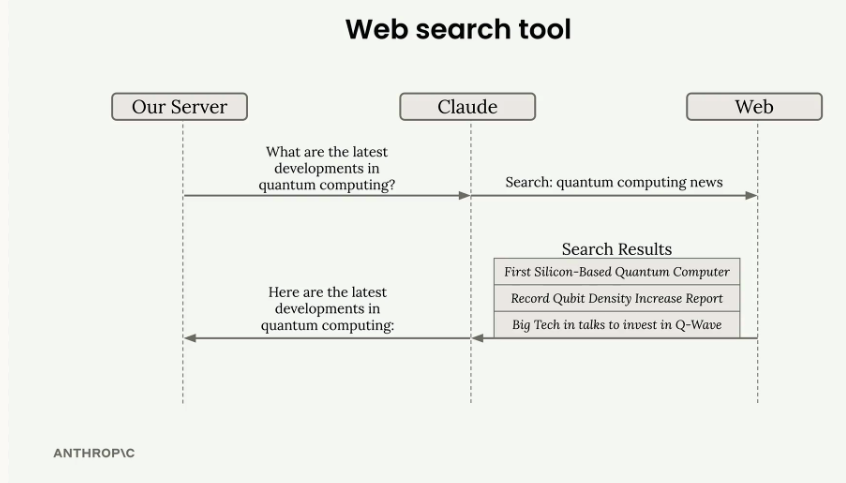
---

#### 26.1 Configuración de la herramienta de búsqueda web

El esquema tiene tres campos:

```python
web_search_schema = {
    "type": "web_search_20250305",   # Versión de la herramienta integrada
    "name": "web_search",            # Nombre con el que Claude identifica la herramienta
    "max_uses": 5                    # Límite de búsquedas por conversación
}
```

| Campo | Descripción |
| --- | --- |
| `type` | Versión de la herramienta de búsqueda web |
| `name` | Nombre fijo: siempre `"web_search"` |
| `max_uses` | Máximo de búsquedas que Claude puede realizar; evita exceso de llamadas a la API |

> Una sola búsqueda puede devolver varios resultados, pero Claude puede considerar necesarias búsquedas adicionales. `max_uses` controla ese límite.

---

#### 26.2 Cómo funciona la respuesta

Cuando Claude usa la herramienta, la respuesta contiene múltiples tipos de bloques:

| Tipo de bloque | Contenido |
| --- | --- |
| **TextBlock** | Explicación de Claude sobre lo que está haciendo |
| **ServerToolUseBlock** | Consulta de búsqueda exacta que usó Claude |
| **WebSearchToolResultBlock** | Contenedor con todos los resultados de la búsqueda |
| **WebSearchResultBlock** | Resultado individual con título y URL de la fuente |
| **Bloque de citas** | Texto específico que Claude usó para respaldar sus afirmaciones, con URL de origen |

Esta estructura permite ver exactamente qué buscó Claude, qué fuentes encontró y qué fragmentos específicos cita para sustentar cada afirmación.

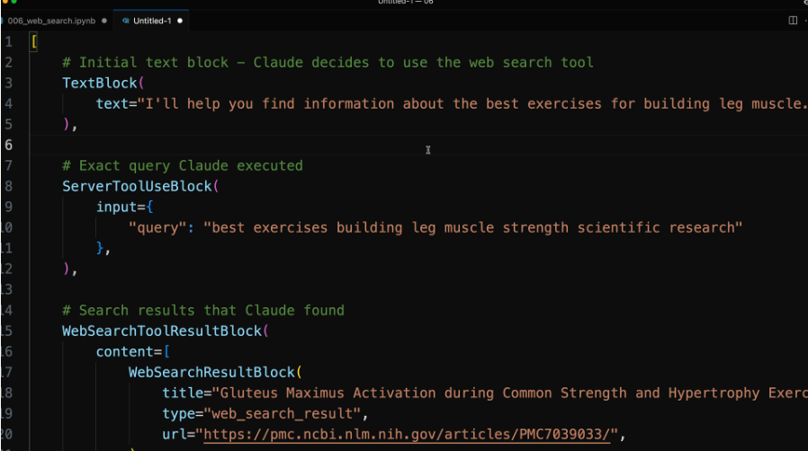
---

#### 26.3 Restricción de dominios de búsqueda

El campo `allowed_domains` limita las búsquedas a dominios de confianza específicos:

```python
web_search_schema = {
    "type": "web_search_20250305",
    "name": "web_search",
    "max_uses": 5,
    "allowed_domains": ["nih.gov"]   # Solo busca en dominios autorizados
}
```

| Campo | Descripción |
| --- | --- |
| `allowed_domains` | Lista de dominios permitidos para la búsqueda (ej. `["nih.gov", "who.int"]`) |

> Útil para garantizar que Claude obtenga información basada en evidencia (ej. PubMed) en lugar de contenido de blogs o fuentes no verificadas.

---

#### 26.4 Mostrando resultados de búsqueda

Cada tipo de bloque está pensado para una representación específica en la UI:

| Bloque | Cómo mostrarlo |
| --- | --- |
| **TextBlock** | Contenido de texto normal |
| **WebSearchResultBlock** | Lista de fuentes en la parte superior de la respuesta |
| **Bloque de citas** | En línea con el texto: dominio, título de página, URL y texto citado |

Esta estructura da transparencia al usuario sobre qué información proviene de cada fuente, generando confianza en las respuestas de la IA.

---

#### 26.5 Uso práctico

La herramienta se incluye en la lista `tools` de la llamada a la API. Claude decide automáticamente cuándo una búsqueda ayudaría a responder al usuario:

```python
response = client.messages.create(
    model=model,
    max_tokens=1000,
    messages=messages,
    tools=[web_search_schema]   # Claude usa la búsqueda cuando lo considera necesario
)
```

Casos donde la herramienta aporta más valor:

| Caso de uso | Por qué es útil |
| --- | --- |
| Eventos actuales y noticias recientes | No están en los datos de entrenamiento de Claude |
| Información especializada o técnica | Fuentes actualizadas superan el conocimiento estático |
| Verificación de datos | Contrasta información con fuentes autorizadas |
| Investigación con datos actualizados | Garantiza información vigente, no desactualizada |

---

### Resumen de la Unidad 5: Tools

Esta unidad es la más larga y técnica del curso — construye desde cero el sistema completo de herramientas que habilita a Claude para actuar sobre el mundo real.

| Módulo | Tema | Concepto clave |
| --- | --- | --- |
| **15** | Introducción a herramientas | Claude propone la llamada, la app la ejecuta; ciclo: solicitud → `tool_use` block → ejecución → `tool_result` → respuesta final |
| **16** | Proyecto práctico | Sistema de recordatorios end-to-end: integración de definición, ejecución y respuesta en una aplicación real |
| **17** | Funciones de herramienta | Las funciones Python son independientes del schema; el schema describe la interfaz, la función implementa la lógica |
| **18** | Esquemas de herramientas | Objeto JSON con `name`, `description` e `input_schema` (JSON Schema); la `description` es crítica — Claude la usa para decidir cuándo invocar la tool |
| **19** | Manejo de bloques de mensajes | La respuesta puede contener múltiples bloques `content`: `text` y `tool_use` conviven en el mismo mensaje; iterar sobre `response.content` para manejar ambos |
| **20** | Enviando resultados | Bloque `tool_result` con `tool_use_id` y `content`; se agrega como mensaje `user` de seguimiento para cerrar el ciclo |
| **21** | Multi-turno con tools | El historial completo (incluyendo `tool_use` y `tool_result`) se acumula en el array `messages` entre turnos |
| **22** | Múltiples giros | Bucle `while True` que alterna entre llamadas a Claude y ejecución de herramientas hasta que `stop_reason == "end_turn"` |
| **23** | Múltiples herramientas | Pasar un array de schemas en `tools=[]`; Claude selecciona la herramienta adecuada según el contexto |
| **24** | Control fino | `tool_choice` para forzar o prohibir herramientas; streaming con tools usa `InputJsonEvent` para recibir argumentos JSON parciales |
| **25** | Text editor tool | Herramienta built-in de Anthropic para leer y editar archivos; reduce el boilerplate de implementar operaciones de archivo manualmente |
| **26** | Web search tool | Herramienta built-in para búsqueda en tiempo real; Claude decide cuándo buscar según el contexto de la pregunta |

**Patrón transversal de la unidad:** el protocolo de tools es siempre el mismo ciclo — definir el schema, detectar el bloque `tool_use` en la respuesta, ejecutar la función, devolver el `tool_result`. Todo lo demás (múltiples herramientas, multi-turno, streaming, tools built-in) son variaciones sobre ese mismo ciclo fundamental.

---

## Unidad 6: RAG y búsqueda agencial

| Módulo | Tema |
| --- | --- |
| 27 | Presentamos la generación aumentada de recuperación |
| 28 | Estrategias de segmentación de texto |
| 29 | Incrustaciones de texto |
| 30 | El flujo RAG completo |
| 31 | Implementación del flujo RAG |
| 32 | Búsqueda léxica BM25 |
| 33 | Una canalización RAG de índice múltiple |

---

### Módulo 27: Presentamos la generación aumentada de recuperación (RAG)

La Generación Aumentada de Recuperación (RAG) es una técnica que permite trabajar con documentos extensos que no caben en un solo prompt. En lugar de incluir toda la información, RAG divide los documentos en fragmentos y solo incluye las partes más relevantes al responder cada pregunta.

---

#### 27.1 El problema de los documentos extensos

Ante un documento de 800 páginas y una pregunta específica como "¿Qué factores de riesgo tiene esta empresa?", hay dos enfoques posibles:

| Opción | Descripción | Limitaciones |
| --- | --- | --- |
| **Incluir todo** | Extraer todo el texto e insertarlo en el mensaje | Límite de longitud del prompt, menor eficacia de Claude con prompts muy largos, mayor costo y latencia |
| **RAG** | Dividir el documento en fragmentos y seleccionar solo los relevantes | Requiere preprocesamiento y un mecanismo de búsqueda |

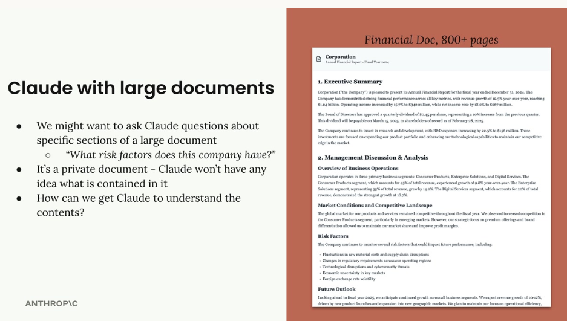
---

#### 27.2 Opción 1: incluir todo en la solicitud

```xml
Answer the user's question about the financial document.

<user_question>
{user_question}
</user_question>

<financial_document>
{financial_document}   <!-- El documento completo: puede ser demasiado largo -->
</financial_document>
```
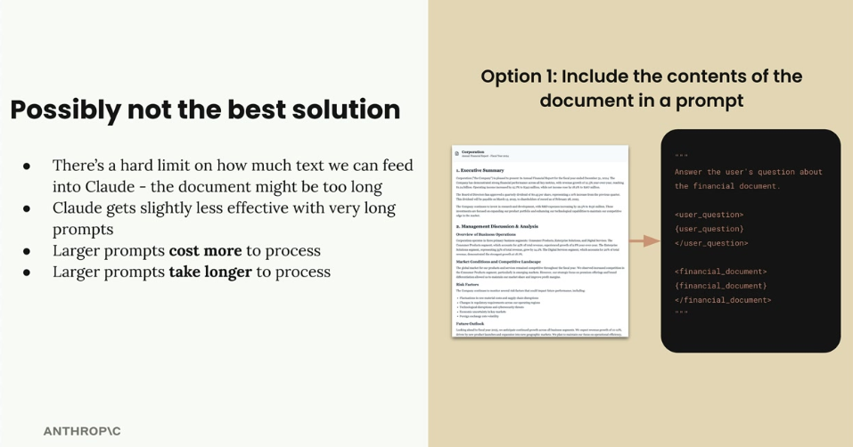
Problemas de este enfoque:

- Existe un límite estricto en la longitud del prompt
- Claude se vuelve menos eficaz con prompts muy largos
- Los mensajes más extensos cuestan más y tardan más en procesarse

---

#### 27.3 Opción 2: RAG — dividir y recuperar

RAG adopta un enfoque de dos etapas:

| Etapa | Cuándo ocurre | Qué hace |
| --- | --- | --- |
| **Preprocesamiento** | Una sola vez, al ingerir el documento | Divide el documento en fragmentos más pequeños |
| **Recuperación** | Cada vez que llega una pregunta | Busca los fragmentos más relevantes e incluye solo esos en el prompt |

**Ejemplo:** ante la pregunta "¿Qué riesgos enfrenta esta empresa?", el sistema busca en los fragmentos, encuentra la sección "Factores de riesgo" e incluye solo ese fragmento en el mensaje a Claude.

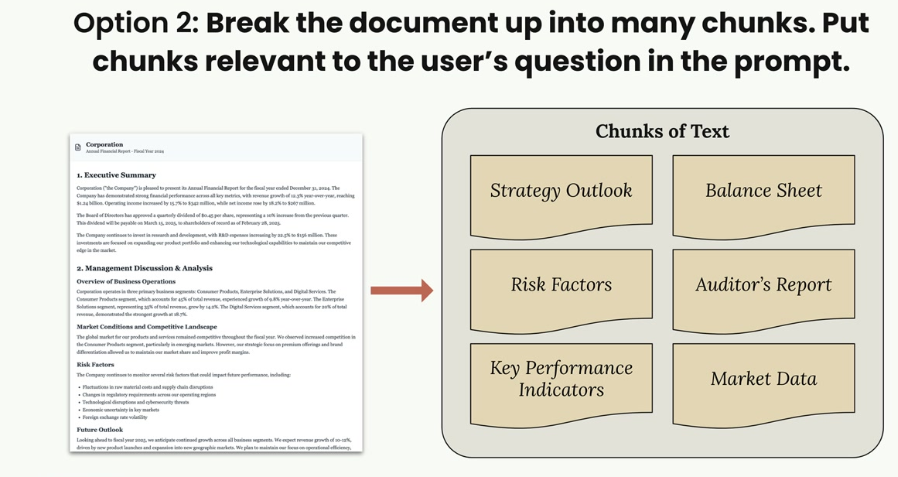
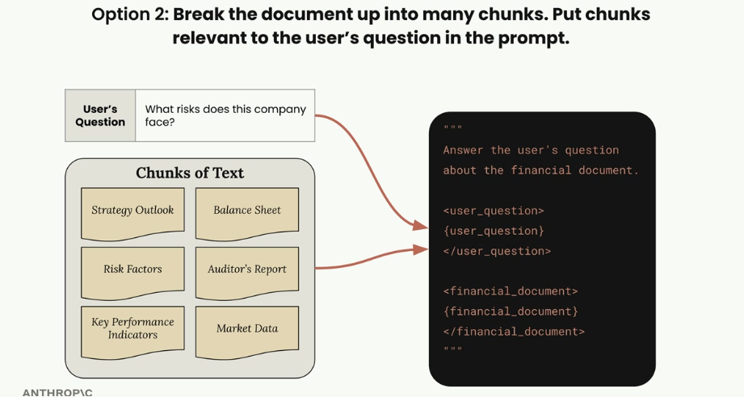
---


#### 27.4 Beneficios y desafíos de RAG

| Beneficios | Desafíos |
| --- | --- |
| Claude se enfoca solo en el contenido relevante | Requiere un paso de preprocesamiento |
| Se adapta a documentos de gran tamaño | Necesita un mecanismo de búsqueda |
| Funciona con múltiples documentos | Los fragmentos pueden perder contexto |
| Prompts más pequeños → menor costo y latencia | Hay muchas estrategias de segmentación posibles |

---

#### 27.5 Cuándo usar RAG

RAG implica más trabajo inicial que simplemente incluir toda la información en el prompt. Conviene evaluar si los beneficios justifican la complejidad según el caso de uso:

| Usar RAG cuando... | Preferir prompt completo cuando... |
| --- | --- |
| El documento es demasiado extenso para el prompt | El documento es corto y cabe en el contexto |
| Se trabaja con múltiples documentos | Se necesita una solución rápida y simple |
| Se necesita optimizar costo y rendimiento | La complejidad adicional no aporta valor |

> RAG prioriza escalabilidad y eficiencia sobre simplicidad. Requiere más trabajo inicial, pero permite trabajar con colecciones de documentos que serían imposibles de manejar con relleno directo del prompt.

---

### Módulo 28: Estrategias de segmentación de texto

La segmentación de texto es uno de los pasos más críticos en un sistema RAG. La forma en que se dividen los documentos impacta directamente en la calidad de las respuestas: una estrategia deficiente puede hacer que Claude reciba contexto completamente irrelevante y genere respuestas erróneas o incoherentes.

Para entender por qué esto importa tanto, pensá en este escenario: tenés un documento con secciones sobre investigación médica e ingeniería de software. Si la segmentación es pobre, la pregunta "¿Cuántos errores corrigieron los ingenieros este año?" puede terminar devolviendo fragmentos de la sección médica — simplemente porque ahí también aparece la palabra "error", pero en un contexto completamente diferente. Claude no tiene manera de saber que ese fragmento es irrelevante si es lo que le pasás.

Existen cuatro estrategias principales para segmentar texto, cada una con un nivel creciente de sofisticación y costo computacional.

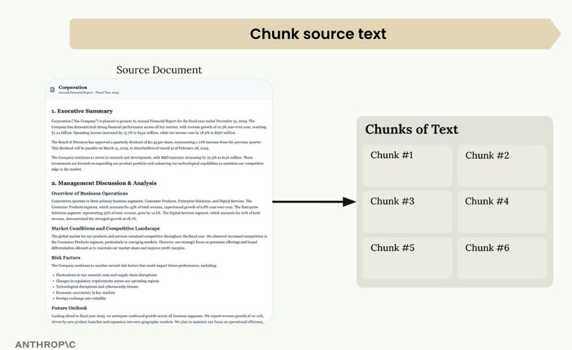

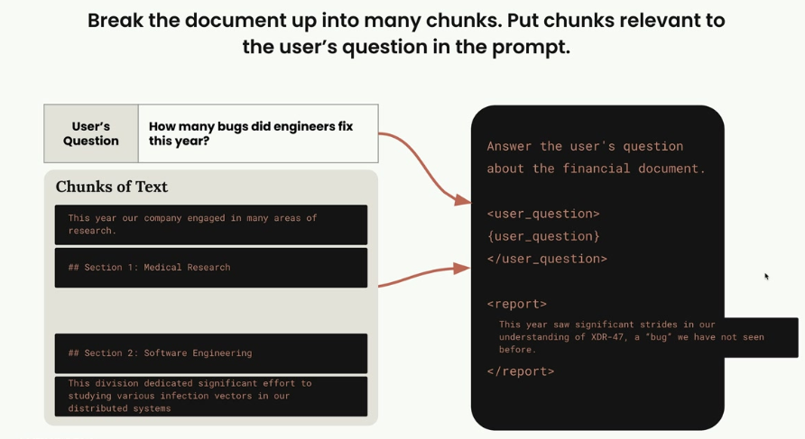

---

#### 28.1 Segmentación basada en el tamaño

Es el método más simple: el texto se divide en cadenas de longitud fija, sin importar el contenido. Funciona como un cuchillo que corta el documento cada N caracteres.

El problema obvio es que un corte puede caer en medio de una palabra o separar un encabezado de su párrafo. Para mitigar esto se introduce el concepto de **solapamiento** (`chunk_overlap`): cada fragmento comparte algunos caracteres con el fragmento anterior. Así, si una idea importante queda cortada al final de un fragmento, también aparece al principio del siguiente, lo que da más contexto al sistema de recuperación.

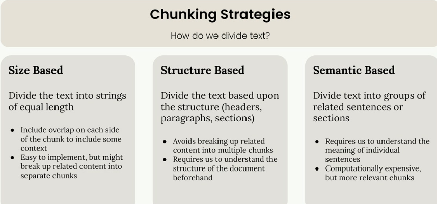

```python
def chunk_by_char(text, chunk_size=150, chunk_overlap=20):
    chunks = []
    start_idx = 0

    while start_idx < len(text):
        end_idx = min(start_idx + chunk_size, len(text))   # No superar el largo del texto
        chunk_text = text[start_idx:end_idx]
        chunks.append(chunk_text)

        # Si todavía hay texto por procesar, el próximo fragmento empieza
        # chunk_overlap caracteres antes del final del actual — así se solapan
        start_idx = (
            end_idx - chunk_overlap if end_idx < len(text) else len(text)
        )

    return chunks
```

| Parámetro | Descripción |
| --- | --- |
| `chunk_size` | Longitud máxima de cada fragmento en caracteres. Valores típicos en producción: 500–1500 caracteres |
| `chunk_overlap` | Caracteres compartidos entre fragmentos consecutivos. Suele ser el 10–20% del `chunk_size` |

| Ventaja | Desventaja |
| --- | --- |
| Fácil de implementar y depurar | Puede cortar palabras o frases a mitad |
| Funciona con cualquier tipo de documento, incluido código | Los encabezados pueden quedar separados de su contenido |
| Predecible: siempre genera fragmentos del mismo tamaño | Los fragmentos pueden carecer de coherencia semántica |

---

#### 28.2 Segmentación basada en la estructura

En lugar de cortar cada N caracteres, este enfoque respeta la estructura natural del documento: divide por encabezados, párrafos o secciones. El resultado es que cada fragmento contiene una unidad de significado completa, no un corte arbitrario del texto.
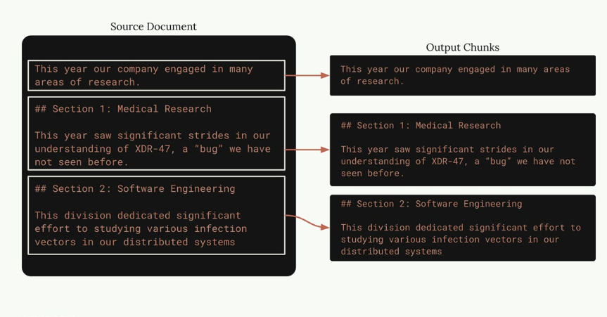
Funciona muy bien con documentos Markdown, donde los encabezados están marcados con `##`, `###`, etc. Al dividir por esos marcadores, cada fragmento corresponde exactamente a una sección del documento.

```python
def chunk_by_section(document_text):
    # El patrón busca saltos de línea seguidos de "## " (encabezado nivel 2 de Markdown)
    # re.split divide el texto en cada ocurrencia de ese patrón
    pattern = r"\n## "
    return re.split(pattern, document_text)
```

La limitación es clara: si el documento no tiene estructura explícita — como muchos PDFs escaneados o texto plano exportado desde un procesador de texto — este método no puede aplicarse.

| Ventaja | Desventaja |
| --- | --- |
| Fragmentos semánticamente completos y con sentido propio | Solo funciona con documentos que tienen marcadores estructurales claros |
| La recuperación es más precisa porque cada fragmento cubre un tema | No aplica a PDFs, texto plano o documentos sin formato |

---

#### 28.3 Segmentación basada en la semántica

Este es el enfoque más sofisticado. La idea es dividir el texto en oraciones individuales y luego usar modelos de procesamiento del lenguaje natural (NLP) para calcular qué tan relacionadas están dos oraciones consecutivas. Si su relación semántica baja de un umbral, ahí se hace el corte; si siguen siendo temáticamente cercanas, se mantienen en el mismo fragmento.

El resultado son fragmentos que agrupan ideas relacionadas independientemente de su extensión o de si están en la misma sección del documento. En teoría, es la estrategia que produce los fragmentos más útiles para el sistema de recuperación. En la práctica, requiere modelos de embeddings adicionales para calcular similitud semántica en tiempo real, lo que lo hace costoso en términos de cómputo y más difícil de mantener.

| Ventaja | Desventaja |
| --- | --- |
| Produce los fragmentos más relevantes semánticamente | Alto costo computacional — requiere modelos de embeddings durante el preprocesamiento |
| Respeta el significado del texto, no solo su formato | Implementación compleja y más difícil de depurar |

---

#### 28.4 Segmentación basada en oraciones

Es la solución intermedia más práctica. En lugar de cortar por caracteres o por encabezados, divide el texto en oraciones completas usando expresiones regulares y las agrupa en fragmentos de N oraciones. El solapamiento ahora opera a nivel de oraciones en lugar de caracteres, lo que preserva mejor el contexto.

La regex `(?<=[.!?])\s+` usa un **lookbehind**: busca un espacio en blanco que esté precedido por `.`, `!` o `?`. Así detecta el final de una oración sin consumir el punto en sí.

```python
def chunk_by_sentence(text, max_sentences_per_chunk=5, overlap_sentences=1):
    # (?<=[.!?]) es un lookbehind: detecta un espacio DESPUÉS de punto, ! o ?
    # Esto divide el texto en oraciones completas sin perder la puntuación
    sentences = re.split(r"(?<=[.!?])\s+", text)

    chunks = []
    start_idx = 0

    while start_idx < len(sentences):
        end_idx = min(start_idx + max_sentences_per_chunk, len(sentences))
        current_chunk = sentences[start_idx:end_idx]
        chunks.append(" ".join(current_chunk))   # Vuelve a unir las oraciones en un string

        # El siguiente fragmento empieza overlap_sentences antes del fin del actual
        # Ej: con max=5 y overlap=1, el siguiente empieza en la oración 5 (no en la 6)
        start_idx += max_sentences_per_chunk - overlap_sentences

        if start_idx < 0:
            start_idx = 0

    return chunks
```

| Parámetro | Descripción |
| --- | --- |
| `max_sentences_per_chunk` | Máximo de oraciones por fragmento. Valores típicos: 3–7 oraciones |
| `overlap_sentences` | Oraciones compartidas entre fragmentos consecutivos. Con 1, el último fragmento siempre aparece al inicio del siguiente |

---

#### 28.5 Elegir la estrategia correcta

No existe una estrategia universalmente óptima — la elección depende del tipo de documentos con los que trabajás y de cuánta complejidad estás dispuesto a manejar.

| Estrategia | Cuándo usarla |
| --- | --- |
| **Basada en estructura** | Controlás el formato de los documentos (ej. informes internos en Markdown) |
| **Basada en oraciones** | Buen punto intermedio para textos en lenguaje natural sin formato definido |
| **Basada en tamaño** | La más confiable para producción: funciona con cualquier contenido, incluido código |
| **Semántica** | Cuando la calidad de recuperación es prioritaria y se dispone de recursos computacionales |

En producción, la segmentación por **tamaño con solapamiento** suele ganar porque combina simplicidad con consistencia. No genera fragmentos perfectos, pero es predecible, fácil de ajustar y no falla ante documentos con formatos inesperados. Ajustar `chunk_size` y `chunk_overlap` ya permite mejorar significativamente los resultados sin cambiar de estrategia.

---

### Módulo 29: Incrustaciones de texto

Una vez que el documento está dividido en fragmentos, el siguiente problema es: ¿cómo sabemos cuáles son relevantes para la pregunta del usuario? Si el documento tiene miles de fragmentos, no se puede enviar todo a Claude — hay que seleccionar solo los más útiles. Eso es exactamente lo que resuelven las incrustaciones de texto.
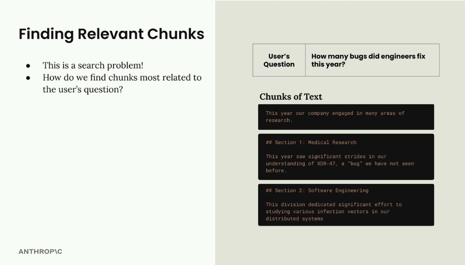
---

#### 29.1 El problema de búsqueda

Encontrar fragmentos relevantes es, en esencia, un problema de búsqueda. La solución más intuitiva sería buscar palabras exactas de la pregunta dentro de los fragmentos — pero ese enfoque falla rápido. Si alguien pregunta "¿cuáles son los riesgos financieros?" y el documento habla de "exposición al mercado" o "volatilidad cambiaria", una búsqueda por palabras clave no va a encontrar esa sección porque las palabras exactas no coinciden.

La solución es la **búsqueda semántica**: en lugar de comparar palabras, se compara *significado*. Y para hacer eso, se necesita una forma de representar el significado de un texto como algo que las computadoras puedan comparar matemáticamente — ahí entran los embeddings.

---

#### 29.2 Qué es una incrustación de texto

Una incrustación (embedding) es una lista de números que representa el significado de un texto. El proceso es el siguiente:

1. Se pasa un texto a un modelo de incrustación
2. El modelo devuelve una lista larga de números (típicamente entre 256 y 3072 valores)
3. Cada número está en el rango **-1 a +1**
4. En conjunto, esos números capturan el "significado" del texto en un espacio matemático
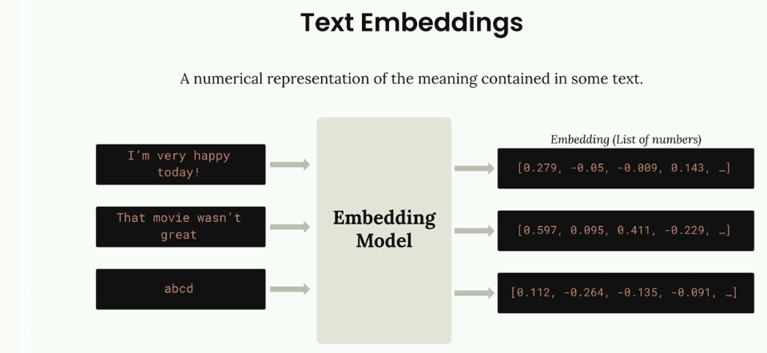

La analogía útil es pensar en un mapa: dos ciudades cercanas en el mapa son geográficamente similares. Con embeddings pasa lo mismo — dos textos con significados similares producen listas de números que están "cerca" en ese espacio matemático. Esa cercanía se puede medir con operaciones como la **similitud coseno**.

---

#### 29.3 Entendiendo los números

Cada número en el embedding es una "puntuación" de alguna cualidad del texto. Podría ser tentador imaginar que el número 47 representa "cuán positivo es el texto" o el número 312 "cuánto habla sobre finanzas" — pero eso no es cómo funciona.

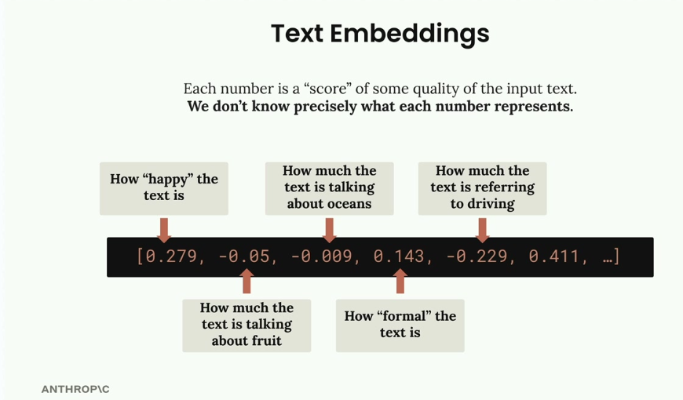

El significado real de cada dimensión lo aprende el modelo durante el entrenamiento con enormes cantidades de texto, y **no es directamente interpretable por humanos**. Lo que sí sabemos es que el modelo aprendió a organizar los textos de modo que textos similares queden cerca entre sí en ese espacio de miles de dimensiones. No necesitamos entender cada número individualmente — solo importa la distancia entre vectores.

---

#### 29.4 VoyageAI para incrustaciones

Anthropic no provee embeddings directamente, por lo que el proveedor recomendado es **VoyageAI**. Requiere una cuenta separada y su propia clave API (hay un nivel gratuito para empezar).

Agregar la clave al archivo `.env`:

```env
VOYAGE_API_KEY="your_key_here"
```

Instalar la librería:

```bash
%pip install voyageai
```

---

#### 29.5 Implementación

```python
from dotenv import load_dotenv
import voyageai

load_dotenv()                  # Carga la VOYAGE_API_KEY desde el archivo .env
voyage_client = voyageai.Client()   # Inicializa el cliente con la clave de entorno

def generate_embedding(text, model="voyage-3-large", input_type="query"):
    # client.embed() recibe una LISTA de textos, por eso pasamos [text]
    # Devuelve un objeto con .embeddings — una lista de listas de floats
    result = voyage_client.embed([text], model=model, input_type=input_type)
    return result.embeddings[0]   # Devuelve el embedding del primer (y único) texto
```
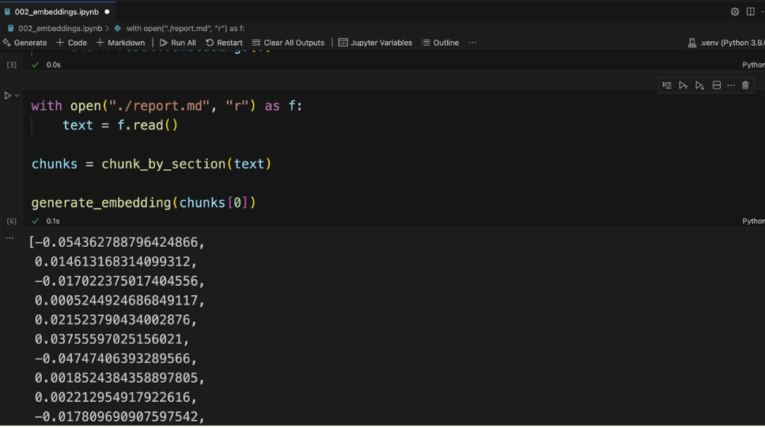

| Parámetro | Descripción |
| --- | --- |
| `text` | El texto a convertir en embedding (puede ser una pregunta o un fragmento del documento) |
| `model` | Modelo de VoyageAI a usar. `"voyage-3-large"` ofrece alta calidad; hay modelos más ligeros para producción de bajo costo |
| `input_type` | `"query"` para preguntas del usuario; `"document"` para fragmentos del corpus. Esta distinción mejora la calidad de la búsqueda |

El parámetro `input_type` merece atención especial: VoyageAI optimiza los embeddings de forma diferente según si el texto es una consulta (lo que busca el usuario) o un documento (lo que se va a recuperar). Usar el tipo correcto mejora la precisión del sistema de recuperación.

La función devuelve una lista de números de coma flotante — el embedding del texto. El próximo paso es comparar ese vector con los embeddings de todos los fragmentos del documento para encontrar los más similares, lo que constituye la base de la búsqueda semántica en RAG.

---

### Módulo 30: El flujo RAG completo

Este módulo conecta todo lo visto hasta ahora — segmentación, embeddings y búsqueda — en un proceso unificado de seis pasos. Lo importante no es solo memorizar los pasos, sino entender **por qué** el sistema puede encontrar información relevante aunque las palabras exactas de la pregunta no aparezcan en el documento.

---

#### 30.1 Paso 1 — Dividir el texto fuente en fragmentos

El primer paso es el preprocesamiento: el documento se divide en fragmentos con alguna de las estrategias del Módulo 28. Para este ejemplo, dos secciones:

| Fragmento | Sección | Contenido |
| --- | --- | --- |
| #1 | Investigación médica | *"Este año se han producido avances significativos en nuestra comprensión de XDR-47, un virus que no habíamos visto antes."* |
| #2 | Ingeniería de software | *"Esta división dedicó un esfuerzo significativo al estudio de diversos vectores de infección en nuestros sistemas distribuidos."* |

Notá que ambos fragmentos comparten vocabulario similar ("infección", "vectores") pero hablan de temas completamente distintos. Una búsqueda por palabras clave exactas no sabría diferenciarlos — los embeddings sí.

---

#### 30.2 Paso 2 — Generar embeddings para cada fragmento

Cada fragmento se convierte en un vector numérico usando el modelo de embeddings. Para ilustrar el concepto con un ejemplo simplificado, imaginemos un modelo que devuelve solo dos números con significado interpretable:

- **Número 1:** cuánto habla el texto sobre medicina
- **Número 2:** cuánto habla el texto sobre ingeniería de software

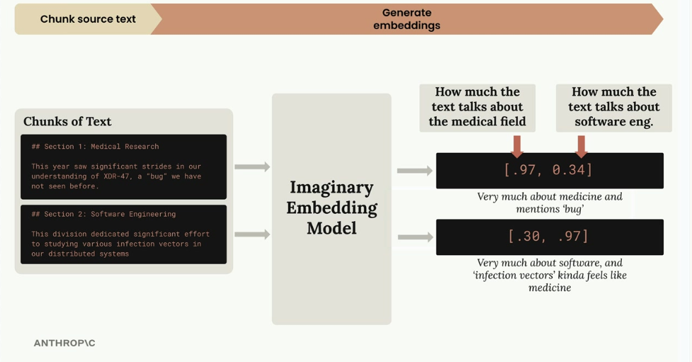

> En la realidad, los modelos de embeddings devuelven miles de dimensiones y ninguna de ellas tiene un significado humano interpretable directamente. Este ejemplo de dos dimensiones es solo una analogía pedagógica.

| Fragmento | Vector crudo | Después de normalización |
| --- | --- | --- |
| Investigación médica | [0.97, 0.34] | [0.944, 0.331] |
| Ingeniería de software | [0.30, 0.97] | [0.295, 0.955] |

La **normalización** escala cada vector para que tenga magnitud 1.0 (es decir, que su longitud en el espacio vectorial sea exactamente 1). La API de VoyageAI hace esto automáticamente. Permite que la comparación entre vectores mida solo la *dirección* — o sea, el significado — sin verse afectada por la longitud de los textos.
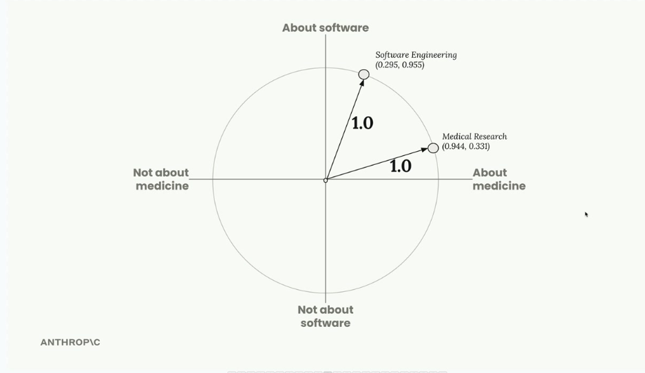
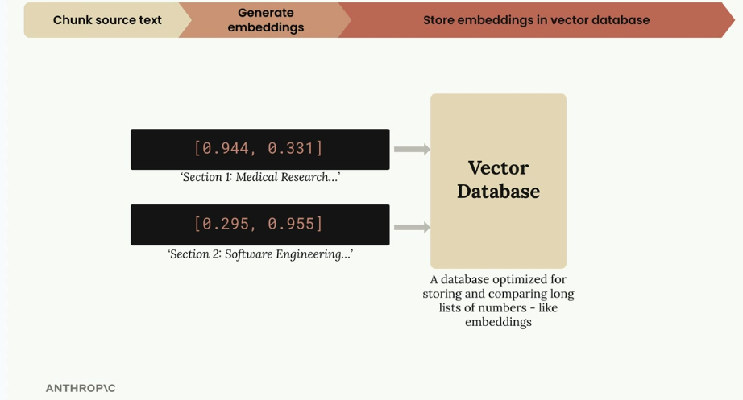

---

#### 30.3 Paso 3 — Almacenar en una base de datos vectorial

Los vectores normalizados se guardan en una **base de datos vectorial**: una base de datos especializada optimizada para almacenar listas de números y para hacer búsquedas de similitud de forma eficiente.

Este paso es el límite del **preprocesamiento**: todo lo realizado hasta aquí ocurre una sola vez, antes de que llegue cualquier consulta del usuario. A partir de aquí, el sistema espera.

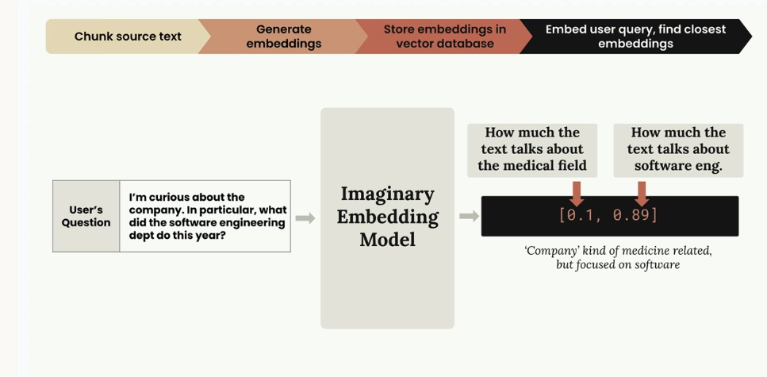
---

#### 30.4 Paso 4 — Procesar la consulta del usuario

Cuando el usuario hace una pregunta, esa pregunta pasa por el **mismo modelo de embeddings** que procesó los fragmentos:

> *"¿Qué hizo el departamento de ingeniería de software este año?"*

El modelo genera un vector para esta consulta, por ejemplo `[0.1, 0.89]` → normalizado: `[0.112, 0.993]`. Este vector tiene puntuación médica baja y puntuación de software alta, lo que refleja el significado semántico de la pregunta.
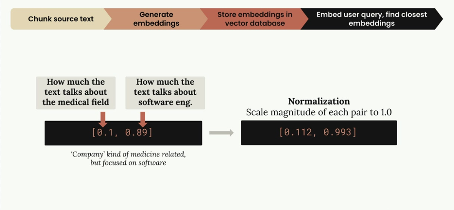
El punto crítico: **la consulta y los fragmentos están en el mismo espacio vectorial**. Eso permite compararlos matemáticamente para encontrar cuál fragmento tiene el significado más cercano a la pregunta.

---

#### 30.5 Paso 5 — Encontrar los fragmentos más similares (similitud coseno)

La base de datos vectorial compara el vector de la consulta con todos los vectores almacenados y devuelve los más similares. La métrica que usa se llama **similitud coseno**: mide el coseno del ángulo entre dos vectores.

| Métrica | Rango | Interpretación |
| --- | --- | --- |
| Similitud coseno | -1 a 1 | Cercano a **1** = muy similares; cercano a **-1** = muy diferentes; **0** = sin relación |
| Distancia coseno | 0 a 2 | `1 - similitud coseno`. Cercano a **0** = muy similares; valores grandes = muy diferentes |


En el ejemplo:

| Fragmento | Similitud coseno con la consulta | Interpretación |
| --- | --- | --- |
| Ingeniería de software | **0.983** | Muy alta similitud — este es el fragmento relevante |
| Investigación médica | 0.398 | Similitud baja — no es lo que el usuario busca |

La base de datos devuelve el fragmento de ingeniería de software, que es el semánticamente más cercano a la pregunta — aunque la pregunta no usa las palabras exactas del fragmento.

> La **distancia coseno** (1 - similitud) aparece frecuentemente en documentación de bases de datos vectoriales porque es más intuitiva para búsquedas: cuanto más cerca de 0, más similar. Los dos sistemas son equivalentes — solo es una convención de presentación.

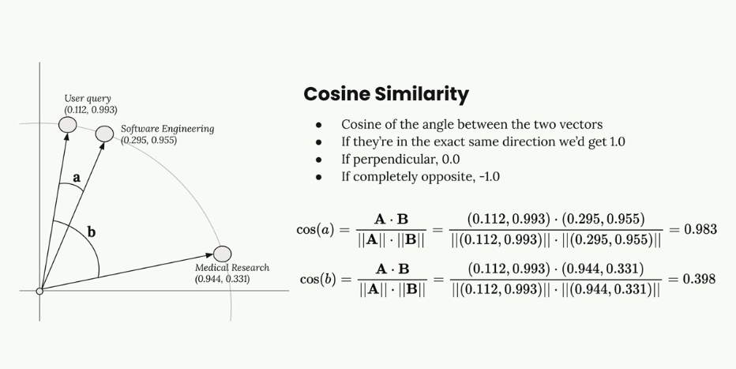

---

#### 30.6 Paso 6 — Construir el prompt final y enviar a Claude

Con el fragmento relevante recuperado, se construye el prompt combinando la pregunta original del usuario y el contexto encontrado:

```xml
Answer the user's question about the company report.

<user_question>
What did the software engineering department do this year?
</user_question>

<report>
## Section 2: Software Engineering
This division dedicated significant effort to studying various infection vectors
in our distributed systems.
</report>
```
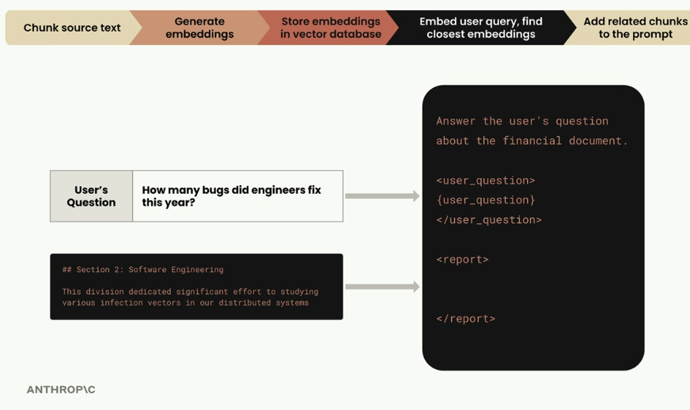

Claude recibe el fragmento relevante como contexto y puede responder con precisión — sin necesidad de haber visto el documento completo.

---

#### 30.7 Resumen del flujo completo

| Etapa | Cuándo ocurre | Qué hace |
| --- | --- | --- |
| **Preprocesamiento** | Una vez, al ingerir el documento | Segmentar → generar embeddings → almacenar en base de datos vectorial |
| **En tiempo real** | Cada vez que el usuario pregunta | Embeddear la consulta → buscar fragmentos similares → construir prompt → enviar a Claude |

La ventaja clave de este diseño: el preprocesamiento costoso ocurre una sola vez. Cada consulta del usuario solo requiere convertir una frase corta en embedding y hacer una búsqueda rápida — operaciones muy eficientes independientemente del tamaño del documento original.

---

#### Resumen rápido del flujo RAG

```text
① Segmentar    →  Dividir el documento en fragmentos manejables
② Embeddear    →  Convertir cada fragmento en un vector numérico (modelo de embeddings)
③ Almacenar    →  Guardar los vectores en una base de datos vectorial
                  ── hasta aquí: preprocesamiento (ocurre una sola vez) ──
④ Consultar    →  El usuario hace una pregunta
⑤ Embeddear    →  Convertir la pregunta en un vector (mismo modelo)
⑥ Buscar       →  Encontrar los fragmentos más similares (similitud coseno)
⑦ Prompt       →  Combinar pregunta + fragmentos relevantes y enviar a Claude
⑧ Respuesta    →  Claude genera la respuesta usando solo el contexto relevante
```

---

### Módulo 31: Implementación del flujo RAG

El módulo anterior mostró el flujo RAG conceptualmente. Este lo lleva a código real. Los cinco pasos de implementación siguen exactamente la misma lógica, pero ahora con clases y funciones concretas. El punto más importante a entender es que el sistema tiene **dos fases de tiempo distintas**: el preprocesamiento (que corre una sola vez) y la consulta (que corre cada vez que el usuario pregunta).

---

#### 31.1 Los cinco pasos de implementación

```text
Preprocesamiento (una vez):
  1. Dividir el documento en fragmentos
  2. Generar embeddings para cada fragmento
  3. Almacenar embeddings + texto original en un VectorIndex

En tiempo real (por cada consulta):
  4. Generar embedding de la pregunta del usuario
  5. Buscar los fragmentos más similares y construir el prompt
```

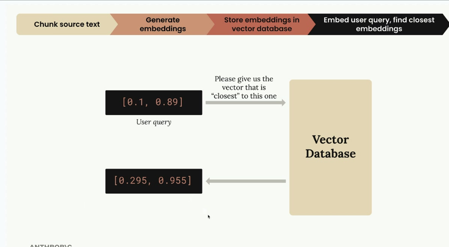

---

#### 31.2 Paso 1 — Dividir el texto en fragmentos

```python
with open("./report.md", "r") as f:
    text = f.read()           # Lee el documento completo como string

# chunk_by_section divide por encabezados Markdown (## )
# Cada elemento de la lista es una sección completa del documento
chunks = chunk_by_section(text)

chunks[2]   # Inspeccionar un fragmento para verificar que la segmentación es correcta
```

---

#### 31.3 Paso 2 — Generar embeddings para todos los fragmentos

En lugar de llamar a `generate_embedding()` una vez por fragmento, la función se actualizó para aceptar una **lista** de textos y procesarlos en un solo llamado a la API — mucho más eficiente:

```python
# generate_embedding ahora acepta tanto un string individual como una lista de strings
# Pasar toda la lista de fragmentos de una vez reduce las llamadas a la API de VoyageAI
embeddings = generate_embedding(chunks, input_type="document")
# input_type="document" porque son fragmentos del corpus, no consultas del usuario
# Devuelve una lista de vectores, uno por cada fragmento en chunks
```

| Comportamiento | Llamadas individuales | Lista completa |
| --- | --- | --- |
| Llamadas a la API | Una por fragmento | Una sola |
| Velocidad | Lenta (N llamadas) | Rápida (1 llamada) |
| Uso recomendado | Prototipado | Producción |

---

#### 31.4 Paso 3 — Almacenar en el índice vectorial

`VectorIndex` es la base de datos vectorial. Cada entrada almacena **dos cosas juntas**: el vector numérico (para hacer la búsqueda) y el texto original (para poder devolverlo como contexto a Claude):

```python
store = VectorIndex()   # Crea el almacén vectorial en memoria

for embedding, chunk in zip(embeddings, chunks):
    # zip() empareja cada embedding con su fragmento de texto correspondiente
    # Se guarda el texto original en {"content": chunk} porque la búsqueda devuelve
    # ese dict — si no se guardara el texto, solo se recibirían números sin utilidad
    store.add_vector(embedding, {"content": chunk})
```

> **Por qué guardar el texto original es obligatorio:** cuando se hace una búsqueda, la base de datos devuelve los vectores más cercanos. Pero Claude necesita el texto, no los números. Si no se almacena el texto junto al vector, el resultado de la búsqueda es inútil para construir el prompt.

---

#### 31.5 Paso 4 — Embeddear la consulta del usuario

La pregunta del usuario pasa por el **mismo modelo de embeddings** que procesó los fragmentos. Esto es lo que hace posible la comparación matemática:

```python
# input_type="query" porque es una consulta del usuario, no un documento
# VoyageAI optimiza los vectores de forma diferente según el tipo
user_embedding = generate_embedding(
    "What did the software engineering dept do last year?",
    input_type="query"
)
```

Si se usaran modelos distintos para documentos y consultas, los vectores estarían en espacios matemáticos diferentes y la similitud coseno no tendría sentido. El mismo modelo garantiza que los vectores son comparables.

---

#### 31.6 Paso 5 — Buscar los fragmentos más relevantes

```python
# search() compara el embedding de la consulta contra todos los almacenados
# El segundo argumento (2) indica cuántos resultados devolver — los 2 más similares
results = store.search(user_embedding, 2)

for doc, distance in results:
    # distance es la distancia coseno: cuanto más cerca de 0, más similar
    # doc["content"] es el texto original del fragmento
    print(distance, "\n", doc["content"][0:200], "\n")
```

| Campo devuelto | Tipo | Descripción |
| --- | --- | --- |
| `doc` | `dict` | El diccionario que se pasó a `add_vector` — contiene `"content"` con el texto original |
| `distance` | `float` | Distancia coseno: `0` = idénticos, `2` = opuestos. Valores típicos relevantes: `< 0.75` |

---

#### 31.7 Comprender los resultados

Con la consulta *"What did the software engineering dept do last year?"*, los resultados son:

| Fragmento recuperado | Distancia coseno | Interpretación |
| --- | --- | --- |
| Sección 2: Ingeniería de Software | **0.71** | Más cercano — el más relevante |
| Sección de Metodología | 0.72 | Segundo más cercano |

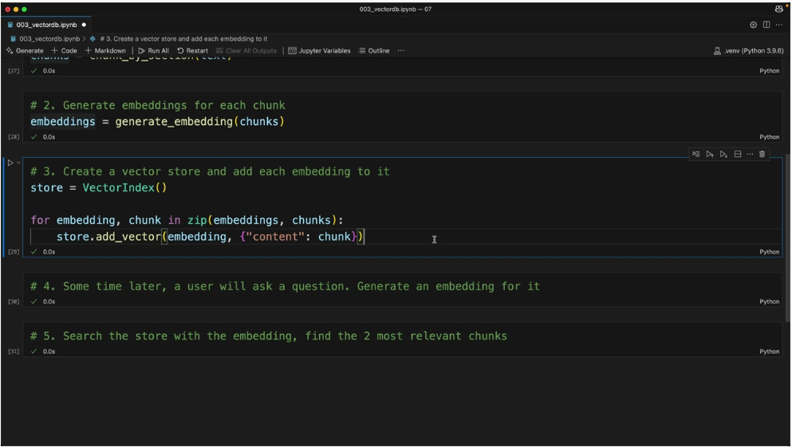

La distancia coseno más baja indica mayor similitud. La diferencia entre 0.71 y 0.72 parece pequeña, pero en búsqueda vectorial esos decimales importan — el sistema está correctamente priorizando el fragmento de ingeniería sobre el de metodología.

> **Conclusión central de RAG:** el sistema convierte texto en números (embeddings), almacena esos números eficientemente y usa similitud matemática para encontrar contenido relevante — sin depender de coincidencias exactas de palabras. Esta es la diferencia fundamental respecto a la búsqueda por palabras clave tradicional.

---

### Módulo 32: Búsqueda léxica BM25

La búsqueda semántica es poderosa, pero tiene un punto ciego específico: cuando el usuario busca un término exacto — un ID de incidente, un código de producto, un nombre técnico preciso — el sistema puede devolver secciones *conceptualmente relacionadas* que no contienen ese término. La solución no es reemplazar la búsqueda semántica, sino complementarla con **búsqueda léxica**, que opera sobre coincidencias exactas de palabras. La combinación de ambas se llama **búsqueda híbrida**.

---

#### 32.1 El problema de la búsqueda semántica sola

Supongamos que el usuario busca el incidente "INC-2023-Q4-011". La búsqueda semántica puede devolver:

| Fragmento devuelto | ¿Contiene el ID? | Por qué lo devolvió |
| --- | --- | --- |
| Sección de Ciberseguridad | ✅ Sí | Contiene el ID y es temáticamente relevante |
| Sección de Análisis Financiero | ❌ No | Es semánticamente cercana al contexto de incidentes, pero no tiene el término exacto |

El segundo resultado es un falso positivo: el sistema encontró algo *conceptualmente relacionado* pero que no responde realmente a la consulta. Para términos únicos y específicos, la coincidencia exacta de palabras es más útil que la similitud de significado.

---

#### 32.2 Estrategia de búsqueda híbrida

La solución es ejecutar **dos búsquedas en paralelo** y combinar los resultados:

| Tipo de búsqueda | Cómo encuentra los fragmentos | Ideal para |
| --- | --- | --- |
| **Semántica** (embeddings) | Similitud de significado en el espacio vectorial | Preguntas conceptuales, paráfrasis, consultas en lenguaje natural |
| **Léxica** (BM25) | Coincidencia exacta de términos con ponderación por rareza | IDs, códigos, nombres técnicos, términos poco frecuentes |
| **Híbrida** (combinada) | Fusión de ambas puntuaciones | La mayoría de los casos de uso reales |

Ningún método es universalmente superior — se complementan. Una pregunta como "¿cuáles fueron los problemas del Q4?" se responde mejor con búsqueda semántica; una búsqueda de "INC-2023-Q4-011" se responde mejor con búsqueda léxica.

---

#### 32.3 Cómo funciona BM25 — los cuatro pasos internos

**BM25 (Best Match 25)** es el algoritmo estándar para búsqueda léxica en sistemas RAG. Su nombre viene de que es la 25ª iteración de la familia de funciones de ranking BM. El proceso para cada consulta:

| Paso | Qué hace | Ejemplo |
| --- | --- | --- |
| **1. Tokenizar** | Divide la consulta en términos individuales | `"find INC-2023-Q4-011"` → `["find", "INC-2023-Q4-011"]` |
| **2. Contar frecuencia** | Cuenta cuántas veces aparece cada término en todos los fragmentos | `"find"` aparece 50 veces; `"INC-2023-Q4-011"` aparece 1 vez |
| **3. Ponderar por rareza** | Los términos raros reciben mayor peso; los comunes, menor | `"find"` → peso bajo; `"INC-2023-Q4-011"` → peso alto |
| **4. Rankear documentos** | Devuelve los fragmentos con más ocurrencias de los términos de mayor peso | Prioriza el fragmento que contiene el ID específico |

La ponderación por rareza es la clave de BM25: una palabra que aparece en casi todos los documentos (como "el", "de", "año") aporta muy poco para distinguir un fragmento relevante de uno irrelevante. Una palabra que aparece solo una vez en todo el corpus casi siempre señala el fragmento correcto.

---

#### 32.4 Implementación de BM25

La interfaz de `BM25Index` es deliberadamente similar a `VectorIndex` para que los dos sistemas sean intercambiables. La diferencia interna es que BM25 no necesita embeddings — trabaja directamente sobre el texto:

```python
# Paso 1: segmentar el documento (igual que en la búsqueda semántica)
chunks = chunk_by_section(text)

# Paso 2: crear el índice BM25 y agregar los fragmentos
store = BM25Index()
for chunk in chunks:
    # A diferencia de VectorIndex, no se necesita generar embeddings primero
    # BM25Index indexa el texto directamente y construye su estructura interna
    store.add_document({"content": chunk})

# Paso 3: buscar — la consulta va como texto, no como embedding
results = store.search("What happened with INC-2023-Q4-011?", 3)

for doc, distance in results:
    # En BM25, "distance" es una puntuación de relevancia (mayor = más relevante)
    # Convención opuesta a la distancia coseno donde menor = más relevante
    print(distance, "\n", doc["content"][:200], "\n----\n")
```

| Diferencia | `VectorIndex` (semántico) | `BM25Index` (léxico) |
| --- | --- | --- |
| Entrada para indexar | Embedding (lista de floats) | Texto directamente |
| Entrada para buscar | Embedding de la consulta | Texto de la consulta |
| Llamadas a API externa | Sí (VoyageAI) | No — el algoritmo corre localmente |
| Métrica de resultado | Distancia coseno (menor = mejor) | Puntuación BM25 (mayor = mejor) |

---

#### 32.5 Por qué BM25 supera a la búsqueda semántica para términos específicos

Con la consulta "What happened with INC-2023-Q4-011?", los resultados de BM25 priorizan correctamente las secciones que **contienen ese ID exacto** — no solo las que tratan sobre incidentes en general.

| Situación | Búsqueda recomendada |
| --- | --- |
| IDs, códigos, identificadores únicos | **BM25** — necesita coincidencia exacta |
| Nombres técnicos precisos (nombres de funciones, errores) | **BM25** |
| Preguntas en lenguaje natural ("¿qué hizo el equipo este año?") | **Semántica** |
| Preguntas conceptuales o con sinónimos | **Semántica** |
| La mayoría de los casos reales | **Híbrida** — combina ambas |

> La búsqueda semántica entiende el *significado*; BM25 garantiza que no se pierda ninguna *coincidencia exacta*. Usarlas juntas cubre las debilidades de cada una.

---

### Módulo 33: Una canalización RAG de índice múltiple

Los módulos anteriores desarrollaron `VectorIndex` y `BM25Index` como sistemas separados. Este módulo los unifica en un único componente llamado `Retriever`. El desafío de combinarlos no es técnico — es matemático: cada sistema usa una métrica de puntuación diferente, así que no se pueden sumar o comparar directamente. La solución es **Reciprocal Rank Fusion (RRF)**: un algoritmo que normaliza los rankings de ambos sistemas usando solo la *posición* de cada resultado, ignorando la puntuación absoluta.

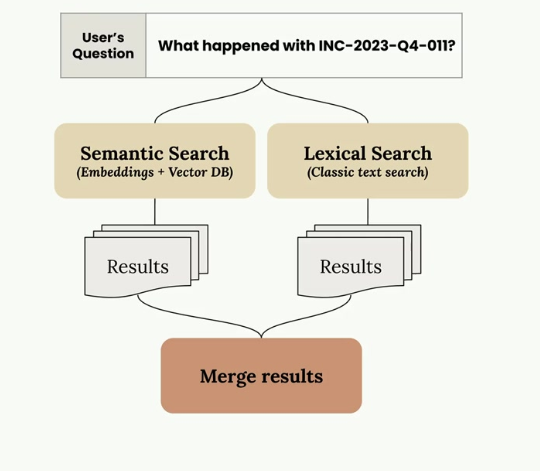

---

#### 33.1 La arquitectura del Retriever

`VectorIndex` y `BM25Index` comparten la misma interfaz (`add_document()` y `search()`). Esta decisión de diseño es lo que hace posible unificarlos sin acoplamiento fuerte: el `Retriever` no sabe ni le importa cómo funciona cada índice internamente — solo sabe que ambos responden a los mismos mensajes.

```python
class Retriever:
    def __init__(self, *indexes: SearchIndex):
        if len(indexes) == 0:
            raise ValueError("At least one index must be provided")
        # Acepta cualquier cantidad de índices — VectorIndex, BM25Index, o cualquier
        # implementación futura que respete la interfaz SearchIndex
        self._indexes = list(indexes)

    def add_document(self, document: Dict[str, Any]):
        # Reenvía cada documento a TODOS los índices registrados
        # Así cada índice construye su propia estructura interna (vectores o tabla BM25)
        for index in self._indexes:
            index.add_document(document)

    def search(self, query_text: str, k: int = 1, k_rrf: int = 60):
        # Consulta cada índice por separado y recopila sus listas de resultados rankeados
        # Luego aplica RRF para fusionarlos en una sola lista ordenada
        all_results = [index.search(query_text, k) for index in self._indexes]
        return self._reciprocal_rank_fusion(all_results, k_rrf)
```

| Parámetro de `search` | Descripción |
| --- | --- |
| `query_text` | La consulta del usuario en texto plano |
| `k` | Cuántos resultados pedir a cada índice individual |
| `k_rrf` | Constante de suavizado de RRF. Valor estándar: `60`. Valores más bajos amplifican la diferencia entre posiciones |

---

#### 33.2 Reciprocal Rank Fusion — cómo combinar resultados incomparables

El problema central: `VectorIndex` devuelve distancias coseno (0.71, 0.72…) y `BM25Index` devuelve puntuaciones de relevancia (12.3, 8.7…). Estos números viven en escalas completamente distintas — no se pueden sumar ni comparar directamente.

RRF resuelve esto ignorando los valores absolutos y usando solo la **posición** (rank) de cada resultado en cada lista. La fórmula es:

```text
RRF_score(d) = Σ  1 / (k + rank_i(d))
```

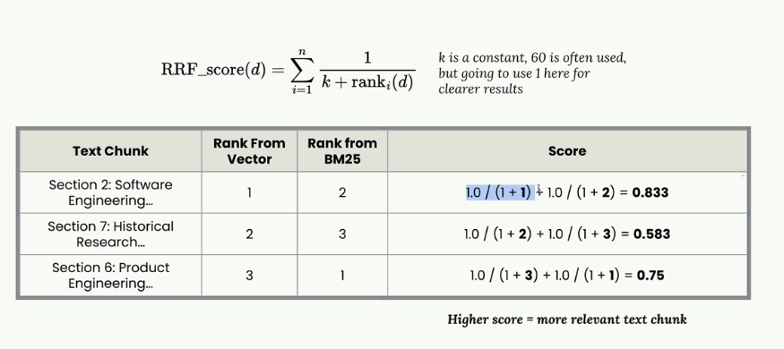

Donde `rank_i(d)` es la posición del fragmento `d` en la lista del índice `i` (empezando en 1), y `k` es una constante de suavizado.

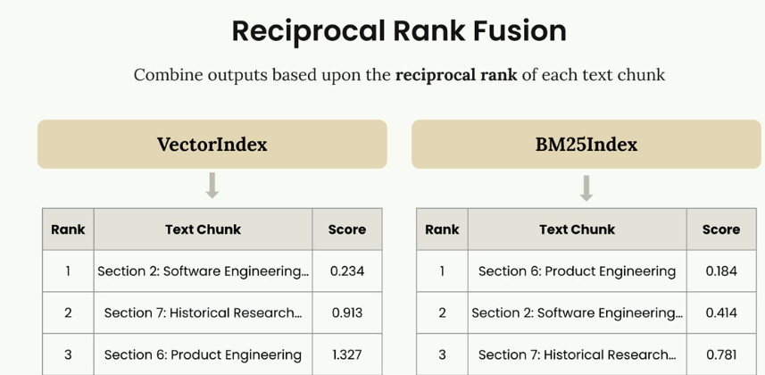

**Ejemplo concreto** con `k = 1` para ver el efecto claramente:

| Fragmento | Rank en VectorIndex | Rank en BM25Index | Cálculo RRF | Score final |
| --- | --- | --- | --- | --- |
| Sección 2 | 1° | 2° | 1/(1+1) + 1/(1+2) | **0.833** |
| Sección 6 | 3° | 1° | 1/(1+3) + 1/(1+1) | **0.750** |
| Sección 7 | 2° | 3° | 1/(1+2) + 1/(1+3) | **0.583** |

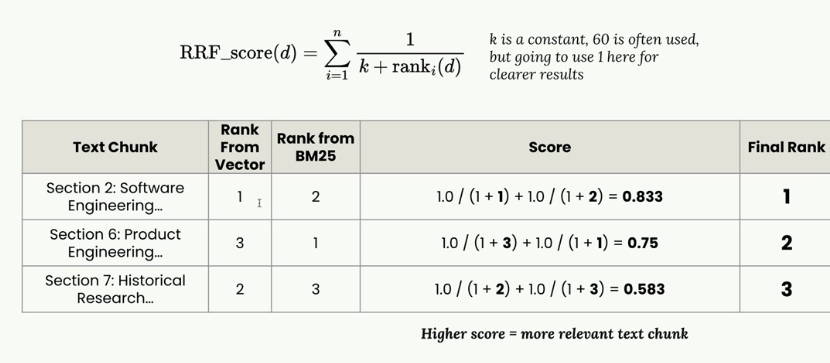

Resultado final: Sección 2 > Sección 6 > Sección 7.

La Sección 2 gana porque estuvo en el top de *ambos* sistemas — aunque no fue primera en ninguno. La Sección 6 quedó segunda porque fue primera en BM25 pero última en vectores. La intuición es correcta: **un fragmento que ambos sistemas consideran relevante merece más confianza que uno que solo destaca en un sistema**.

> Con `k = 60` (valor estándar), las diferencias entre posiciones se suavizan más — un fragmento en posición 1 y otro en posición 5 quedan más cercanos en el score final. Con `k = 1`, la diferencia entre posiciones es más pronunciada.

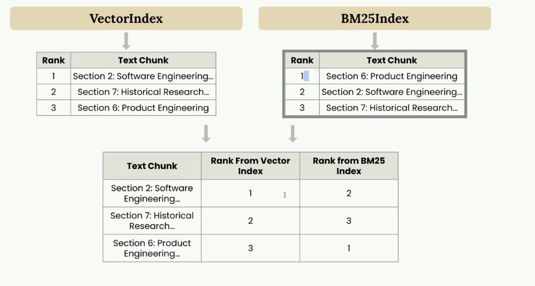

---

#### 33.3 Resultado: búsqueda híbrida en acción

Con la consulta `"¿qué pasó con INC-2023-Q4-011?"`, los resultados del `Retriever` híbrido mejoran claramente sobre cada sistema solo:

| # | Fragmento | ¿Por qué aparece aquí? |
| --- | --- | --- |
| 1 | Sección 10: Análisis de Ciberseguridad | Contiene el ID exacto (BM25) y es temáticamente relevante (semántica) |
| 2 | Sección 2: Ingeniería de Software | Relevante semánticamente y mencionada en contexto del incidente |
| 3 | Sección 5: Novedades Legales | Relevancia semántica secundaria |

Comparado con el resultado de solo vectores que devolvía el análisis financiero como segundo resultado (un falso positivo), el sistema híbrido produce resultados más precisos porque BM25 penaliza los fragmentos que no contienen el ID exacto.

---

#### 33.4 Extensibilidad — la ventaja del diseño por interfaz

Porque todos los índices implementan la misma interfaz `SearchIndex` (`add_document` + `search`), agregar un nuevo tipo de búsqueda no requiere modificar el `Retriever`:

| Tipo de índice | Cómo funciona | Caso de uso ideal |
| --- | --- | --- |
| `VectorIndex` | Similitud coseno sobre embeddings | Consultas semánticas y conceptuales |
| `BM25Index` | Frecuencia inversa de términos | IDs, códigos, términos técnicos exactos |
| Índice de grafos *(futuro)* | Relaciones entre entidades | Consultas sobre conexiones entre personas/eventos |
| Índice especializado *(futuro)* | Dominio específico | Búsqueda médica, legal, financiera con vocabulario propio |

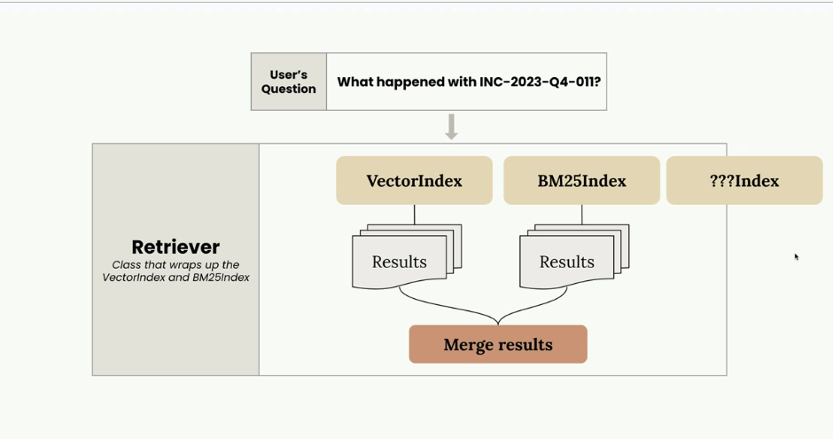

La clave del diseño modular es que cada implementación puede desarrollarse, probarse y optimizarse de forma independiente. El `Retriever` solo necesita que respeten la interfaz — el resto es transparente para él.

---

#### 33.5 Resumen de la Unidad 6 — RAG completo

```text
Unidad 6: RAG y búsqueda agencial

Módulo 27  →  Qué es RAG y cuándo usarlo
Módulo 28  →  Cómo segmentar documentos (tamaño, estructura, oraciones, semántica)
Módulo 29  →  Qué son los embeddings y cómo generarlos con VoyageAI
Módulo 30  →  El flujo completo paso a paso (con similitud coseno y normalización)
Módulo 31  →  Implementación real con VectorIndex
Módulo 32  →  Búsqueda léxica BM25 para términos exactos
Módulo 33  →  Retriever híbrido con Reciprocal Rank Fusion

Sistema final = Segmentación + Embeddings + VectorIndex + BM25Index + RRF
```

---

### Resumen de la Unidad 6: RAG y búsqueda agencial

Esta unidad resuelve la limitación más fundamental de los LLMs: su conocimiento está congelado en la fecha de entrenamiento. RAG conecta a Claude con bases de conocimiento externas actualizables.

| Módulo | Tema | Concepto clave |
| --- | --- | --- |
| **27** | Introducción a RAG | Recuperar fragmentos relevantes antes de generar; el contexto del prompt reemplaza la memoria del modelo |
| **28** | Estrategias de chunking | Cuatro enfoques: tamaño fijo, por estructura, por oraciones, semántico; el tamaño del chunk afecta precisión y cobertura del retrieval |
| **29** | Embeddings de texto | Vectores de alta dimensión que capturan significado semántico; similitud coseno mide relevancia; VoyageAI como proveedor recomendado |
| **30** | Flujo RAG completo | Pipeline: query → embedding → similitud coseno → top-k chunks → prompt enriquecido → respuesta con contexto |
| **31** | Implementación con VectorIndex | `VectorIndex` almacena embeddings; `query()` devuelve los chunks más similares; integración con `client.messages.create()` |
| **32** | Búsqueda léxica BM25 | Complementa los embeddings con búsqueda por términos exactos; `BM25Index` para keywords, nombres propios y acrónimos que el embedding no captura bien |
| **33** | Pipeline multi-índice con RRF | Reciprocal Rank Fusion combina los rankings de BM25 y embeddings; resultado más robusto que cualquier método solo |

**Patrón transversal de la unidad:** RAG es un workflow de encadenamiento aplicado al retrieval — cada módulo agrega una capa al pipeline. El sistema final (chunking + embeddings + vector search + BM25 + RRF) no es complejo por capricho: cada capa resuelve un caso de fallo de la anterior.

---

## Unidad 7: Características de Claude

---

### Módulo 34: Pensamiento extendido

El pensamiento extendido (*Extended Thinking*) es la función de razonamiento avanzado de Claude: le da al modelo tiempo para analizar un problema en profundidad antes de generar la respuesta final. La analogía más útil es pensarlo como el **borrador** de Claude — un espacio donde razona en voz alta antes de comprometerse con una respuesta. El resultado es mayor precisión en tareas complejas y, como beneficio adicional, transparencia total sobre el proceso de razonamiento.

La contrapartida es real: más tokens consumidos, mayor latencia y código más complejo para manejar la respuesta. Por eso no es la primera herramienta a usar — es la que se agrega cuando las indicaciones optimizadas ya no alcanzan.

> **Restricción importante:** Extended Thinking no es compatible con prefill de mensajes ni con temperatura personalizada. Verificar la lista completa de restricciones en la documentación oficial antes de implementar.
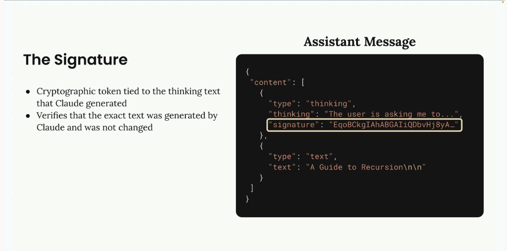 

---

#### 34.1 Cómo cambia la estructura de la respuesta

Sin pensamiento extendido, `response.content` es una lista con un solo `TextBlock`. Con pensamiento habilitado, la lista tiene **dos bloques**:

| Bloque | Tipo | Contenido |
| --- | --- | --- |
| `content[0]` | `ThinkingBlock` | El razonamiento interno de Claude — visible para el desarrollador |
| `content[1]` | `TextBlock` | La respuesta final para el usuario |

Esta es la misma distinción que con los `ToolUseBlock` en tools: la respuesta deja de ser texto simple y se convierte en una lista de bloques con tipos diferentes. El código que procesa la respuesta debe estar preparado para manejar ambos.

---

#### 34.2 El sistema de firma (seguridad)

Cada `ThinkingBlock` viene acompañado de una **firma criptográfica** generada por Anthropic. Esta firma cumple un rol de seguridad específico: garantiza que el texto de razonamiento no fue modificado por el desarrollador antes de enviárselo de vuelta a Claude.

¿Por qué importa esto? Si alguien pudiera alterar el bloque de pensamiento, podría dirigir a Claude hacia razonamientos manipulados — potencialmente llevándolo a producir respuestas inseguras o incorrectas. La firma hace que cualquier modificación sea detectable.

| Campo del ThinkingBlock | Descripción |
| --- | --- |
| `type` | Siempre `"thinking"` |
| `thinking` | El texto de razonamiento legible |
| `signature` | Token criptográfico que autentica el bloque |

---

#### 34.3 Pensamiento censurado

En ocasiones, en lugar del texto de razonamiento legible, se recibe un **bloque de pensamiento censurado** (`redacted_thinking`). Esto ocurre cuando los sistemas de seguridad internos de Claude detectan irregularidades en el proceso de razonamiento.

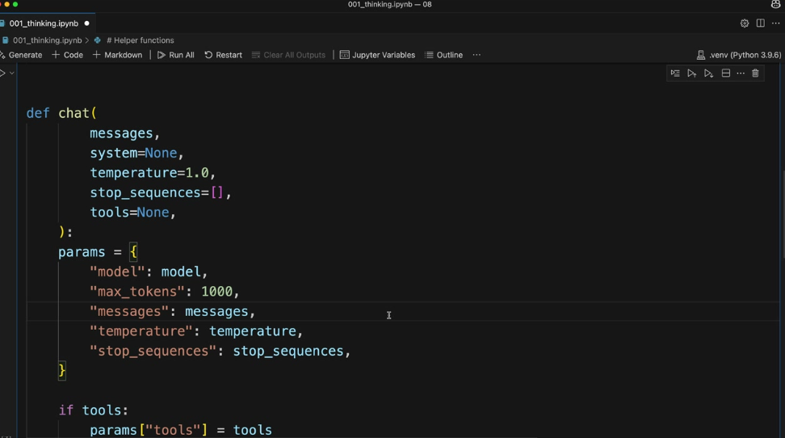

El contenido censurado no es un error — es una respuesta válida que contiene el pensamiento real en forma cifrada. Su propósito es permitir que el bloque se incluya en el historial de conversaciones futuras sin perder el contexto, aunque el desarrollador no pueda leerlo.

Para probar que el código maneja correctamente este caso, existe una cadena de activación especial que fuerza a Claude a devolver un bloque censurado — útil para asegurarse de que la aplicación no falla ante esta respuesta antes de llegar a producción.

---

#### 34.4 Implementación

Se agregan dos parámetros a la función `chat`: `thinking` (booleano que activa la función) y `thinking_budget` (límite de tokens para el razonamiento):

```python
def chat(
    messages,
    system=None,
    temperature=1.0,
    stop_sequences=[],
    tools=None,
    thinking=False,          # False por defecto — no activa el pensamiento extendido
    thinking_budget=1024     # Mínimo 1024 tokens; debe ser menor que max_tokens
):
    params = {
        "model": model,
        "max_tokens": 16000,     # Debe ser mayor que thinking_budget
        "messages": messages,
    }

    if thinking:
        # Solo se agrega el bloque de pensamiento si se habilitó explícitamente
        params["thinking"] = {
            "type": "enabled",
            "budget_tokens": thinking_budget   # Cuántos tokens puede usar Claude para razonar
        }
        # Nota: al activar thinking, temperature debe ser 1.0 (valor por defecto)
        # y no se puede usar prefill de mensajes de asistente

    if system:
        params["system"] = system

    return client.messages.create(**params)
```

| Parámetro | Tipo | Descripción |
| --- | --- | --- |
| `thinking` | `bool` | Activa el pensamiento extendido. Por defecto `False` |
| `thinking_budget` | `int` | Tokens máximos para razonar. Mínimo `1024`; debe ser menor que `max_tokens` |
| `budget_tokens` | `int` | Campo interno del dict que recibe la API (distinto de `thinking_budget`) |

Llamada con pensamiento habilitado:

```python
response = chat(messages, thinking=True, thinking_budget=5000)

# Procesar los bloques de la respuesta
for block in response.content:
    if block.type == "thinking":
        print("Razonamiento:", block.thinking)   # Texto de razonamiento interno
    elif block.type == "text":
        print("Respuesta:", block.text)          # Respuesta final para el usuario
```

---

#### 34.5 Cuándo usar pensamiento extendido

La decisión sigue un orden claro:

| Paso | Acción |
| --- | --- |
| 1 | Escribir y optimizar el prompt sin pensamiento extendido |
| 2 | Evaluar la precisión con el pipeline de evaluación |
| 3 | Si la precisión no alcanza el umbral requerido, **entonces** habilitar pensamiento extendido |

Habilitar pensamiento extendido desde el principio sin optimizar el prompt primero es un error de diseño: los costos se disparan y la mejora puede no ser necesaria. Es una herramienta de último recurso para problemas que genuinamente requieren razonamiento profundo — matemáticas complejas, lógica multi-paso, análisis de escenarios.

| Usar pensamiento extendido cuando... | No usarlo cuando... |
| --- | --- |
| El prompt optimizado no alcanza la precisión requerida | La tarea es conversacional o de redacción |
| La tarea requiere razonamiento multi-paso | La latencia es crítica para el usuario |
| Se necesita transparencia en el proceso de decisión | El costo es una restricción importante |

---

### Módulo 35: Soporte de imágenes

Claude es un modelo **multimodal**: puede recibir tanto texto como imágenes en el mismo mensaje. Esto abre una clase entera de aplicaciones que antes requerían modelos especializados de visión — análisis de documentos escaneados, inspección de fotografías, lectura de gráficos, evaluaciones visuales automatizadas. El principio de ingeniería de indicaciones aplica igual que con texto: prompts simples dan resultados mediocres, prompts estructurados dan resultados precisos.

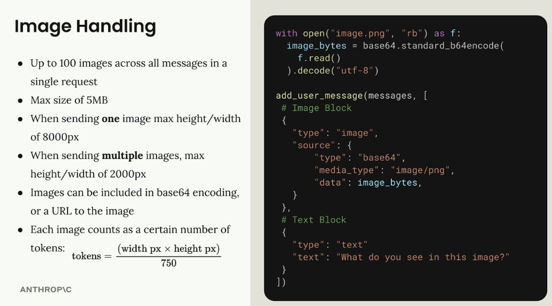

---

#### 35.1 Limitaciones y costo de imágenes

Antes de implementar, hay restricciones concretas a tener en cuenta:

| Límite | Valor |
| --- | --- |
| Imágenes por solicitud | Máximo **100** en todos los mensajes |
| Tamaño por imagen | Máximo **5 MB** |
| Dimensiones (imagen única) | Máximo **8000 × 8000 px** |
| Dimensiones (múltiples imágenes) | Máximo **2000 × 2000 px** |
| Formatos aceptados | `image/png`, `image/jpeg`, `image/gif`, `image/webp` |

Las imágenes **consumen tokens** proporcionales a sus dimensiones. La fórmula es:

```text
tokens = (ancho_px × alto_px) / 750
```

Una imagen de 1000 × 1000 px consume ~1333 tokens. Esto es importante para estimar costos antes de escalar: muchas imágenes grandes en un pipeline pueden volverse costosas rápidamente.

Las imágenes se pueden enviar de dos formas:

- **Base64**: se codifica el archivo en texto y se incluye directamente en el mensaje — funciona sin URLs públicas
- **URL**: se pasa un link a la imagen — más simple, pero requiere que la imagen sea accesible desde internet

---

#### 35.2 Estructura del mensaje con imagen

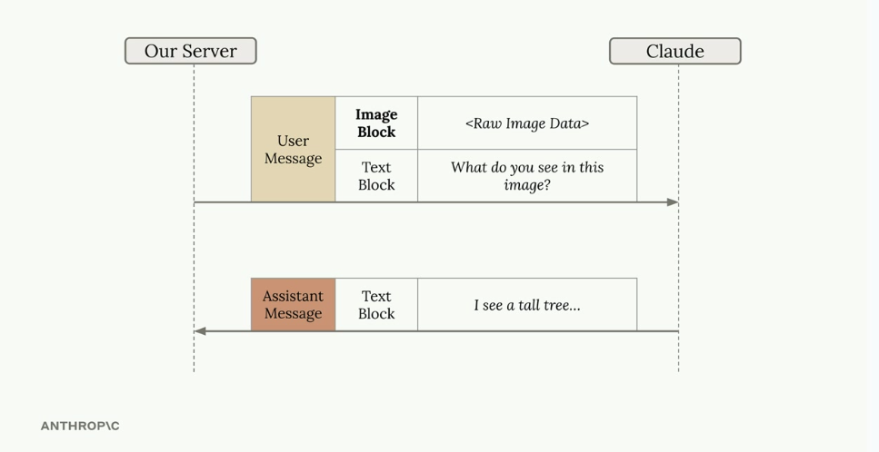

El mensaje de usuario deja de ser un string simple y se convierte en una **lista de bloques**, igual que con tool use. Cada bloque tiene un `type` que indica su naturaleza:

```python
import base64

# Leer el archivo y codificarlo en base64
with open("image.png", "rb") as f:
    # "rb" abre en modo lectura binaria — necesario para archivos que no son texto
    image_bytes = base64.standard_b64encode(f.read()).decode("utf-8")
    # standard_b64encode convierte los bytes a base64
    # .decode("utf-8") convierte los bytes de base64 a string

add_user_message(messages, [
    # Bloque de imagen — siempre antes del bloque de texto
    {
        "type": "image",
        "source": {
            "type": "base64",              # Indicamos que la imagen viene codificada en base64
            "media_type": "image/png",     # Tipo MIME del archivo
            "data": image_bytes,           # El string base64 generado arriba
        }
    },
    # Bloque de texto con la instrucción o pregunta
    {
        "type": "text",
        "text": "What do you see in this image?"
    }
])
```

| Campo del bloque de imagen | Descripción |
| --- | --- |
| `type` | Siempre `"image"` |
| `source.type` | `"base64"` para archivo codificado; `"url"` para imagen en internet |
| `source.media_type` | Tipo MIME: `"image/png"`, `"image/jpeg"`, `"image/gif"`, `"image/webp"` |
| `source.data` | El contenido base64 (solo cuando `source.type == "base64"`) |
| `source.url` | La URL de la imagen (solo cuando `source.type == "url"`) |

El flujo de mensajes es idéntico al de conversaciones solo de texto: Claude recibe el mensaje con imagen y responde con un `TextBlock` con su análisis.

---

#### 35.3 Técnicas de inducción para imágenes

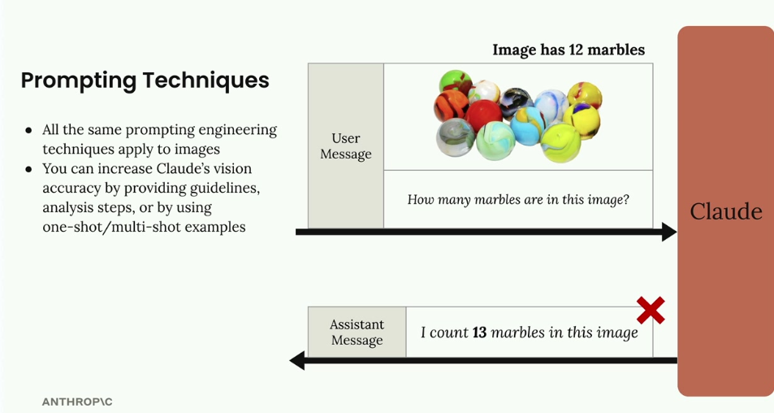

Las mismas técnicas de ingeniería de indicaciones que funcionan con texto funcionan con imágenes. La diferencia es que Claude ahora tiene dos fuentes de información simultáneas — el texto del prompt y el contenido visual — y las instrucciones determinan cómo combinarlas.

Un prompt simple como "¿Cuántas canicas hay?" tiende a dar resultados incorrectos porque Claude no tiene una metodología explícita para contar. Hay tres técnicas principales para mejorar la precisión:

| Técnica | Qué hace | Cuándo usarla |
| --- | --- | --- |
| **Pasos de análisis explícitos** | Guía a Claude a través de un método paso a paso | Cuando la tarea requiere razonamiento sistemático |
| **Few-shot con imagen de referencia** | Incluye una imagen con respuesta conocida como ejemplo | Cuando el formato de salida es específico o el estilo importa |
| **Subtareas secuenciales** | Divide una tarea compleja en pasos más simples | Cuando la imagen tiene múltiples elementos a analizar |

---

#### 35.4 Análisis paso a paso

En lugar de una pregunta directa, se le provee a Claude una metodología concreta:

```text
Analyze this image of marbles and determine the exact count using this methodology:

1. Begin by identifying each unique marble one at a time.
   Assign each a number as you identify it.
2. Verify your result by counting with a different method.
   Start from the bottom-left corner and work row by row, left to right.

What is the exact, verified number of marbles?
```

El punto clave es el paso de **verificación**: pedirle a Claude que cuente dos veces con métodos distintos reduce errores porque obliga a que ambos resultados coincidan antes de dar la respuesta. Esta técnica aplica a cualquier tarea de conteo o detección visual.

---

#### 35.5 Ejemplo práctico — evaluación de riesgo de incendio

Una aplicación concreta del análisis de imágenes es la automatización de evaluaciones de riesgo para seguros de hogar usando imágenes satelitales. En lugar de enviar inspectores físicos, el sistema analiza la vegetación alrededor de una propiedad y asigna una puntuación de riesgo.


Lo que hace efectivo al prompt no es la pregunta — es la **metodología en 5 pasos** que estructura el análisis:

```text
Analyze the attached satellite image of a property with these specific steps:

1. Residence identification: Locate the primary residence by looking for:
   - The largest roofed structure
   - Typical residential features (driveway, regular geometry)
   - Distinction from other structures (garages, sheds, pools)

2. Tree overhang analysis: Examine all trees near the residence:
   - Identify trees whose canopy extends over the roof
   - Estimate the percentage of roof covered (0-25%, 25-50%, 50-75%, 75%+)
   - Note dense overhang areas

3. Fire risk assessment: For overhanging trees, evaluate:
   - Wildfire vulnerability (ember catch points, fuel paths to structure)
   - Proximity to chimneys, vents, or roof openings
   - Branches that "bridge" wildland vegetation to the structure

4. Defensible space identification:
   - Identify if trees form a continuous canopy over the home
   - Note fuel ladders (vegetation that carries fire from ground to roof)

5. Fire risk rating (1-4):
   - Rating 1 (Low): No overhanging branches, good defensible space
   - Rating 2 (Moderate): <25% roof overhang, some separation between canopies
   - Rating 3 (High): 25-50% overhang, connected canopies, multiple vulnerability points
   - Rating 4 (Severe): >50% overhang, dense vegetation against structure

For each item (1-5), write one sentence summarizing your findings.
Final response: the numerical rating.
```

| Elemento del prompt | Por qué mejora el resultado |
| --- | --- |
| **Criterios de identificación explícitos** | Claude sabe exactamente qué buscar, no hace suposiciones |
| **Rangos porcentuales predefinidos** | Elimina ambigüedad — "significativo" es subjetivo, "25-50%" no lo es |
| **Resumen de una oración por paso** | Fuerza a Claude a justificar cada parte del análisis antes de la calificación final |
| **Escala de rating con descripción** | Claude asigna la puntuación correcta porque sabe exactamente qué diferencia un 2 de un 3 |

> El principio central: las mismas técnicas de ingeniería de indicaciones que funcionan con texto funcionan con imágenes. El modelo combina lo que ve con las instrucciones que recibe — cuanto más precisas sean las instrucciones, más útil es el análisis visual.

---

### Módulo 36: Compatibilidad con PDF

Los PDFs son un formato universal para documentos estructurados: informes, papers, contratos, manuales. Claude puede leer y analizar PDFs directamente, sin necesidad de convertirlos a texto primero. Esto significa que Claude tiene acceso al documento completo — texto, tablas, imágenes incrustadas y estructura de formato — tal como lo vería un humano que lo abre en un visor.

El mecanismo es idéntico al de imágenes: el PDF se convierte a base64 y se incluye en el mensaje como un bloque de contenido. La única diferencia está en el `type` del bloque (`"document"` en lugar de `"image"`) y en el `media_type` (`"application/pdf"`).

#### 36.1 Estructura del mensaje con PDF

```python
import base64

# Leer el PDF y codificarlo en base64 (igual que con imágenes)
with open("earth.pdf", "rb") as f:
    file_bytes = base64.standard_b64encode(f.read()).decode("utf-8")

messages = []

add_user_message(
    messages,
    [
        {
            "type": "document",          # "document" en lugar de "image"
            "source": {
                "type": "base64",
                "media_type": "application/pdf",  # MIME type del PDF
                "data": file_bytes,               # contenido codificado en base64
            },
        },
        {"type": "text", "text": "Summarize the document in one sentence"},
    ],
)

chat(messages)
```

| Campo | Valor para PDF | Valor equivalente para imagen |
| --- | --- | --- |
| `type` (bloque) | `"document"` | `"image"` |
| `source.type` | `"base64"` | `"base64"` |
| `source.media_type` | `"application/pdf"` | `"image/png"` / `"image/jpeg"` |
| `source.data` | PDF codificado en base64 | imagen codificada en base64 |


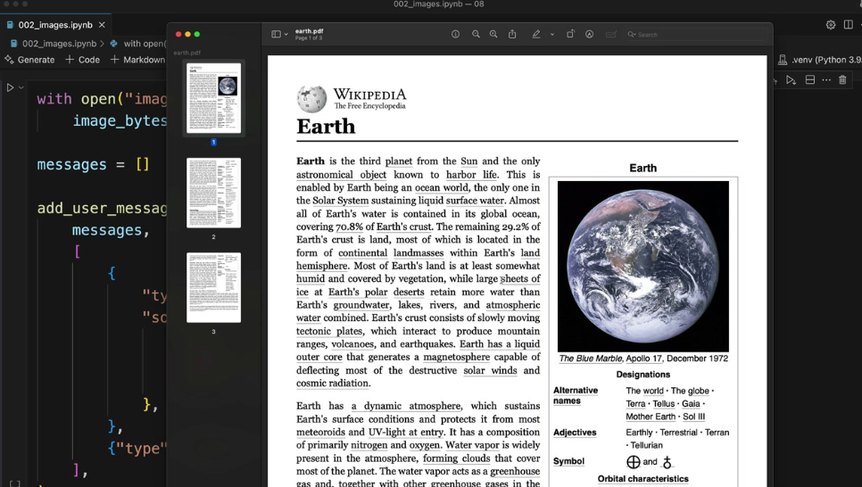

> La estructura es casi idéntica a la de imágenes. Si ya tenés código de procesamiento de imágenes funcionando, adaptarlo a PDFs requiere cambiar solo dos campos: `type` y `media_type`.

#### 36.2 Qué puede extraer Claude de un PDF

A diferencia de un extractor de texto plano (que solo ve caracteres), Claude interpreta el documento como un todo:

| Elemento del PDF | Qué puede hacer Claude |
| --- | --- |
| **Texto corrido** | Leer, resumir, citar, traducir |
| **Tablas** | Entender relaciones entre filas y columnas, comparar datos |
| **Imágenes y gráficos incrustados** | Describir, interpretar, extraer información visual |
| **Estructura y formato** | Reconocer secciones, encabezados, jerarquía del documento |

> Esta combinación hace que Claude sea útil para tareas como: resumir un paper científico, extraer cláusulas de un contrato, analizar un reporte financiero con gráficos, o comparar secciones de un manual técnico — todo sin preprocesamiento externo.

---

### Módulo 37: Citas

Cuando Claude responde preguntas basadas en documentos que le proveemos, el usuario no puede saber si la información viene de los documentos proporcionados o del entrenamiento del modelo. Las **citas** resuelven este problema: le indican a Claude que marque cada afirmación con una referencia exacta al fragmento del documento del que proviene. El resultado es una respuesta estructurada donde cada dato tiene un origen verificable.

Esto transforma a Claude de una "caja negra" que da respuestas en un **asistente de investigación transparente** — los usuarios pueden ver exactamente qué parte del documento original respalda cada afirmación.

#### 37.1 Habilitar citas en un documento PDF

Para activar las citas hay que agregar dos campos al bloque de documento: `title` (nombre legible) y `citations` (flag de activación):

```python
{
    "type": "document",
    "source": {
        "type": "base64",
        "media_type": "application/pdf",
        "data": file_bytes,         # contenido del PDF en base64
    },
    "title": "earth.pdf",           # nombre del documento (aparece en la cita)
    "citations": {"enabled": True}  # activa el sistema de citas
}
```

| Campo | Tipo | Descripción |
| --- | --- | --- |
| `title` | `str` | Nombre legible del documento — aparece en la referencia de cada cita |
| `citations.enabled` | `bool` | Si es `True`, Claude incluye referencias al documento en su respuesta |

#### 37.2 Estructura de la respuesta con citas

Cuando las citas están habilitadas, la respuesta deja de ser texto simple y pasa a ser **datos estructurados**: cada fragmento de la respuesta incluye metadatos que lo conectan con el documento fuente.
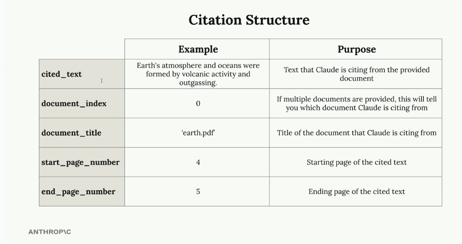
Cada cita contiene:

| Campo de la cita | Descripción |
| --- | --- |
| `cited_text` | El texto exacto del documento que respalda la afirmación |
| `document_index` | Índice del documento referenciado (útil cuando hay múltiples documentos) |
| `document_title` | El `title` asignado al documento |
| `start_page_number` | Página donde comienza el texto citado |
| `end_page_number` | Página donde termina el texto citado |

> Los campos `start_page_number` y `end_page_number` son específicos de PDFs. Con texto plano se usan posiciones de caracteres en su lugar (ver §37.3).

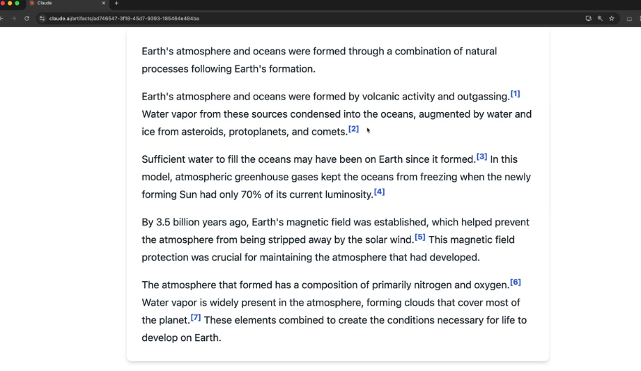

#### 37.3 Citas con texto plano

Las citas no están limitadas a PDFs. Con texto plano la estructura del `source` cambia, pero `title` y `citations` se mantienen igual:

```python
{
    "type": "document",
    "source": {
        "type": "text",             # "text" en lugar de "base64"
        "media_type": "text/plain",
        "data": article_text,       # string de texto directamente
    },
    "title": "earth_article",
    "citations": {"enabled": True}
}
```

| Tipo de fuente | `source.type` | `source.media_type` | Referencia de posición |
| --- | --- | --- | --- |
| PDF | `"base64"` | `"application/pdf"` | Números de página |
| Texto plano | `"text"` | `"text/plain"` | Posiciones de caracteres |

#### 37.4 Cuándo usar citas

| Escenario | Por qué las citas ayudan |
| --- | --- |
| Usuarios que deben verificar información | Pueden ir directo al fragmento del documento original |
| Documentos autoritativos (contratos, papers) | Cada afirmación queda anclada a una fuente específica |
| Interfaces con múltiples documentos | `document_index` identifica cuál de los documentos es la fuente |
| Aplicaciones donde la transparencia es crítica | Los usuarios ven el proceso, no solo el resultado |

> El valor real de las citas no está solo en la respuesta — está en lo que hacés con los metadatos. Se pueden construir interfaces donde el usuario pase el cursor sobre una afirmación y vea el fragmento exacto del documento fuente, o donde se resalten automáticamente las secciones citadas en un visor de PDFs.

---

### Módulo 38: Almacenamiento en caché de mensajes (Prompt Caching)

Cada vez que se envía un mensaje a Claude, el modelo hace una cantidad significativa de trabajo antes de generar cualquier token de respuesta: tokeniza la entrada, construye embeddings para cada token y analiza el contexto circundante. Por defecto, todo ese trabajo se descarta al finalizar la solicitud.

El **prompt caching** cambia ese comportamiento: en lugar de descartar el resultado del preprocesamiento, Claude lo guarda en una caché. Cuando llega una solicitud posterior que contiene el mismo contenido, Claude reutiliza ese trabajo en lugar de repetirlo. El resultado es doble — **respuestas más rápidas** y **menor costo**, porque el trabajo ya está hecho.

#### 38.1 Flujo sin caché vs. con caché

**Sin caché (comportamiento por defecto):**

```text
Solicitud 1: [preprocesamiento completo → respuesta → descarte del trabajo]
Solicitud 2: [preprocesamiento completo de nuevo → respuesta → descarte]
Solicitud 3: [preprocesamiento completo de nuevo → ...]
```

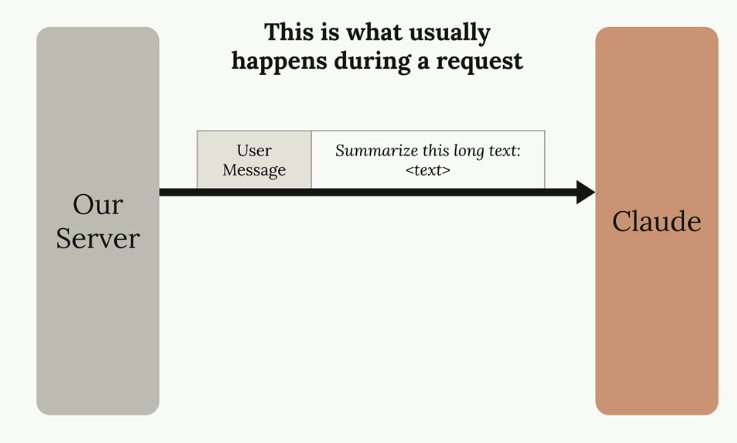
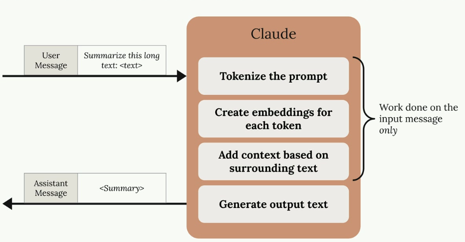
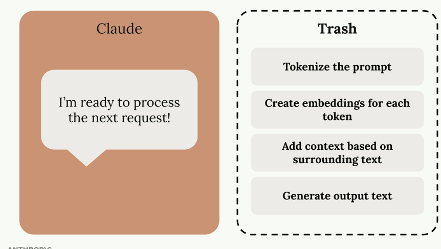

**Con caché habilitada:**

```text
Solicitud 1: [preprocesamiento completo → respuesta → guarda en caché]
Solicitud 2: [lee de la caché → respuesta]  ← más rápido y más barato
Solicitud 3: [lee de la caché → respuesta]  ← idem
```
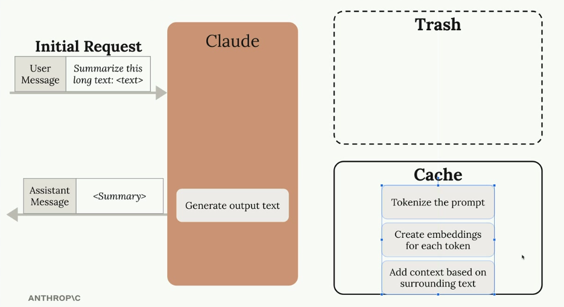

La primera solicitud siempre paga el costo completo (es quien escribe la caché). Las solicitudes siguientes que reutilicen el mismo contenido se benefician.

#### 38.2 Características clave

| Característica | Detalle |
| --- | --- |
| **Duración de la caché** | El contenido almacenado permanece activo por **1 hora** |
| **Primera solicitud** | Escribe en la caché — paga costo completo |
| **Solicitudes siguientes** | Leen de la caché — pagan costo reducido |
| **Requisito** | El contenido reutilizado debe ser **idéntico** para que aplique la caché |
| **Optimización** | Automática — no requiere lógica especial de comparación |

#### 38.3 Cuándo usar prompt caching

El caching es útil solo cuando el mismo bloque de contenido se repite frecuentemente en las solicitudes. No aporta nada si cada solicitud es completamente diferente.

| Caso de uso | Por qué funciona bien |
| --- | --- |
| **Análisis de documentos extensos** | Se hacen múltiples preguntas sobre el mismo PDF o texto |
| **Edición iterativa** | El documento base no cambia, solo el prompt varía |
| **System prompts largos** | El mismo prompt de sistema aparece en cientos de solicitudes |
| **Conversaciones con contexto fijo** | Un fragmento grande de contexto se mantiene entre turnos |

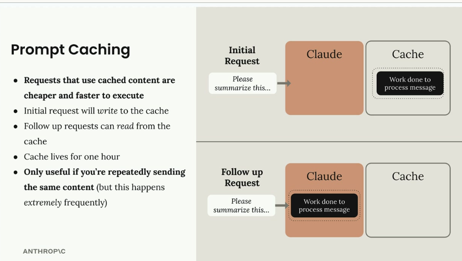

> La regla práctica: si un bloque de texto aparece en más de una solicitud por hora, el caching probablemente conviene. Si cada solicitud lleva contenido distinto, no hay beneficio porque la caché nunca se reutiliza antes de expirar.

---

### Módulo 39: Reglas del almacenamiento en caché

El caching no es automático ni global — hay que activarlo explícitamente en los bloques que queremos cachear, y hay reglas específicas que determinan si la caché se usa o se invalida. Entender estas reglas es la diferencia entre implementar caching efectivo e implementarlo sin que funcione.

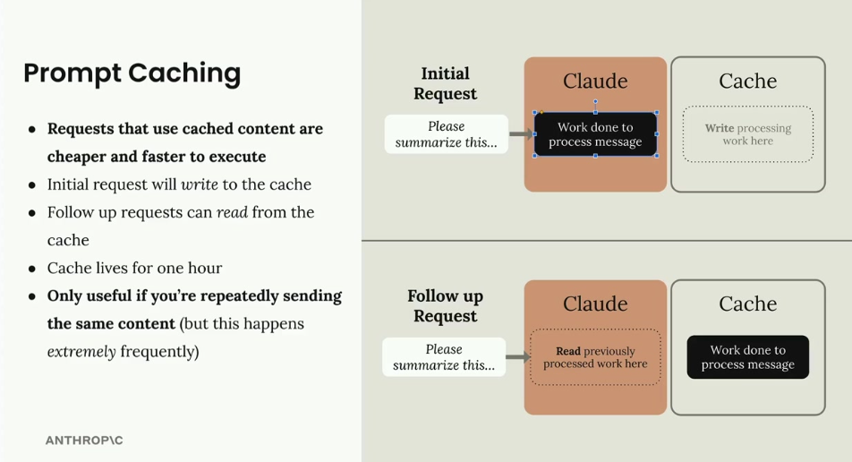

#### 39.1 Puntos de interrupción de caché (cache breakpoints)

El mecanismo concreto para activar el caching es el **cache breakpoint**: un campo extra en el bloque de contenido que le dice a Claude "guardá en caché todo el trabajo computacional hasta este punto".

Para agregarlo, hay que usar la forma expandida del bloque de texto (la forma abreviada — un string simple — no tiene campo para `cache_control`):

```python
# Forma ABREVIADA — no permite cache_control
{"role": "user", "content": "Texto del mensaje"}

# Forma EXPANDIDA — permite agregar cache_control
{
    "role": "user",
    "content": [
        {
            "type": "text",
            "text": "Texto del mensaje",
            "cache_control": {"type": "ephemeral"}  # activa el breakpoint
        }
    ]
}
```

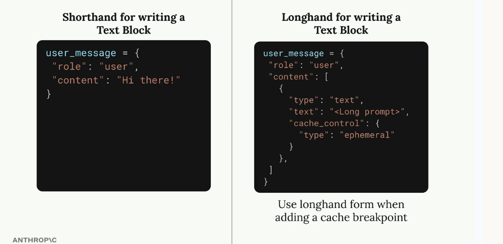

| Campo | Valor | Efecto |
| --- | --- | --- |
| `cache_control.type` | `"ephemeral"` | Guarda en caché todo el contenido procesado hasta este bloque inclusive |

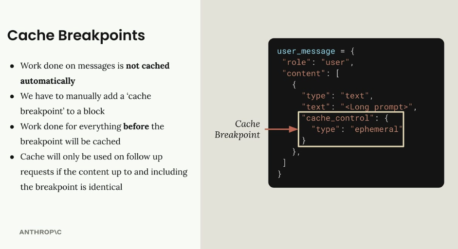

> `"ephemeral"` significa que la caché dura hasta su expiración (1 hora). Es el único tipo de `cache_control` disponible actualmente.

#### 39.2 Regla de invalidación — el contenido debe ser idéntico

La caché solo se reutiliza si el contenido **hasta el breakpoint inclusive** es exactamente igual al de la solicitud que generó la caché. Cualquier cambio, por mínimo que sea, invalida la caché completa y obliga a reprocesar todo.

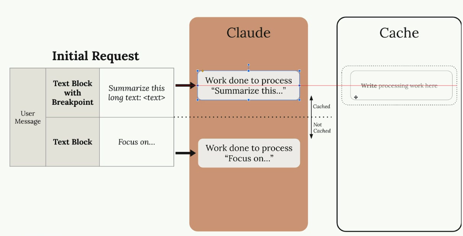

```text
Solicitud 1: "Analizá este documento extenso..."  → escribe caché ✓
Solicitud 2: "Analizá este documento extenso..."  → lee caché ✓
Solicitud 3: "Analizá este documento extenso. Por favor..." → CACHÉ INVALIDADA ✗
```

Esto tiene una implicación importante: el contenido variable (la pregunta del usuario, por ejemplo) debe ir **después** del breakpoint, no antes.

#### 39.3 El breakpoint puede abarcar múltiples mensajes

Si se coloca un breakpoint en un mensaje posterior de una conversación, Claude cachea todo el contexto anterior también — mensajes de usuario, respuestas del asistente, etc. — no solo el bloque donde está el campo `cache_control`.

```text
[Mensaje 1 — usuario]
[Respuesta 1 — asistente]
[Mensaje 2 — usuario con cache_control aquí]  ← cachea todo hasta acá
[Mensaje 3 — usuario — procesado normalmente]
```
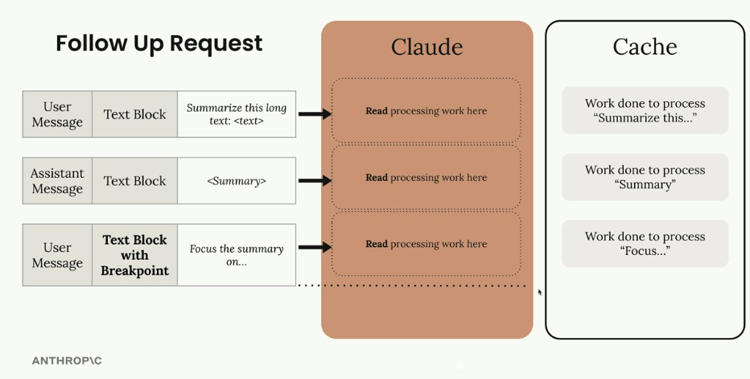

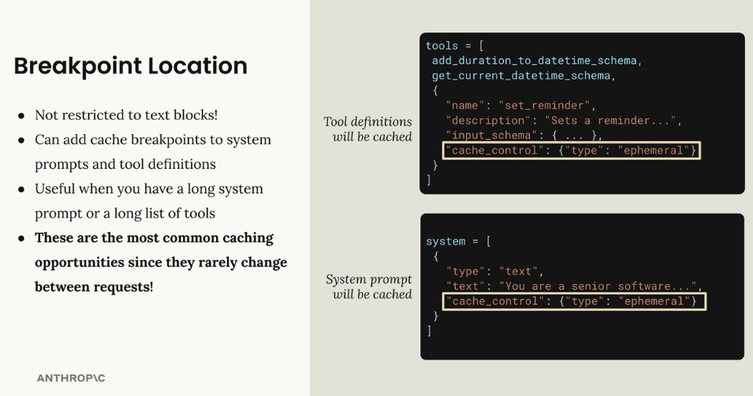

#### 39.4 Qué tipos de bloques admiten breakpoints

Los breakpoints no son exclusivos de mensajes de texto — se pueden agregar a cualquiera de estos bloques:

| Tipo de bloque | Por qué es buen candidato para caché |
| --- | --- |
| **System prompts** | Casi nunca cambian entre solicitudes |
| **Definiciones de herramientas** | Se mantienen constantes durante toda la aplicación |
| **Bloques de imagen** | Si la misma imagen se analiza repetidamente |
| **Bloques de uso/resultado de herramienta** | En flujos multi-turn con contexto acumulado |

> Las definiciones de herramientas y los system prompts son los mejores candidatos para caching porque rara vez cambian. Una aplicación con un system prompt de 2000 tokens que hace cientos de llamadas por hora ahorra costos significativos con un solo breakpoint.

#### 39.5 Orden de procesamiento interno y límite de breakpoints

Claude procesa los componentes de la solicitud en este orden:

```text
1. Herramientas (tool definitions)
2. System prompt
3. Mensajes (de más antiguo a más reciente)
```

Este orden determina cómo Claude construye el contexto cacheado. Se pueden agregar **hasta 4 breakpoints** en total por solicitud, lo que permite cachear secciones distintas de forma independiente (ej: herramientas + system prompt + parte del historial de conversación).
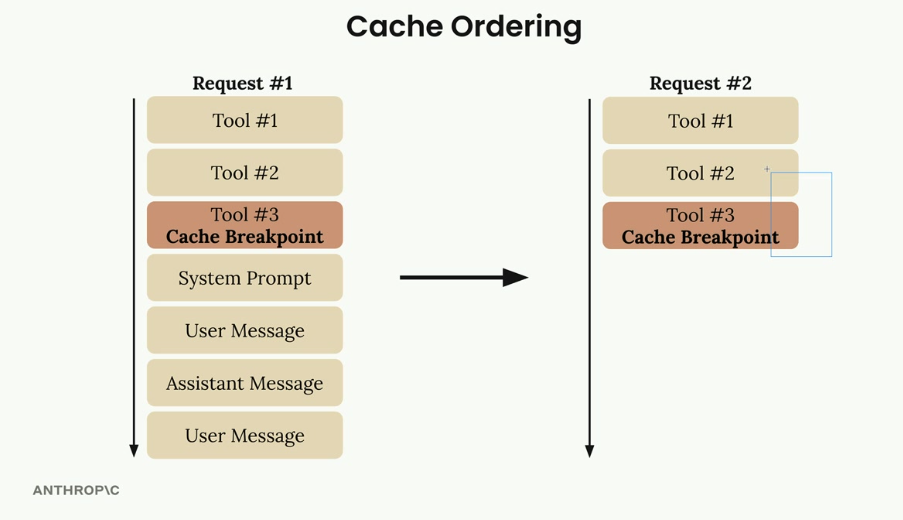

#### 39.6 Umbral mínimo de tokens

El caching no aplica a contenido corto. El contenido total acumulado hasta el breakpoint debe superar los **1024 tokens** para ser elegible:

| Condición | Resultado |
| --- | --- |
| Contenido total < 1024 tokens | No se cachea, se procesa normalmente |
| Contenido total ≥ 1024 tokens | Elegible para caching |

> El umbral aplica al total acumulado hasta el breakpoint, no a cada bloque por separado. Un system prompt de 500 tokens más un documento de 600 tokens suma 1100 tokens — supera el umbral aunque ninguno lo alcance individualmente.
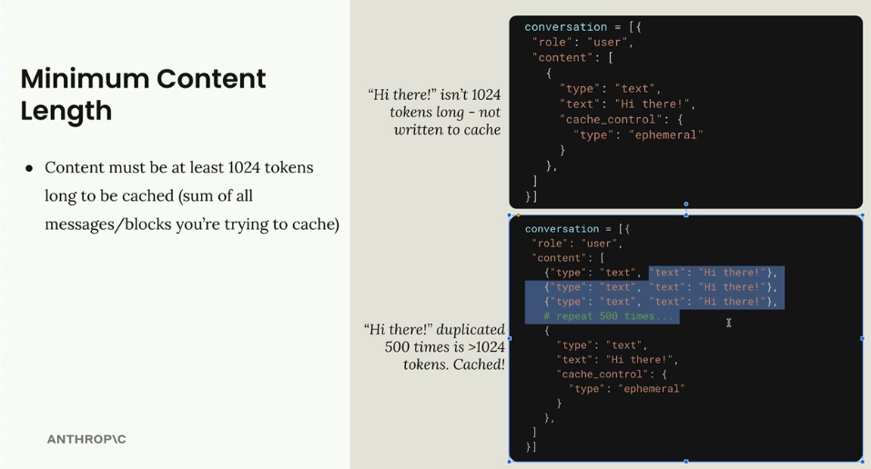

---

### Módulo 40: Prompt caching en acción

Los dos módulos anteriores cubrieron el concepto y las reglas del caching. Este módulo muestra cómo implementarlo concretamente en una función `chat()` que maneje herramientas y system prompt con breakpoints de caché.

Los candidatos más frecuentes para cachear son los **esquemas de herramientas** (que pueden llegar a ~1700 tokens) y los **system prompts largos** (hasta 6000+ tokens en asistentes de código). Ambos cambian raramente entre llamadas — ideal para caching.

#### 40.1 Cachear los esquemas de herramientas

El breakpoint de caché en herramientas se agrega al **último elemento** de la lista. La razón: Claude procesa las herramientas en orden, y el breakpoint indica "guardá en caché todo lo procesado hasta aquí". Si está en el último elemento, abarca todas las herramientas.

Para evitar mutar el objeto original (lo que podría causar bugs si la lista se reordena o reutiliza), se trabaja con copias:

```python
if tools:
    tools_clone = tools.copy()           # copia superficial de la lista
    last_tool = tools_clone[-1].copy()   # copia del último elemento (dict)
    last_tool["cache_control"] = {"type": "ephemeral"}  # agrega el breakpoint
    tools_clone[-1] = last_tool          # reemplaza el último con la versión cacheada
    params["tools"] = tools_clone        # usa la lista modificada en la solicitud
```

> Modificar `tools[-1]["cache_control"]` directamente también funciona, pero muta el objeto original. La copia protege contra efectos secundarios si la misma lista de herramientas se usa en múltiples lugares del código.

#### 40.2 Cachear el system prompt

El system prompt normalmente es un string simple. Para agregar un breakpoint, hay que convertirlo al formato expandido — una lista con un bloque de texto que incluya `cache_control`:

```python
if system:
    params["system"] = [
        {
            "type": "text",
            "text": system,                          # el contenido del system prompt
            "cache_control": {"type": "ephemeral"}   # activa el breakpoint
        }
    ]
```

Sin el formato expandido, no hay lugar donde poner `cache_control`. Por eso el string simple no sirve cuando se quiere cachear.

#### 40.3 Leer el estado de la caché en la respuesta

La API devuelve información sobre qué ocurrió con la caché en el objeto `usage` de la respuesta:

| Campo en `usage` | Cuándo aparece | Qué significa |
| --- | --- | --- |
| `cache_creation_input_tokens` | Primera solicitud | Claude escribió en la caché — tokens procesados y guardados |
| `cache_read_input_tokens` | Solicitudes siguientes | Claude leyó de la caché — no reprocesó ese contenido |
| `input_tokens` | Siempre | Tokens no cacheados procesados normalmente |

**Ejemplo de progresión típica:**

```text
Solicitud 1: cache_creation_input_tokens=1772, cache_read_input_tokens=0
Solicitud 2: cache_creation_input_tokens=0,    cache_read_input_tokens=1772
Solicitud 3: cache_creation_input_tokens=0,    cache_read_input_tokens=1772
```

Si el contenido cambia entre solicitudes, `cache_creation_input_tokens` vuelve a aparecer — Claude invalidó la caché anterior y escribió una nueva.

#### 40.4 Caching granular con múltiples breakpoints

Si se tienen tanto herramientas como system prompt, cada uno puede tener su propio breakpoint. El resultado es caching independiente por componente:

```text
[Tools con cache_control]         → breakpoint 1
[System prompt con cache_control] → breakpoint 2
[Mensajes]                        → procesados normalmente
```

Si el system prompt cambia pero las herramientas no:

```text
→ cache_read_input_tokens para tools  (no cambió, se reutiliza la caché)
→ cache_creation_input_tokens para system prompt  (cambió, se reescribe la caché)
```

> Este comportamiento granular es lo que hace útil tener múltiples breakpoints: si solo hubiera uno global, cualquier cambio en una parte invalida el caché de todo. Con breakpoints separados, solo se invalida la parte que cambió.

#### 40.5 Cuándo conviene implementarlo

| Condición | Recomendación |
| --- | --- |
| System prompt > 1024 tokens y cambia raramente | Agregar breakpoint — ahorro significativo |
| Múltiples herramientas con schemas detallados | Cachear la lista de herramientas completa |
| Aplicación con alta frecuencia de llamadas por hora | El caching amortiza bien — vale la pena |
| Cada llamada lleva contenido completamente diferente | No hay beneficio — la caché nunca se reutiliza |

> La caché dura 1 hora: está diseñada para aplicaciones con uso frecuente de la API, no para almacenamiento persistente entre sesiones separadas.

---

### Módulo 41: Ejecución de código y la API de archivos

Hasta ahora, todas las capacidades de Claude operaban dentro del mensaje: texto, imágenes, PDFs, herramientas que Claude llama y el código devuelve resultados. Este módulo introduce dos características que expanden ese modelo: la **API de archivos** (para subir y referenciar archivos sin incluirlos en cada mensaje) y la **ejecución de código** (para que Claude escriba y ejecute Python real en un entorno aislado).

Usadas por separado, cada una es útil. Usadas juntas, permiten delegarle a Claude tareas computacionales complejas — análisis de datos, generación de gráficos, procesamiento de documentos — con control total sobre las entradas y salidas.

#### 41.1 API de archivos

En los módulos anteriores, los archivos (PDFs, imágenes) se codificaban en base64 y se incluían directamente en cada mensaje. Esto funciona, pero tiene un costo: si el mismo archivo se referencia varias veces o es muy grande, se está enviando el mismo contenido repetidamente.

La API de archivos resuelve esto con un flujo de dos pasos:

```text
1. Subir el archivo una sola vez → obtener un file_id
2. En mensajes futuros, referenciar el file_id en lugar de incluir el contenido
```

```python
# Paso 1 — subir el archivo (una llamada separada a la API)
file_metadata = upload('streaming.csv')
# file_metadata.id contiene el ID único del archivo

# Paso 2 — referenciar el archivo por ID en un mensaje
{
    "type": "container_upload",
    "file_id": file_metadata.id   # referencia al archivo subido
}
```

| Método | Cuándo usarlo |
| --- | --- |
| **Base64 inline** | Archivos pequeños o de un solo uso |
| **API de archivos** | Archivos grandes, reutilizados múltiples veces, o que entran al contenedor de ejecución |

#### 41.2 Herramienta de ejecución de código

La ejecución de código es una **herramienta del lado del servidor** — no requiere implementación propia. Se declara en la solicitud igual que cualquier tool, y Claude decide si y cuándo ejecutar código Python durante la respuesta.

```python
chat(
    messages,
    tools=[{
        "type": "code_execution_20250522",  # herramienta predefinida por Anthropic
        "name": "code_execution"
    }]
)
```

Características del entorno de ejecución:

| Característica | Detalle |
| --- | --- |
| **Aislamiento** | Contenedor Docker dedicado por sesión |
| **Acceso a red** | Ninguno — no puede hacer llamadas externas |
| **Iteraciones** | Claude puede ejecutar código múltiples veces en una sola respuesta |
| **Resultados** | Claude interpreta la salida y la incorpora a su análisis |
| **Archivos generados** | Se almacenan en el contenedor, descargables via API de archivos |

> La falta de acceso a red es el motivo por el que la API de archivos es la vía principal para meter datos al contenedor: no se puede hacer un `requests.get()` desde adentro.

#### 41.3 Flujo completo: análisis de datos con CSV

```python
# 1. Subir el archivo de datos
file_metadata = upload('streaming.csv')

messages = []

# 2. Construir el mensaje con el archivo y la tarea
add_user_message(
    messages,
    [
        {
            "type": "text",
            "text": """Run a detailed analysis to determine major drivers of churn.
            Your final output should include at least one detailed plot summarizing your findings."""
        },
        {
            "type": "container_upload",     # tipo especial para pasar archivos al contenedor
            "file_id": file_metadata.id     # referencia al CSV subido previamente
        },
    ],
)

# 3. Llamar a chat con la herramienta de ejecución habilitada
chat(
    messages,
    tools=[{"type": "code_execution_20250522", "name": "code_execution"}]
)
```

Claude recibe el CSV dentro del contenedor, escribe código Python para analizarlo, lo ejecuta, interpreta los resultados y puede iterar — todo antes de generar la respuesta final.

#### 41.4 Estructura de la respuesta

Cuando Claude usa ejecución de código, la respuesta contiene bloques de distintos tipos mezclados:

| Tipo de bloque | Contenido |
| --- | --- |
| `text` | Análisis, explicaciones e interpretaciones de Claude |
| `tool_use` (server-side) | El código Python que Claude decidió ejecutar |
| `code_execution_output` | Resultado de la ejecución (stdout, stderr, archivos generados) |

Claude puede pasar por múltiples ciclos de escritura → ejecución → interpretación antes de entregar la respuesta final. Cada ciclo agrega un par de bloques `tool_use` + `code_execution_output`.

#### 41.5 Descargar archivos generados

Si Claude genera un gráfico u otro archivo durante la ejecución, queda almacenado en el contenedor y se puede descargar:

```python
# Buscar bloques type: "code_execution_output" en la respuesta
# que contengan file_id para el contenido generado
download_file("file_id_from_response")
```

---

### Resumen de la Unidad 7: Características de Claude

Esta unidad cubrió las capacidades avanzadas que van más allá del chat básico con texto.

| Módulo | Tema | Concepto clave |
| --- | --- | --- |
| **34** | Pensamiento extendido | `thinking: {type: "enabled", budget_tokens: N}` — Claude razona antes de responder |
| **35** | Soporte de imágenes | Bloque `"image"` con base64; costo = `(w×h)/750` tokens |
| **36** | Compatibilidad con PDF | Bloque `"document"` con `application/pdf`; lee texto, tablas e imágenes incrustadas |
| **37** | Citas | `citations: {enabled: True}` en el bloque documento; respuesta estructurada con `cited_text`, páginas y `document_index` |
| **38** | Prompt caching — concepto | La caché guarda el preprocesamiento; dura 1 hora; útil solo con contenido repetido |
| **39** | Prompt caching — reglas | `cache_control: {type: "ephemeral"}` en forma expandida; contenido idéntico requerido; umbral mínimo de 1024 tokens; hasta 4 breakpoints |
| **40** | Prompt caching — en acción | Cachear tools y system prompt por separado; leer `cache_creation_input_tokens` vs `cache_read_input_tokens` |
| **41** | API de archivos + ejecución de código | Subir archivos por ID; Claude ejecuta Python en Docker aislado; iterar → descargar resultados |

**Patrón transversal de la unidad:** todas estas características extienden el bloque de contenido del mensaje. Imágenes, PDFs, documentos con citas, archivos para el contenedor — todos son bloques adicionales en la lista `content` del mensaje. El bloque `"type"` determina qué capacidad se activa.

---

## Unidad 8: MCP (Protocolo de Contexto del Modelo)

Esta unidad cubre el Model Context Protocol — el estándar abierto que permite conectar Claude a servicios externos sin tener que implementar cada integración desde cero. Los módulos van desde los conceptos fundamentales hasta la implementación práctica de servidores y clientes MCP.

---

### Módulo 42: Presentamos MCP

En los módulos anteriores, cuando Claude necesitaba interactuar con un servicio externo (buscar en la web, ejecutar código, leer un archivo), había que definir manualmente el esquema de la herramienta y escribir la función que la implementa. Para un par de herramientas esto es razonable. Para integraciones complejas — GitHub, bases de datos, sistemas de archivos, APIs de terceros — se convierte en un trabajo enorme de escritura, prueba y mantenimiento.

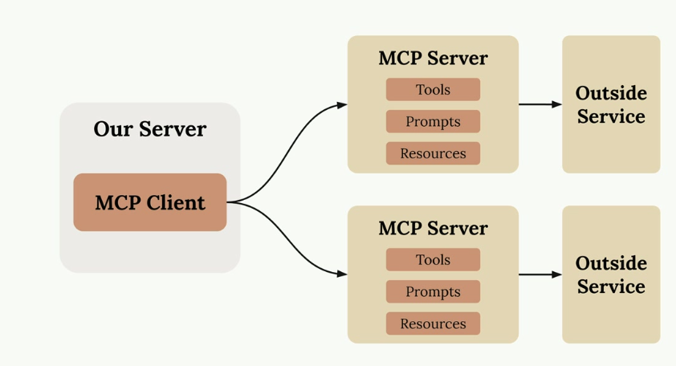

**MCP (Model Context Protocol)** es un estándar que resuelve este problema desplazando esa responsabilidad: en lugar de que vos escribas las herramientas, un **servidor MCP** especializado ya las tiene definidas e implementadas. Tu aplicación solo se conecta al servidor y obtiene acceso a todas sus herramientas.

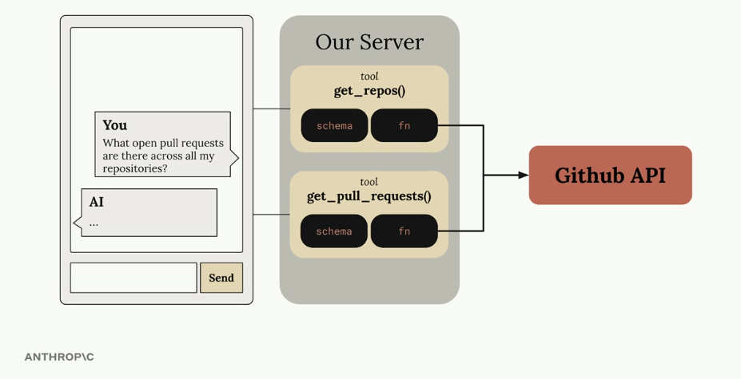

#### 42.1 La diferencia fundamental: sin MCP vs. con MCP

**Sin MCP** — vos sos responsable de todo:

```text
Tu aplicación
    → define el esquema de cada herramienta (JSON)
    → implementa la función que la ejecuta (Python/JS/etc.)
    → mantiene la integración cuando la API externa cambia
    → repite esto para cada funcionalidad del servicio
```

**Con MCP** — el servidor ya hizo ese trabajo:

```text
Tu aplicación
    → se conecta al servidor MCP de GitHub
    → recibe automáticamente todos los esquemas y funciones
    → Claude puede usar esas herramientas directamente
```

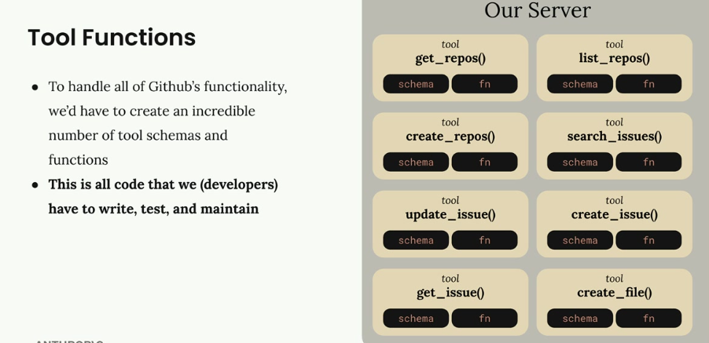

#### 42.2 Qué provee un servidor MCP

Un servidor MCP es una capa de abstracción sobre un servicio externo. Empaqueta tres tipos de recursos:

| Recurso MCP | Qué es | Ejemplo con GitHub |
| --- | --- | --- |
| **Tools** | Funciones que Claude puede llamar | `list_pull_requests`, `create_issue` |
| **Prompts** | Plantillas de prompts preconfiguradas | "Resume los PRs abiertos de este repo" |
| **Resources** | Datos que Claude puede leer | Contenido de archivos, repositorios |

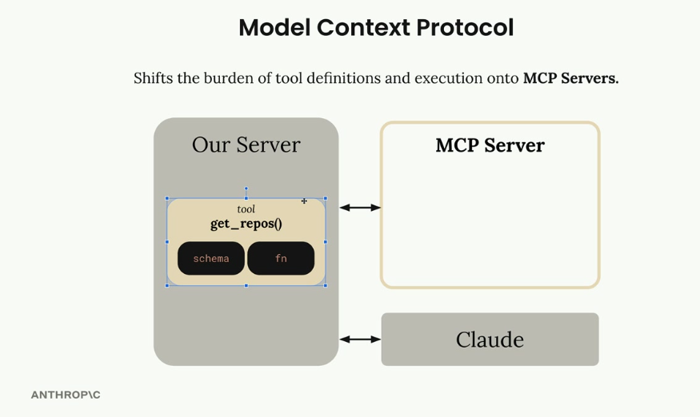
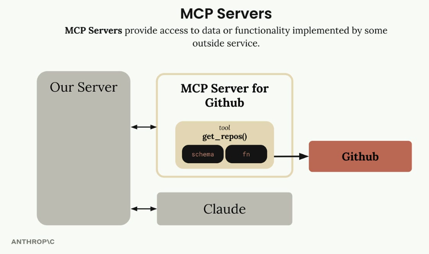
> Las **tools** son el recurso más usado — son equivalentes a las herramientas que definíamos manualmente, pero ya escritas y mantenidas por el servidor MCP.

#### 42.3 Quién crea los servidores MCP

Cualquiera puede implementar un servidor MCP — es un estándar abierto. En la práctica:

| Autor | Ejemplo |
| --- | --- |
| **El propio proveedor del servicio** | AWS publica un servidor MCP oficial para sus servicios |
| **La comunidad** | Desarrolladores crean servidores para servicios populares |
| **Vos mismo** | Podés crear un servidor MCP para tu propia API o sistema interno |

#### 42.4 MCP vs. tool use — la distinción clave

Es fácil confundirlos porque ambos involucran herramientas. La diferencia está en **quién escribe y mantiene** esas herramientas:

| Aspecto | Tool use directo | Con MCP |
| --- | --- | --- |
| **Quién define el esquema** | Vos | El servidor MCP |
| **Quién implementa la función** | Vos | El servidor MCP |
| **Quién mantiene la integración** | Vos | El autor del servidor |
| **Cuánto código escribís** | Mucho | Casi nada |

> MCP no reemplaza el tool use — lo complementa. Por debajo, Claude sigue usando herramientas. Lo que cambia es que alguien más ya hizo el trabajo de definirlas e implementarlas. Conectarse a un servidor MCP es como importar una librería: obtenés funcionalidad lista para usar sin escribirla desde cero.

---

### Módulo 43: Clientes MCP

El módulo anterior presentó MCP como concepto. Este módulo cubre el **cliente MCP** — el componente concreto que vive en tu aplicación y se encarga de toda la comunicación con los servidores MCP.

El cliente es un puente: tu servidor no habla directamente con GitHub ni con ningún servicio externo. Habla con el cliente MCP, y el cliente MCP habla con el servidor MCP, que a su vez habla con el servicio. Esta separación de responsabilidades es lo que hace que la arquitectura sea limpia.

#### 43.1 Independencia del transporte

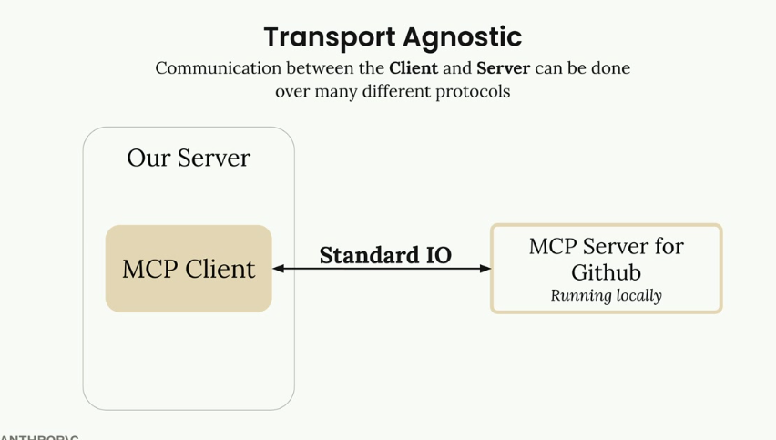

Una característica importante del protocolo MCP es que **no está atado a un mecanismo de comunicación específico**. El cliente y el servidor pueden comunicarse por distintos canales según el despliegue:

| Transporte | Cuándo se usa |
| --- | --- |
| **Stdin/stdout** | Cliente y servidor en la misma máquina — el más común en desarrollo |
| **HTTP** | Servidor MCP remoto, comunicación request/response |
| **WebSockets** | Comunicación bidireccional en tiempo real con servidor remoto |

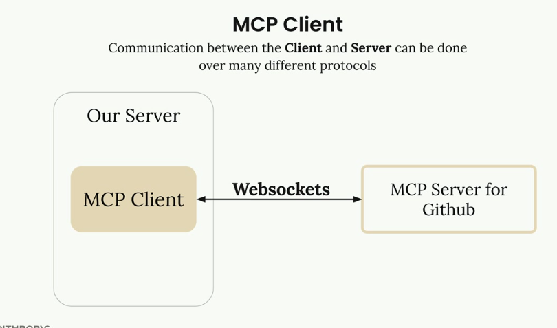

> En la mayoría de los casos de desarrollo local, cliente y servidor MCP corren en la misma máquina y se comunican por stdin/stdout — el proceso del servidor MCP recibe mensajes por entrada estándar y responde por salida estándar.

#### 43.2 Tipos de mensajes del protocolo

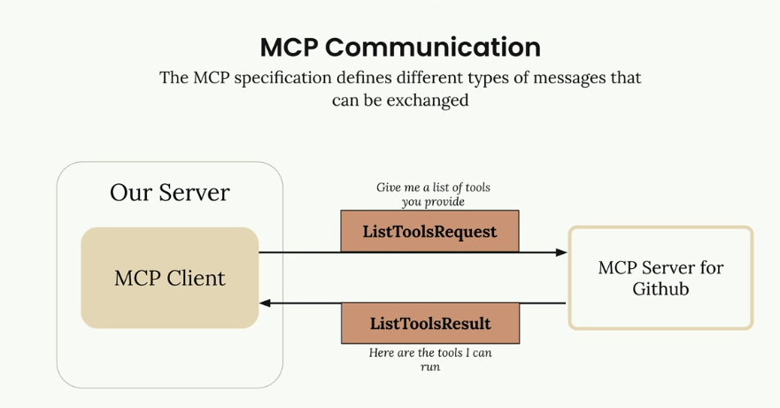
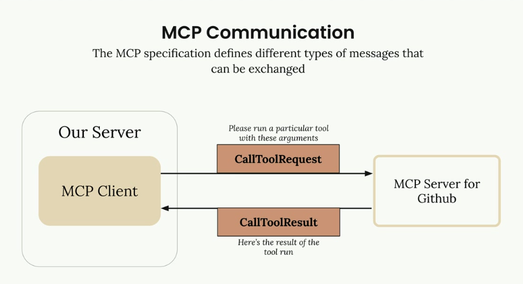

El protocolo MCP define mensajes específicos para cada tipo de operación. Los dos más importantes son:

| Mensaje | Dirección | Para qué sirve |
| --- | --- | --- |
| `ListToolsRequest` | Cliente → Servidor | "¿Qué herramientas tenés disponibles?" |
| `ListToolsResult` | Servidor → Cliente | Lista de herramientas con sus esquemas |
| `CallToolRequest` | Cliente → Servidor | "Ejecutá esta herramienta con estos argumentos" |
| `CallToolResult` | Servidor → Cliente | Resultado de la ejecución de la herramienta |

El flujo siempre es: primero listar herramientas (para saber qué hay disponible), luego llamar herramientas (para ejecutarlas cuando Claude lo pide).

#### 43.3 Flujo completo de una solicitud
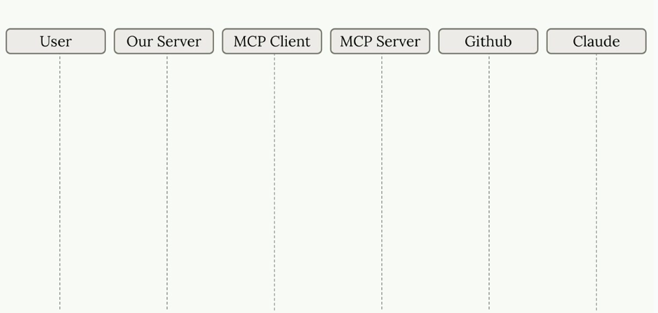
Tomando como ejemplo "¿Qué repositorios tengo?" en un chatbot de GitHub, el flujo completo involucra 8 pasos:

```text
1. Usuario → Tu servidor       "¿Qué repositorios tengo?"

2. Tu servidor → Cliente MCP   "Dame la lista de herramientas"
3. Cliente MCP → Servidor MCP  ListToolsRequest
4. Servidor MCP → Cliente MCP  ListToolsResult (herramientas de GitHub)

5. Tu servidor → Claude        [pregunta del usuario + herramientas disponibles]
6. Claude → Tu servidor        tool_use: list_repositories

7. Tu servidor → Cliente MCP   "Ejecutá list_repositories"
8. Cliente MCP → Servidor MCP  CallToolRequest
   Servidor MCP → GitHub       llamada real a la API
   GitHub → Servidor MCP       datos de repositorios
   Servidor MCP → Cliente MCP  CallToolResult

9. Tu servidor → Claude        [resultado de la herramienta]
10. Claude → Tu servidor       respuesta final formateada
11. Tu servidor → Usuario      "Tenés 12 repositorios: ..."
```
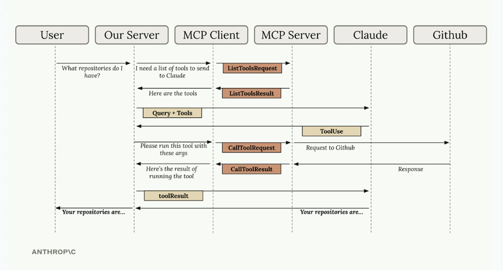

> Son muchos pasos, pero cada componente tiene una única responsabilidad. El cliente MCP abstrae los pasos 3-4 y 7-8 — tu servidor solo llama métodos del cliente, sin saber nada de cómo se comunica con el servidor MCP por debajo.

#### 43.4 Por qué esta arquitectura tiene sentido

La separación cliente/servidor MCP permite sustituir partes del sistema sin tocar el resto:

- Cambiar el **transporte** (de stdin a HTTP) sin cambiar la lógica de la aplicación
- Cambiar el **servidor MCP** (de GitHub a GitLab) sin cambiar cómo el cliente hace las solicitudes
- Agregar nuevos servidores MCP sin modificar el código existente — solo conectar uno nuevo al cliente

---

### Módulo 44: Configuración del proyecto

Este módulo introduce el proyecto práctico de la unidad: un chatbot de línea de comandos que implementa **ambos lados** de la arquitectura MCP — cliente y servidor — para entender cómo se comunican entre sí.

#### 44.1 Qué se está construyendo

El proyecto es un chatbot CLI que permite interactuar con una colección de documentos en memoria. Tiene dos componentes principales:

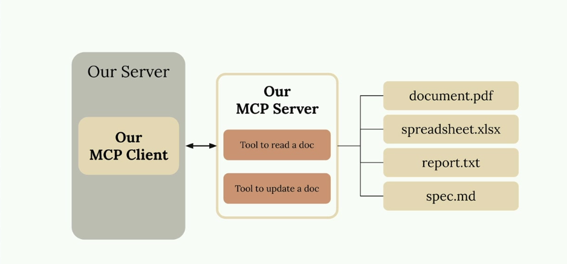

| Componente | Archivo | Responsabilidad |
| --- | --- | --- |
| **Cliente MCP** | `mcp_client.py` | Gestiona las interacciones del usuario y se comunica con el servidor MCP |
| **Servidor MCP** | `mcp_server.py` | Expone herramientas para leer y actualizar documentos |
| **Entrada principal** | `main.py` | Orquesta cliente, servidor y la interfaz de chat |

El servidor provee dos herramientas:

- **Leer documento** — devuelve el contenido de un documento por nombre
- **Actualizar documento** — modifica el contenido de un documento existente

Los documentos se almacenan en memoria (sin base de datos) para simplificar el foco en MCP.

#### 44.2 Nota arquitectónica importante

En proyectos reales, normalmente se implementa **uno de los dos lados**, no ambos:

| Caso real | Qué implementás |
| --- | --- |
| Querés exponer tu servicio a otros | Solo el **servidor MCP** |
| Querés conectarte a servidores existentes | Solo el **cliente MCP** |
| Este proyecto (educativo) | **Ambos** — para entender cómo se comunican |

#### 44.3 Configuración y ejecución

```bash
# 1. Agregar la API key al archivo de entorno
# Editar .env y agregar: ANTHROPIC_API_KEY=sk-...

# 2. Instalar dependencias (con UV — recomendado)
uv run main.py

# 3. O con Python estándar
python main.py
```

Al iniciar correctamente, aparece una interfaz de chat. Una consulta simple como "¿cuánto es 1+1?" confirma que Claude está respondiendo antes de agregar la funcionalidad MCP.

> La ventaja de construir ambos lados en un proyecto de aprendizaje es que podés ver exactamente qué mensaje sale del cliente, qué recibe el servidor, y qué responde — sin la capa de opacidad que tendría un servidor MCP externo.

---

### Módulo 45: Definir herramientas con MCP

En los módulos de tool use anteriores, definir una herramienta requería escribir manualmente un esquema JSON con el nombre, descripción y cada parámetro. El SDK oficial de Python para MCP elimina ese trabajo: inferimos el esquema automáticamente desde las **type hints** y los **decoradores** de Python.

El resultado es que definir una herramienta MCP se parece más a escribir una función Python normal que a mantener un JSON.

#### 45.1 Inicializar el servidor

```python
from mcp.server.fastmcp import FastMCP

# Una línea para crear el servidor completo
mcp = FastMCP("DocumentMCP", log_level="ERROR")

# Documentos en memoria (dict: id → contenido)
docs = {
    "deposition.md": "This deposition covers the testimony of Angela Smith, P.E.",
    "report.pdf":    "The report details the state of a 20m condenser tower.",
    "financials.docx": "These financials outline the project's budget and expenditure",
    "plan.md":       "The plan outlines the steps for the project's implementation.",
    "spec.txt":      "These specifications define the technical requirements for the equipment"
}
```

| Parámetro de `FastMCP` | Descripción |
| --- | --- |
| `"DocumentMCP"` | Nombre del servidor — aparece en la negociación del protocolo |
| `log_level="ERROR"` | Reduce el ruido de logs durante el desarrollo |

#### 45.2 Definir herramientas con el decorador `@mcp.tool`

En lugar de escribir esquemas JSON, se decoran funciones Python normales. El SDK genera el esquema automáticamente a partir de los tipos y las descripciones de `Field`:

**Herramienta de lectura:**

```python
from pydantic import Field

@mcp.tool(
    name="read_doc_contents",
    description="Read the contents of a document and return it as a string."
)
def read_document(
    doc_id: str = Field(description="Id of the document to read")  # Field provee la descripción del parámetro
):
    if doc_id not in docs:
        raise ValueError(f"Doc with id {doc_id} not found")  # error descriptivo que Claude puede interpretar

    return docs[doc_id]  # devuelve el contenido como string
```

**Herramienta de edición (búsqueda y reemplazo):**

```python
@mcp.tool(
    name="edit_document",
    description="Edit a document by replacing a string in the document's content with a new string."
)
def edit_document(
    doc_id: str = Field(description="Id of the document that will be edited"),
    old_str: str = Field(description="The text to replace. Must match exactly, including whitespace."),
    new_str: str = Field(description="The new text to insert in place of the old text.")
):
    if doc_id not in docs:
        raise ValueError(f"Doc with id {doc_id} not found")

    docs[doc_id] = docs[doc_id].replace(old_str, new_str)  # reemplazo in-place en el dict
```

#### 45.3 Qué hace el SDK por vos automáticamente

| Tarea | Sin SDK (manual) | Con SDK |
| --- | --- | --- |
| Definir el esquema JSON de la herramienta | Escribir JSON a mano | Inferido de type hints |
| Describir cada parámetro | Campo en el JSON | `Field(description=...)` |
| Validar tipos de entrada | Implementar manualmente | Pydantic lo hace automáticamente |
| Registrar la herramienta en el protocolo | Código de integración | Lo maneja `@mcp.tool` |

> `Field` es de Pydantic — la misma librería que usa FastAPI. Si ya conocés FastAPI, la sintaxis de definición de herramientas MCP te va a resultar familiar. Si no, el patrón es simple: cada parámetro de la función es un parámetro de la herramienta, y `Field` agrega la descripción que Claude lee para entender qué esperar.

#### 45.4 Manejo de errores

Ambas herramientas levantan un `ValueError` cuando el `doc_id` no existe. Esto no es un detalle menor: Claude recibe el mensaje de error y puede reaccionar — por ejemplo, informarle al usuario que el documento no existe en lugar de devolver un resultado vacío o incorrecto. Los errores descriptivos son parte del contrato de la herramienta.

---

### Módulo 46: El inspector del servidor MCP

Antes de conectar un servidor MCP a Claude o a una aplicación completa, conviene poder probar las herramientas de forma aislada. El SDK de Python incluye un **inspector basado en navegador** que permite ejecutar herramientas individualmente, ver sus resultados y depurar problemas sin montar todo el stack.

#### 46.1 Iniciar el inspector

```bash
# Con el entorno Python activado, desde el directorio del proyecto:
mcp dev mcp_server.py
```

Esto levanta un servidor de desarrollo en el puerto **6277** y muestra una URL local para abrir en el navegador. La interfaz del inspector se carga con un panel de control que muestra el estado del servidor.

> El inspector MCP está en desarrollo activo — la interfaz visual puede diferir de capturas de pantalla, pero la funcionalidad principal (listar y ejecutar herramientas) se mantiene estable.

#### 46.2 Flujo de prueba de una herramienta

```text
1. Clic en "Connect"        → inicia el servidor MCP
2. Ir a sección "Tools"     → muestra las herramientas registradas
3. Clic en "List Tools"     → lista todas las herramientas disponibles
4. Seleccionar una herramienta → abre su interfaz de prueba con campos para los parámetros
5. Completar los parámetros → ej: doc_id = "deposition.md"
6. Clic en "Run Tool"       → ejecuta la herramienta y muestra el resultado
```

Se pueden encadenar operaciones: editar un documento y luego ejecutar la herramienta de lectura inmediatamente para confirmar que el cambio se aplicó correctamente.

#### 46.3 Por qué importa este flujo de trabajo

| Sin inspector | Con inspector |
| --- | --- |
| Conectar el servidor a Claude para cada prueba | Probar herramientas individuales directamente |
| Depurar a través de la conversación completa | Aislar el problema en la herramienta específica |
| Ciclo de prueba lento | Ciclo de desarrollo rápido y enfocado |

> El inspector convierte el desarrollo de servidores MCP en un proceso iterativo similar al desarrollo de APIs con Postman o Insomnia: implementás una herramienta, la probás en aislamiento, corregís, repetís — sin necesidad de montar el cliente ni la integración con Claude para cada prueba.

---

### Módulo 47: Implementación de un cliente MCP

El servidor MCP expone herramientas. El cliente es el componente que las consume — es quien llama a `ListTools` para saber qué hay disponible y a `CallTool` para ejecutarlas cuando Claude lo pide. Este módulo muestra cómo implementar ese cliente en Python.

#### 47.1 Estructura del cliente

El cliente tiene dos capas:

| Capa | Qué es | Responsabilidad |
| --- | --- | --- |
| **`ClientSession`** | Del SDK de Python de MCP | La conexión real con el servidor — maneja el protocolo |
| **`MCPClient`** (clase propia) | Clase personalizada que envuelve la sesión | Simplifica el uso y garantiza la limpieza de recursos |

La sesión del cliente requiere limpieza explícita al cerrarse (cerrar la conexión, liberar recursos). Encapsularla en una clase propia con `async with` hace que esa limpieza sea automática — el código que usa el cliente no tiene que preocuparse por eso.

#### 47.2 Los dos métodos clave

```python
# Obtener la lista de herramientas disponibles en el servidor
async def list_tools(self) -> list[types.Tool]:
    result = await self.session().list_tools()  # envía ListToolsRequest al servidor
    return result.tools                          # devuelve la lista de Tool objects

# Ejecutar una herramienta específica con sus argumentos
async def call_tool(
    self, tool_name: str, tool_input: dict
) -> types.CallToolResult | None:
    return await self.session().call_tool(tool_name, tool_input)  # envía CallToolRequest
```

| Método | Mensaje MCP enviado | Qué devuelve |
| --- | --- | --- |
| `list_tools()` | `ListToolsRequest` | Lista de `Tool` con esquemas |
| `call_tool(name, input)` | `CallToolRequest` | `CallToolResult` con la salida de la herramienta |

#### 47.3 Cómo se prueba el cliente en aislamiento

```python
async with MCPClient(
    command="uv", args=["run", "mcp_server.py"]  # lanza el servidor como subproceso
) as client:
    result = await client.list_tools()
    print(result)  # imprime los esquemas de read_doc_contents y edit_document
```

`async with` garantiza que al salir del bloque — ya sea por éxito o por error — la sesión se cierra correctamente. Esto es el mismo patrón que `with open(...)` para archivos, pero asíncrono.

#### 47.4 Flujo completo cliente ↔ servidor ↔ Claude

Con cliente y servidor funcionando, el flujo de una pregunta sobre un documento es:

```text
1. App → client.list_tools()           → servidor devuelve herramientas disponibles
2. App → Claude [pregunta + herramientas]
3. Claude → App  tool_use: read_doc_contents(doc_id="report.pdf")
4. App → client.call_tool("read_doc_contents", {"doc_id": "report.pdf"})
5. Servidor ejecuta la función → devuelve contenido del documento
6. App → Claude [resultado de la herramienta]
7. Claude → App  respuesta final al usuario
```

> El cliente actúa como puente: la app no sabe nada de cómo funciona el servidor por dentro, y el servidor no sabe nada de Claude. El cliente es la capa que los conecta, exponiendo solo dos métodos simples (`list_tools` y `call_tool`) independientemente de la complejidad del servidor.

---

### Módulo 48: Definir recursos MCP

Hasta ahora, las herramientas MCP realizan **acciones** — leer un documento, editarlo. Los **recursos** son el complemento: exponen **datos** que el cliente puede consultar, sin ejecutar ninguna acción. La distinción es conceptualmente similar a la diferencia entre un endpoint `POST` (hace algo) y un `GET` (devuelve datos) en una API HTTP.

Un caso de uso típico son las menciones `@documento` en un chat: cuando el usuario escribe `@`, la app necesita obtener la lista de documentos disponibles (un recurso de lista); cuando el usuario selecciona uno, la app obtiene su contenido (un recurso con parámetro). Ninguna de esas dos operaciones modifica nada — solo recuperan datos.

#### 48.1 Tipos de recursos

| Tipo | URI ejemplo | Cuándo usarlo |
| --- | --- | --- |
| **Directo** | `docs://documents` | URI fijo — siempre devuelve lo mismo (ej: lista de todos los docs) |
| **Con plantilla** | `docs://documents/{doc_id}` | URI parametrizado — el parámetro se resuelve en tiempo de ejecución |

Para recursos con plantilla, el SDK extrae automáticamente los parámetros de la URI y los pasa como argumentos a la función.

#### 48.2 Implementación con `@mcp.resource`

```python
# Recurso directo — lista de todos los documentos disponibles
@mcp.resource(
    "docs://documents",          # URI fija
    mime_type="application/json" # indica al cliente que el dato es JSON
)
def list_docs() -> list[str]:
    return list(docs.keys())     # el SDK serializa la lista a JSON automáticamente

# Recurso con plantilla — obtiene el contenido de un documento específico
@mcp.resource(
    "docs://documents/{doc_id}", # {doc_id} se extrae de la URI y se pasa como argumento
    mime_type="text/plain"
)
def fetch_doc(doc_id: str) -> str:
    if doc_id not in docs:
        raise ValueError(f"Doc with id {doc_id} not found")
    return docs[doc_id]
```

El cliente accede a estos recursos enviando un `ReadResourceRequest` con la URI correspondiente. El servidor responde con los datos.

#### 48.3 Tipos MIME comunes

| `mime_type` | Qué indica |
| --- | --- |
| `"application/json"` | Datos estructurados — listas, dicts |
| `"text/plain"` | Texto sin formato |
| Cualquier MIME válido | El SDK serializa automáticamente el valor de retorno |

> El SDK se encarga de serializar el valor devuelto por la función. No hay que llamar a `json.dumps()` manualmente — retornar una lista o un dict es suficiente si el `mime_type` es `application/json`.

#### 48.4 Diferencia clave: recursos vs. herramientas

| Aspecto | Recursos | Herramientas |
| --- | --- | --- |
| **Propósito** | Exponer datos (leer) | Realizar acciones (leer, escribir, ejecutar) |
| **Decorador** | `@mcp.resource("uri")` | `@mcp.tool(name=..., description=...)` |
| **Mensaje MCP** | `ReadResourceRequest` | `CallToolRequest` |
| **Analogía HTTP** | `GET` | `POST` / `PUT` / `DELETE` |
| **Quién lo llama** | El cliente directamente | Claude lo decide y el cliente lo ejecuta |

> La distinción práctica es sobre el **iniciador**: los recursos los solicita la aplicación cuando los necesita (ej: al cargar la lista de documentos para el autocompletado). Las herramientas las invoca Claude cuando decide que las necesita para responder.

---

### Módulo 49: Acceso a los recursos desde el cliente

El módulo anterior mostró cómo **definir** recursos en el servidor. Este módulo muestra cómo el cliente los **consume** — cómo solicitar un recurso por URI, recibir la respuesta y convertirla al tipo Python correcto según su `mime_type`.

La ventaja de los recursos frente a las herramientas en este contexto es la eficiencia: el contenido del documento llega directamente en el mensaje a Claude, sin necesidad de un ciclo tool_use → tool_result. Ideal para el patrón de mención `@documento`.

#### 49.1 Implementar `read_resource` en el cliente

```python
import json
from pydantic import AnyUrl  # garantiza el tipo correcto para la URI

async def read_resource(self, uri: str) -> Any:
    # Envía ReadResourceRequest al servidor con la URI del recurso
    result = await self.session().read_resource(AnyUrl(uri))

    # La respuesta contiene una lista de contenidos; normalmente solo hay uno
    resource = result.contents[0]

    # Manejar el tipo de contenido según el mime_type
    if isinstance(resource, types.TextResourceContents):
        if resource.mimeType == "application/json":
            return json.loads(resource.text)  # convierte el JSON string a dict/list de Python
        return resource.text                  # texto plano: devolver como string directamente
```

| Tipo de contenido | `mimeType` | Procesamiento |
| --- | --- | --- |
| JSON estructurado | `"application/json"` | `json.loads(resource.text)` → dict o list |
| Texto plano | `"text/plain"` | `resource.text` → string |

#### 49.2 Flujo de una mención `@documento`

Cuando el usuario escribe `@report.pdf` en el chat:

```text
1. App detecta la mención "@report.pdf"
2. App → client.read_resource("docs://documents/report.pdf")
3. Cliente → servidor MCP  ReadResourceRequest(uri="docs://documents/report.pdf")
4. Servidor ejecuta fetch_doc("report.pdf") → devuelve el contenido
5. Cliente parsea la respuesta según mime_type
6. App inserta el contenido del documento en el mensaje que va a Claude
7. Claude recibe el contenido directamente — sin necesitar una tool call
```

> La diferencia clave con las herramientas: en el paso 6 el contenido ya está en el mensaje. Claude no tiene que pedir el documento — ya lo tiene. Esto elimina un ciclo completo de tool_use → tool_result, haciendo la interacción más rápida.

#### 49.3 Por qué `AnyUrl` en lugar de un string simple

`AnyUrl` es una clase de Pydantic que valida que la cadena sea una URL bien formada antes de enviarla al servidor. El SDK de MCP lo requiere para el parámetro URI de `read_resource` — pasar un string directamente causaría un error de tipo.

#### 49.4 Separación de responsabilidades

```text
mcp_client.py  → sabe cómo hablar con el servidor (protocolo, tipos, parsing)
main.py        → sabe cómo usar los datos (cuándo buscar un recurso, qué hacer con él)
```

El cliente expone `read_resource(uri)` como interfaz limpia. La lógica de la aplicación no necesita saber nada de `AnyUrl`, `TextResourceContents` ni `json.loads` — solo llama al método y recibe el dato Python listo para usar.

---

### Módulo 50: Definir indicaciones (prompts) en MCP

Los servidores MCP pueden exponer tres tipos de recursos: herramientas (acciones), recursos (datos) y **prompts** (instrucciones prediseñadas). Los prompts son plantillas de mensajes cuidadosamente elaboradas que el cliente puede solicitar y usar directamente, en lugar de que cada usuario tenga que redactar su propia versión.

La diferencia no es solo de comodidad — es de calidad. Un usuario que pide "convertí este documento a Markdown" obtiene un resultado razonable. Un prompt bien diseñado por el autor del servidor, con instrucciones específicas sobre estructura, encabezados y formato, produce resultados consistentemente mejores.

#### 50.1 Cómo funcionan los prompts MCP

Cuando el cliente solicita un prompt al servidor, el servidor devuelve una **lista de mensajes** (`UserMessage`, `AssistantMessage`) que se pueden enviar directamente a Claude. El prompt no es texto libre — es estructura de conversación lista para usar.

```text
Cliente → GetPromptRequest(name="format", args={doc_id: "report.pdf"})
Servidor → lista de mensajes con el prompt completo interpolado
Cliente → envía esos mensajes a Claude
```

#### 50.2 Implementación con `@mcp.prompt`

```python
from mcp.server.fastmcp import base
from pydantic import Field

@mcp.prompt(
    name="format",
    description="Rewrites the contents of the document in Markdown format."
)
def format_document(
    doc_id: str = Field(description="Id of the document to format")  # parámetro interpolado en el prompt
) -> list[base.Message]:                                              # devuelve lista de mensajes
    prompt = f"""
Your goal is to reformat a document to be written with markdown syntax.

The id of the document you need to reformat is:

{doc_id}

Add in headers, bullet points, tables, etc as necessary. Feel free to add in extra formatting.
Use the 'edit_document' tool to edit the document after reformatting.
"""
    return [
        base.UserMessage(prompt)  # un mensaje de usuario con las instrucciones completas
    ]
```

| Elemento | Descripción |
| --- | --- |
| `@mcp.prompt(name=..., description=...)` | Registra el prompt en el servidor con nombre y descripción visibles para el cliente |
| `Field(description=...)` | Igual que en herramientas — documenta el parámetro para que el cliente sepa qué pasar |
| `-> list[base.Message]` | Tipo de retorno — siempre una lista de mensajes (`UserMessage`, `AssistantMessage`) |
| `base.UserMessage(texto)` | Crea un mensaje de rol `user` con el texto del prompt |

#### 50.3 Los tres recursos de un servidor MCP comparados

| Tipo | Decorador | Qué devuelve | Para qué sirve |
| --- | --- | --- | --- |
| **Tool** | `@mcp.tool` | Resultado de ejecutar una acción | Realizar operaciones (leer, editar, buscar) |
| **Resource** | `@mcp.resource` | Datos crudos (texto, JSON) | Proveer contexto o información |
| **Prompt** | `@mcp.prompt` | Lista de mensajes listos para Claude | Instrucciones prediseñadas y reutilizables |

#### 50.4 Buenas prácticas para diseñar prompts MCP

| Práctica | Por qué importa |
| --- | --- |
| Instrucciones específicas y detalladas | Los prompts vagos producen resultados inconsistentes |
| Probar con múltiples entradas diferentes | Un prompt puede funcionar bien con un doc_id y fallar con otro |
| Referenciar las herramientas disponibles en el servidor | El prompt puede indicarle a Claude qué tool usar (ej: `edit_document`) |
| Descripciones claras en `name` y `description` | El cliente las muestra al usuario para que sepa qué hace cada prompt |

> Los prompts son la forma en que el autor del servidor MCP comparte su expertise con los usuarios. No son atajos de comodidad — son instrucciones que reflejan conocimiento específico del dominio que los usuarios no tendrían por sí mismos.

---

### Módulo 51: Indicaciones en el cliente

El módulo anterior mostró cómo **definir** prompts en el servidor. Este módulo completa el par: cómo el cliente los **consume** — listarlos y obtenerlos con argumentos interpolados para enviarlos directamente a Claude.

#### 51.1 Listar los prompts disponibles

```python
async def list_prompts(self) -> list[types.Prompt]:
    result = await self.session().list_prompts()  # envía ListPromptsRequest al servidor
    return result.prompts                          # devuelve la lista de prompts con nombre y descripción
```

Esto es el equivalente de `list_tools()` pero para prompts. El cliente obtiene todos los prompts disponibles en el servidor — útil para construir una interfaz donde el usuario pueda seleccionar cuál usar (ej: `/formato`, `/resumen`).

#### 51.2 Obtener un prompt con argumentos

```python
async def get_prompt(self, prompt_name: str, args: dict[str, str]):
    result = await self.session().get_prompt(prompt_name, args)  # envía GetPromptRequest
    return result.messages  # devuelve la lista de mensajes lista para enviar a Claude
```

El parámetro `args` es un diccionario con los valores que se interpolarán en la función del prompt del servidor. Por ejemplo, para el prompt `"format"` que espera `doc_id`:

```python
messages = await client.get_prompt("format", {"doc_id": "report.pdf"})
# El servidor ejecuta format_document(doc_id="report.pdf")
# y devuelve la lista de mensajes con el doc_id ya interpolado
```

#### 51.3 Los tres métodos del cliente MCP — resumen

| Método | Mensaje MCP | Qué devuelve |
| --- | --- | --- |
| `list_tools()` | `ListToolsRequest` | Lista de herramientas con esquemas |
| `list_prompts()` | `ListPromptsRequest` | Lista de prompts con nombre y descripción |
| `get_prompt(name, args)` | `GetPromptRequest` | Lista de mensajes listos para Claude |
| `call_tool(name, input)` | `CallToolRequest` | Resultado de ejecutar una herramienta |
| `read_resource(uri)` | `ReadResourceRequest` | Datos del recurso (texto o JSON) |

#### 51.4 Flujo completo desde la CLI

Cuando el usuario escribe `/formato` en la interfaz de línea de comandos:

```text
1. Usuario escribe "/" → app lista los prompts disponibles (list_prompts)
2. Usuario selecciona "formato"
3. App pide argumentos al usuario → "¿Qué documento?" → "report.pdf"
4. App → client.get_prompt("format", {"doc_id": "report.pdf"})
5. Servidor interpola doc_id en la función → devuelve lista de mensajes
6. App envía esos mensajes directamente a Claude
7. Claude usa las herramientas del servidor (edit_document) para completar la tarea
```

> Los mensajes que devuelve `get_prompt` son la entrada completa para Claude — no hay que construir el prompt manualmente. El cliente recibe la conversación ya armada y la manda tal cual. Esto es lo que hace que los prompts MCP sean reutilizables: el servidor define la estructura, el cliente solo pasa los argumentos.

---

### Resumen de la Unidad 8: MCP

Esta unidad cubrió el Model Context Protocol de punta a punta — desde el concepto hasta la implementación completa de cliente y servidor.

| Módulo | Tema | Concepto clave |
| --- | --- | --- |
| **42** | Presentamos MCP | MCP delega la definición e implementación de herramientas a servidores especializados; complementa tool use, no lo reemplaza |
| **43** | Clientes MCP | El cliente envía `ListToolsRequest` y `CallToolRequest`; independiente del transporte (stdin, HTTP, WebSockets) |
| **44** | Configuración del proyecto | Proyecto educativo con cliente + servidor propios; en producción se implementa solo uno de los dos |
| **45** | Definir herramientas | `@mcp.tool` + type hints + `Field` → el SDK genera el esquema JSON automáticamente; `ValueError` para errores descriptivos |
| **46** | Inspector del servidor | `mcp dev mcp_server.py` levanta una UI en el puerto 6277 para probar herramientas en aislamiento |
| **47** | Implementar el cliente | `list_tools()` + `call_tool()` en una clase que encapsula `ClientSession`; `async with` garantiza limpieza |
| **48** | Definir recursos | `@mcp.resource("uri")` — recursos directos (URI fija) y con plantilla (`{param}`); devuelven datos, no ejecutan acciones |
| **49** | Acceso a recursos | `read_resource(uri)` en el cliente; `AnyUrl` para validación; parsear según `mimeType` (`json.loads` vs string) |
| **50** | Definir prompts | `@mcp.prompt` devuelve `list[base.Message]`; plantillas de alta calidad listas para enviar a Claude |
| **51** | Prompts en el cliente | `list_prompts()` + `get_prompt(name, args)`; el servidor interpola los args y devuelve la conversación armada |

**Los tres recursos de un servidor MCP:**

| Recurso | Decorador | Iniciador | Para qué |
| --- | --- | --- | --- |
| **Tool** | `@mcp.tool` | Claude (decide cuándo llamarla) | Ejecutar acciones |
| **Resource** | `@mcp.resource` | La aplicación (cuando necesita datos) | Proveer contexto |
| **Prompt** | `@mcp.prompt` | El usuario (selecciona qué usar) | Instrucciones prediseñadas |

**Patrón transversal de la unidad:** el SDK de Python abstrae el protocolo en ambos lados. En el servidor, decoradores (`@mcp.tool`, `@mcp.resource`, `@mcp.prompt`) convierten funciones Python en endpoints MCP. En el cliente, métodos simples (`list_tools`, `call_tool`, `read_resource`, `get_prompt`) ocultan los mensajes del protocolo. El desarrollador solo escribe lógica de negocio.

---

## Unidad 9: Aplicaciones de Anthropic — Claude Code y Computer Use

Esta unidad examina dos aplicaciones reales de Anthropic como casos de estudio de agentes de IA: Claude Code (asistente de programación en terminal) y Computer Use (control de entornos de escritorio). Entender cómo están construidas es la base para diseñar agentes propios.

---

### Módulo 52: Aplicaciones de Anthropic

Esta unidad tiene un doble propósito: explorar dos herramientas concretas de Anthropic **y** usarlas como lentes para entender qué hace que un agente de IA funcione bien en la práctica.

#### 52.1 Las dos aplicaciones

| Aplicación | Dónde corre | Qué puede hacer |
| --- | --- | --- |
| **Claude Code** | Terminal / línea de comandos | Editar archivos, corregir errores, responder preguntas de código, asistir flujos de desarrollo |
| **Computer Use** | Entorno de escritorio completo | Navegar sitios web, interactuar con aplicaciones de escritorio, realizar tareas que requieren navegación visual |

La diferencia clave es el **entorno de acción**: Claude Code opera sobre archivos y procesos de terminal; Computer Use opera sobre una interfaz gráfica completa, lo que amplía drásticamente el rango de tareas posibles.

#### 52.2 Por qué son casos de estudio para agentes

Ambas aplicaciones demuestran los principios que hacen efectivo a un agente:

| Principio | Cómo se ve en Claude Code / Computer Use |
| --- | --- |
| **Integración de herramientas** | Usan herramientas para leer archivos, ejecutar comandos, hacer clic, escribir texto |
| **Ejecución multi-paso** | Completan tareas que requieren múltiples acciones secuenciales |
| **Interacción con el entorno** | Observan el estado del entorno y reaccionan a él |
| **Resolución autónoma de problemas** | Toman decisiones sin requerir instrucción explícita en cada paso |

> La progresión de la unidad es intencional: Claude Code primero (más acotado, más fácil de seguir), luego Computer Use (más amplio), y finalmente el concepto general de agentes — construyendo comprensión desde lo concreto hacia lo abstracto.

---

### Módulo 53: Configuración de Claude Code

Claude Code es un asistente de programación que corre directamente en la terminal — no en una interfaz web, sino integrado en el flujo de trabajo de desarrollo. La idea es tener a Claude disponible en el mismo contexto donde ya trabajás: el mismo directorio, los mismos archivos, la misma terminal.

#### 53.1 Herramientas disponibles en Claude Code

Claude Code no es solo un chat con código — tiene acceso a herramientas reales que le permiten actuar sobre el proyecto:

| Herramienta | Qué puede hacer |
| --- | --- |
| **Operaciones con archivos** | Buscar, leer y editar archivos del proyecto |
| **Acceso a terminal** | Ejecutar comandos directamente desde la conversación |
| **Acceso web** | Buscar documentación, obtener ejemplos de código |
| **Servidores MCP** | Conectar herramientas adicionales (bases de datos, APIs, servicios externos) |

La integración con MCP es especialmente relevante dado lo que cubrimos en la unidad anterior: cualquier servidor MCP que construyas puede conectarse a Claude Code para extender sus capacidades.

**Compatibilidad:** macOS, Windows (WSL) y Linux.

#### 53.2 Instalación en tres pasos

```bash
# 1. Verificar si Node.js ya está instalado
npm help   # si devuelve ayuda, Node.js está disponible

# 2. Instalar Claude Code globalmente via npm
npm install -g @anthropic-ai/claude-code

# 3. Iniciar sesión con la cuenta de Anthropic
claude     # la primera vez pide autenticación
```

Una vez configurado, el comando `claude` queda disponible en cualquier directorio desde la terminal.

> Claude Code corre con las mismas credenciales de la cuenta de Anthropic. No requiere configuración adicional de API keys en el proyecto — la autenticación se maneja una sola vez durante el setup.

---

### Módulo 54: Claude Code en acción

Claude Code no es solo un generador de código — es un **socio colaborativo** que puede trabajar en todas las fases de un proyecto: desde entender la base de código existente, planificar una solución, implementarla y verificarla con pruebas. Cuanto más contexto y estructura se le da, mejores resultados produce.

#### 54.1 El archivo CLAUDE.md — memoria persistente del proyecto

El primer paso en cualquier proyecto es ejecutar `/init`. Claude analiza todo el código fuente — estructura, dependencias, estilo, arquitectura — y resume lo aprendido en un archivo `CLAUDE.md`. Este archivo se incluye automáticamente como contexto en todas las conversaciones futuras.

| Tipo de CLAUDE.md | Alcance | Versionado en Git |
| --- | --- | --- |
| **Proyecto** | Compartido entre todos los ingenieros | Sí |
| **Local** | Solo en tu máquina, notas personales | No |
| **Usuario** | Aplica a todos tus proyectos | No |

```bash
# Agregar una nota rápida al CLAUDE.md desde la terminal:
# Always use descriptive variable names
# Claude preguntará si la agrega a proyecto, local o usuario
```

> `CLAUDE.md` es la forma en que Claude recuerda las convenciones del proyecto entre sesiones. Es el equivalente a la documentación interna que leería un nuevo desarrollador antes de empezar.

#### 54.2 Flujo de trabajo estándar: contexto → plan → implementación

El patrón más efectivo para trabajar con Claude Code tiene tres pasos deliberadamente separados:

```text
Paso 1 — Dar contexto
> Read the math.py and document.py files
(Claude entiende los patrones de código existentes antes de escribir nada)

Paso 2 — Planificar sin implementar todavía
> Plan to implement document_path_to_markdown tool. Do not write any code yet.
(Claude propone el enfoque y los pasos — vos revisás y ajustás)

Paso 3 — Implementar el plan aprobado
> Implement the plan
(Claude escribe código basado en el contexto y el plan ya validado)
```

Separar planificación e implementación es clave: evita que Claude tome decisiones de diseño sin tu input y produce código más alineado con lo que realmente querés.

#### 54.3 Flujo de trabajo guiado por pruebas (TDD)

Para resultados más robustos, se puede usar un enfoque basado en pruebas:

```text
1. Dar contexto    → Claude entiende el código existente
2. Proponer tests  → Claude piensa qué casos de prueba validarían la nueva función
3. Escribir tests  → Claude implementa los tests seleccionados
4. Implementar     → Claude escribe código hasta que todos los tests pasen
```

Este enfoque da a Claude **criterios de éxito claros** — en lugar de escribir código y esperar que funcione, tiene una definición concreta de "listo".

#### 54.4 Comandos de Claude Code

| Comando | Qué hace |
| --- | --- |
| `/init` | Escanea el código fuente y genera `CLAUDE.md` |
| `/clear` | Borra el historial de conversación y resetea el contexto |
| `#` + texto | Agrega una nota rápida al `CLAUDE.md` sin abrir el archivo |

Además de estos comandos, Claude Code puede encargarse de tareas de desarrollo rutinarias directamente desde la conversación: preparar y confirmar cambios en Git, ejecutar pruebas, gestionar dependencias — sin necesidad de alternar entre editor y terminal.

---

### Módulo 55: Mejoras con servidores MCP

Claude Code tiene un **cliente MCP integrado**, lo que significa que puede conectarse a cualquier servidor MCP y usar sus herramientas, recursos y prompts directamente desde la terminal. Esto convierte todo lo aprendido en la Unidad 8 en extensiones concretas del flujo de trabajo de desarrollo.

#### 55.1 Registrar un servidor MCP en Claude Code

```bash
# Formato general
claude mcp add [nombre-del-servidor] [comando-para-iniciarlo]

# Ejemplo: servidor de procesamiento de documentos
claude mcp add documents uv run main.py
```

Una vez registrado, Claude Code se conecta automáticamente al servidor cuando se inicia. El servidor queda disponible en todas las sesiones — no hay que registrarlo cada vez.

#### 55.2 Ejemplo: herramienta personalizada de documentos

Con un servidor MCP que expone una herramienta `document_path_to_markdown`, Claude puede convertir PDFs y archivos Word directamente desde la conversación:

```text
> Convertí el archivo tests/fixtures/mcp_docs.docx a Markdown
→ Claude detecta que existe la herramienta document_path_to_markdown
→ La llama con el path del archivo
→ Devuelve el contenido convertido
```

#### 55.3 Servidores MCP populares para desarrollo

| Servidor | Qué agrega a Claude Code |
| --- | --- |
| `sentry-mcp` | Acceso a errores de producción registrados en Sentry |
| `playwright-mcp` | Automatización de navegador para testing y debugging |
| `figma-context-mcp` | Acceso a diseños de Figma |
| `mcp-atlassian` | Lectura de tickets de Jira y páginas de Confluence |
| `firecrawl-mcp-server` | Web scraping desde la conversación |
| `slack-mcp` | Publicar mensajes y responder hilos en Slack |

#### 55.4 Flujo de trabajo completo con múltiples servidores

El verdadero potencial está en combinar varios servidores para que Claude opere dentro del ecosistema de herramientas que ya usás:

```text
1. Sentry MCP      → Claude lee el error de producción
2. Jira MCP        → Claude entiende los requisitos del ticket relacionado
3. Código          → Claude implementa la solución en el repositorio
4. Slack MCP       → Claude notifica al equipo que el trabajo está listo
```

> Cada servidor MCP que se registra en Claude Code le añade capacidades sin modificar Claude Code en sí. Es el mismo principio que en la Unidad 8: los servidores MCP son extensiones componibles — se pueden combinar libremente según las necesidades del proyecto.

---

### Resumen de la Unidad 9: Claude Code y Computer Use

Esta unidad cubrió Claude Code como caso de estudio de agente de IA y su extensión mediante MCP.

| Módulo | Tema | Concepto clave |
| --- | --- | --- |
| **52** | Introducción | Claude Code y Computer Use como casos de estudio de agentes; demuestran integración de herramientas, ejecución multi-paso e interacción con el entorno |
| **53** | Configuración | `npm install -g @anthropic-ai/claude-code` + `claude`; funciona en macOS, WSL y Linux |
| **54** | Claude Code en acción | Flujo contexto → plan → implementación; `CLAUDE.md` como memoria persistente; `/init`, `/clear`, `#` |
| **55** | Mejoras con MCP | `claude mcp add [nombre] [comando]`; ecosistema de servidores MCP; flujos multi-servidor para todo el ciclo de desarrollo |

**Patrón transversal:** Claude Code es en sí mismo un agente — percibe el entorno (archivos, terminal, web), decide qué herramientas usar, actúa y observa el resultado. Los servidores MCP amplían ese entorno de percepción y acción sin cambiar el núcleo del agente.

---

## Unidad 10: Agentes y Flujos de Trabajo

### Módulo 56: Agentes y Flujos de Trabajo

#### 56.1 ¿Qué son los flujos de trabajo y los agentes?

Cuando una tarea es demasiado compleja para resolverse en una sola solicitud a Claude, existen dos estrategias:

- **Flujo de trabajo (workflow):** una serie de llamadas a Claude con pasos predefinidos por el desarrollador.
- **Agente (agent):** Claude recibe un objetivo y un conjunto de herramientas, y decide por sí mismo cómo completarlo.

La diferencia no está en la tecnología — ambos usan llamadas a la API y herramientas — sino en **quién controla el flujo**: el código o Claude.

> Nota: A lo largo de este curso ya creaste ambas cosas. Cuando le diste herramientas a Claude y le pediste que completara una tarea sin decirle exactamente cómo, eso fue un agente.

---

#### 56.2 ¿Cuándo usar cada estrategia?

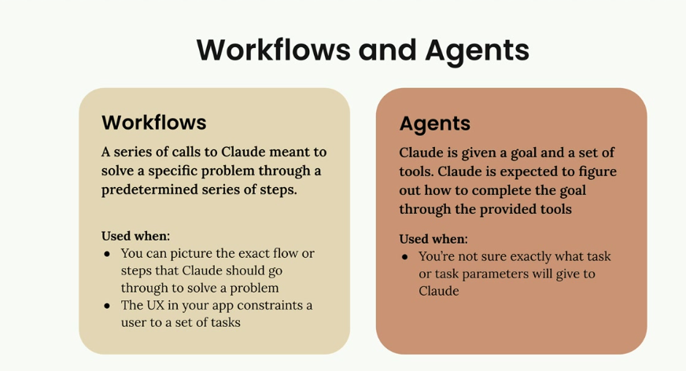

| Criterio | Flujo de trabajo | Agente |
| --- | --- | --- |
| Comprensión del problema | Sabes exactamente los pasos necesarios | No sabes qué pasos ni qué parámetros se necesitarán |
| Control del flujo | Lo define el desarrollador en código | Lo decide Claude en tiempo de ejecución |
| Predictibilidad | Alta — mismos pasos siempre | Variable — Claude adapta su plan a cada caso |
| Casos de uso típicos | Pipelines bien definidos, apps con UX acotada | Asistentes generales, tareas abiertas |
| Riesgo de errores | Bajo — el flujo es determinístico | Mayor — Claude puede tomar caminos inesperados |

**Regla práctica:**

- Si podés escribir el flujo en un diagrama antes de codificarlo → usá un **workflow**.
- Si no podés anticipar qué tarea exacta recibirá Claude → usá un **agente**.

---

#### 56.3 Ejemplo de flujo de trabajo: Imagen a CAD

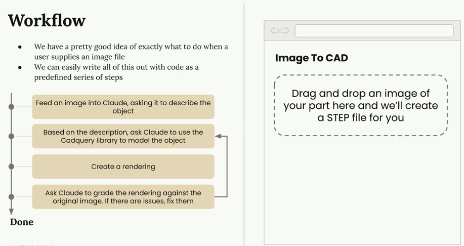

Este ejemplo ilustra cuándo un workflow es la elección correcta. El usuario sube la foto de una pieza metálica y la aplicación devuelve un archivo STEP (modelo 3D industrial).

**Pasos del flujo definidos de antemano:**

```text
1. Usuario sube imagen de la pieza
        ↓
2. Claude describe el objeto (forma, dimensiones estimadas, geometría)
        ↓
3. Claude genera código CadQuery para modelar el objeto en 3D
        ↓
4. Se renderiza el modelo y se genera una imagen del resultado
        ↓
5. Claude compara el renderizado con la imagen original
        ↓
   ¿Son equivalentes?
   → Sí → Se exporta el archivo STEP al usuario
   → No → Claude corrige el código CadQuery y vuelve al paso 4
```

Este caso es un **workflow** porque:

- El desarrollador sabe exactamente qué hacer con cada imagen.
- La UX limita al usuario a una sola tarea: subir una imagen de pieza metálica.
- Los pasos son predefinidos y predecibles.

---

#### 56.4 El patrón Evaluador-Optimizador

El flujo de imagen a CAD implementa un patrón clásico de workflows llamado **Evaluador-Optimizador**. Es una de las recetas más reutilizables en el diseño de sistemas con LLMs.

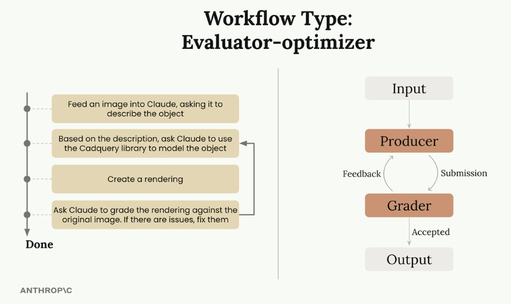

**Componentes del patrón:**

| Rol | Qué hace | En el ejemplo |
| --- | --- | --- |
| **Productor** | Recibe el input y genera un resultado | Claude genera código CadQuery a partir de la descripción |
| **Evaluador** | Juzga si el resultado cumple los criterios | Claude compara el renderizado con la imagen original |
| **Bucle de retroalimentación** | Si falla, le envía feedback al productor | Claude recibe la comparación y corrige el código |
| **Condición de salida** | El ciclo termina cuando el evaluador aprueba | El renderizado es suficientemente fiel a la imagen |

**Implementación esquemática en Python:**

```python
import anthropic

client = anthropic.Anthropic()

def producir(imagen_base64: str, feedback: str = "") -> str:
    """Genera código CadQuery a partir de la imagen (o lo corrige con feedback)."""
    prompt = f"""
    Analizá esta imagen de una pieza metálica y generá código Python con CadQuery
    para modelarla en 3D.
    {"Feedback del evaluador: " + feedback if feedback else ""}
    Devolvé solo el código Python, sin explicaciones.
    """
    response = client.messages.create(
        model="claude-opus-4-7",
        max_tokens=2048,
        messages=[{
            "role": "user",
            "content": [
                {"type": "image", "source": {"type": "base64", "media_type": "image/png", "data": imagen_base64}},
                {"type": "text", "text": prompt}
            ]
        }]
    )
    return response.content[0].text

def evaluar(imagen_original_base64: str, renderizado_base64: str) -> tuple[bool, str]:
    """Compara el renderizado con la imagen original. Devuelve (aprobado, feedback)."""
    response = client.messages.create(
        model="claude-opus-4-7",
        max_tokens=512,
        messages=[{
            "role": "user",
            "content": [
                {"type": "text", "text": "Imagen original:"},
                {"type": "image", "source": {"type": "base64", "media_type": "image/png", "data": imagen_original_base64}},
                {"type": "text", "text": "Renderizado del modelo 3D:"},
                {"type": "image", "source": {"type": "base64", "media_type": "image/png", "data": renderizado_base64}},
                {"type": "text", "text": "¿El renderizado representa fielmente la pieza? Respondé APROBADO o RECHAZADO y explicá las diferencias."}
            ]
        }]
    )
    texto = response.content[0].text
    aprobado = "APROBADO" in texto.upper()
    return aprobado, texto

def workflow_imagen_a_cad(imagen_base64: str, max_iteraciones: int = 3) -> str:
    """Orquesta el ciclo productor → evaluador hasta que el resultado sea aceptado."""
    feedback = ""

    for iteracion in range(1, max_iteraciones + 1):
        print(f"Iteración {iteracion}: generando modelo...")
        codigo_cad = producir(imagen_base64, feedback)

        # Aquí iría la lógica de renderizado real con CadQuery
        renderizado_base64 = renderizar_modelo(codigo_cad)  # función externa

        aprobado, feedback = evaluar(imagen_base64, renderizado_base64)
        if aprobado:
            print(f"Modelo aprobado en la iteración {iteracion}.")
            return exportar_step(codigo_cad)  # función externa

    raise RuntimeError("No se logró un modelo aceptable en el límite de iteraciones.")
```

| Parámetro | Descripción |
| --- | --- |
| `max_iteraciones` | Límite de ciclos para evitar bucles infinitos |
| `feedback` | Texto del evaluador que guía la corrección del productor |
| `aprobado` | Booleano que controla si el ciclo continúa o termina |

---

#### 56.5 ¿Por qué aprender patrones de flujo de trabajo?

Los patrones de workflow son **recetas reutilizables** — no hacen el trabajo por vos, pero dan una estructura probada sobre la cual construir. El patrón Evaluador-Optimizador es especialmente valioso porque:

- Modela el proceso natural de revisión y corrección que haría un humano.
- Permite que Claude mejore su propio output de forma iterativa.
- Es agnóstico al dominio — funciona para código, texto, imágenes, diseño, etc.

| Patrón | Cuándo usarlo |
| --- | --- |
| **Evaluador-Optimizador** | El output es verificable y mejora con feedback (código, diseño, texto estructurado) |
| **Pipeline secuencial** | Cada paso transforma el resultado del anterior sin verificación intermedia |
| **Fan-out / Fan-in** | Varias subtareas independientes que luego se combinan |
| **Agente con herramientas** | El flujo no es predecible y Claude debe decidir qué hacer en cada paso |

---

### Módulo 57: Flujos de Trabajo de Paralelización

#### 57.1 El problema del prompt único complejo

Cuando Claude recibe una sola solicitud con múltiples criterios de evaluación simultáneos, enfrenta una carga cognitiva alta que degrada la calidad del resultado. Por ejemplo, pedir en un solo mensaje que evalúe una imagen para seis tipos de material distintos obliga al modelo a equilibrar criterios contrapuestos en paralelo internamente, lo que genera análisis superficiales y menor consistencia.

El problema se agrava si se agregan criterios detallados al mismo prompt: más información no siempre produce mejores resultados — puede generar confusión entre los criterios y reducir la precisión de cada evaluación individual.

---

#### 57.2 La solución: paralelización

El patrón de **paralelización** divide una tarea compleja en múltiples subtareas independientes que se envían a Claude simultáneamente. Cada subtarea se focaliza en un único aspecto del problema con criterios especializados. Los resultados individuales se agregan luego en un paso final de síntesis.

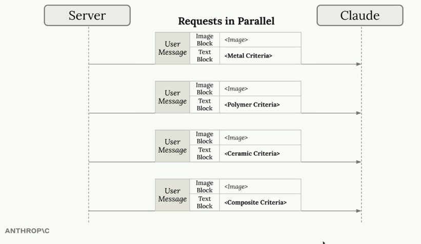

**Estructura del patrón:**

```text
Input
  ├─→ Solicitud especializada A (criterios para metal)     ┐
  ├─→ Solicitud especializada B (criterios para polímero)  │→ Agregador → Decisión final
  ├─→ Solicitud especializada C (criterios para cerámica)  │
  └─→ Solicitud especializada D (criterios para madera)    ┘
```

Las subtareas paralelas **no tienen que ser idénticas**: cada una puede tener su propio prompt, herramientas o criterios de evaluación. Lo que las une es que se ejecutan de forma independiente y sus resultados se combinan al final.


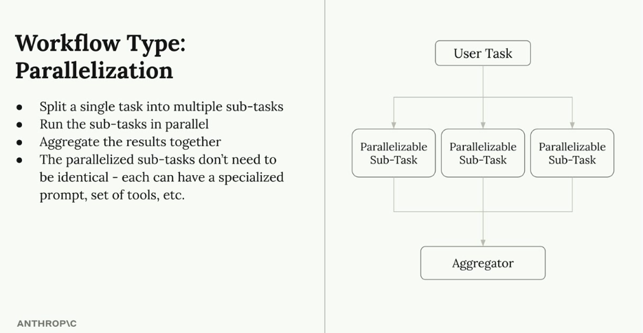

---

#### 57.3 Implementación en Python con `asyncio`

```python
import asyncio
import anthropic
import base64

client = anthropic.Anthropic()

# Criterios especializados por tipo de material
CRITERIOS_MATERIAL = {
    "metal": "Evaluá si esta pieza es apta para fabricarse en metal. Considerá: resistencia mecánica, conductividad, soldabilidad, resistencia a la corrosión y capacidad de maquinado.",
    "polímero": "Evaluá si esta pieza es apta para fabricarse en polímero. Considerá: flexibilidad requerida, resistencia química, temperatura de operación, costo y facilidad de moldeo.",
    "cerámica": "Evaluá si esta pieza es apta para fabricarse en cerámica. Considerá: resistencia térmica, dureza, fragilidad, aislamiento eléctrico y precisión dimensional requerida.",
    "compuesto": "Evaluá si esta pieza es apta para fabricarse en material compuesto. Considerá: relación resistencia/peso, anisotropía, costo de fabricación y geometría de la pieza.",
    "elastómero": "Evaluá si esta pieza es apta para fabricarse en elastómero. Considerá: deformación reversible requerida, sellado, amortiguación y rango de temperatura.",
    "madera": "Evaluá si esta pieza es apta para fabricarse en madera. Considerá: cargas estructurales, humedad del entorno, acabado superficial y carácter estético o funcional.",
}

def evaluar_material(imagen_base64: str, material: str, criterios: str) -> dict:
    """Envía una solicitud especializada para un único tipo de material."""
    response = client.messages.create(
        model="claude-opus-4-7",
        max_tokens=512,
        messages=[{
            "role": "user",
            "content": [
                {"type": "image", "source": {"type": "base64", "media_type": "image/png", "data": imagen_base64}},
                {"type": "text", "text": f"{criterios}\nDa una puntuación del 1 al 10 y una justificación breve."}
            ]
        }]
    )
    return {"material": material, "analisis": response.content[0].text}

async def evaluar_en_paralelo(imagen_base64: str) -> list[dict]:
    """Ejecuta todas las evaluaciones de material simultáneamente."""
    loop = asyncio.get_event_loop()
    tareas = [
        loop.run_in_executor(None, evaluar_material, imagen_base64, material, criterios)
        for material, criterios in CRITERIOS_MATERIAL.items()
    ]
    return await asyncio.gather(*tareas)

def agregar_resultados(imagen_base64: str, analisis: list[dict]) -> str:
    """Paso final: Claude recibe todos los análisis y emite una recomendación."""
    resumen = "\n\n".join(
        f"**{r['material'].upper()}**:\n{r['analisis']}" for r in analisis
    )
    response = client.messages.create(
        model="claude-opus-4-7",
        max_tokens=1024,
        messages=[{
            "role": "user",
            "content": [
                {"type": "image", "source": {"type": "base64", "media_type": "image/png", "data": imagen_base64}},
                {"type": "text", "text": f"Estos son los análisis individuales por material:\n\n{resumen}\n\nCompará los resultados y recomendá el material más adecuado para esta pieza, justificando tu elección."}
            ]
        }]
    )
    return response.content[0].text

async def workflow_seleccion_material(ruta_imagen: str) -> str:
    """Orquesta el workflow completo: paralelización + agregación."""
    with open(ruta_imagen, "rb") as f:
        imagen_base64 = base64.b64encode(f.read()).decode()

    print("Evaluando materiales en paralelo...")
    analisis = await evaluar_en_paralelo(imagen_base64)

    print("Agregando resultados...")
    recomendacion = agregar_resultados(imagen_base64, analisis)
    return recomendacion

# Uso
resultado = asyncio.run(workflow_seleccion_material("pieza.png"))
print(resultado)
```

| Función | Rol en el patrón | Nota |
| --- | --- | --- |
| `evaluar_material` | Subtarea paralela | Una llamada por material, con criterios especializados |
| `evaluar_en_paralelo` | Fan-out | `asyncio.gather` ejecuta todas las solicitudes simultáneamente |
| `agregar_resultados` | Fan-in / Agregador | Recibe todos los análisis y genera la decisión final |
| `workflow_seleccion_material` | Orquestador | Coordina el flujo completo de principio a fin |

- Divide una sola tarea en múltiples subtareas : desglosa la decisión compleja en evaluaciones especializadas y enfocadas.
- Ejecutar las subtareas en paralelo : ejecutar todas las evaluaciones simultáneamente para un procesamiento más rápido.
- Agrupar los resultados : combinar los análisis especializados en una decisión final.
- Las subtareas paralelas no tienen por qué ser idénticas ; cada una puede tener una indicación especializada, un conjunto de herramientas o criterios de evaluación.


---


#### 57.4 Beneficios del patrón de paralelización

| Beneficio | Por qué ocurre |
| --- | --- |
| **Atención focalizada** | Cada llamada evalúa un único aspecto; Claude no equilibra criterios contrapuestos en simultáneo |
| **Optimización independiente** | Podés ajustar el prompt de metales sin tocar el de polímeros |
| **Escalabilidad** | Agregar un nuevo material = agregar una entrada al diccionario de criterios |
| **Mayor fiabilidad** | Subtareas más pequeñas → menor complejidad por llamada → resultados más consistentes |
| **Velocidad** | Las solicitudes corren en paralelo, no en secuencia; el tiempo total ≈ el de la solicitud más lenta |

---

#### 57.5 Cuándo usar paralelización

Este patrón es adecuado cuando la tarea cumple estas condiciones:

- La decisión puede descomponerse en **evaluaciones independientes entre sí**.
- Cada subtarea tiene **criterios o perspectivas propias** que no dependen del resultado de las otras.
- El costo de múltiples llamadas se justifica por la ganancia en precisión o mantenibilidad.
- La tarea crece agregando nuevas categorías (materiales, idiomas, categorías de riesgo, etc.).

> No usar si las subtareas dependen unas de otras — en ese caso, un pipeline secuencial es más apropiado.

---

### Módulo 58: Encadenamiento de Flujos de Trabajo

#### 58.1 ¿Qué es el encadenamiento de workflows?

El **encadenamiento** (chaining) divide una tarea grande y compleja en subtareas **secuenciales** — donde cada paso puede usar el output del anterior como input. A diferencia de la paralelización (donde las subtareas son independientes), en el encadenamiento el orden importa: el paso 2 no puede empezar hasta que el paso 1 termine.

La diferencia clave respecto a un prompt único es que cada llamada a Claude recibe una sola responsabilidad bien delimitada, lo que reduce la carga cognitiva del modelo y mejora la consistencia del resultado.

---

#### 58.2 Cuándo encadenar en lugar de un prompt único

| Situación | Por qué el encadenamiento ayuda |
| --- | --- |
| Tarea con muchas restricciones simultáneas | Claude puede ignorar algunas restricciones cuando hay demasiadas en un solo prompt |
| Pasos que dependen del resultado anterior | El output de cada paso es el input del siguiente |
| Procesamiento no-LLM entre pasos | Podés insertar código, APIs, validaciones o transformaciones entre llamadas |
| Dificultad para depurar el resultado final | El encadenamiento permite inspeccionar y corregir cada paso por separado |
| Tarea demasiado larga para un solo contexto | Dividir reduce el riesgo de que Claude pierda el hilo en prompts muy extensos |

---

#### 58.3 Ejemplo 1: Herramienta de marketing en redes sociales

Este caso combina llamadas a Claude con pasos de código y APIs externas — el flujo completo no podría estar en un solo prompt.

```text
1. [API Twitter]  → Obtener temas en tendencia relacionados al nicho
        ↓
2. [Claude]       → Seleccionar el tema más interesante y relevante
        ↓
3. [Claude]       → Investigar el tema y resumir los puntos clave
        ↓
4. [Claude]       → Escribir el guion para un video de formato corto
        ↓
5. [API externa]  → Generar el video con avatar IA + text-to-speech
        ↓
6. [API redes]    → Publicar el video en las plataformas
```

Los pasos 2, 3 y 4 son llamadas a Claude. Los pasos 1, 5 y 6 son código o APIs externas. El encadenamiento permite mezclar ambos sin restricciones.

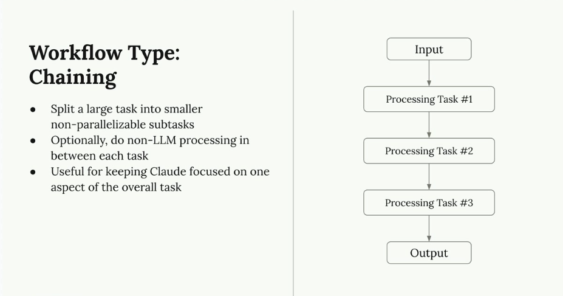
---

#### 58.4 Ejemplo 2: Corrección de restricciones en artículos técnicos

Este es el caso más frecuente del patrón: Claude produce un primer borrador aceptable, pero viola algunas restricciones. En lugar de complicar el prompt original, se agrega un segundo paso de revisión enfocado.

**Paso 1 — Generación:**

```python
import anthropic

client = anthropic.Anthropic()

def generar_articulo(tema: str) -> str:
    """Paso 1: genera un borrador sin preocuparse aún por todas las restricciones."""
    response = client.messages.create(
        model="claude-opus-4-7",
        max_tokens=2048,
        messages=[{
            "role": "user",
            "content": f"Escribí un artículo técnico de 500 palabras sobre: {tema}"
        }]
    )
    return response.content[0].text
```

**Paso 2 — Revisión con restricciones:**

```python
def revisar_articulo(articulo: str) -> str:
    """Paso 2: Claude revisa el borrador con foco exclusivo en el cumplimiento de reglas."""
    prompt_revision = f"""
    Revisá el artículo que se provee a continuación. Seguí estos pasos para reescribirlo:

    1. Identificá cualquier parte donde el texto se identifique como escrito por IA y eliminala.
    2. Encontrá y eliminá todos los emojis.
    3. Localizá cualquier lenguaje informal o cliché y reemplazalo por texto de tono profesional y técnico.

    Artículo a revisar:
    {articulo}

    Devolvé únicamente el artículo revisado, sin comentarios adicionales.
    """
    response = client.messages.create(
        model="claude-opus-4-7",
        max_tokens=2048,
        messages=[{
            "role": "user",
            "content": prompt_revision
        }]
    )
    return response.content[0].text

def workflow_articulo_tecnico(tema: str) -> str:
    """Orquesta los dos pasos del workflow encadenado."""
    print("Paso 1: generando borrador...")
    borrador = generar_articulo(tema)

    print("Paso 2: revisando restricciones...")
    articulo_final = revisar_articulo(borrador)

    return articulo_final

# Uso
resultado = workflow_articulo_tecnico("arquitecturas de microservicios con Kubernetes")
print(resultado)
```

| Función | Paso | Responsabilidad única |
| --- | --- | --- |
| `generar_articulo` | 1 | Producir contenido de calidad sobre el tema |
| `revisar_articulo` | 2 | Detectar y corregir violaciones a las restricciones |
| `workflow_articulo_tecnico` | Orquestador | Pasar el output del paso 1 como input del paso 2 |

---

#### 58.5 Extensión: encadenamiento con validación intermedia

En algunas variantes del patrón, se agrega un paso de validación entre la generación y la revisión para decidir si la revisión es necesaria o no, ahorrando llamadas innecesarias.

```python
def validar_restricciones(articulo: str) -> tuple[bool, list[str]]:
    """Verifica qué restricciones se incumplieron antes de revisar."""
    response = client.messages.create(
        model="claude-haiku-4-5-20251001",  # Haiku es suficiente para una tarea de clasificación
        max_tokens=256,
        messages=[{
            "role": "user",
            "content": f"""
            Revisá si el siguiente artículo incumple alguna de estas reglas:
            1. Menciona que fue escrito por IA
            2. Contiene emojis
            3. Usa lenguaje informal o cliché

            Respondé con una lista de las reglas violadas (o "NINGUNA" si no hay problemas).

            Artículo:
            {articulo}
            """
        }]
    )
    texto = response.content[0].text
    hay_problemas = "NINGUNA" not in texto.upper()
    return hay_problemas, texto

def workflow_con_validacion(tema: str) -> str:
    """Workflow encadenado con paso de validación intermedio."""
    borrador = generar_articulo(tema)

    hay_problemas, problemas = validar_restricciones(borrador)
    if not hay_problemas:
        print("Borrador aprobado sin revisión.")
        return borrador

    print(f"Problemas detectados:\n{problemas}\nIniciando revisión...")
    return revisar_articulo(borrador)
```

> Al usar Haiku para la validación y Opus para la generación/revisión, se optimiza el costo: la tarea de clasificación no necesita el modelo más potente.

---

#### 58.6 Paralelización vs Encadenamiento — Cuándo usar cada uno

| Criterio | Paralelización | Encadenamiento |
| --- | --- | --- |
| Dependencia entre subtareas | No — cada subtarea es independiente | Sí — cada paso usa el output del anterior |
| Velocidad | Más rápido (corren en paralelo) | Más lento (corren en secuencia) |
| Caso de uso típico | Evaluar múltiples opciones al mismo tiempo | Refinar un resultado en múltiples pasadas |
| Inserción de código entre pasos | Posible en el agregador | Posible entre cualquier par de pasos |
| Ejemplo | Evaluar 6 materiales simultáneamente | Generar artículo → validar → revisar |

---

### Módulo 59: Flujos de Trabajo de Enrutamiento

#### 59.1 El problema de los prompts genéricos

Muchas aplicaciones reciben solicitudes de naturaleza muy diferente. Un prompt único que intenta cubrir todos los casos produce resultados mediocres porque no puede optimizarse para ninguno en particular.

**Ejemplo:** Una herramienta de guiones de video recibe el tema "programación" y el tema "surf". Ambos ameritan estilos completamente distintos:

| Tema | Estilo óptimo | Falla del prompt genérico |
| --- | --- | --- |
| Programación | Educativo: explicaciones claras, ejemplos, definiciones | Tono demasiado informal o sin estructura didáctica |
| Surf | Entretenimiento: emoción, visual, energía | Tono académico que no conecta con la audiencia |

La solución es un **workflow de enrutamiento**: antes de generar el contenido, Claude clasifica la solicitud y la dirige al pipeline especializado correspondiente.

---

#### 59.2 Arquitectura del patrón de enrutamiento

```text
Input del usuario
        ↓
   [Enrutador]  ← Claude clasifica la solicitud en una categoría
        ↓
   ¿Categoría?
   ├─ Educativo    → Pipeline educativo    → Output especializado
   ├─ Entretenimiento → Pipeline entret.  → Output especializado
   ├─ Comedia      → Pipeline comedia     → Output especializado
   ├─ Vlog         → Pipeline vlog        → Output especializado
   ├─ Reseña       → Pipeline reseña      → Output especializado
   └─ Narrativa    → Pipeline narrativa   → Output especializado
```

La solicitud del usuario pasa **únicamente por un canal**, no por todos. Eso permite optimizar cada pipeline de forma independiente.

El proceso de enrutamiento se realiza en dos pasos:

- Categorización : Envía el tema del usuario a Claude con una solicitud para que lo clasifique en uno de tus géneros predefinidos.
- Procesamiento especializado : utilice el resultado de la categoría para seleccionar la plantilla de solicitud adecuada y generar contenido.


---

#### 59.3 Definición de categorías y prompts especializados

```python
import anthropic

client = anthropic.Anthropic()

# Cada categoría tiene su propio prompt especializado
PROMPTS_CATEGORIA = {
    "educativo": (
        "Desarrollá un guion claro y atractivo que transforme información compleja "
        "en ideas comprensibles usando ejemplos cercanos y preguntas que inviten a la reflexión. "
        "Priorizá la precisión conceptual y la progresión lógica."
    ),
    "entretenimiento": (
        "Creá un guion dinámico y culturalmente relevante con lenguaje moderno. "
        "Enfatizá el atractivo visual, la energía y el ritmo. "
        "El espectador debe sentir emoción desde el primer segundo."
    ),
    "comedia": (
        "Escribí un guion ingenioso con observaciones inesperadas y un ritmo excelente. "
        "Usá humor situacional, subversión de expectativas y timing preciso."
    ),
    "vlog": (
        "Escribí un guion auténtico e íntimo con narración conversacional. "
        "El tono debe sentirse como una charla con un amigo, no como una presentación."
    ),
    "reseña": (
        "Escribí un guion decisivo basado en experiencia real. "
        "Destacá fortalezas y debilidades con criterio claro. El espectador debe poder tomar una decisión al terminar."
    ),
    "narrativa": (
        "Creá un guion inmersivo que use detalles vívidos y conexión emocional. "
        "Construí tensión, personajes y una resolución satisfactoria."
    ),
}

CATEGORIAS_VALIDAS = list(PROMPTS_CATEGORIA.keys())
```

| Categoría | Foco del prompt |
| --- | --- |
| `educativo` | Precisión, progresión lógica, ejemplos comprensibles |
| `entretenimiento` | Energía, atractivo visual, ritmo acelerado |
| `comedia` | Ingenio, subversión de expectativas, timing |
| `vlog` | Autenticidad, tono conversacional, cercanía |
| `reseña` | Criterio claro, fortalezas/debilidades, utilidad práctica |
| `narrativa` | Detalles vívidos, arco emocional, inmersión |

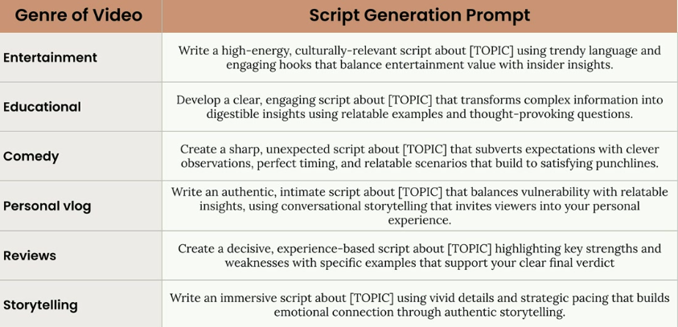

---

#### 59.4 Implementación completa del enrutador

```python
def enrutar(tema: str) -> str:
    """Paso 1: Claude clasifica el tema en una de las categorías predefinidas."""
    categorias_str = "\n".join(f"- {c}" for c in CATEGORIAS_VALIDAS)
    response = client.messages.create(
        model="claude-haiku-4-5-20251001",  # Haiku es suficiente para clasificación
        max_tokens=64,
        messages=[{
            "role": "user",
            "content": f"""Categorizá el siguiente tema de video en una de las categorías listadas.
Respondé únicamente con el nombre de la categoría, en minúsculas, sin explicaciones.

<topic>{tema}</topic>

<categories>
{categorias_str}
</categories>"""
        }]
    )
    categoria = response.content[0].text.strip().lower()

    # Validar que la categoría devuelta es una de las esperadas
    if categoria not in CATEGORIAS_VALIDAS:
        categoria = "educativo"  # fallback por defecto
    return categoria

def generar_guion(tema: str, categoria: str) -> str:
    """Paso 2: genera el guion usando el prompt especializado de la categoría."""
    prompt_especializado = PROMPTS_CATEGORIA[categoria]
    response = client.messages.create(
        model="claude-opus-4-7",
        max_tokens=1024,
        messages=[{
            "role": "user",
            "content": f"{prompt_especializado}\n\nTema del video: {tema}"
        }]
    )
    return response.content[0].text

def workflow_enrutamiento(tema: str) -> dict:
    """Orquesta el workflow completo: enrutamiento → generación especializada."""
    print(f"Enrutando tema: '{tema}'...")
    categoria = enrutar(tema)
    print(f"Categoría asignada: {categoria}")

    print("Generando guion especializado...")
    guion = generar_guion(tema, categoria)

    return {"tema": tema, "categoria": categoria, "guion": guion}

# Uso
resultado = workflow_enrutamiento("Funciones de Python")
print(f"Categoría: {resultado['categoria']}")
print(resultado['guion'])
```

| Función | Modelo usado | Por qué ese modelo |
| --- | --- | --- |
| `enrutar` | Haiku | Clasificar en categorías predefinidas es una tarea simple y repetitiva |
| `generar_guion` | Opus | La generación de contenido de calidad requiere el modelo más capaz |
| `workflow_enrutamiento` | — | Orquestador sin lógica de LLM propia |

> Separar el enrutador del generador también permite cambiar uno sin tocar el otro. Si los criterios de categorización cambian, solo se modifica `enrutar`; si se mejoran los prompts de contenido, solo se modifica `PROMPTS_CATEGORIA`.

---

#### 59.5 Variante: enrutamiento con confianza

En aplicaciones de producción es útil saber qué tan seguro está Claude de su categorización. Si la confianza es baja, se puede pedir confirmación al usuario o usar un canal genérico como fallback.

```python
def enrutar_con_confianza(tema: str) -> tuple[str, str]:
    """Clasifica el tema y devuelve también una justificación breve."""
    categorias_str = "\n".join(f"- {c}" for c in CATEGORIAS_VALIDAS)
    response = client.messages.create(
        model="claude-haiku-4-5-20251001",
        max_tokens=128,
        messages=[{
            "role": "user",
            "content": f"""Categorizá el siguiente tema en una de las categorías.
Respondé en formato: CATEGORIA | motivo en una línea

<topic>{tema}</topic>
<categories>
{categorias_str}
</categories>"""
        }]
    )
    partes = response.content[0].text.strip().split("|", 1)
    categoria = partes[0].strip().lower()
    motivo = partes[1].strip() if len(partes) > 1 else ""
    if categoria not in CATEGORIAS_VALIDAS:
        categoria = "educativo"
    return categoria, motivo
```

Flujo de trabajo del enrutamiento:
- La entrada del usuario se envía primero a un componente del enrutador.
- El enrutador clasifica la solicitud mediante una llamada Claude inicial.
- Según la categoría, la entrada se envía a una canalización de procesamiento específica.
- Cada canalización puede tener su propio flujo de trabajo, indicaciones o herramientas optimizadas para esa categoría.

La clave reside en que la información del usuario se procesa únicamente a través de un único canal especializado, no a través de todos. Esto permite optimizar cada canal para su caso de uso específico.

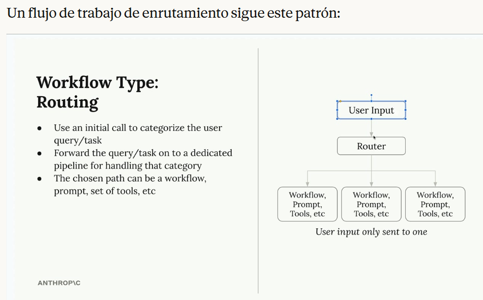


---

#### 59.6 Cuándo usar enrutamiento

| Condición | ¿Usar enrutamiento? |
| --- | --- |
| Las solicitudes tienen tipos claramente distintos | Sí |
| Las categorías se pueden definir con antelación | Sí |
| Un prompt genérico produce resultados inconsistentes | Sí |
| Todas las solicitudes son del mismo tipo | No — el enrutamiento agrega latencia innecesaria |
| Las categorías se superponen demasiado | No — el clasificador producirá errores frecuentes |

**Casos de uso típicos:** bots de atención al cliente (técnico / facturación / reclamos), herramientas de contenido (formal / informal / creativo), sistemas de moderación (spam / contenido sensible / legítimo).

---

### Módulo 60: Agentes y Herramientas

#### 60.1 La diferencia fundamental: agentes vs workflows

Los módulos anteriores cubrieron workflows — flujos donde el desarrollador define la secuencia exacta de pasos. Los agentes invierten esa responsabilidad: el desarrollador provee un objetivo y un conjunto de herramientas, y **Claude decide cómo combinarlas** para alcanzar el objetivo.

| Dimensión | Workflow | Agente |
| --- | --- | --- |
| Control del flujo | El desarrollador | Claude |
| Secuencia de pasos | Predefinida en código | Decidida en tiempo de ejecución |
| Flexibilidad ante lo inesperado | Baja — solo maneja los casos previstos | Alta — puede adaptarse a solicitudes nuevas |
| Fiabilidad | Alta — el comportamiento es predecible | Menor — Claude puede tomar caminos inesperados |
| Costo por tarea | Controlable | Variable — más pasos de razonamiento |
| Cuándo usarlo | Se conocen los pasos exactos | No se puede anticipar qué pasos serán necesarios |

> La flexibilidad de los agentes tiene un costo: mayor variabilidad en el comportamiento y en el gasto de tokens. No son superiores a los workflows — son la herramienta correcta para el problema correcto.

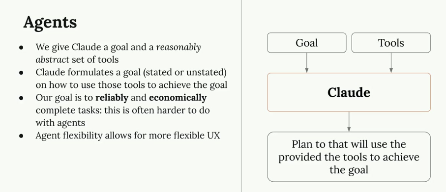
---

#### 60.2 Cómo las herramientas le dan poder al agente

El valor de un agente no está en las herramientas individuales sino en su **capacidad de combinarlas**. Con un conjunto pequeño de herramientas de fecha y hora, Claude puede resolver solicitudes de complejidad muy distinta:

| Solicitud del usuario | Herramientas que Claude encadena |
| --- | --- |
| "¿Qué hora es?" | `get_current_datetime` |
| "¿Qué día es dentro de 11 días?" | `get_current_datetime` → `add_duration_to_datetime` |
| "Recordatorio para el gimnasio el próximo miércoles" | `get_current_datetime` → `add_duration_to_datetime` → `set_reminder` |
| "¿Cuándo vence mi garantía de 90 días?" | Pide más info al usuario → `get_current_datetime` → `add_duration_to_datetime` |

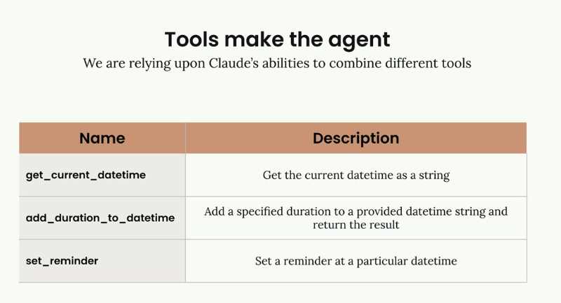

Claude también reconoce cuándo **le falta información** para completar una tarea y la solicita antes de llamar herramientas — comportamiento emergente que no fue programado explícitamente.

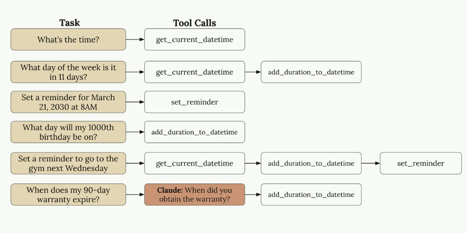
---

#### 60.3 Implementación básica de un agente con herramientas

```python
import anthropic
from datetime import datetime, timedelta

client = anthropic.Anthropic()

# Definición de las herramientas (schemas que Claude puede invocar)
HERRAMIENTAS = [
    {
        "name": "get_current_datetime",
        "description": "Obtiene la fecha y hora actuales del sistema.",
        "input_schema": {"type": "object", "properties": {}, "required": []}
    },
    {
        "name": "add_duration_to_datetime",
        "description": "Suma una cantidad de días a una fecha dada y devuelve la nueva fecha.",
        "input_schema": {
            "type": "object",
            "properties": {
                "fecha_iso": {"type": "string", "description": "Fecha base en formato ISO 8601 (YYYY-MM-DDTHH:MM:SS)"},
                "dias": {"type": "integer", "description": "Número de días a agregar (puede ser negativo)"}
            },
            "required": ["fecha_iso", "dias"]
        }
    },
    {
        "name": "set_reminder",
        "description": "Crea un recordatorio para una fecha y hora específicas.",
        "input_schema": {
            "type": "object",
            "properties": {
                "mensaje": {"type": "string", "description": "Texto del recordatorio"},
                "fecha_iso": {"type": "string", "description": "Fecha y hora del recordatorio en formato ISO 8601"}
            },
            "required": ["mensaje", "fecha_iso"]
        }
    }
]

def ejecutar_herramienta(nombre: str, params: dict) -> str:
    """Despacha la llamada a la función real según el nombre de la herramienta."""
    if nombre == "get_current_datetime":
        return datetime.now().isoformat()

    if nombre == "add_duration_to_datetime":
        base = datetime.fromisoformat(params["fecha_iso"])
        resultado = base + timedelta(days=params["dias"])
        return resultado.isoformat()

    if nombre == "set_reminder":
        # En producción esto llamaría a una API real de recordatorios
        return f"Recordatorio creado: '{params['mensaje']}' para {params['fecha_iso']}"

    return f"Herramienta desconocida: {nombre}"

def ejecutar_agente(solicitud_usuario: str) -> str:
    """
    Bucle agente: Claude razona, llama herramientas, observa resultados,
    y continúa hasta producir una respuesta final.
    """
    mensajes = [{"role": "user", "content": solicitud_usuario}]

    while True:
        response = client.messages.create(
            model="claude-opus-4-7",
            max_tokens=1024,
            tools=HERRAMIENTAS,
            messages=mensajes
        )

        # Si Claude terminó de razonar, devolver la respuesta final
        if response.stop_reason == "end_turn":
            return response.content[0].text

        # Si Claude quiere usar herramientas, ejecutarlas y continuar el bucle
        if response.stop_reason == "tool_use":
            # Agregar la respuesta de Claude (con sus tool_use blocks) al historial
            mensajes.append({"role": "assistant", "content": response.content})

            # Ejecutar todas las herramientas solicitadas
            resultados_herramientas = []
            for bloque in response.content:
                if bloque.type == "tool_use":
                    resultado = ejecutar_herramienta(bloque.name, bloque.input)
                    resultados_herramientas.append({
                        "type": "tool_result",
                        "tool_use_id": bloque.id,
                        "content": resultado
                    })

            # Devolver los resultados al agente para que continúe
            mensajes.append({"role": "user", "content": resultados_herramientas})

# Uso
print(ejecutar_agente("¿Qué día de la semana es dentro de 11 días?"))
print(ejecutar_agente("Poné un recordatorio para el gimnasio el próximo miércoles"))
```

| Componente | Descripción |
| --- | --- |
| `HERRAMIENTAS` | Schemas que describen a Claude qué puede invocar y con qué parámetros |
| `ejecutar_herramienta` | Despacha la herramienta real; Claude solo ve el nombre y el resultado |
| `ejecutar_agente` | Bucle `while True` que alterna entre razonamiento de Claude y ejecución de herramientas |
| `stop_reason == "end_turn"` | Señal de que Claude terminó y su respuesta final está lista |
| `stop_reason == "tool_use"` | Señal de que Claude quiere invocar una o más herramientas antes de continuar |

---

#### 60.4 Principio de diseño: herramientas abstractas, no hiperespecializadas

La clave para crear agentes robustos es proveer herramientas **genéricas y componibles**, no funciones para cada caso de uso posible.

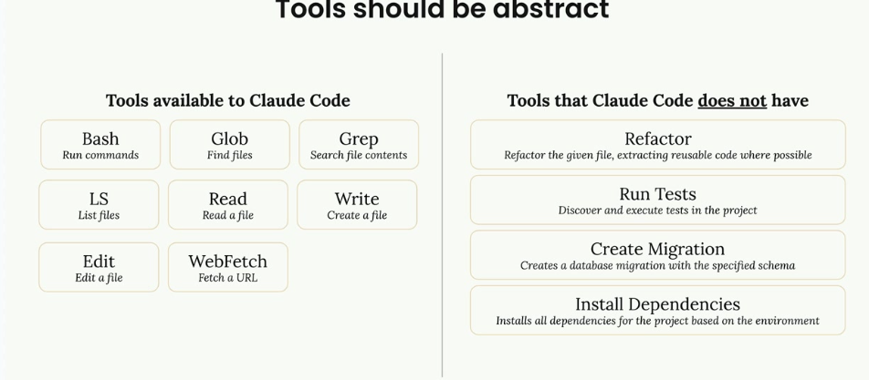

**Contraejemplo — herramientas demasiado específicas:**

```text
refactorizar_codigo()
instalar_dependencias()
crear_pull_request()
```

Cada función cubre un caso exacto. Si surge un caso no previsto, el agente no tiene con qué trabajar.

**Ejemplo correcto — herramientas abstractas (como Claude Code):**

```text
bash()     → ejecuta cualquier comando de terminal
read()     → lee cualquier archivo
write()    → crea cualquier archivo
edit()     → modifica archivos
glob()     → busca archivos por patrón
grep()     → busca contenido dentro de archivos
```

Con estas seis herramientas, Claude puede refactorizar código, instalar dependencias, crear pull requests, depurar errores y mucho más — sin que ninguno de esos casos haya sido programado explícitamente.

| Criterio | Herramientas abstractas | Herramientas hiperespecializadas |
| --- | --- | --- |
| Cobertura de casos | Amplia — Claude improvisa combinaciones | Estrecha — solo los casos previstos |
| Mantenimiento | Bajo — pocas herramientas estables | Alto — hay que agregar una por cada caso nuevo |
| Comportamiento emergente | Posible — Claude descubre usos nuevos | Imposible — solo hace lo que fue programado |
| Riesgo de mal uso | Mayor — más superficie de acción | Menor — las acciones están acotadas |

---

#### 60.5 Ejemplo: agente de video para redes sociales

Un conjunto de herramientas abstractas permite al agente adaptarse dinámicamente según las preferencias del usuario durante la sesión.

```python
HERRAMIENTAS_VIDEO = [
    {
        "name": "bash",
        "description": "Ejecuta un comando de terminal. Permite usar ffmpeg para procesamiento de video.",
        "input_schema": {
            "type": "object",
            "properties": {"comando": {"type": "string"}},
            "required": ["comando"]
        }
    },
    {
        "name": "generate_image",
        "description": "Genera una imagen a partir de una descripción textual.",
        "input_schema": {
            "type": "object",
            "properties": {"descripcion": {"type": "string"}},
            "required": ["descripcion"]
        }
    },
    {
        "name": "text_to_speech",
        "description": "Convierte texto a un archivo de audio.",
        "input_schema": {
            "type": "object",
            "properties": {
                "texto": {"type": "string"},
                "voz": {"type": "string", "description": "Estilo de voz (neutral, energético, suave)"}
            },
            "required": ["texto"]
        }
    },
    {
        "name": "post_media",
        "description": "Sube contenido multimedia a una plataforma de redes sociales.",
        "input_schema": {
            "type": "object",
            "properties": {
                "archivo": {"type": "string"},
                "plataforma": {"type": "string"},
                "descripcion": {"type": "string"}
            },
            "required": ["archivo", "plataforma"]
        }
    }
]
```

Con este conjunto, Claude puede manejar flujos simples ("creá y publicá el video") o flujos interactivos ("generá primero una imagen de muestra para que el usuario la apruebe antes de crear el video completo") — sin que el desarrollador haya programado explícitamente cada variante.

---

#### 60.6 Cuándo usar agentes y cuándo no

| Usar agente | Usar workflow |
| --- | --- |
| Las solicitudes varían mucho y no son predecibles | Los pasos son siempre los mismos |
| Se quiere flexibilidad a costa de algo de variabilidad | Se necesita comportamiento determinístico |
| El conjunto de herramientas es abstracto y combinable | Los pasos son demasiado específicos para generalizarse |
| Se acepta el costo variable de múltiples llamadas | El costo por solicitud debe ser controlado |

---

### Módulo 61: Inspección Ambiental

#### 61.1 El problema: Claude opera a ciegas por defecto

Cuando un agente ejecuta una acción — escribir en un archivo, llamar una API, ejecutar un comando — no sabe automáticamente si funcionó ni cómo quedó el entorno después. Sin mecanismos de observación, Claude actúa como un ejecutor ciego de órdenes: invoca herramientas pero no puede verificar sus efectos.

La **inspección ambiental** es el principio que resuelve esto: darle a Claude la capacidad de **observar el estado del entorno antes y después de cada acción**, para que pueda razonar sobre lo que ocurrió y adaptar su siguiente paso.

> Claude Code ilustra este principio: después de cada acción (click, escritura, etc.) recibe automáticamente una captura de pantalla. Sin esa captura, no podría saber si navegó a una página nueva, si se abrió un menú o si la acción falló silenciosamente.

---

#### 61.2 El patrón: observar → actuar → observar

La inspección ambiental convierte el bucle agente básico (razonar → actuar) en un bucle de tres fases:

```text
[Observar estado inicial]
        ↓
[Razonar sobre qué hacer]
        ↓
[Actuar con una herramienta]
        ↓
[Observar resultado de la acción]
        ↓
   ¿El resultado es el esperado?
   → Sí → continuar con el siguiente paso
   → No → corregir y reintentar
```

| Fase | Qué hace Claude | Por qué es necesaria |
| --- | --- | --- |
| Observar antes | Lee el archivo, hace una captura, consulta la API | Entender el estado actual antes de actuar sobre él |
| Actuar | Modifica, crea, envía, ejecuta | Avanzar hacia el objetivo |
| Observar después | Vuelve a leer, extrae frames, compara outputs | Verificar que la acción tuvo el efecto esperado |

---

#### 61.3 Ejemplo concreto: leer antes de escribir

El patrón más común es **leer el contenido actual antes de modificarlo**. Si Claude escribe en un archivo sin leerlo primero, puede sobreescribir código existente o introducir conflictos.

```python
import anthropic

client = anthropic.Anthropic()

HERRAMIENTAS = [
    {
        "name": "read_file",
        "description": "Lee y devuelve el contenido completo de un archivo.",
        "input_schema": {
            "type": "object",
            "properties": {"ruta": {"type": "string", "description": "Ruta al archivo"}},
            "required": ["ruta"]
        }
    },
    {
        "name": "write_file",
        "description": "Escribe contenido en un archivo, sobreescribiendo su contenido actual.",
        "input_schema": {
            "type": "object",
            "properties": {
                "ruta": {"type": "string"},
                "contenido": {"type": "string"}
            },
            "required": ["ruta", "contenido"]
        }
    },
    {
        "name": "bash",
        "description": "Ejecuta un comando de terminal y devuelve stdout y stderr.",
        "input_schema": {
            "type": "object",
            "properties": {"comando": {"type": "string"}},
            "required": ["comando"]
        }
    }
]

SYSTEM_PROMPT = """Sos un agente de desarrollo de software.

Antes de modificar cualquier archivo, siempre seguí estos pasos:
1. Usá read_file para leer el contenido actual del archivo.
2. Analizá la estructura existente antes de hacer cambios.
3. Después de escribir el archivo, usá bash para ejecutar los tests o importar el módulo
   y verificar que no se rompió nada.

Nunca modifiques un archivo sin leerlo primero."""

def ejecutar_herramienta(nombre: str, params: dict) -> str:
    if nombre == "read_file":
        try:
            with open(params["ruta"], "r", encoding="utf-8") as f:
                return f.read()
        except FileNotFoundError:
            return f"ERROR: archivo '{params['ruta']}' no encontrado"

    if nombre == "write_file":
        with open(params["ruta"], "w", encoding="utf-8") as f:
            f.write(params["contenido"])
        return f"Archivo '{params['ruta']}' escrito correctamente."

    if nombre == "bash":
        import subprocess
        result = subprocess.run(params["comando"], shell=True, capture_output=True, text=True)
        return result.stdout + result.stderr

    return f"Herramienta desconocida: {nombre}"

def ejecutar_agente(solicitud: str) -> str:
    mensajes = [{"role": "user", "content": solicitud}]

    while True:
        response = client.messages.create(
            model="claude-opus-4-7",
            max_tokens=2048,
            system=SYSTEM_PROMPT,   # instruye a Claude a inspeccionar antes y después
            tools=HERRAMIENTAS,
            messages=mensajes
        )

        if response.stop_reason == "end_turn":
            return next(b.text for b in response.content if hasattr(b, "text"))

        if response.stop_reason == "tool_use":
            mensajes.append({"role": "assistant", "content": response.content})
            resultados = []
            for bloque in response.content:
                if bloque.type == "tool_use":
                    resultado = ejecutar_herramienta(bloque.name, bloque.input)
                    resultados.append({
                        "type": "tool_result",
                        "tool_use_id": bloque.id,
                        "content": resultado
                    })
            mensajes.append({"role": "user", "content": resultados})

# Uso: el agente leerá el archivo antes de modificarlo
ejecutar_agente("Agregá una ruta /health al archivo routes.py que devuelva {'status': 'ok'}")
```

| Instrucción en el system prompt | Efecto en el comportamiento del agente |
| --- | --- |
| "Antes de modificar cualquier archivo, siempre usá `read_file`" | Claude no escribe sin leer primero |
| "Después de escribir, usá bash para ejecutar los tests" | Claude verifica que el cambio no rompió nada |
| "Nunca modifiques un archivo sin leerlo primero" | Refuerzo explícito de la regla como restricción dura |

---

#### 61.4 Inspección ambiental para generación de video

En tareas más complejas como la generación de video, la inspección requiere herramientas especializadas para observar el estado del artefacto producido.

```python
SYSTEM_PROMPT_VIDEO = """Sos un agente de producción de video.

Después de generar o modificar un video, siempre inspeccioná el resultado:

1. Ejecutá whisper.cpp con bash para generar subtítulos con timestamps y verificar
   que el diálogo de audio está correctamente ubicado en el tiempo.

2. Usá ffmpeg para extraer capturas de pantalla a intervalos regulares:
   bash("ffmpeg -i output.mp4 -vf fps=1 frames/frame_%04d.png")
   Luego inspeccioná visualmente los frames clave con read_file o revisalos.

3. Compará el contenido generado con los requisitos originales antes de considerar
   la tarea completa.

Si detectás discrepancias, corregí el video antes de responder al usuario."""
```

| Verificación | Herramienta | Qué detecta |
| --- | --- | --- |
| Timing del diálogo | `whisper.cpp` vía `bash` | Subtítulos desincronizados o silencios inesperados |
| Contenido visual | `ffmpeg` frame extraction | Elementos faltantes, glitches, transiciones incorrectas |
| Completitud | Comparación con requisitos | Partes del guion no incluidas o mal ordenadas |

---

#### 61.5 Beneficios de la inspección ambiental

| Beneficio | Mecanismo |
| --- | --- |
| **Seguimiento de progreso** | Claude puede calcular qué tan cerca está del objetivo observando el estado actual |
| **Detección de errores** | Los resultados inesperados se identifican antes de continuar |
| **Control de calidad** | La tarea no se considera completa hasta que la observación lo confirma |
| **Comportamiento adaptativo** | Claude ajusta su plan en función de lo que observa, no de lo que supone |

---

#### 61.6 Checklist de diseño: ¿puede Claude observar sus acciones?

Al diseñar un agente, para cada acción posible preguntarse:

- **Archivos:** ¿hay una herramienta `read_file` para leer antes y verificar después?
- **APIs:** ¿la herramienta devuelve la respuesta completa de la API, incluyendo errores?
- **UIs:** ¿hay una herramienta de captura de pantalla o de scraping de estado?
- **Código generado:** ¿hay una herramienta `bash` para ejecutar y observar el output?
- **Artefactos (video, imagen, audio):** ¿hay herramientas para extraer muestras verificables?

Si alguna acción no tiene mecanismo de observación, Claude operará a ciegas en esa parte del flujo.

---

### Módulo 62: Flujos de Trabajo vs Agentes — Decisión Arquitectónica

#### 62.1 Resumen comparativo

Este módulo cierra la unidad sintetizando los dos grandes enfoques arquitectónicos y ofreciendo criterios claros para elegir entre ellos.

| Dimensión | Workflow | Agente |
| --- | --- | --- |
| **Definición** | Serie predefinida de llamadas a Claude para resolver problemas conocidos | Claude recibe herramientas y elabora su propio plan para completar la tarea |
| **Control del flujo** | El desarrollador codifica la secuencia | Claude decide los pasos en tiempo de ejecución |
| **Precisión** | Alta — cada paso está enfocado en una subtarea específica | Menor — Claude puede tomar caminos subóptimos |
| **Tasa de éxito** | Alta — comportamiento predecible y testeable | Menor — el plan emergente puede fallar de formas no anticipadas |
| **Flexibilidad** | Baja — resuelve los tipos de tarea para los que fue diseñado | Alta — puede manejar solicitudes novedosas |
| **Testing y evaluación** | Fácil — se conoce cada paso exacto | Difícil — la secuencia de pasos es desconocida de antemano |
| **Planificación previa** | Alta — requiere diseñar el flujo completo | Baja — alcanza con definir herramientas y objetivo |
| **Costo por tarea** | Controlable — llamadas fijas y predecibles | Variable — más pasos de razonamiento implican más tokens |

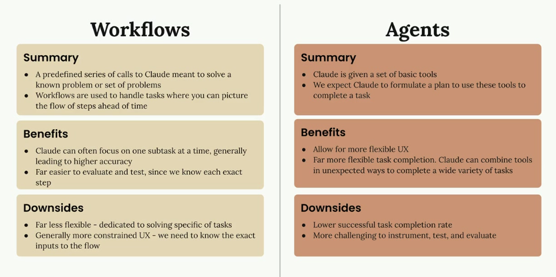
---

#### 62.2 Ventajas y desventajas detalladas

**Ventajas de los workflows:**

- Claude trabaja una subtarea a la vez → mayor precisión por paso
- Cada paso es inspectable y testeable de forma independiente
- El comportamiento es reproducible: misma entrada, misma secuencia
- Ideal para aplicaciones de producción donde la fiabilidad es crítica

**Desventajas de los workflows:**

- Solo resuelven los tipos de tarea para los que fueron diseñados
- La UX está limitada a las entradas que el flujo puede procesar
- Requieren más trabajo de diseño previo: hay que mapear el flujo completo antes de codificar

**Ventajas de los agentes:**

- La UX es más flexible: el usuario puede pedir cosas no anticipadas
- Claude combina herramientas de formas creativas para resolver problemas nuevos
- Puede pedir información adicional al usuario cuando la necesita
- Un solo agente puede reemplazar múltiples workflows especializados

**Desventajas de los agentes:**

- Menor tasa de finalización exitosa comparado con workflows equivalentes
- El camino que toma Claude es difícil de predecir, instrumentar y depurar
- El comportamiento puede variar entre ejecuciones con la misma entrada
- El costo en tokens es más alto y menos predecible

---

#### 62.3 Marco de decisión

```text
¿Puedo describir los pasos exactos que Claude debería seguir?
        │
       Sí → ¿Los pasos son siempre los mismos para este tipo de tarea?
              │
             Sí → WORKFLOW
              │
             No → ¿Hay categorías bien definidas de tareas?
                    │
                   Sí → WORKFLOW con ENRUTAMIENTO (módulo 59)
                    │
                   No → AGENTE
        │
       No → ¿Las subtareas son independientes entre sí?
              │
             Sí → WORKFLOW con PARALELIZACIÓN (módulo 57)
              │
             No → AGENTE con herramientas abstractas (módulo 60)
```

| Señal en el proyecto | Arquitectura recomendada |
| --- | --- |
| Proceso de negocio con pasos fijos | Workflow encadenado |
| Múltiples tipos de solicitud bien diferenciados | Workflow con enrutamiento |
| Evaluaciones independientes sobre el mismo input | Workflow con paralelización |
| Output que mejora iterativamente con feedback | Workflow evaluador-optimizador |
| Solicitudes variadas e impredecibles | Agente con herramientas abstractas |
| Mezcla de tareas predecibles e impredecibles | Workflow como camino principal + agente como fallback |

---

#### 62.4 La recomendación del curso: priorizar workflows

> "Los usuarios probablemente no les importe que hayas creado un agente sofisticado; lo que quieren es un producto que funcione de forma consistente."

La guía práctica del curso es:

1. **Intentar implementar un workflow primero.** Si podés mapear los pasos, usá un workflow.
2. **Recurrir a agentes solo cuando sea estrictamente necesario:** cuando los requisitos son tan variados que no se pueden anticipar los pasos.
3. **Combinar ambos:** un workflow como camino feliz y un agente como mecanismo de fallback para solicitudes fuera del flujo normal.

Esta recomendación no es dogmática — es una heurística de ingeniería. La complejidad de un agente se justifica cuando la flexibilidad que aporta supera el costo en fiabilidad y capacidad de depuración.

---

#### 62.5 Cuándo cada enfoque es correcto

| Usar **workflow** cuando... | Usar **agente** cuando... |
| --- | --- |
| El proceso de negocio está bien definido | Las solicitudes del usuario son impredecibles |
| La fiabilidad y la reproducibilidad son críticas | La flexibilidad es más valiosa que la consistencia |
| El equipo necesita poder testear y auditar cada paso | No se puede anticipar la secuencia de herramientas necesaria |
| El costo por solicitud debe ser predecible | Se acepta variabilidad en el costo y el comportamiento |
| Los usuarios siempre proveen los mismos tipos de input | Los usuarios pueden pedir cualquier cosa dentro de un dominio |

---

### Resumen de la Unidad 10: Agentes y Flujos de Trabajo

| Módulo | Tema | Concepto clave |
| --- | --- | --- |
| **56** | Agentes y Flujos de Trabajo | Workflows = pasos predefinidos por el desarrollador; Agentes = Claude decide el flujo; elegir según qué tan bien se comprende la tarea de antemano |
| **57** | Flujos de Trabajo de Paralelización | Dividir una tarea compleja en subtareas independientes (fan-out); ejecutar en paralelo; agregar resultados (fan-in); mejor foco y escalabilidad que un prompt único |
| **58** | Encadenamiento de Flujos de Trabajo | Dividir una tarea en pasos secuenciales donde cada output alimenta el siguiente input; ideal cuando Claude ignora restricciones en prompts largos o cuando hay procesamiento no-LLM entre pasos |
| **59** | Flujos de Trabajo de Enrutamiento | Clasificar la solicitud entrante con un enrutador (Claude/Haiku) y dirigirla al pipeline especializado correspondiente; evita prompts genéricos que producen resultados mediocres |
| **60** | Agentes y Herramientas | Agente = objetivo + herramientas abstractas; Claude decide cómo combinarlas; las herramientas deben ser genéricas y componibles para maximizar el comportamiento emergente; el bucle agente alterna razonamiento y ejecución de herramientas |
| **61** | Inspección Ambiental | Claude opera a ciegas sin mecanismos de observación; el patrón observar→actuar→observar convierte acciones ciegas en acciones verificables; el system prompt debe instruir explícitamente cuándo y cómo inspeccionar |
| **62** | Flujos de Trabajo vs Agentes | Priorizar workflows por su fiabilidad y capacidad de testing; recurrir a agentes solo cuando la variabilidad de las solicitudes lo exige; combinar ambos como camino feliz + fallback |

**Conclusión de la unidad:** La elección entre workflow y agente no es técnica sino de ingeniería de producto. Los workflows dan previsibilidad; los agentes dan flexibilidad. El objetivo final es siempre la fiabilidad del producto para el usuario — la arquitectura es el medio, no el fin. Dominar los patrones de esta unidad (paralelización, encadenamiento, enrutamiento, evaluador-optimizador, inspección ambiental) permite construir tanto workflows robustos como agentes efectivos, y combinarlos según lo que cada parte del sistema requiera.

---

## Resumen General del Curso

El curso cubre el ciclo completo de construir aplicaciones con Claude, desde la primera llamada a la API hasta sistemas agénticos complejos. Hay una progresión clara: cada unidad se apoya en la anterior.

---

### Mapa de unidades y relaciones

```text
[U1: Fundamentos] → [U2: API] → [U3: Evaluación] → [U4: Prompting]
                                                              ↓
                        [U7: Features avanzadas]  ←  [U5: Herramientas]
                                 ↓                          ↓
                        [U8: MCP]                   [U6: RAG]
                                 ↓
                        [U9: Claude Code]
                                 ↓
                        [U10: Agentes y Workflows]
```

---

### [Unidad 1](#unidad-1-introducción) — Fundamentos (Módulos [1](#módulo-1-introducción-a-claude-y-sus-modelos)–[2](#módulo-2-ciclo-de-vida-de-una-solicitud-a-claude))

**¿Qué es Claude y cómo funciona una solicitud?**

Establece el vocabulario base. Los tres modelos (Opus / Sonnet / Haiku) y su tradeoff inteligencia-costo-velocidad son la primera decisión de diseño que aparece en casi todas las unidades siguientes. El ciclo de vida de 5 pasos (cliente → backend → API → modelo → respuesta) es la anatomía de toda llamada a la API.

**Relación con el resto:** La elección de modelo ([U1](#unidad-1-introducción)) resuena en [U5](#unidad-5-tools) (herramientas complejas → Opus), [U6](#unidad-6-rag-y-búsqueda-agencial) (RAG → Haiku para embeddings), [U8](#unidad-8-mcp-protocolo-de-contexto-del-modelo) (MCP), y [U10](#unidad-10-agentes-y-flujos-de-trabajo) (enrutamiento usa Haiku para clasificar, Opus para generar).

---

### [Unidad 2](#unidad-2-acceso-a-claude-mediante-api) — Acceso a la API (Módulos [3](#módulo-3-hacer-una-solicitud-primera-llamada-a-la-api)–[8](#módulo-8-datos-estructurados))

**Los bloques básicos de construcción.**

Cubre las primitivas fundamentales que aparecen en todas las unidades posteriores:

| Concepto | Por qué importa después |
| --- | --- |
| Llamada básica a la API ([M3](#módulo-3-hacer-una-solicitud-primera-llamada-a-la-api)) | Base de todo lo demás |
| Conversaciones multi-turno ([M4](#módulo-4-conversaciones-de-múltiples-turnos)) | Prerequisito directo para Tools ([U5](#unidad-5-tools)) y Agentes ([U10](#unidad-10-agentes-y-flujos-de-trabajo)) |
| System prompt ([M5](#módulo-5-system-prompts)) | Reaparece en [U10](#unidad-10-agentes-y-flujos-de-trabajo) como instrumento de inspección ambiental |
| Temperatura ([M6](#módulo-6-temperatura)) | Afecta la creatividad en generación ([U5](#unidad-5-tools)) y la consistencia en agentes ([U10](#unidad-10-agentes-y-flujos-de-trabajo)) |
| Streaming ([M7](#módulo-7-transmisión-de-respuesta-streaming)) | Técnica de UX para respuestas largas; relevante en agentes de larga duración |
| Datos estructurados ([M8](#módulo-8-datos-estructurados)) | Prerequisito para los schemas de herramientas en [U5](#unidad-5-tools) y [U8](#unidad-8-mcp-protocolo-de-contexto-del-modelo) |

**Relación clave:** Los datos estructurados ([M8](#módulo-8-datos-estructurados)) y las conversaciones multi-turno ([M4](#módulo-4-conversaciones-de-múltiples-turnos)) son los dos cimientos sobre los que se construye todo el sistema de herramientas en [U5](#unidad-5-tools).

---

### [Unidad 3](#unidad-3-evaluación-inmediata) — Evaluación (Módulo [9](#módulo-9-evaluación-de-indicaciones))

**¿Cómo saber si Claude hace lo correcto?**

Introduce el concepto de evaluar respuestas antes de ir a producción. Es la unidad más metodológica — no agrega features sino criterio de ingeniería. La idea central: nunca desplegar un sistema que no se puede medir.

**Relación con el resto:** El patrón Evaluador-Optimizador de [U10](#unidad-10-agentes-y-flujos-de-trabajo) ([M56](#módulo-56-agentes-y-flujos-de-trabajo)) es la automatización programática de este mismo principio: un evaluador juzga el output y un productor lo mejora en bucle.

---

### [Unidad 4](#unidad-4-ingeniería-de-indicaciones) — Ingeniería de Prompts (Módulos [10](#módulo-10-ingeniería-rápida--proceso-iterativo)–[14](#módulo-14-proporcionar-ejemplos-few-shot-prompting))

**Cómo hablarle bien a Claude.**

Cuatro técnicas concretas que mejoran la calidad de cualquier llamada:

- **Proceso iterativo ([M10](#módulo-10-ingeniería-rápida--proceso-iterativo)):** nunca el primer prompt es el mejor; probar y medir.
- **Claridad y especificidad ([M11](#módulo-11-ser-claro-y-directo)–[12](#módulo-12-ser-específico)):** Claude es literal — la ambigüedad produce resultados ambiguos.
- **XML tags ([M13](#módulo-13-estructura-con-etiquetas-xml)):** estructura el input para que Claude no mezcle instrucciones con datos.
- **Few-shot ([M14](#módulo-14-proporcionar-ejemplos-few-shot-prompting)):** mostrar ejemplos es más efectivo que describir el formato esperado.

**Relación clave:** Las XML tags de [M13](#módulo-13-estructura-con-etiquetas-xml) son exactamente la estructura que se usa en los system prompts de agentes en [U10](#unidad-10-agentes-y-flujos-de-trabajo). El few-shot de [M14](#módulo-14-proporcionar-ejemplos-few-shot-prompting) reaparece en los prompts especializados del enrutamiento ([M59](#módulo-59-flujos-de-trabajo-de-enrutamiento)). La iteración de [M10](#módulo-10-ingeniería-rápida--proceso-iterativo) es la filosofía subyacente al evaluador-optimizador de [M56](#módulo-56-agentes-y-flujos-de-trabajo).

---

### [Unidad 5](#unidad-5-tools) — Herramientas (Módulos [15](#módulo-15-introducción-al-uso-de-herramientas)–[26](#módulo-26-la-herramienta-de-búsqueda-web))

**Darle capacidades de acción a Claude.**

La unidad más larga y técnica. Construye el sistema de herramientas desde cero:

```text
Concepto de tool (M15)
    → Schema JSON (M18)
    → Manejo de bloques tool_use/tool_result (M19–20)
    → Multi-turno con tools (M21–22)
    → Múltiples herramientas en paralelo (M23)
    → Control fino (M24)
    → Tools built-in: text_editor (M25) y web_search (M26)
```

**Relación clave:** Todo [U10](#unidad-10-agentes-y-flujos-de-trabajo) se construye sobre este sistema. El bucle agente de [M60](#módulo-60-agentes-y-herramientas) es exactamente el bucle multi-turno de [M21](#módulo-21-conversaciones-de-varios-turnos-con-herramientas)–[22](#módulo-22-implementar-múltiples-giros) pero con Claude tomando la iniciativa en lugar del desarrollador. Los schemas JSON de [M18](#módulo-18-esquemas-de-herramientas) son los mismos que se definen en [U8](#unidad-8-mcp-protocolo-de-contexto-del-modelo) (MCP) y [U10](#unidad-10-agentes-y-flujos-de-trabajo).

---

### [Unidad 6](#unidad-6-rag-y-búsqueda-agencial) — RAG (Módulos [27](#módulo-27-presentamos-la-generación-aumentada-de-recuperación-rag)–[33](#módulo-33-una-canalización-rag-de-índice-múltiple))

**Darle memoria de largo plazo a Claude.**

Claude solo conoce lo que está en su contexto. RAG resuelve eso: recuperar información relevante de una base de conocimiento externa antes de generar la respuesta.

```text
Problema (M27) → Chunking (M28) → Embeddings (M29)
    → Flujo RAG completo (M30) → Implementación (M31)
    → BM25 léxico (M32) → Índice múltiple (M33)
```

**Relación clave:** RAG es un workflow de encadenamiento ([U10](#unidad-10-agentes-y-flujos-de-trabajo)/[M58](#módulo-58-encadenamiento-de-flujos-de-trabajo)) aplicado a recuperación de información: buscar → recuperar → generar. La búsqueda BM25 ([M32](#módulo-32-búsqueda-léxica-bm25)) + embeddings ([M29](#módulo-29-incrustaciones-de-texto)) combinados en [M33](#módulo-33-una-canalización-rag-de-índice-múltiple) es exactamente el patrón de paralelización ([M57](#módulo-57-flujos-de-trabajo-de-paralelización)) aplicado a búsqueda. MCP ([U8](#unidad-8-mcp-protocolo-de-contexto-del-modelo)) puede exponer un índice RAG como recurso o herramienta, conectando [U6](#unidad-6-rag-y-búsqueda-agencial) con [U8](#unidad-8-mcp-protocolo-de-contexto-del-modelo).

---

### [Unidad 7](#unidad-7-características-de-claude) — Características Avanzadas de Claude (Módulos [34](#módulo-34-pensamiento-extendido)–[41](#módulo-41-ejecución-de-código-y-la-api-de-archivos))

**Las capacidades nativas que amplifican todo lo anterior.**

| Feature | Cuándo usarla | Relación |
| --- | --- | --- |
| Extended thinking ([M34](#módulo-34-pensamiento-extendido)) | Razonamiento complejo, matemáticas, código difícil | Hace al agente ([U10](#unidad-10-agentes-y-flujos-de-trabajo)) más capaz en tareas de varios pasos |
| Imágenes ([M35](#módulo-35-soporte-de-imágenes)) | Input visual | Prerequisito del ejemplo imagen-a-CAD de [M56](#módulo-56-agentes-y-flujos-de-trabajo) |
| PDF ([M36](#módulo-36-compatibilidad-con-pdf)) | Documentos | Input para pipelines RAG ([U6](#unidad-6-rag-y-búsqueda-agencial)) |
| Citas ([M37](#módulo-37-citas)) | Respuestas con fuente verificable | Complementa RAG ([U6](#unidad-6-rag-y-búsqueda-agencial)) |
| Prompt caching ([M38](#módulo-38-almacenamiento-en-caché-de-mensajes-prompt-caching)–[40](#módulo-40-prompt-caching-en-acción)) | Reducir costo en system prompts largos y repetidos | Crítico en agentes ([U10](#unidad-10-agentes-y-flujos-de-trabajo)) donde el system prompt se repite en cada turno |
| Files API / Code execution ([M41](#módulo-41-ejecución-de-código-y-la-api-de-archivos)) | Análisis de datos, generación de artefactos | Herramienta abstracta ideal para agentes ([M60](#módulo-60-agentes-y-herramientas)) |

**Relación clave:** El prompt caching ([M38](#módulo-38-almacenamiento-en-caché-de-mensajes-prompt-caching)–[40](#módulo-40-prompt-caching-en-acción)) es especialmente relevante en [U10](#unidad-10-agentes-y-flujos-de-trabajo): en el bucle agente, el system prompt se envía en cada iteración del loop. Sin caching, el costo escala linealmente con los turnos.

---

### [Unidad 8](#unidad-8-mcp-protocolo-de-contexto-del-modelo) — MCP (Módulos [42](#módulo-42-presentamos-mcp)–[51](#módulo-51-indicaciones-en-el-cliente))

**El estándar abierto para conectar Claude con cualquier sistema externo.**

MCP generaliza el sistema de herramientas de [U5](#unidad-5-tools): en lugar de definir funciones en código, se define un servidor MCP que expone herramientas, recursos y prompts. Cualquier cliente compatible (Claude Code, tu app) puede consumirlos.

```text
Concepto MCP (M42) → Clientes (M43) → Configuración (M44)
    → Herramientas MCP (M45–46) → Cliente MCP (M47)
    → Recursos MCP (M48–49) → Prompts MCP (M50–51)
```

**Relación clave:** MCP es la versión estandarizada y distribuible de las herramientas de [U5](#unidad-5-tools). Donde [U5](#unidad-5-tools) define tools en Python, [U8](#unidad-8-mcp-protocolo-de-contexto-del-modelo) las expone como servidor reutilizable. Claude Code ([U9](#unidad-9-aplicaciones-de-anthropic--claude-code-y-computer-use)) usa MCP para extenderse con servidores externos. Los agentes de [U10](#unidad-10-agentes-y-flujos-de-trabajo) pueden consumir servidores MCP como fuente de herramientas abstractas.

---

### [Unidad 9](#unidad-9-aplicaciones-de-anthropic--claude-code-y-computer-use) — Claude Code y Computer Use (Módulos [52](#módulo-52-aplicaciones-de-anthropic)–[55](#módulo-55-mejoras-con-servidores-mcp))

**Un agente real como caso de estudio.**

Claude Code es la demostración práctica de todo el curso: un agente ([U10](#unidad-10-agentes-y-flujos-de-trabajo)) que usa herramientas abstractas ([U5](#unidad-5-tools)/[M60](#módulo-60-agentes-y-herramientas)), con inspección ambiental ([M61](#módulo-61-inspección-ambiental)), extensible via MCP ([U8](#unidad-8-mcp-protocolo-de-contexto-del-modelo)), capaz de procesar archivos ([U7](#unidad-7-características-de-claude)), con conversaciones multi-turno ([U2](#unidad-2-acceso-a-claude-mediante-api)) y system prompt estructurado ([U4](#unidad-4-ingeniería-de-indicaciones)).

**Relación clave:** Claude Code es el caso de estudio que integra [U2](#unidad-2-acceso-a-claude-mediante-api) + [U4](#unidad-4-ingeniería-de-indicaciones) + [U5](#unidad-5-tools) + [U7](#unidad-7-características-de-claude) + [U8](#unidad-8-mcp-protocolo-de-contexto-del-modelo) + [U10](#unidad-10-agentes-y-flujos-de-trabajo) en un solo sistema. Estudiarlo es ver cómo interactúan todos los conceptos del curso.

---

### [Unidad 10](#unidad-10-agentes-y-flujos-de-trabajo) — Agentes y Workflows (Módulos [56](#módulo-56-agentes-y-flujos-de-trabajo)–[62](#módulo-62-flujos-de-trabajo-vs-agentes--decisión-arquitectónica))

**Cómo orquestar todo lo anterior en sistemas complejos.**

La unidad final sintetiza el curso con cinco patrones arquitectónicos:

| Patrón | Módulo | Relación con otras unidades |
| --- | --- | --- |
| Evaluador-Optimizador | [M56](#módulo-56-agentes-y-flujos-de-trabajo) | Automatiza la evaluación de [U3](#unidad-3-evaluación-inmediata) en un bucle programático |
| Paralelización | [M57](#módulo-57-flujos-de-trabajo-de-paralelización) | Usa asyncio + múltiples llamadas API ([U2](#unidad-2-acceso-a-claude-mediante-api)) con herramientas ([U5](#unidad-5-tools)) |
| Encadenamiento | [M58](#módulo-58-encadenamiento-de-flujos-de-trabajo) | Multi-turno ([U2](#unidad-2-acceso-a-claude-mediante-api)/[M4](#módulo-4-conversaciones-de-múltiples-turnos)) + procesamiento intermedio de código |
| Enrutamiento | [M59](#módulo-59-flujos-de-trabajo-de-enrutamiento) | Clasificación primero (Haiku/[U1](#unidad-1-introducción)) + prompts especializados ([U4](#unidad-4-ingeniería-de-indicaciones)) |
| Agentes + tools | [M60](#módulo-60-agentes-y-herramientas) | Bucle multi-turno ([U2](#unidad-2-acceso-a-claude-mediante-api)) + herramientas abstractas ([U5](#unidad-5-tools)) + system prompt ([U4](#unidad-4-ingeniería-de-indicaciones)) |
| Inspección ambiental | [M61](#módulo-61-inspección-ambiental) | System prompt ([U2](#unidad-2-acceso-a-claude-mediante-api)/[M5](#módulo-5-system-prompts)) que instruye cuándo observar + tools de lectura ([U5](#unidad-5-tools)) |
| Decisión final | [M62](#módulo-62-flujos-de-trabajo-vs-agentes--decisión-arquitectónica) | Criterios de ingeniería: priorizar workflows, agentes como último recurso |

---

### El hilo conductor del curso

```text
Llamada básica (U2)
    + Prompts bien escritos (U4)
    + Herramientas (U5)
    + Memoria externa (U6)
    + Features nativas (U7)
    + Estándar de integración (U8)
    = Agente robusto y medible (U10)
```

La progresión es acumulativa: cada unidad agrega una capa. No se puede hacer agentes sin herramientas; no se pueden usar herramientas sin entender los schemas; los schemas requieren datos estructurados; los datos estructurados son [U2](#unidad-2-acceso-a-claude-mediante-api). El curso no tiene desvíos — cada módulo construye sobre el anterior.
