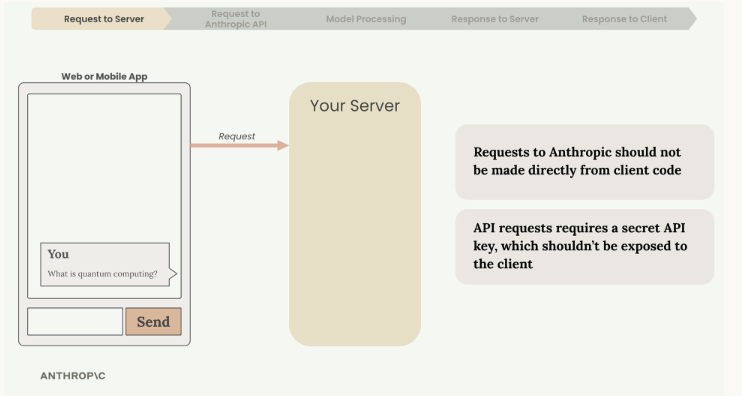
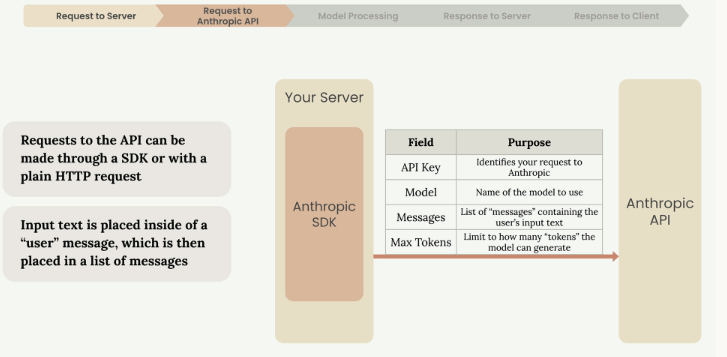
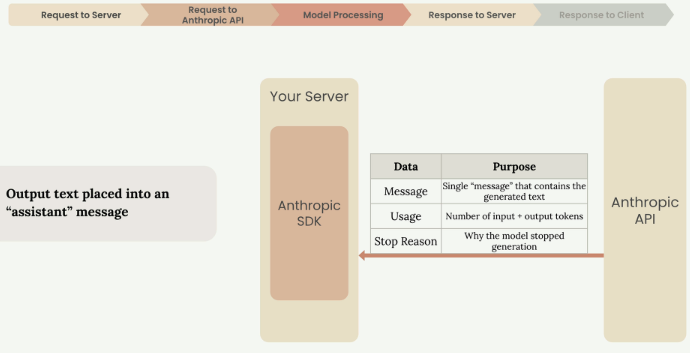
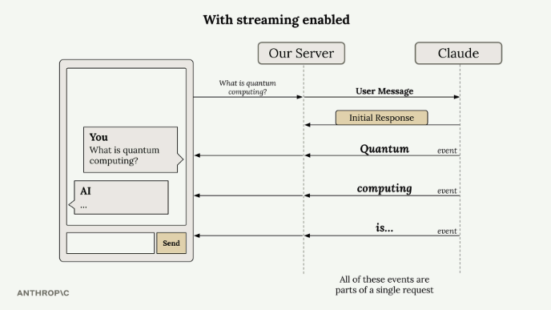
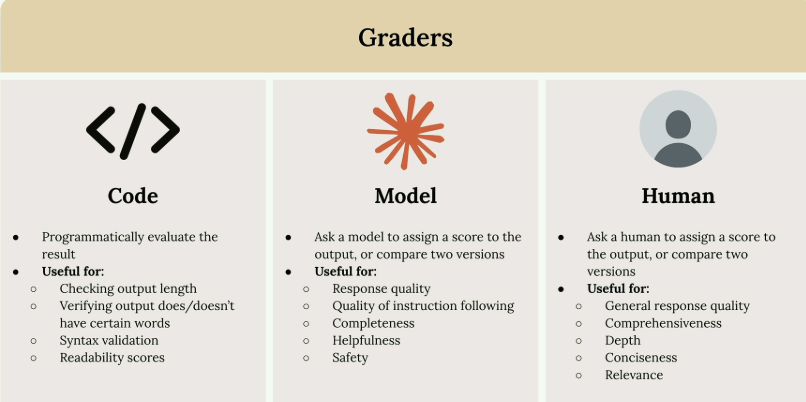

# Building with the Claude API — Resumen

---

## Unidad 1: Introducción

### Módulo 1: Introducción a Claude y sus Modelos

#### 1.1 La familia de modelos Claude

| Modelo | Inteligencia | Costo | Velocidad |
|---|---|---|---|
| **Claude Opus** | ⭐⭐⭐ Máxima | Alto | Moderada |
| **Claude Sonnet** | ⭐⭐ Alta | Medio | Rápida |
| **Claude Haiku** | ⭐ Moderada | Bajo | La más rápida |

#### Claude Opus
- Altamente inteligente, más caro, mayor latencia
- Ideal para: arquitecturas a gran escala, tareas complejas, planificación estratégica, reasoning avanzado

#### Claude Sonnet
- Fuerte balance entre inteligencia, costo y velocidad
- Ideal para: codificación, documentos, análisis de datos, imágenes, automatización

#### Claude Haiku
- Inteligencia moderada, bajo costo, máxima velocidad
- Ideal para: completado rápido de código, moderación, traducción, Q&A, alto volumen

---

#### 1.2 Cómo elegir el modelo correcto

El eje de decisión es **Inteligencia ←→ Costo/Velocidad**:

| Necesidad | Modelo recomendado |
|---|---|
| Máxima capacidad de razonamiento | Opus |
| Balance entre calidad y eficiencia | Sonnet |
| Velocidad y bajo costo a gran escala | Haiku |

---

### Módulo 2: Ciclo de vida de una solicitud a Claude

Comprender el ciclo de vida completo de las solicitudes ayuda a tomar mejores decisiones arquitectónicas y a depurar problemas con mayor eficacia.

#### 2.1 El flujo de solicitud de cinco pasos

Cada interacción con Claude sigue un patrón predecible con cinco fases:

1. **Solicitud al servidor** — el cliente envía la solicitud a tu backend.
2. **Solicitud a la API de Anthropic** — tu servidor llama a la API.
3. **Procesamiento del modelo** — Claude procesa la entrada y genera la respuesta.
4. **Respuesta al servidor** — la API devuelve el resultado a tu backend.
5. **Respuesta al cliente** — tu servidor envía la respuesta al usuario final.



---

#### 2.2 Por qué necesitas un servidor

**Nunca** se debe llamar a la API de Anthropic directamente desde el cliente:

- Las solicitudes requieren una **clave API secreta**.
- Exponerla en el cliente crea una grave vulnerabilidad de seguridad.
- Cualquiera podría extraerla y hacer solicitudes no autorizadas.

La aplicación cliente envía solicitudes a tu propio servidor, que se comunica con Anthropic usando la clave almacenada de forma segura.

---

#### 2.3 Realizar solicitudes a la API

Puedes usar un SDK oficial (Python, TypeScript, JavaScript, Go, Ruby) o realizar peticiones HTTP directas.

Campos esenciales de cada solicitud:

| Campo | Descripción |
|---|---|
| **API Key** | Identifica tu solicitud ante Anthropic |
| **Model** | Nombre del modelo (ej. `claude-3-sonnet`) |
| **Messages** | Lista con el texto introducido por el usuario |
| **Max tokens** | Límite de tokens que Claude puede generar |



---

#### 2.4 Dentro del proceso de Claude

Una vez recibida la solicitud, Claude procesa la entrada en cuatro etapas:

#### Tokenización
Divide el texto en fragmentos pequeños llamados **tokens** (palabras completas, partes de palabras, espacios o símbolos).

#### Embedding (incrustación)
Cada token se convierte en un **vector**: una lista de números que representa todos los posibles significados de esa palabra. Por ejemplo, "cuántico" puede referirse a:

- Una unidad discreta de magnitud física
- Conceptos de mecánica cuántica
- Algo extremadamente pequeño o subatómico
- Aplicaciones de computación cuántica

#### Contextualización
Claude refina cada vector basándose en las palabras circundantes para determinar el significado más probable en contexto.

#### Generación
Los embeddings contextualizados pasan por una capa de salida que calcula probabilidades para cada posible palabra siguiente. Claude combina probabilidad con aleatoriedad controlada para generar respuestas naturales y variadas. Tras seleccionar cada token, lo añade a la secuencia y repite el proceso.


---

#### 2.5 Cuándo Claude deja de generar

Después de cada token, Claude evalúa si continuar:

- **Máximo de tokens alcanzado** — llegó al límite especificado.
- **Final natural** — generó un token de fin de secuencia.
- **Stop sequence** — encontró una frase de parada predefinida.

---

#### 2.6 La respuesta de la API

Cuando termina la generación, la API devuelve una respuesta estructurada con:

- **Message** — el texto generado.
- **Usage** — recuento de tokens de entrada y salida.
- **Stop reason** — motivo por el que terminó la generación.

El servidor reenvía el texto generado a la aplicación cliente, donde aparece en la UI.



---

#### 2.7 Conclusiones clave

Comprender este flujo permite:

- Diseñar arquitecturas seguras que protejan las claves API.
- Establecer límites de tokens adecuados al caso de uso.
- Gestionar distintos *stop reasons* en la lógica de la aplicación.
- Depurar problemas identificando en qué etapa del flujo ocurren.

---

## Unidad 2: Acceso a Claude mediante API

### Módulo 3: Hacer una solicitud (primera llamada a la API)

Realizar la primera solicitud a la API de Anthropic es sencillo una vez configurado el entorno y comprendida la estructura básica.

#### 3.1 Configuración del entorno

Instalar dependencias en el notebook:

```
%pip install anthropic python-dotenv
```

Crear un archivo `.env` en el mismo directorio para guardar la clave API de forma segura:

```
ANTHROPIC_API_KEY="your-api-key-here"
```

> Esto mantiene la clave fuera del código y evita subirla por accidente al control de versiones. Siempre agrega `.env` a tu `.gitignore`.

Cargar variables de entorno y crear el cliente:

```python
from dotenv import load_dotenv
load_dotenv()          # Lee el archivo .env y carga las variables de entorno (incluida la API key)

from anthropic import Anthropic

client = Anthropic()           # Crea el cliente; toma la API key de la variable de entorno automáticamente
model = "claude-sonnet-4-0"    # Define el modelo a usar en todas las solicitudes
```

---

#### 3.2 La función `create`

La base para enviar solicitudes es `client.messages.create()`. Tres parámetros clave:

| Parámetro | Descripción |
|---|---|
| **model** | Nombre del modelo Claude a usar |
| **max_tokens** | Límite de seguridad para la longitud de la respuesta (no un objetivo) |
| **messages** | Historial de conversación enviado a Claude |

> `max_tokens` es un mecanismo de seguridad: si lo fijas en 1000, Claude se detendrá al llegar a ese número aunque tenga más que decir. Claude **no intenta alcanzar** el límite; simplemente escribe lo que considera apropiado y se detiene si toca el máximo.

---

#### 3.3 Comprender los mensajes

Los mensajes representan la conversación, similar a un chat. Dos tipos:

- **User messages** — contenido que envías a Claude (escrito por humanos).
- **Assistant messages** — respuestas generadas por Claude.

Cada mensaje es un diccionario con un `role` (`"user"` o `"assistant"`) y un `content` (el texto).

---

#### 3.4 Primera solicitud

```python
message = client.messages.create(
    model=model,        # Modelo a usar (definido arriba)
    max_tokens=1000,    # Límite de tokens en la respuesta; Claude se detiene aquí si no terminó antes
    messages=[
        {
            "role": "user",                                              # Quién envía el mensaje
            "content": "What is quantum computing? Answer in one sentence"  # El texto del mensaje
        }
    ]
)
```

Claude procesa la solicitud y devuelve un objeto de respuesta con el texto generado y metadatos.

---

#### 3.5 Extraer la respuesta

El objeto de respuesta trae mucha información, pero normalmente solo necesitas el texto generado:

```python
message.content[0].text
# message.content es una lista de bloques de contenido
# [0] accede al primer (y generalmente único) bloque
# .text extrae el texto generado como string limpio
```

Esto entrega una salida limpia y legible (por ejemplo, una definición de computación cuántica en una sola oración).

Con estas bases puedes empezar a experimentar con distintos prompts y construir interacciones más complejas con Claude.

---

### Módulo 4: Conversaciones de múltiples turnos

#### 4.1 Claude no tiene memoria

Claude **no almacena historial de conversaciones**. Cada solicitud es completamente independiente — no recuerda ningún intercambio anterior.

> Si le preguntas "¿Qué es la computación cuántica?" y luego envías "Escribe otra frase", Claude escribirá sobre algo aleatorio porque no recuerda el contexto previo.

---

#### 4.2 Cómo mantener el contexto

Para que Claude "recuerde" la conversación, tú debes gestionar el estado manualmente:

| Paso | Acción |
|---|---|
| 1 | Mantener una lista acumulativa de mensajes en tu código |
| 2 | Enviar el historial completo con cada nueva solicitud |

#### Flujo de una conversación de varios turnos

1. Enviar el mensaje inicial de usuario a Claude.
2. Tomar la respuesta y agregarla al historial como mensaje `assistant`.
3. Añadir la siguiente pregunta como mensaje `user`.
4. Enviar **todo el historial** en la próxima solicitud.


---

#### 4.3 Funciones auxiliares

Para simplificar la gestión del historial:

```python
def add_user_message(messages, text):
    messages.append({"role": "user", "content": text})      # Agrega un turno del usuario al historial

def add_assistant_message(messages, text):
    messages.append({"role": "assistant", "content": text}) # Agrega la respuesta de Claude al historial

def chat(messages):
    message = client.messages.create(
        model=model,
        max_tokens=1000,
        messages=messages,   # Envía el historial completo en cada solicitud
    )
    return message.content[0].text   # Devuelve solo el texto de la respuesta
```

---

#### 4.4 Ejemplo completo

```python
messages = []   # Historial vacío al inicio de la conversación

add_user_message(messages, "Define quantum computing in one sentence")
answer = chat(messages)         # Primera llamada: solo hay un mensaje de usuario

add_assistant_message(messages, answer)          # Guarda la respuesta de Claude en el historial
add_user_message(messages, "Write another sentence")  # Agrega la segunda pregunta

final_answer = chat(messages)   # Segunda llamada: envía los 3 mensajes juntos para mantener contexto
```

Ahora Claude entiende que "Write another sentence" se refiere a la definición de computación cuántica, porque recibe el historial completo.

---

### Módulo 5: System Prompts

#### 5.1 ¿Qué son y para qué sirven?

Los **system prompts** permiten personalizar cómo Claude responde: su tono, rol, restricciones y enfoque. En lugar de respuestas genéricas, obtenés comportamiento adaptado a tu caso de uso.

> **Ejemplo:** Un tutor de matemáticas no debería dar la respuesta directa — debería guiar al estudiante paso a paso. Un system prompt hace exactamente eso.

| Sin system prompt | Con system prompt de tutor |
|---|---|
| Da la solución completa de inmediato | Hace preguntas orientadoras |
| Comportamiento genérico | Rol especializado y coherente |

---

#### 5.2 Estructura básica

```python
system_prompt = """
You are a patient math tutor.
Do not directly answer a student's questions.
Guide them to a solution step by step.
"""
# El system prompt define el rol y comportamiento de Claude para toda la conversación

client.messages.create(
    model=model,
    messages=messages,
    max_tokens=1000,
    system=system_prompt    # Se pasa como parámetro separado, no dentro de messages
)
```

---

#### 5.3 Función de chat flexible

La API de Claude **no acepta `system=None`**, por lo que hay que incluir el parámetro condicionalmente:

```python
def chat(messages, system=None):
    params = {              # Parámetros base que siempre se envían
        "model": model,
        "max_tokens": 1000,
        "messages": messages,
    }
    if system:
        params["system"] = system   # Solo se agrega si se proporcionó (la API no acepta system=None)

    message = client.messages.create(**params)   # ** desempaqueta el diccionario como argumentos nombrados
    return message.content[0].text
```

Uso:

```python
# Sin system prompt
answer = chat(messages)

# Con system prompt
system = "You are a patient math tutor. Guide students step by step."
answer = chat(messages, system=system)
```

Los system prompts son esenciales para que una aplicación de IA se comporte de forma coherente y apropiada a su propósito.

---

### Módulo 6: Temperatura

#### 6.1 ¿Qué es la temperatura?

La **temperatura** es un parámetro decimal entre `0.0` y `1.0` que controla qué tan predecibles o creativas son las respuestas de Claude. Influye directamente en la etapa de **muestreo** del proceso de generación.

> La tokenización y la predicción de probabilidades ocurren igual siempre — la temperatura solo afecta cómo se elige el siguiente token a partir de esas probabilidades.

---


#### 6.2 Cómo afecta la temperatura a las probabilidades

| Temperatura | Efecto |
| --- | --- |
| **Cercana a 0** | Claude casi siempre elige el token más probable → respuestas deterministas |
| **Cercana a 1** | Las probabilidades se distribuyen más uniformemente → respuestas variadas y creativas |

Ejemplo: para el token siguiente a "¿Qué opinas?", Claude puede asignar 30 % a "about", 20 % a "would", 10 % a "of", etc. A temperatura 0.0 siempre elige "about"; a temperatura 1.0 cualquiera de ellos puede ganar.

---

#### 6.3 Temperatura según el tipo de tarea

| Rango | Tipo de tarea | Ejemplos |
| --- | --- | --- |
| **0.0 – 0.3** (baja) | Precisión y consistencia | Respuestas factuales, codificación, extracción de datos, moderación |
| **0.4 – 0.7** (media) | Balance entre calidad y variedad | Resúmenes, contenido educativo, resolución de problemas, escritura creativa acotada |
| **0.8 – 1.0** (alta) | Creatividad y diversidad | Lluvia de ideas, marketing, escritura libre, generación de humor |

---


#### 6.4 Agregar temperatura a la función de chat

```python
def chat(messages, system=None, temperature=1.0):   # temperature=1.0 es el valor por defecto
    params = {
        "model": model,
        "max_tokens": 1000,
        "messages": messages,
        "temperature": temperature   # Controla la creatividad: 0.0 = determinista, 1.0 = creativo
    }
    if system:
        params["system"] = system

    message = client.messages.create(**params)
    return message.content[0].text
```

Los únicos cambios respecto a la versión anterior son añadir `temperature=1.0` como parámetro e incluirlo en el diccionario `params`.

---

#### 6.5 Conclusiones clave

- La temperatura **no garantiza** resultados diferentes; solo cambia la probabilidad de obtenerlos.
- Incluso a temperatura alta, Claude puede producir respuestas similares ocasionalmente.
- Ajustar la temperatura al caso de uso específico es más útil que dejarlo en el valor por defecto.

| Situación | Temperatura recomendada |
| --- | --- |
| Necesito respuestas consistentes y objetivas | Baja (0.0 – 0.3) |
| Quiero lluvia de ideas creativa | Alta (0.8 – 1.0) |
| Tarea general equilibrada | Media (0.4 – 0.7) |


---

### Módulo 7: Transmisión de respuesta (Streaming)

#### 7.1 El problema con las respuestas estándar

En una configuración típica, el servidor espera la respuesta **completa** de Claude antes de enviar algo al cliente. Esto genera una demora de 10 a 30 segundos en la que el usuario no recibe ninguna señal de que algo está pasando.

---

#### 7.2 Cómo funciona el streaming

Con streaming habilitado, Claude envía fragmentos de texto a medida que los genera. Tu servidor puede reenviarlos al cliente en tiempo real, permitiendo que el usuario vea la respuesta aparecer palabra por palabra — igual que en claude.ai.

Todos estos fragmentos son parte de una única solicitud a la API.

---

#### 7.3 Tipos de eventos del stream

| Evento | Descripción |
| --- | --- |
| **MessageStart** | Inicio de un nuevo mensaje |
| **ContentBlockStart** | Inicio de un bloque de contenido (texto, tool use, etc.) |
| **ContentBlockDelta** | Fragmento del texto generado |
| **ContentBlockStop** | El bloque de contenido actual finalizó |
| **MessageDelta** | El mensaje actual está completo |
| **MessageStop** | Fin de la información del mensaje |


Los eventos `ContentBlockDelta` contienen el texto que se muestra al usuario.



---

#### 7.4 Implementación básica

```python
stream = client.messages.create(
    model=model,
    max_tokens=1000,
    messages=messages,
    stream=True     # Activa el modo streaming: Claude envía fragmentos en lugar de esperar la respuesta completa
)

for event in stream:
    print(event)    # Imprime cada evento raw (incluye metadata, no solo texto)
```

---

#### 7.5 Interfaz simplificada con `messages.stream`

En lugar de parsear manualmente los eventos, el SDK ofrece una interfaz simplificada que extrae solo el texto:

```python
with client.messages.stream(   # Interfaz de alto nivel del SDK; maneja el stream automáticamente
    model=model,
    max_tokens=1000,
    messages=messages
) as stream:
    for text in stream.text_stream:     # Itera solo sobre los fragmentos de texto (filtra el resto de eventos)
        print(text, end="")             # end="" evita saltos de línea entre fragmentos; el texto fluye continuo
```

Esto filtra automáticamente todo excepto el contenido de texto, que es lo que normalmente se necesita para mostrar al usuario.

---

#### 7.6 Obtener el mensaje completo al final

Después del streaming se puede recuperar el mensaje ensamblado completo, útil para guardarlo en base de datos o procesarlo:

```python
with client.messages.stream(
    model=model,
    max_tokens=1000,
    messages=messages
) as stream:
    for text in stream.text_stream:
        pass    # Aquí iría el código para enviar cada fragmento al cliente en tiempo real

    # Una vez terminado el stream, get_final_message() devuelve el objeto Message completo
    # (con el texto ensamblado, uso de tokens, stop_reason, etc.)
    final_message = stream.get_final_message()
```

Esto da lo mejor de ambos mundos: streaming en tiempo real para el usuario y un objeto de mensaje completo para la lógica de la aplicación.

---

### Módulo 8: Datos estructurados

#### 8.1 El problema

Cuando le pides a Claude que genere JSON u otro contenido estructurado, por defecto añade texto explicativo y lo envuelve en bloques de código Markdown:

````markdown
```json
{
  "source": ["aws.ec2"],
  ...
}
```
This rule captures EC2 instance state changes when instances start running.
````

Para aplicaciones donde el usuario necesita copiar el dato directamente (ej. una regla de AWS EventBridge), esto genera fricción innecesaria.

---

#### 8.2 La solución: prefill + stop sequences

Combinar el **prellenado del mensaje del asistente** con **secuencias de parada** permite extraer exactamente el contenido deseado:

```python
messages = []

add_user_message(messages, "Generate a very short event bridge rule as json")
add_assistant_message(messages, "```json")   # Prefill: Claude "cree" que ya empezó un bloque de código

# stop_sequences hace que Claude deje de generar cuando intente escribir el cierre ```
text = chat(messages, stop_sequences=["```"])
```

**Cómo funciona:**

| Paso | Qué ocurre |
| --- | --- |
| 1 | El mensaje de usuario indica qué generar |
| 2 | El prefill hace que Claude crea que ya abrió un bloque de código |
| 3 | Claude continúa escribiendo solo el contenido JSON |
| 4 | Cuando Claude intenta cerrar con ` ``` `, la stop sequence detiene la generación |

El resultado es JSON limpio sin ningún formato adicional.

---

#### 8.3 Procesar la respuesta

La respuesta puede tener saltos de línea sobrantes; `json.loads` con `strip()` los elimina:

```python
import json

clean_json = json.loads(text.strip())
# text.strip() elimina espacios y saltos de línea al inicio y al final
# json.loads() convierte el string JSON en un diccionario Python
```

---

#### 8.4 Más allá de JSON

La misma técnica aplica a cualquier contenido estructurado donde solo se quiere el dato, sin explicaciones:

- Fragmentos de código Python
- Listas con viñetas
- Datos CSV
- Cualquier formato donde Claude envuelva naturalmente el contenido

La clave es identificar el patrón de apertura que Claude usaría y usarlo como prefill y como stop sequence de cierre.

---

## Unidad 3: Evaluación inmediata

### Módulo 9: Evaluación de indicaciones

#### 9.1 Ingeniería vs. evaluación de indicaciones

Trabajar con Claude implica dos disciplinas distintas:

| Concepto | Qué es |
| --- | --- |
| **Ingeniería de indicaciones** | Técnicas para redactar mejores prompts (few-shot, XML, etc.) |
| **Evaluación de indicaciones** | Medir la eficacia de los prompts mediante pruebas automatizadas |

La ingeniería te dice *cómo* escribir; la evaluación te dice *qué tan bien* funciona lo que escribiste.


---

#### 9.2 Tres opciones tras escribir una indicación

| Opción | Descripción | Riesgo |
| --- | --- | --- |
| **1** | Probar una sola vez y decidir si es suficiente | Alto — falla ante entradas inesperadas en producción |
| **2** | Probar varias veces y ajustar uno o dos casos borde | Medio — los usuarios siempre encontrarán casos no considerados |
| **3** | Someter la indicación a un proceso de evaluación con métricas objetivas | Bajo — mayor inversión inicial, mucha más confianza en la fiabilidad |

---

#### 9.3 Por qué las opciones 1 y 2 son trampas

Es natural escribir un prompt para una aplicación seria y no probarlo lo suficiente. Los ingenieros tienden a subestimar la variedad de entradas que generarán los usuarios reales. Lo que parece sólido en pruebas limitadas puede fallar rápidamente en producción.

---

#### 9.4 El enfoque de evaluación primero (Opción 3)

Someter la indicación a un proceso de evaluación sistemático permite:

- Identificar debilidades antes de que lleguen a producción
- Comparar objetivamente distintas versiones del mismo prompt
- Iterar con confianza basándose en mejoras medibles
- Construir aplicaciones de IA más fiables

Requiere mayor inversión inicial en infraestructura de pruebas, pero los beneficios en robustez y confiabilidad justifican el esfuerzo.

---

#### 9.5 Flujo de trabajo de evaluación típico

El proceso consta de cinco pasos que se repiten iterativamente:

#### Paso 1 — Redactar una indicación inicial

```python
prompt = f"""
Please answer the user's question:

{question}
"""
```

Esta es la línea de base que se va a medir y mejorar.

#### Paso 2 — Crear un conjunto de datos de evaluación

Reúne ejemplos representativos de las entradas que el prompt recibirá en producción. Pueden ser decenas, cientos o miles de registros. También puedes usar Claude para generarlos.

Ejemplo mínimo:

- "What's 2+2?"
- "How do you make oatmeal?"
- "How far away is the Moon?"

#### Paso 3 — Pasar cada entrada por Claude

Combina cada ejemplo con la plantilla de la indicación y envíalo a Claude para obtener una respuesta por cada registro del dataset.

#### Paso 4 — Calificar las respuestas

Un evaluador (modelo o código) analiza cada par pregunta-respuesta y asigna una puntuación, típicamente del 1 al 10. El promedio da una métrica objetiva de referencia.

Ejemplo:

| Pregunta | Puntuación |
| --- | --- |
| Matemáticas (2+2) | 10 |
| Avena | 4 |
| Distancia a la Luna | 9 |
| **Promedio** | **7.66** |

#### Paso 5 — Modificar la indicación y repetir

Con la métrica de referencia en mano, ajusta el prompt y vuelve a correr todo el proceso. Si la nueva puntuación es más alta, el cambio fue una mejora real.

```python
prompt = f"""
Please answer the user's question:

{question}

Answer the question with ample detail
"""
```

Nueva puntuación promedio: **8.7** → la instrucción adicional mejoró el rendimiento.

---

#### 9.6 La ventaja del enfoque

Este ciclo sistemático elimina las conjeturas de la ingeniería de indicaciones:

- Las comparaciones son numéricas y objetivas
- Siempre se usa la versión con mejor puntuación
- Se puede seguir iterando con confianza en que cada cambio es una mejora medible, no solo una variación diferente

---

#### 9.7 Generación de conjuntos de datos de prueba

#### Objetivo de ejemplo

Construir un evaluador para una indicación que ayude a usuarios a escribir código específico de AWS. Los formatos de salida esperados son:

- Código Python
- Archivos de configuración JSON
- Expresiones regulares

La indicación inicial (v1):

```python
prompt = f"""
Please provide a solution to the following task:
{task}
"""
```

---

#### Generar el dataset con Claude

En lugar de crear los casos de prueba manualmente, se puede usar un modelo rápido (Haiku) para generarlos automáticamente:

```python
def generate_dataset():
    prompt = """
Generate an evaluation dataset for a prompt evaluation. The dataset will be used to evaluate
prompts that generate Python, JSON, or Regex specifically for AWS-related tasks.
Generate an array of JSON objects, each representing a task that requires Python, JSON, or a Regex.

Example output:
[
  {"task": "Description of task"},
  ...
]

* Focus on tasks solvable by a single Python function, JSON object, or regex
* Focus on tasks that do not require much code

Please generate 3 objects.
"""
    messages = []
    add_user_message(messages, prompt)
    add_assistant_message(messages, "```json")  # Prefill para forzar respuesta JSON limpia
    text = chat(messages, stop_sequences=["```"])  # Detiene la generación antes del cierre ```
    return json.loads(text)   # Convierte el string en lista de diccionarios Python
```

> Se usa prefill + stop sequence para extraer el JSON limpio directamente. Si el modelo no soporta prefill, reemplazar por un system prompt que indique devolver solo JSON.

---

#### Guardar el dataset

Una vez generado, se persiste en disco para reutilizarlo en cada ciclo de evaluación:

```python
dataset = generate_dataset()   # Llama a Claude para generar los casos de prueba

with open('dataset.json', 'w') as f:
    json.dump(dataset, f, indent=2)   # indent=2 da formato legible con sangría al JSON guardado
```

Esto crea un archivo `dataset.json` en el mismo directorio del notebook, listo para ser cargado en las siguientes etapas del flujo de evaluación.

---

#### 9.8 Ejecutar la evaluación

El flujo es: dataset → combinar con prompt → enviar a Claude → calificar resultado.

#### Tres funciones principales

**`run_prompt`** — combina el caso de prueba con la plantilla y llama a Claude:

```python
def run_prompt(test_case):
    prompt = f"""
Please solve the following task:

{test_case["task"]}   
"""
    # test_case["task"] inserta la descripción del caso de prueba en la plantilla del prompt
    messages = []
    add_user_message(messages, prompt)
    return chat(messages)   # Devuelve el texto de la respuesta de Claude
```

**`run_test_case`** — ejecuta un caso y califica el resultado:

```python
def run_test_case(test_case):
    output = run_prompt(test_case)
    score = 10  # placeholder — se reemplaza con lógica real de calificación
    return {
        "output": output,
        "test_case": test_case,
        "score": score
    }
```

**`run_eval`** — coordina todo el proceso sobre el dataset completo:

```python
def run_eval(dataset):
    results = []
    for test_case in dataset:
        result = run_test_case(test_case)
        results.append(result)
    return results
```

---

#### Ejecutar y examinar resultados

```python
with open("dataset.json", "r") as f:
    dataset = json.load(f)   # Carga el dataset guardado como lista de diccionarios Python

results = run_eval(dataset)
print(json.dumps(results, indent=2))   # Imprime los resultados formateados con sangría para leerlos fácil
```

Cada objeto de resultados contiene:

| Campo | Descripción |
| --- | --- |
| `output` | Respuesta completa de Claude |
| `test_case` | El caso de prueba original |
| `score` | Puntuación de evaluación (por ahora fija en 10) |

> Procesar un dataset completo con Haiku puede tomar ~30 segundos. La puntuación fija de `10` es un placeholder — la lógica real de calificación se agrega en el siguiente paso.

---

#### 9.9 Calificación basada en modelos

Un evaluador toma la salida del modelo y devuelve una señal objetiva de calidad, generalmente un número del 1 al 10.

#### Tipos de evaluadores

| Tipo | Descripción | Mejor para |
| --- | --- | --- |
| **Código** | Lógica programática personalizada | Longitud, sintaxis, palabras clave |
| **Modelo** | Otro modelo de IA evalúa la salida | Calidad, utilidad, seguimiento de instrucciones |
| **Humano** | Revisión manual | Calidad general, profundidad, relevancia |


---

#### Criterios de evaluación para generación de código AWS

Antes de implementar el evaluador, definir criterios claros:

| Criterio | Evaluador recomendado |
| --- | --- |
| **Formato** — solo Python, JSON o regex, sin explicación | Código |
| **Sintaxis válida** — el código generado compila/parsea | Código |
| **Seguimiento de tarea** — responde directamente lo que se pidió | Modelo |

---

#### Implementar el evaluador por modelo

```python
def grade_by_model(test_case, output):
    eval_prompt = f"""
Eres un revisor experto de código. Evalúa esta solución generada por IA.

Tarea: {test_case["task"]}
Solución: {output}

Devuelve un objeto JSON con:
- "strengths": lista de 1-3 fortalezas clave
- "weaknesses": lista de 1-3 áreas de mejora
- "reasoning": explicación concisa de tu evaluación
- "score": número entre 1 y 10
"""
    messages = []
    add_user_message(messages, eval_prompt)
    add_assistant_message(messages, "```json")

    eval_text = chat(messages, stop_sequences=["```"])
    return json.loads(eval_text)
```

> Pedir `strengths`, `weaknesses` y `reasoning` junto con el puntaje es clave. Sin ese contexto, los modelos tienden a dar puntajes mediocres alrededor de 6 sin mucha variación.

---

#### Integrar la calificación en el flujo

```python
def run_test_case(test_case):
    output = run_prompt(test_case)         # 1. Obtiene la respuesta de Claude
    model_grade = grade_by_model(test_case, output)  # 2. La evalúa con el calificador

    return {
        "output": output,                  # Respuesta original de Claude
        "test_case": test_case,            # Caso de prueba usado
        "score": model_grade["score"],     # Puntaje numérico (1-10)
        "reasoning": model_grade["reasoning"]  # Justificación del puntaje
    }
```

```python
from statistics import mean

def run_eval(dataset):
    results = []
    for test_case in dataset:
        result = run_test_case(test_case)  # Corre y califica cada caso
        results.append(result)

    # Calcula el promedio de todos los puntajes para tener una métrica global
    average_score = mean([result["score"] for result in results])
    print(f"Puntuación promedio: {average_score}")
    return results
```

`mean([result["score"] for result in results])` recorre la lista de resultados, extrae el campo `score` de cada uno y calcula el promedio. Ese número es la métrica de referencia: si al cambiar el prompt el promedio sube, la nueva versión es objetivamente mejor.

La puntuación promedio es la métrica de referencia que se usa para comparar versiones del prompt. Los evaluadores de modelos pueden ser algo variables, pero ofrecen una línea base consistente para medir mejoras.

---

#### 9.10 Calificación basada en código

Mientras el evaluador por modelo mide calidad semántica, el evaluador por código verifica dos aspectos técnicos objetivos:

| Criterio | Evaluador |
| --- | --- |
| **Formato** — solo Python, JSON o regex, sin explicación | Código |
| **Sintaxis válida** — el código parsea correctamente | Código |
| **Seguimiento de tarea** — responde lo que se pidió con precisión | Modelo |

---

#### Funciones de validación de sintaxis

Cada función intenta parsear el texto en su formato correspondiente. Si tiene éxito devuelve 10; si falla devuelve 0:

```python
import json, ast, re

def validate_json(text):
    try:
        json.loads(text.strip())   # Intenta convertir el string a un objeto JSON
        return 10                  # Sintaxis válida
    except json.JSONDecodeError:
        return 0                   # JSON malformado

def validate_python(text):
    try:
        ast.parse(text.strip())    # Intenta parsear el string como código Python
        return 10
    except SyntaxError:
        return 0                   # Error de sintaxis Python

def validate_regex(text):
    try:
        re.compile(text.strip())   # Intenta compilar el string como expresión regular
        return 10
    except re.error:
        return 0                   # Regex inválida
```


---

#### Agregar el campo `format` al dataset

Para que el evaluador sepa qué validador usar, cada caso de prueba debe incluir el formato esperado:

```python
# Ejemplo de caso de prueba con formato especificado
{
    "task": "Create a Python function to validate an AWS IAM username",
    "format": "python"   # Indica qué validador aplicar: "python", "json" o "regex"
}
```

---

#### Mejorar el prompt para forzar formato limpio

Agregar instrucciones explícitas de formato reduce respuestas con texto explicativo innecesario:

```python
# Instrucciones de formato en el prompt
"""
* Respond only with Python, JSON, or a plain Regex
* Do not add any comments or commentary or explanation
"""

# Prefill genérico para code blocks (sin especificar el lenguaje)
add_assistant_message(messages, "```code")
# Claude interpreta esto como la apertura de un bloque de código y continúa solo con el código
```

---

#### Combinar puntaje de modelo y puntaje de código

```python
model_grade = grade_by_model(test_case, output)
model_score = model_grade["score"]       # Calidad semántica: ¿resuelve bien la tarea?
syntax_score = grade_syntax(output, test_case)  # Corrección técnica: ¿es sintaxis válida?

score = (model_score + syntax_score) / 2   # Promedio simple: ambos criterios tienen igual peso
```

El peso de cada criterio se puede ajustar según el caso de uso. Por ejemplo, si la sintaxis válida es crítica, podría dársele más peso que la calidad semántica.

> La puntuación de referencia no es buena ni mala en sí misma — lo que importa es si mejora al iterar sobre el prompt. El evaluador por código convierte esa medición en algo objetivo y reproducible.
