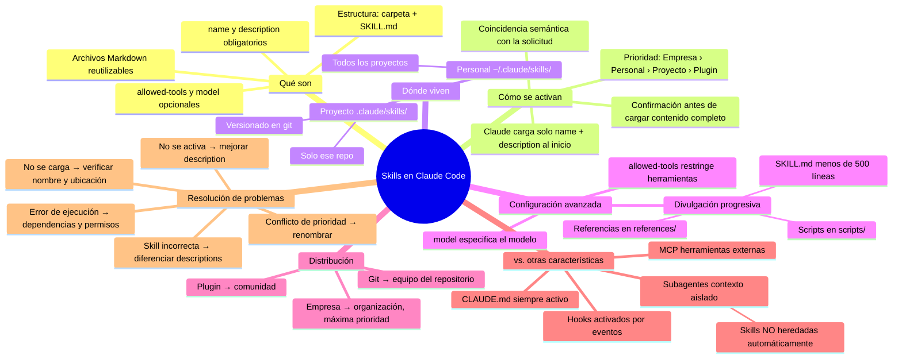
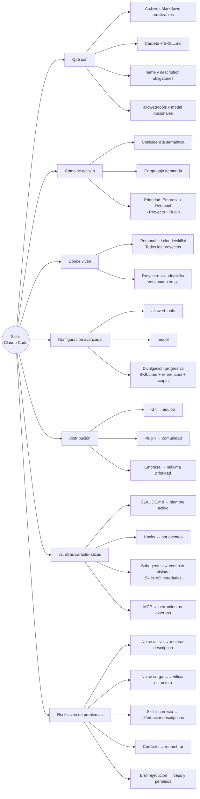

# Introducción a las Habilidades de Agente en Claude Code

---

## Módulo 1: ¿Qué son las Habilidades?

### Concepto central

Las **habilidades** (*skills*) son archivos Markdown reutilizables que enseñan a Claude Code cómo gestionar tareas específicas de forma automática. En lugar de repetir instrucciones cada vez que necesitás que Claude haga algo, escribís la habilidad una sola vez y Claude la aplica cada vez que la situación lo requiere.

> **Regla de oro:** Si te encontrás explicándole lo mismo a Claude repetidamente, eso es una habilidad que todavía no escribiste.

---

### Anatomía de una habilidad

Cada habilidad vive en un archivo llamado `SKILL.md` dentro de una carpeta con el nombre de la habilidad. El archivo tiene dos partes:

#### 1. Frontmatter (metadatos)

```markdown
---
name: pr-review
description: Reviews pull requests for code quality. Use when reviewing PRs or checking code changes.
---
```

#### 2. Cuerpo de instrucciones

Debajo del frontmatter van las instrucciones reales: listas de verificación, formatos esperados, preferencias de estilo, etc.

| Campo | Propósito |
| --- | --- |
| `name` | Identificador único de la habilidad |
| `description` | Criterio que usa Claude para decidir cuándo activarla |

> La `description` es clave: Claude la compara con tu solicitud para decidir si cargar o no la habilidad.

---

### Dónde viven las habilidades

| Ubicación | Ruta | Alcance |
| --- | --- | --- |
| **Personales** | `~/.claude/skills/` (Linux/Mac) | Disponibles en todos tus proyectos |
| **Personales (Windows)** | `C:/Users/<usuario>/.claude/skills/` | Disponibles en todos tus proyectos |
| **De proyecto** | `.claude/skills/` en la raíz del repo | Compartidas con todo el equipo via git |

Las habilidades de proyecto se versionan junto con el código, por lo que cualquier persona que clone el repositorio las obtiene automáticamente.

---

### Habilidades vs. otras formas de personalización

| Mecanismo | Cuándo se carga | Requiere invocación explícita | Caso de uso ideal |
| --- | --- | --- | --- |
| **CLAUDE.md** | En cada conversación | No | Reglas globales siempre activas (ej: usar TypeScript estricto) |
| **Habilidades** | Bajo demanda, al coincidir con la solicitud | No (automático) | Conocimiento especializado por tarea |
| **Comandos `/`** | Solo cuando el usuario los escribe | Sí | Acciones que querés disparar a mano |

**Ventaja clave de las habilidades:** no ocupan la ventana de contexto cuando no son necesarias. Claude solo carga el nombre y la descripción inicialmente; el contenido completo se carga al activarse.

---

### Flujo de activación

```text
Usuario escribe solicitud
        ↓
Claude compara con descripciones de todas las habilidades disponibles
        ↓
¿Coincide alguna descripción?
   ├── Sí → Claude carga el SKILL.md completo y lo aplica
   └── No → Claude responde sin habilidad específica
```

Cuando una habilidad se activa, lo podés ver en la terminal de Claude Code.

---

### Casos de uso típicos

- Estándares de revisión de código del equipo
- Formato de mensajes de commit
- Directrices de marca (colores, tipografías, tono)
- Plantillas de documentación por tipo de documento
- Listas de verificación para debugging en frameworks específicos

---

### Preguntas de repaso

1. ¿Cuál es la diferencia principal entre una habilidad y un archivo `CLAUDE.md`?
2. Si querés que todos los miembros de tu equipo usen la misma habilidad de revisión de PRs, ¿dónde la guardás?
3. ¿Qué parte del archivo `SKILL.md` usa Claude para decidir si activar la habilidad?
4. ¿Por qué las habilidades son más eficientes en contexto que poner todo en `CLAUDE.md`?
5. Pensá en tu flujo de trabajo actual: ¿qué instrucciones le repetís frecuentemente a Claude que podrían convertirse en una habilidad?

---

### Ejercicio práctico

Diseñá (en papel o en código) una habilidad para un flujo de trabajo que uses frecuentemente:

1. Elegí una tarea repetitiva (ej: "escribir mensajes de commit en español siguiendo Conventional Commits")
2. Redactá el frontmatter con `name` y `description`
3. Escribí el cuerpo con las instrucciones específicas
4. Decidí si la habilidad es personal o de proyecto

```markdown
---
name: [tu nombre]
description: [cuándo debe activarse — sé específico]
---

## Instrucciones

[Tus instrucciones aquí]
```

---

## Módulo 2: Creando tu Primera Habilidad

### Idea principal

Crear una habilidad es un proceso de tres pasos: crear un directorio con el nombre de la habilidad, escribir el `SKILL.md` con frontmatter e instrucciones, y reiniciar Claude Code. A partir de ahí, Claude la carga automáticamente al detectar solicitudes que coincidan con su descripción.

---

### Estructura de directorios

```text
~/.claude/skills/
└── pr-description/       ← nombre del directorio = nombre de la habilidad
    └── SKILL.md          ← único archivo obligatorio
```

Para habilidades de proyecto:

```text
.claude/skills/
└── pr-description/
    └── SKILL.md
```

---

### Creando la habilidad paso a paso

#### Paso 1: Crear el directorio

```bash
# Habilidad personal (disponible en todos los proyectos)
mkdir -p ~/.claude/skills/pr-description

# Habilidad de proyecto (solo en este repo)
mkdir -p .claude/skills/pr-description
```

#### Paso 2: Escribir el SKILL.md

```markdown
---
name: pr-description
description: Writes pull request descriptions. Use when creating a PR, writing a PR, or when the user asks to summarize changes for a pull request.
---

When writing a PR description:

1. Run `git diff main...HEAD` to see all changes on this branch
2. Write a description following this format:

## What
One sentence explaining what this PR does.

## Why
Brief context on why this change is needed.

## Changes
- Bullet points of specific changes made
- Group related changes together
- Mention any files deleted or renamed
```

> La `description` debe incluir varios disparadores ("creating a PR", "writing a PR", "summarize changes") para capturar distintas formas en que el usuario puede pedir lo mismo.

#### Paso 3: Reiniciar Claude Code

Claude escanea las habilidades al iniciar. Cualquier cambio (crear, editar, borrar) requiere reinicio para que surta efecto.

---

### Cómo funciona la coincidencia semántica

Claude no busca palabras clave exactas: usa **coincidencia semántica** comparando la intención de tu solicitud con la descripción de cada habilidad.

```text
Solicitud del usuario: "escribe una descripción de PR para mis cambios"
                              ↓
Claude compara contra todas las descripciones disponibles
                              ↓
"Writes pull request descriptions. Use when creating a PR..."  ← COINCIDE
                              ↓
Claude pide confirmación antes de cargar el SKILL.md completo
                              ↓
Usuario confirma → Claude lee las instrucciones y las aplica
```

**Dato clave:** Claude solo carga nombre y descripción al inicio, no el contenido completo. El cuerpo del `SKILL.md` se carga recién cuando hay una coincidencia confirmada. Esto mantiene la ventana de contexto eficiente.

---

### Jerarquía de prioridad entre habilidades

Cuando dos habilidades tienen el mismo `name`, Claude aplica este orden de precedencia:

| Prioridad | Tipo | Ubicación |
| --- | --- | --- |
| 1 (mayor) | **Empresa** | Configuración administrada por la organización |
| 2 | **Personal** | `~/.claude/skills/` |
| 3 | **Proyecto** | `.claude/skills/` en el repositorio |
| 4 (menor) | **Complementos** | Plugins instalados |

**Implicancia práctica:** si tu empresa tiene una habilidad `code-review` y vos también tenés una personal con el mismo nombre, la versión empresarial siempre gana. Para evitar conflictos, usá nombres descriptivos y específicos: `frontend-review`, `backend-review`, en lugar de solo `review`.

---

### Ciclo de vida de una habilidad

| Acción | Cómo hacerlo |
| --- | --- |
| Crear | Crear directorio + `SKILL.md` → reiniciar |
| Actualizar | Editar `SKILL.md` → reiniciar |
| Eliminar | Borrar el directorio completo → reiniciar |
| Verificar que existe | Pedirle a Claude la lista de habilidades disponibles |

---

### Buenas prácticas para la `description`

La descripción es el mecanismo de activación. Una descripción mal escrita hace que la habilidad nunca se active o se active en momentos incorrectos.

| Problema | Descripción mala | Descripción buena |
| --- | --- | --- |
| Demasiado vaga | `"Use for PRs"` | `"Writes PR descriptions. Use when creating a PR, writing a PR, or summarizing branch changes."` |
| Sin disparadores | `"Formats pull request text"` | `"Use when the user asks to describe, summarize, or document changes for a pull request."` |
| Nombre ambiguo | `name: review` | `name: frontend-pr-review` |

---

### Repaso — Módulo 2

1. ¿Qué tres pasos son necesarios para crear una habilidad desde cero?
2. ¿Por qué Claude pide confirmación antes de cargar el `SKILL.md` completo?
3. Si tenés una habilidad personal `deploy` y el proyecto también tiene una habilidad `deploy`, ¿cuál prevalece?
4. ¿Qué pasa si editás un `SKILL.md` sin reiniciar Claude Code?
5. ¿Qué diferencia hay entre coincidencia de palabras clave y coincidencia semántica en el contexto de las habilidades?

---

### Ejercicio — Módulo 2

Creá una habilidad personal completa siguiendo estos pasos:

1. Elegí una tarea repetitiva real (ej: escribir mensajes de commit, generar documentación, revisar código)
2. Creá el directorio en `~/.claude/skills/<nombre-habilidad>/`
3. Escribí el `SKILL.md` con frontmatter válido y al menos 3 instrucciones concretas
4. Reiniciá Claude Code y verificá que aparece en la lista
5. Probala haciendo una solicitud que debería activarla

**Plantilla de referencia:**

```markdown
---
name: commit-message
description: Writes git commit messages. Use when the user asks to commit changes, write a commit, or summarize changes for a commit message.
---

When writing a commit message:

1. Run `git diff --staged` to see what's being committed
2. Use Conventional Commits format: `type(scope): description`
3. Types válidos: feat, fix, docs, style, refactor, test, chore
4. Keep the subject line under 72 characters
5. Add a body if the change needs explanation of WHY, not just WHAT
```

---

## Módulo 3: Configuración Avanzada y Habilidades Multarchivo

### Resumen del módulo

Una habilidad básica solo necesita `name` y `description`, pero hay campos opcionales y técnicas de organización que la hacen más precisa, segura y mantenible. Este módulo cubre los metadatos avanzados, cómo escribir descripciones que se activen siempre en el momento correcto, cómo restringir herramientas para flujos sensibles, y cómo estructurar habilidades complejas sin saturar el contexto.

---

### Campos de metadatos completos

```markdown
---
name: codebase-onboarding
description: Helps new developers understand how the system works. Use when someone asks to understand the architecture, explore the codebase, or get oriented in the project.
allowed-tools: Read, Grep, Glob, Bash
model: sonnet
---
```

| Campo | Obligatorio | Descripción |
| --- | --- | --- |
| `name` | Sí | Identificador único. Solo minúsculas, números y guiones. Máx. 64 caracteres. Debe coincidir con el nombre del directorio. |
| `description` | Sí | Criterio de activación semántica. Máx. 1024 caracteres. Es el campo más importante. |
| `allowed-tools` | No | Lista de herramientas que Claude puede usar mientras la habilidad está activa. Si se omite, no hay restricciones. |
| `model` | No | Modelo de Claude a usar para esa habilidad (ej: `sonnet`, `opus`, `haiku`). |

---

### Cómo escribir descripciones eficaces

Una descripción tiene que responder dos preguntas de forma explícita:

1. **¿Qué hace la habilidad?**
2. **¿Cuándo debe usarla Claude?**

```text
Descripción vaga   →  "Helps with code"
Descripción buena  →  "Explains unfamiliar code to new team members. Use when someone asks
                       what a function does, how a module works, or wants to understand
                       a piece of logic they haven't seen before."
```

**Si la habilidad no se activa cuando esperás:** agregá más sinónimos a la descripción que reflejen cómo formulás tus pedidos reales. La coincidencia es semántica, pero incluir variantes de vocabulario mejora la cobertura.

| Señal | Qué hacer |
| --- | --- |
| La habilidad nunca se activa | La descripción es demasiado vaga o genérica |
| La habilidad se activa cuando no deberías | La descripción es demasiado amplia; acotarla con "Use ONLY when..." |
| La habilidad compite con otra | Revisar nombres y descripciones para diferenciarlas |

---

### Restricción de herramientas con `allowed-tools`

`allowed-tools` limita qué herramientas puede usar Claude mientras esa habilidad está activa. Las herramientas fuera de la lista quedan bloqueadas sin necesidad de confirmación del usuario.

```markdown
---
name: security-audit
description: Audits the codebase for security issues. Use when reviewing code for vulnerabilities, checking dependencies, or performing a security scan.
allowed-tools: Read, Grep, Glob, Bash
---
```

En este ejemplo Claude puede leer y buscar, pero **no puede editar ni escribir archivos**.

**Casos de uso típicos para `allowed-tools`:**

| Escenario | Herramientas recomendadas |
| --- | --- |
| Habilidad de solo lectura / auditoría | `Read, Grep, Glob` |
| Análisis con ejecución de comandos | `Read, Grep, Glob, Bash` |
| Habilidad de documentación (solo escribe docs) | `Read, Write` |
| Sin restricciones (comportamiento por defecto) | Omitir el campo |

> Si `allowed-tools` se omite completamente, la habilidad no restringe nada y Claude usa su modelo de permisos habitual.

---

### Divulgación progresiva: habilidades multarchivo

Cuando una habilidad necesita guías de referencia, ejemplos extensos o scripts, meterlo todo en un solo `SKILL.md` tiene dos problemas: consume espacio de contexto innecesariamente y es difícil de mantener.

La **divulgación progresiva** resuelve esto: las instrucciones esenciales van en `SKILL.md`, y el material detallado va en archivos separados que Claude carga solo cuando los necesita.

#### Estructura recomendada del directorio

```text
.claude/skills/architecture-guide/
├── SKILL.md               ← instrucciones principales (< 500 líneas)
├── references/
│   └── architecture.md    ← cargado solo si se pregunta sobre diseño del sistema
├── scripts/
│   └── validate-env.sh    ← ejecutado, no leído; solo su output va al contexto
└── resources/
    └── component-template.md
```

#### Ejemplo de SKILL.md con referencias condicionales

```markdown
---
name: architecture-guide
description: Guides developers through system architecture. Use when someone asks about system design, where to add a component, or how modules connect.
allowed-tools: Read, Grep, Glob, Bash
---

When answering questions about the codebase:

1. Start by understanding what the developer is trying to do
2. If the question is about system design or architecture, read `references/architecture.md`
3. If the question is about adding a component, use `resources/component-template.md`
4. Otherwise, explore the relevant files directly

Only load reference files when they are directly relevant to the question.
```

Claude solo lee `architecture.md` si la pregunta es sobre arquitectura. Si alguien pregunta dónde agregar un botón, ese archivo nunca se carga. Es como tener un índice en contexto en lugar del documento completo.

**Regla práctica:** mantenés `SKILL.md` bajo 500 líneas. Si lo superás, el contenido excedente probablemente pertenece a un archivo de referencia.

---

### Scripts: ejecución sin carga de contexto

Los scripts dentro del directorio de habilidades se pueden **ejecutar** sin cargar su contenido al contexto. Solo el *output* del script consume tokens.

```markdown
## Environment Setup

Before starting, run the environment validation script:
`bash scripts/validate-env.sh`

Do NOT read the script — just execute it and use its output.
```

**La instrucción crítica:** decirle a Claude que *ejecute* el script, no que lo *lea*. Si Claude lo lee, todo el código fuente entra al contexto.

**Útil para:**

- Validación del entorno (dependencias, versiones, variables de entorno)
- Transformaciones de datos que deben ser consistentes
- Operaciones más confiables como código probado que como código generado en el momento

---

### Comparación: habilidad simple vs. habilidad avanzada

| Característica | Habilidad simple | Habilidad avanzada |
| --- | --- | --- |
| Archivos | Solo `SKILL.md` | `SKILL.md` + referencias + scripts |
| Metadatos | `name` + `description` | + `allowed-tools` + `model` |
| Restricción de herramientas | Ninguna | Definida con `allowed-tools` |
| Carga de contexto | Todo en el momento de activación | Solo lo necesario, bajo demanda |
| Mantenibilidad | Alta para habilidades simples | Necesaria para habilidades complejas |

---

### Repaso — Módulo 3

1. ¿Qué dos campos son obligatorios en el frontmatter de un `SKILL.md`?
2. ¿Qué sucede si una habilidad define `allowed-tools: Read, Grep` y Claude intenta editar un archivo mientras esa habilidad está activa?
3. ¿Cuál es la regla de longitud recomendada para `SKILL.md` y qué hacés con el contenido que lo excede?
4. ¿Por qué es preferible que Claude *ejecute* un script en lugar de *leerlo*?
5. Tenés una habilidad de auditoría de seguridad. ¿Qué valor le darías a `allowed-tools` y por qué?
6. ¿Cómo le indicás a Claude que cargue un archivo de referencia solo en ciertas situaciones?

---

### Ejercicio — Módulo 3

Diseñá una habilidad avanzada con estructura multarchivo:

**Escenario:** habilidad `code-review` que revisa código para tu equipo, incluye una guía de estilo detallada como referencia y un script que verifica si el entorno tiene las herramientas de linting instaladas.

1. Escribí el frontmatter con `allowed-tools` apropiado
2. Definí la estructura de directorios completa
3. Escribí el cuerpo del `SKILL.md` con referencias condicionales
4. Describí qué iría en el archivo de referencia y qué haría el script

```text
.claude/skills/code-review/
├── SKILL.md
├── references/
│   └── ???
└── scripts/
    └── ???
```

---

## Módulo 4: Habilidades frente a Otras Características de Claude Code

### Panorama general

Claude Code ofrece cinco mecanismos de personalización distintos. Elegir el incorrecto genera complejidad innecesaria; usarlos en conjunto genera un entorno de desarrollo completo. Este módulo enseña cuándo usar cada uno y cómo combinarlos.

---

### Los cinco mecanismos de personalización

| Mecanismo | Se activa por | Persiste en | Propósito principal |
| --- | --- | --- | --- |
| **CLAUDE.md** | Inicio de conversación (siempre) | Todo el proyecto | Reglas y estándares permanentes |
| **Habilidades** | Solicitud del usuario (semántica) | Conversación actual | Conocimiento especializado por tarea |
| **Subagentes** | Delegación explícita | Contexto aislado | Tareas delegadas independientes |
| **Hooks** | Eventos del sistema | Configuración | Automatización basada en eventos |
| **Servidores MCP** | Llamada a herramienta | Sesión activa | Integraciones y herramientas externas |

---

### CLAUDE.md vs. Habilidades

La distinción clave es **siempre activo vs. bajo demanda**.

**CLAUDE.md** se carga en cada conversación, sin importar de qué se trate. Todo lo que escribís ahí está en contexto desde el primer mensaje. Ideal para reglas que deben aplicarse sin excepción.

**Las habilidades** solo se cargan cuando Claude detecta que la solicitud las requiere. No consumen contexto cuando no son relevantes.

```text
Pregunta clave: ¿Esta instrucción debe aplicarse en TODA conversación,
                o solo cuando el usuario pide algo específico?

   Toda conversación → CLAUDE.md
   Solo a veces      → Habilidad
```

**Usá CLAUDE.md para:**

- Estándares que aplican a todo el proyecto en todo momento
- Restricciones absolutas ("nunca modificar el esquema de la base de datos")
- Preferencias de framework y estilo de codificación general

**Usá habilidades para:**

- Conocimiento especializado por tipo de tarea
- Procedimientos detallados que saturarían cada conversación
- Expertise que solo es relevante ocasionalmente

**Ejemplo concreto:**

| Instrucción | Dónde va |
| --- | --- |
| "Siempre usar TypeScript estricto en este proyecto" | `CLAUDE.md` |
| "Al escribir un PR, seguir este formato de descripción" | Habilidad `pr-description` |
| "Nunca eliminar registros sin confirmación del usuario" | `CLAUDE.md` |
| "Al revisar código de seguridad, verificar estos puntos" | Habilidad `security-review` |

---

### Habilidades vs. Subagentes

La distinción clave es **enriquecer el contexto actual vs. ejecutar en contexto aislado**.

**Las habilidades** agregan instrucciones a la conversación en curso. Claude sigue siendo el mismo agente, con más conocimiento sobre cómo manejar la tarea.

**Los subagentes** son instancias separadas de Claude que reciben una tarea, la procesan de forma independiente (con su propio contexto) y devuelven el resultado. No comparten el historial de la conversación principal.

```text
Habilidad:   conversación principal → [instrucciones de habilidad cargadas] → Claude responde
Subagente:   conversación principal → [tarea delegada] → contexto aislado → resultado devuelto
```

**Usá subagentes cuando:**

- Querés delegar una tarea a un contexto de ejecución separado
- Necesitás un acceso a herramientas diferente al de la conversación principal
- Querés aislar el trabajo delegado para no contaminar el contexto principal

**Usá habilidades cuando:**

- Querés que Claude aplique conocimiento especializado en la conversación actual
- La expertise debe influir en el razonamiento de toda la interacción

---

### Habilidades vs. Hooks

La distinción clave es **activación por solicitud vs. activación por evento**.

**Los hooks** se disparan cuando ocurre un evento del sistema: Claude guarda un archivo, llama a una herramienta específica, o completa una acción. Son independientes de lo que el usuario pida.

**Las habilidades** se activan según lo que el usuario solicita, comparando semánticamente el mensaje con las descripciones disponibles.

```text
Hook:      evento ocurre (Claude guarda archivo) → hook se ejecuta automáticamente
Habilidad: usuario hace solicitud → Claude compara y activa si hay coincidencia
```

**Usá hooks para:**

- Ejecutar un linter cada vez que Claude guarda un archivo
- Validar la entrada antes de ciertas llamadas a herramientas
- Efectos secundarios automatizados de las acciones de Claude

**Usá habilidades para:**

- Conocimiento que influye en cómo Claude gestiona solicitudes
- Guías que afectan el razonamiento, no las acciones automáticas

---

### Servidores MCP

Los servidores MCP son una categoría diferente: proporcionan **herramientas externas e integraciones** (bases de datos, APIs, servicios) que amplían qué puede *hacer* Claude, no cómo *piensa* o *razona*.

| Característica | Habilidades | MCP |
| --- | --- | --- |
| Propósito | Añadir conocimiento y procedimientos | Añadir capacidades y herramientas externas |
| Ejemplo | "Cómo escribir un PR en este equipo" | "Conectarse a la base de datos de producción" |
| Activación | Coincidencia semántica | Llamada a herramienta específica |

---

### Configuración complementaria típica

Un entorno de desarrollo completo combina todos los mecanismos, cada uno en su rol:

```text
Proyecto de ejemplo:

CLAUDE.md
  └── "Usar Python 3.11+, tests con pytest, no commits directos a main"

.claude/skills/
  ├── pr-description/     ← cómo formatear PRs
  ├── code-review/        ← checklist de revisión del equipo
  └── debug-backend/      ← protocolo de debugging para el stack específico

Hooks
  └── Al guardar: ejecutar black + mypy automáticamente

Subagentes
  └── Para análisis de logs largos sin saturar el contexto principal

MCP
  └── Conexión a base de datos de staging para consultas directas
```

---

### Árbol de decisión: ¿qué mecanismo usar?

```text
¿La instrucción debe aplicarse en toda conversación?
   └── Sí → CLAUDE.md
   └── No ↓

¿Se activa por un evento del sistema (guardar, llamar herramienta)?
   └── Sí → Hook
   └── No ↓

¿Necesita herramientas o integraciones externas?
   └── Sí → Servidor MCP
   └── No ↓

¿Debe ejecutarse en un contexto aislado (tarea delegada)?
   └── Sí → Subagente
   └── No ↓

¿Es conocimiento especializado que Claude aplica cuando el usuario lo pide?
   └── Sí → Habilidad
```

---

### Repaso — Módulo 4

1. ¿Cuál es la diferencia fundamental entre CLAUDE.md y una habilidad en términos de cuándo se carga?
2. Tenés una regla: "nunca eliminar datos de producción sin confirmación". ¿Va en CLAUDE.md o como habilidad? ¿Por qué?
3. ¿Qué ventaja tiene usar un subagente en lugar de una habilidad para analizar un log de 10.000 líneas?
4. ¿En qué se diferencia la activación de un hook de la activación de una habilidad?
5. Un compañero propone poner todas las instrucciones del proyecto en habilidades para "mantener el CLAUDE.md limpio". ¿Qué le explicarías?
6. Diseñá una configuración para un equipo que trabaja con una API externa, tiene estándares de código estrictos y hace revisiones de PR frecuentes. ¿Qué usarías para cada necesidad?

---

### Ejercicio — Módulo 4

Analizá el siguiente `CLAUDE.md` hipotético e identificá qué partes deberían moverse a habilidades:

```markdown
# Proyecto Backend API

Usamos FastAPI con Python 3.11. Siempre añadir type hints.
Nunca hardcodear credenciales. Tests con pytest.

## Revisión de PRs
Cuando revises un PR, verificá:
- [ ] Type hints en todas las funciones
- [ ] Tests para cada endpoint nuevo
- [ ] Documentación de OpenAPI actualizada
- [ ] Sin credenciales hardcodeadas

## Mensajes de commit
Formato: `type(scope): descripción` (Conventional Commits)
Types: feat, fix, docs, refactor, test, chore
Máximo 72 caracteres en el subject.

## Debugging
Al debuggear errores de la API:
1. Revisar logs con `docker logs api --tail 100`
2. Verificar variables de entorno con `env | grep API_`
3. Chequear el estado de la base de datos
```

Para cada sección: ¿queda en `CLAUDE.md` o se mueve a una habilidad? Justificá tu respuesta.

---

## Módulo 5: Compartir Habilidades

### Panorama del módulo

Una habilidad que solo usa una persona es útil; la misma habilidad compartida con todo un equipo estandariza el trabajo y crea consistencia a escala. Este módulo cubre los tres canales de distribución (repositorio Git, plugins, configuración empresarial) y explica cómo conectar habilidades con subagentes personalizados.

---

### Los tres métodos de distribución

| Método | Alcance | Prioridad | Mejor para |
| --- | --- | --- | --- |
| **Repositorio Git** (`.claude/skills/`) | El equipo del repo | Normal (proyecto) | Estándares del equipo, flujos del proyecto |
| **Plugin / Marketplace** | Comunidad o empresa | Baja (complemento) | Habilidades reutilizables entre proyectos |
| **Configuración empresarial** | Toda la organización | Máxima | Estándares obligatorios, compliance |

---

### Método 1: Repositorio Git

Es el método más simple. Las habilidades en `.claude/skills/` se versionan junto con el código y cualquier persona que clone el repositorio las obtiene automáticamente, sin instalación adicional.

```text
mi-proyecto/
├── src/
└── .claude/
    ├── skills/
    │   ├── pr-description/
    │   │   └── SKILL.md
    │   └── code-review/
    │       └── SKILL.md
    ├── agents/
    └── hooks/
```

**Flujo de actualización:** cuando alguien hace push de cambios a una habilidad, el resto del equipo los recibe en el próximo `git pull`. Sin pasos extras.

**Ideal para:**

- Estándares de codificación del equipo
- Flujos de trabajo específicos del proyecto (que referencian la estructura del codebase)
- Listas de verificación que cambian junto con el código

---

### Método 2: Plugins y Marketplaces

Los plugins permiten distribuir habilidades entre repositorios y organizaciones. Un plugin es un proyecto independiente con su propio directorio `skills/` que sigue la misma estructura que `.claude/skills/`.

```text
mi-plugin/
└── skills/
    ├── accessibility-audit/
    │   └── SKILL.md
    └── performance-check/
        └── SKILL.md
```

Una vez publicado en un marketplace, otros usuarios pueden descubrirlo e instalarlo directamente desde Claude Code.

**Ideal para:**

- Habilidades que no dependen de la estructura interna de un proyecto específico
- Expertise reutilizable por la comunidad (ej: linting de accesibilidad, auditoría de seguridad genérica)
- Distribución fuera de los límites de un solo equipo

> Los plugins tienen la prioridad más baja en la jerarquía (Empresa → Personal → Proyecto → **Plugin**).

---

### Método 3: Configuración Empresarial Administrada

Los administradores de la organización pueden desplegar habilidades en todas las instalaciones de Claude Code de los empleados mediante configuración administrada. Estas habilidades tienen la **máxima prioridad** y anulan cualquier habilidad personal, de proyecto o de plugin con el mismo nombre.

**Ejemplo de configuración administrada:**

```json
{
  "strictKnownMarketplaces": [
    {
      "source": "github",
      "repo": "acme-corp/approved-plugins"
    },
    {
      "source": "npm",
      "package": "@acme-corp/compliance-plugins"
    }
  ]
}
```

`strictKnownMarketplaces` controla desde qué fuentes se pueden instalar plugins, permitiendo a la organización aprobar solo repositorios o paquetes verificados.

**Ideal para:**

- Estándares de codificación que deben ser uniformes en toda la empresa
- Requisitos de seguridad y compliance no negociables
- Flujos de trabajo que no pueden dejarse a criterio individual

---

### Habilidades y Subagentes: un detalle crítico

> **Los subagentes NO heredan las habilidades automáticamente.**

Cuando delegás una tarea a un subagente, este comienza con un contexto limpio. No ve tus habilidades personales ni las del proyecto a menos que se las indiques explícitamente.

| Tipo de agente | Puede usar habilidades | Cómo |
| --- | --- | --- |
| Conversación principal | Sí | Automáticamente (coincidencia semántica) |
| Agentes integrados (Explorer, Plan, Verify) | **No** | No es posible |
| Subagentes personalizados (`.claude/agents/`) | Sí | Solo si se listan en `skills:` |

#### Cómo crear un subagente con habilidades

Los subagentes personalizados se definen como archivos Markdown en `.claude/agents/`. Podés crearlos con el comando `/agents` en Claude Code o escribirlos manualmente.

```markdown
---
name: frontend-security-reviewer
description: "Use this agent when you need to review frontend code for accessibility and security issues."
tools: Bash, Glob, Grep, Read, WebFetch, WebSearch, Skill
model: sonnet
color: blue
skills: accessibility-audit, performance-check
---

You are a specialized frontend reviewer. Apply all loaded skills to every review.
Focus on accessibility (WCAG 2.1 AA) and performance (Core Web Vitals).
```

**Campos clave del frontmatter del agente:**

| Campo | Propósito |
| --- | --- |
| `skills` | Lista de habilidades a cargar al iniciar (separadas por coma) |
| `tools` | Incluir `Skill` para que el agente pueda usar habilidades |
| `model` | Modelo a usar para este agente |

**Diferencia de carga:** en la conversación principal las habilidades se cargan bajo demanda. En un subagente personalizado, **se cargan todas al inicio**, en el contexto del subagente.

```text
Conversación principal:
  usuario pide algo → Claude detecta coincidencia → habilidad se carga

Subagente personalizado:
  subagente inicia → todas las habilidades del campo `skills:` se cargan inmediatamente
```

---

### Prerequisito para habilidades en subagentes

Antes de referenciar una habilidad en el campo `skills:` de un agente, la habilidad debe existir en `.claude/skills/`. El flujo completo:

```text
1. Crear la habilidad en .claude/skills/nombre-habilidad/SKILL.md
2. Crear o editar el archivo de agente en .claude/agents/nombre-agente.md
3. Agregar el nombre de la habilidad al campo skills: del agente
4. Reiniciar Claude Code
```

---

### Cuándo usar subagentes con habilidades

Este patrón es especialmente útil cuando:

- Querés delegar tareas con expertise específico sin afectar la conversación principal
- Diferentes subagentes necesitan diferentes habilidades (revisor frontend vs. revisor backend)
- Querés garantizar que el trabajo delegado siempre aplique ciertos estándares, sin depender de prompts

---

### Repaso — Módulo 5

1. Si añadís una habilidad a `.claude/skills/` y tu compañero hace `git pull`, ¿necesita hacer algo más para usar la habilidad?
2. ¿Qué prioridad tienen las habilidades empresariales en la jerarquía? ¿Por qué esto es importante?
3. ¿Por qué los agentes integrados (Explorer, Plan, Verify) no pueden usar habilidades?
4. ¿Qué campo del frontmatter de un subagente personalizado define qué habilidades se cargan?
5. ¿En qué difiere el momento de carga de habilidades en un subagente vs. en la conversación principal?
6. Un administrador quiere que todos los desarrolladores de la empresa usen la misma habilidad `security-scan`. ¿Qué método de distribución elige y por qué?

---

### Ejercicio — Módulo 5

Diseñá la arquitectura completa de distribución de habilidades para este escenario:

**Contexto:** sos tech lead de un equipo de 8 personas. El equipo trabaja en un solo repositorio. La empresa tiene 200 desarrolladores. Hay estándares de seguridad que aplican a todos. Además, el equipo frontend tiene necesidades específicas de accesibilidad que el equipo backend no comparte.

Respondé:

1. ¿Qué habilidades irían en `.claude/skills/` del repositorio? ¿Cuáles en configuración empresarial?
2. ¿Crearías un subagente especializado para el equipo frontend? ¿Cómo sería su frontmatter?
3. ¿Qué habilidades NO serían candidatas para un plugin de marketplace y por qué?

```markdown
---
name: frontend-reviewer
description: ???
tools: Bash, Glob, Grep, Read, Skill
model: sonnet
skills: ???
---
```

---

## Módulo 6: Resolución de Problemas con Habilidades

### Enfoque general

Cuando una habilidad no funciona, el problema casi siempre cae en una de cuatro categorías: no se activa, no se carga, activa la habilidad equivocada, o falla durante la ejecución. Este módulo ofrece un enfoque sistemático para diagnosticar cada caso.

---

### Paso 0: Usar el validador de habilidades

Antes de depurar cualquier otra cosa, ejecutá el validador. Detecta problemas estructurales (frontmatter mal formado, nombres incorrectos, rutas inválidas) en segundos.

```bash
# Instalación con uv (recomendado)
uv tool install agent-skills-validator

# Ejecutar en el directorio del proyecto
agent-skills-validator .claude/skills/

# O en habilidades personales
agent-skills-validator ~/.claude/skills/
```

**Si el validador pasa sin errores y la habilidad sigue sin funcionar**, el problema es de descripción, prioridad o ejecución — cubiertos a continuación.

---

### Categoría 1: La habilidad no se activa

La habilidad existe, pasa el validador, pero Claude nunca la usa.

**Causa casi siempre:** la descripción no coincide semánticamente con cómo formulás tus pedidos reales.

**Diagnóstico:**

```text
1. Anotá exactamente cómo formulaste la solicitud que debería activarla
2. Leé tu description en SKILL.md
3. ¿El significado se superpone claramente? Si hay dudas, Claude tampoco lo ve
```

**Solución:**

- Agregá frases que los usuarios realmente usarían
- Incluí sinónimos y variantes de vocabulario
- Probá variaciones de tu solicitud; si alguna no activa la habilidad, agregá esas palabras a la descripción

**Ejemplo de mejora:**

```markdown
# Descripción débil
description: "Analyzes code performance"

# Descripción mejorada
description: "Analyzes code performance. Use when the user asks why something is slow,
wants to optimize a function, asks for performance improvements, or says 'make this faster'."
```

---

### Categoría 2: La habilidad no se carga

La habilidad no aparece al preguntarle a Claude "¿qué habilidades están disponibles?".

**Lista de verificación estructural:**

| Requisito | Correcto | Incorrecto |
| --- | --- | --- |
| Nombre del archivo | `SKILL.md` | `skill.md`, `Skill.md`, `SKILL.MD` |
| Ubicación del archivo | `skills/nombre-habilidad/SKILL.md` | `skills/SKILL.md` (en la raíz) |
| Nombre del directorio | Coincide con `name:` en el frontmatter | Distinto al campo `name:` |
| Sintaxis YAML | Frontmatter entre `---` válidos | Espacios o caracteres inválidos |

**Diagnóstico con modo debug:**

```bash
claude --debug
```

Buscá en el output mensajes que mencionen el nombre de tu habilidad. El mensaje de error suele indicar directamente qué falla.

**Errores comunes de YAML:**

```markdown
# MAL: comillas sin cerrar
description: "Writes PRs for the team

# MAL: tabulaciones en vez de espacios
    name: pr-review

# BIEN
---
name: pr-review
description: "Writes PR descriptions. Use when creating or describing a pull request."
---
```

---

### Categoría 3: Se activa la habilidad equivocada

Claude usa una habilidad cuando debería usar otra, o parece confundido entre varias.

**Causa:** las descripciones son demasiado similares entre sí.

**Solución:** hacé las descripciones más distintas y específicas.

```markdown
# Dos descripciones demasiado similares — problema
name: review-frontend
description: "Reviews code quality"

name: review-backend
description: "Reviews code quality"

# Descripciones diferenciadas — solución
name: review-frontend
description: "Reviews React/TypeScript frontend code for accessibility, component structure,
and CSS consistency. Use when reviewing UI components, hooks, or styling."

name: review-backend
description: "Reviews Python API code for correctness, security, and database query efficiency.
Use when reviewing endpoints, models, or background tasks."
```

**Tip:** si dos habilidades comparten propósito pero difieren en contexto, explicitá el contexto en la descripción (`"Use ONLY for frontend code"`, `"Use ONLY when working on API routes"`).

---

### Categoría 4: Conflictos de prioridad

Tu habilidad personal es ignorada por una habilidad de mayor prioridad con el mismo `name`.

**Diagnóstico:** verificá si existe una habilidad empresarial o de proyecto con el mismo nombre.

```bash
# Ver todas las habilidades cargadas y su origen
claude --debug 2>&1 | grep -i skill
```

**Recordatorio de jerarquía:**

```text
Empresa (máxima) → Personal → Proyecto → Plugin (mínima)
```

**Opciones:**

1. **Renombrar tu habilidad** a algo más específico (camino más fácil y recomendado)
2. **Hablar con el administrador** si la habilidad empresarial necesita modificarse
3. **Usar un nombre con prefijo** para evitar colisiones: `mi-equipo-code-review` en vez de `code-review`

---

### Categoría 5: Plugin instalado pero sin habilidades visibles

**Pasos:**

```bash
# 1. Limpiar caché
claude cache clear

# 2. Reiniciar Claude Code completamente

# 3. Reinstalar el plugin
claude plugin install nombre-plugin

# 4. Verificar estructura del plugin con el validador
agent-skills-validator
```

Si después de reinstalar las habilidades siguen sin aparecer, la estructura interna del plugin es incorrecta. Usá el validador sobre el directorio del plugin para identificar el problema.

---

### Categoría 6: Errores en tiempo de ejecución

La habilidad se carga y se activa, pero falla al ejecutarse.

| Causa | Síntoma | Solución |
| --- | --- | --- |
| **Dependencias faltantes** | Error al ejecutar un comando externo | Instalar dependencias; documentarlas en la `description` |
| **Permisos de scripts** | "Permission denied" al ejecutar un script | `chmod +x scripts/nombre-script.sh` |
| **Separadores de ruta** | Rutas no encontradas en Windows | Usar siempre `/` en lugar de `\`, incluso en Windows |
| **Ruta relativa incorrecta** | Archivo de referencia no encontrado | Usar rutas relativas desde la raíz del skill, no desde el cwd |

#### Para dependencias: documentarlas en el SKILL.md

```markdown
---
name: python-analyzer
description: "Analyzes Python code quality. Requires: pylint, mypy, black (pip install pylint mypy black)."
allowed-tools: Bash, Read, Grep
---

Before starting, verify dependencies are installed:
Run: `pip show pylint mypy black`
If any are missing, inform the user before proceeding.
```

---

### Lista de verificación rápida

Antes de invertir más tiempo, recorrés esta lista en orden:

```text
□ ¿El validador de habilidades pasa sin errores?
□ ¿El archivo se llama exactamente SKILL.md (mayúsculas)?
□ ¿Está dentro de un directorio con nombre (no en la raíz de skills/)?
□ ¿El name: en el frontmatter coincide con el nombre del directorio?
□ ¿Reiniciaste Claude Code después del último cambio?
□ ¿La descripción incluye frases que coincidan con tus solicitudes reales?
□ ¿Existe otra habilidad con el mismo nombre y mayor prioridad?
□ ¿Los scripts tienen permisos de ejecución (chmod +x)?
□ ¿Las rutas usan barras diagonales / en vez de \?
```

---

### Mapa de diagnóstico

```text
¿La habilidad aparece en "habilidades disponibles"?
   └── No → problema estructural (Categoría 2)
              Verificar nombre de archivo, ubicación y YAML
   └── Sí ↓

¿Claude la activa cuando hacés la solicitud esperada?
   └── No → problema de descripción (Categoría 1)
              Agregar frases de activación más específicas
   └── Activa la EQUIVOCADA → descripciones demasiado similares (Categoría 3)
   └── Sí ↓

¿Es la habilidad correcta (no una de mayor prioridad)?
   └── No → conflicto de prioridad (Categoría 4)
              Renombrar o hablar con el administrador
   └── Sí ↓

¿La habilidad completa la tarea sin errores?
   └── No → error de ejecución (Categoría 6)
              Verificar dependencias, permisos y rutas
   └── Sí → habilidad funcionando correctamente ✓
```

---

### Repaso — Módulo 6

1. ¿Cuál es el primer paso recomendado al debuggear una habilidad que no funciona?
2. Una habilidad pasa el validador pero Claude nunca la activa. ¿Cuál es la causa más probable y cómo la solucionás?
3. ¿Cuál es el nombre de archivo correcto para una habilidad? ¿Por qué importa el uso de mayúsculas?
4. Tenés una habilidad `security-check` pero Claude sigue usando otra diferente. ¿Cómo diagnosticás si es un conflicto de prioridad?
5. Un script en tu habilidad devuelve "Permission denied". ¿Qué hacés?
6. ¿Por qué es importante documentar las dependencias externas en la `description` de la habilidad?

---

### Ejercicio — Módulo 6

Analizá los siguientes `SKILL.md` defectuosos e identificá **todos** los problemas de cada uno:

**Caso A:**

```markdown
---
name: Code Review
description: Reviews code
---

Review the code carefully.
```

**Caso B** (ubicado en `skills/SKILL.md`, no en un subdirectorio):

```markdown
---
name: pr-helper
description: "Helps write PR descriptions. Use when creating pull requests, writing PR descriptions, or summarizing changes for review."
---

Run `scripts/analyze.sh` to check the diff.
```

**Caso C:**

```markdown
---
name: data-analyzer
description  "Analyzes data files. Use when working with CSV or JSON data."  # falta ':'
allowed-tools: Read, Bash
---

Install requirements: pip install pandas
Run: python scripts/analyze.py
```

Para cada caso: listá los problemas y escribí la versión corregida.

---

## Resumen General del Curso

| Módulo | Tema | Concepto clave |
| --- | --- | --- |
| 1 | Qué son las habilidades | Archivos Markdown que Claude activa automáticamente por coincidencia semántica |
| 2 | Crear tu primera habilidad | Directorio + `SKILL.md` + reinicio; la `description` es el disparador |
| 3 | Configuración avanzada | `allowed-tools`, `model`, divulgación progresiva, scripts sin carga de contexto |
| 4 | Habilidades vs. otras características | CLAUDE.md=siempre; skills=bajo demanda; hooks=eventos; subagentes=contexto aislado |
| 5 | Compartir habilidades | Git (equipo), plugins (comunidad), configuración empresarial (organización) |
| 6 | Resolución de problemas | Validador → descripción → estructura → prioridad → ejecución |

> **Regla de oro del curso:** Si te encontrás explicándole lo mismo a Claude repetidamente, eso es una habilidad que todavía no escribiste.

---

## Mapa Conceptual del Curso (texto)

```text
Skills en Claude Code
├── Qué son
│   ├── Archivos Markdown reutilizables
│   ├── Estructura: carpeta + SKILL.md
│   └── Campos: name y description (obligatorios), allowed-tools y model (opcionales)
├── Cómo se activan
│   ├── Claude carga solo name + description al inicio
│   ├── Coincidencia semántica con la solicitud
│   ├── Confirmación antes de cargar contenido completo
│   └── Prioridad: Empresa › Personal › Proyecto › Plugin
├── Dónde viven
│   ├── Personal → ~/.claude/skills/ (todos los proyectos)
│   └── Proyecto → .claude/skills/ (solo ese repo, versionado en git)
├── Configuración avanzada
│   ├── allowed-tools → restringe herramientas disponibles
│   ├── model → especifica el modelo
│   └── Divulgación progresiva → SKILL.md < 500 líneas + references/ + scripts/
├── Distribución
│   ├── Git → equipo del repositorio
│   ├── Plugin → comunidad
│   └── Empresa → organización completa (máxima prioridad)
├── vs. otras características
│   ├── CLAUDE.md → siempre activo (reglas permanentes)
│   ├── Hooks → activados por eventos del sistema
│   ├── Subagentes → contexto aislado, skills NO heredadas automáticamente
│   └── MCP → herramientas e integraciones externas
└── Resolución de problemas
    ├── No se activa → mejorar description, agregar sinónimos
    ├── No se carga → verificar nombre SKILL.md y ubicación en carpeta
    ├── Skill incorrecta → diferenciar descriptions
    ├── Conflicto de prioridad → renombrar
    └── Error de ejecución → dependencias, permisos (chmod +x), rutas con /
```

---

## Mapa Conceptual del Curso (Mermaid — mindmap)



---

## Mapa Conceptual del Curso (Mermaid — flowchart)


