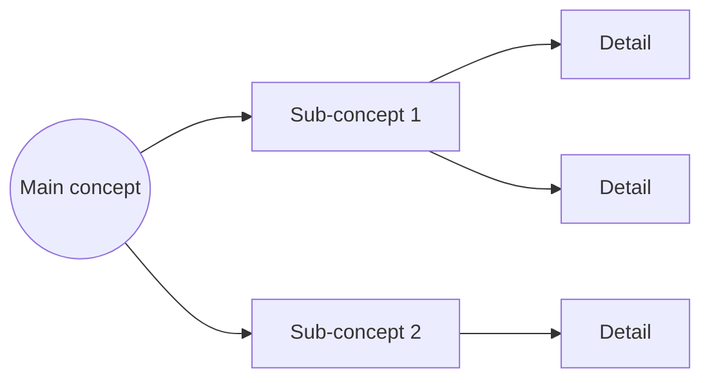

When performing a reading analysis:

1. Read the full document first — do not start writing until you have read everything
2. Be strictly faithful to the content — do not add, interpret beyond what is written, or enrich
3. Do NOT edit or write to any file

## Output structure

Produce three sections in this order:

### Resumen general

A concise summary of the full text in plain language.
- Capture the main ideas, not the details
- Length proportional to the source: short text = short summary, long text = up to 3–4 paragraphs
- Neutral tone, no opinions

### Tabla (only if the content has structured or comparative information)

Include a table only when the source text contains:
- Lists of items with properties
- Comparisons between options
- Step-by-step processes with attributes

If the content does not justify a table, skip this section entirely.

### Mapa conceptual (texto)

A text-based map using indentation and connectors to show hierarchy and relationships.

```
[Main concept]
├── [Sub-concept]
│   ├── [detail]
│   └── [detail]
└── [Sub-concept] → relates to [other concept]
```

### Mapa conceptual (Mermaid — flowchart)

The same map rendered as a Mermaid flowchart for visual preview in VS Code or GitHub.
Always use `flowchart LR` with the spacing init directive.



If you need to see an example of the expected output format, read `references/agents-skills-example.md`.
