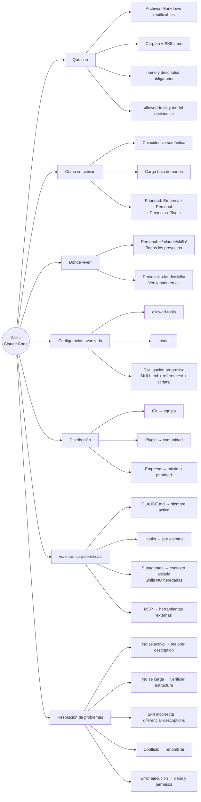

# Example output — Agents_skills.md

This file shows the expected output format when applying the text-reading skill
to `Agents_skills.md`. Use it as a reference for structure, depth, and tone.

---

## Resumen general

Las habilidades (skills) en Claude Code son archivos Markdown que permiten automatizar
comportamientos específicos sin repetir instrucciones manualmente. Cada skill vive en
una carpeta propia con un archivo `SKILL.md` que contiene metadatos (name, description)
e instrucciones. Claude carga solo el nombre y la descripción al inicio, y activa la
skill completa cuando detecta una coincidencia semántica con la solicitud del usuario.

Las skills pueden ser personales (`~/.claude/skills/`) o de proyecto (`.claude/skills/`),
y se distribuyen mediante repositorios Git, plugins o configuración empresarial. Existe
una jerarquía de prioridad: Empresa > Personal > Proyecto > Plugin.

Los campos opcionales `allowed-tools` y `model` permiten restringir herramientas y
especificar el modelo a usar. Para skills complejas, se recomienda divulgación progresiva:
instrucciones principales en `SKILL.md` (menos de 500 líneas) y material de referencia
en archivos separados que se cargan solo cuando son necesarios.

Los subagentes no heredan skills automáticamente; deben declararse explícitamente en
el campo `skills:` del archivo de agente. Los agentes integrados (Explorer, Plan, Verify)
no pueden usar skills en absoluto.

---

## Tabla

| Mecanismo | Cuándo se carga | Activación | Caso de uso |
| --- | --- | --- | --- |
| CLAUDE.md | Siempre, al iniciar conversación | Automática | Reglas permanentes del proyecto |
| Skills | Bajo demanda | Semántica (por solicitud) | Conocimiento especializado por tarea |
| Hooks | Al ocurrir un evento del sistema | Por evento | Automatización (linting, validación) |
| Subagentes | Al ser delegados | Explícita | Tareas en contexto aislado |
| MCP | Al llamar una herramienta | Por herramienta | Integraciones y herramientas externas |

| Ubicación | Ruta | Alcance |
| --- | --- | --- |
| Personal | `~/.claude/skills/` | Todos los proyectos del usuario |
| Proyecto | `.claude/skills/` | Solo el repositorio actual |
| Empresarial | Configuración administrada | Toda la organización |
| Plugin | Marketplace | Comunidad o empresa |

---

## Mapa conceptual (texto)

```text
Skills en Claude Code
├── Qué son
│   ├── Archivos Markdown reutilizables
│   ├── Estructura: carpeta + SKILL.md
│   └── Campos: name y description (obligatorios), allowed-tools y model (opcionales)
├── Cómo se activan
│   ├── Claude carga solo name + description al inicio
│   ├── Coincidencia semántica con la solicitud
│   ├── Confirmación antes de cargar contenido completo
│   └── Prioridad: Empresa › Personal › Proyecto › Plugin
├── Dónde viven
│   ├── Personal → ~/.claude/skills/ (todos los proyectos)
│   └── Proyecto → .claude/skills/ (solo ese repo, versionado en git)
├── Configuración avanzada
│   ├── allowed-tools → restringe herramientas disponibles
│   ├── model → especifica el modelo
│   └── Divulgación progresiva → SKILL.md < 500 líneas + references/ + scripts/
├── Distribución
│   ├── Git → equipo del repositorio
│   ├── Plugin → comunidad
│   └── Empresa → organización completa (máxima prioridad)
├── vs. otras características
│   ├── CLAUDE.md → siempre activo (reglas permanentes)
│   ├── Hooks → activados por eventos del sistema
│   ├── Subagentes → contexto aislado, skills NO heredadas automáticamente
│   └── MCP → herramientas e integraciones externas
└── Resolución de problemas
    ├── No se activa → mejorar description, agregar sinónimos
    ├── No se carga → verificar nombre SKILL.md y ubicación en carpeta
    ├── Skill incorrecta → diferenciar descriptions
    ├── Conflicto de prioridad → renombrar
    └── Error de ejecución → dependencias, permisos (chmod +x), rutas con /
```

## Mapa conceptual (Mermaid — flowchart)


