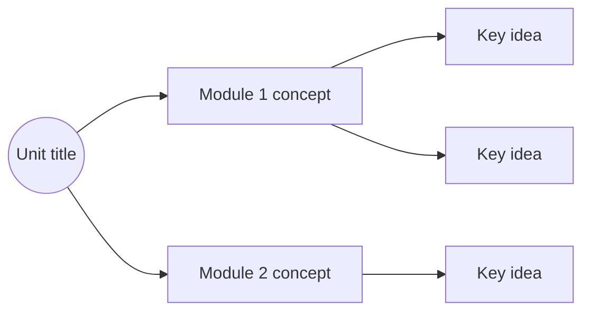

When summarizing course material into a study module:

1. Read the full content before writing anything
2. Add content that is missing but theoretically relevant — don't just synthesize, enrich
3. If you need the detailed module format and template, read `references/module-template.md`

## General rules

- Write in the same language the user is writing in
- Use second person (vos/tú) consistently — match what the user uses
- Explain the WHY, not just the WHAT
- Prefer concrete examples over abstract definitions

## Tables

Always add summary tables for:
- Parameters or configuration fields (name, type, required, purpose)
- Comparisons between options or mechanisms
- Decision guides (when to use X vs Y)

## When appending to an existing file

- Read the file first to check existing heading names
- Never duplicate a heading — add module context to make it unique (e.g. "Repaso — Módulo 3" not just "Repaso")
- Match the style and tone of existing modules
- Add content at the end, after the last module

## Conceptual map (end of file or unit)

At the end of a complete unit or when the user asks for a summary map, generate a Mermaid flowchart covering all modules covered so far.
Always use `flowchart LR` with the spacing init directive.

