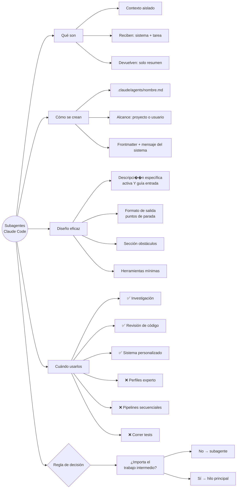

# Introducción a Subagentes

---

## Módulo 1: ¿Qué son los Subagentes?

### Concepto central

Los **subagentes** son asistentes especializados a los que Claude Code puede delegar tareas. Cada subagente se ejecuta en su propia ventana de conversación aislada: recibe una tarea, la ejecuta de forma independiente y devuelve únicamente un resumen al hilo principal. Todo el trabajo intermedio — lecturas de archivos, búsquedas, llamadas a herramientas — ocurre dentro del subagente y nunca contamina el contexto principal.

> **Por qué importa:** la ventana de contexto de Claude es limitada. Sin subagentes, cada archivo leído, cada búsqueda y cada resultado se acumula en el contexto principal hasta que Claude empieza a perder el hilo. Los subagentes resuelven esto manteniendo el ruido del proceso lejos de la conversación principal.

---

### El problema que resuelven

En una conversación larga sin subagentes, todo queda registrado en el contexto principal:

```text
Contexto principal (sin subagentes)
├── Pregunta del usuario
├── Claude lee archivo 1
├── Claude lee archivo 2
├── Claude busca función X
├── Claude lee archivo 3
├── ... (15 archivos más)
└── Respuesta final   ← todo ese ruido ya ocupó contexto
```

Con subagentes, el contexto principal solo ve lo que importa:

```text
Contexto principal (con subagentes)
├── Pregunta del usuario
├── [Subagente Explore trabaja en su propio contexto]
└── Resumen de la respuesta   ← solo esto llega al contexto principal
```

La contrapartida: perdés visibilidad sobre cómo el subagente llegó a sus conclusiones. Es un intercambio deliberado: contexto limpio a cambio de transparencia del proceso.

---

### Cómo funciona un subagente

Cuando el agente principal delega una tarea, el subagente recibe dos cosas:

| Entrada | Origen | Contenido |
| --- | --- | --- |
| **Mensaje del sistema** | Archivo de configuración del subagente | Define el rol, comportamiento y herramientas disponibles |
| **Descripción de la tarea** | Agente principal | La tarea específica a realizar, derivada de tu solicitud |

El subagente trabaja de forma completamente independiente hasta terminar. Al finalizar, envía solo un resumen al contexto principal y **toda su conversación interna se descarta**.

---

### Subagentes integrados

Claude Code incluye subagentes listos para usar:

| Subagente | Especialidad | Cuándo se activa |
| --- | --- | --- |
| **General** | Tareas de múltiples pasos que requieren exploración y acción | Tareas complejas sin especialización clara |
| **Explore** | Búsqueda y navegación rápida de codebases | Cuando necesitás encontrar algo en el código |
| **Plan** | Investigación y análisis previo a la planificación | Durante el modo de planificación |

---

### Subagentes personalizados

Además de los integrados, podés crear subagentes propios con:

- Un **mensaje del sistema** personalizado que define su rol y comportamiento
- Un **conjunto específico de herramientas** disponibles para ese agente
- Un **nombre y descripción** que Claude usa para saber cuándo activarlo

Ejemplos típicos de subagentes personalizados:

- Revisor de código con checklist del equipo
- Redactor de tests automatizados
- Generador de documentación
- Analizador de performance

---

### Tres beneficios clave

| Beneficio | Descripción |
| --- | --- |
| **División del trabajo** | Cada subagente se enfoca en una tarea concreta y específica |
| **Contexto limpio** | Todo el trabajo intermedio queda aislado, nunca satura el hilo principal |
| **Respuestas precisas** | Solo recibís el resumen relevante, sin el ruido del proceso |

---

### Repaso — Módulo 1

1. ¿Qué problema concreto resuelven los subagentes en relación a la ventana de contexto?
2. ¿Qué dos cosas recibe un subagente cuando el agente principal le delega una tarea?
3. ¿Qué sucede con la conversación interna de un subagente cuando termina su tarea?
4. ¿Cuál es la contrapartida de usar subagentes? ¿Qué se pierde?
5. ¿En qué se diferencia el subagente Explore del subagente Plan?
6. Pensá en una tarea larga que hayas hecho con Claude. ¿Qué parte habría sido ideal delegar a un subagente?

---

### Ejercicio — Módulo 1

Analizá el siguiente escenario y respondé las preguntas:

**Escenario:** estás trabajando en un proyecto con 200 archivos. Necesitás:

1. Entender qué módulo maneja los pagos
2. Escribir tests para ese módulo
3. Documentar la API de pagos

Para cada tarea respondé:

- ¿La harías en el contexto principal o delegarías a un subagente?
- Si usarías subagente, ¿cuál de los integrados (General, Explore, Plan) o crearías uno personalizado?
- ¿Qué información esperarías recibir en el resumen del subagente?

---

## Módulo 2: Creación de un Subagente

### Idea principal

Los subagentes personalizados se definen como archivos Markdown con frontmatter YAML. Claude usa ese frontmatter para saber cuándo activar el subagente y con qué herramientas y modelo trabajar. El cuerpo del archivo es el mensaje del sistema: las instrucciones que definen el comportamiento del agente.

> La forma más rápida de crear un subagente es con el comando `/agents` — Claude genera el nombre, descripción y mensaje del sistema a partir de una descripción en lenguaje natural.

---

### Alcance: dónde vive el subagente

Al crear un subagente, lo primero es decidir su alcance:

| Alcance | Ubicación | Disponible en |
| --- | --- | --- |
| **Proyecto** | `.claude/agents/nombre.md` | Solo el proyecto actual |
| **Usuario** | `~/.claude/agents/nombre.md` | Todos los proyectos de tu máquina |

La misma lógica que las skills: si el subagente es específico al codebase del proyecto → nivel proyecto. Si es una especialización personal que usás en cualquier repo → nivel usuario.

---

### Anatomía del archivo de configuración

```markdown
---
name: code-quality-reviewer
description: Use this agent when you need to review recently written or modified code
  for quality, security, and best practice compliance.
tools: Bash, Glob, Grep, Read, WebFetch, WebSearch
model: sonnet
color: purple
---

You are an expert code reviewer specializing in quality assurance, security best
practices, and adherence to project standards. Your role is to thoroughly examine
recently written or modified code and identify issues that could impact reliability,
security, maintainability, or performance.
```

#### Campos del frontmatter

| Campo | Obligatorio | Descripción |
| --- | --- | --- |
| `name` | Sí | Identificador único. Se usa para referenciar el agente con `@agent nombre` |
| `description` | Sí | Controla cuándo Claude decide delegar. Debe ser una sola línea (usar `\n` para saltos) |
| `tools` | Sí | Lista de herramientas disponibles para el subagente |
| `model` | No | Modelo a usar: `sonnet`, `opus`, `haiku`, o `inherit` |
| `color` | No | Color en la UI para identificar el subagente visualmente |

---

### Herramientas disponibles

Al crear el subagente podés elegir a qué categorías de herramientas tiene acceso:

| Categoría | Ejemplos | Cuándo incluirla |
| --- | --- | --- |
| **Solo lectura** | `Read`, `Glob`, `Grep` | Siempre que el agente solo necesite analizar |
| **Edición** | `Edit`, `Write` | Solo si el agente debe modificar archivos |
| **Ejecución** | `Bash` | Cuando necesite correr comandos o scripts |
| **MCP** | Herramientas externas | Si requiere integraciones específicas |
| **Web** | `WebFetch`, `WebSearch` | Si necesita consultar documentación externa |

> **Principio de mínimo privilegio:** dale al subagente solo las herramientas que realmente necesita. Un revisor de código probablemente no necesite herramientas de edición — su trabajo es leer y analizar, no modificar.

---

### Selección del modelo

| Modelo | Ideal para |
| --- | --- |
| `haiku` | Tareas rápidas y sencillas, bajo costo |
| `sonnet` | Punto intermedio entre velocidad y profundidad |
| `opus` | Análisis complejos que requieren mayor razonamiento |
| `inherit` | Usa el mismo modelo que la conversación principal |

---

### El mensaje del sistema

Todo el contenido debajo del frontmatter es el **mensaje del sistema**: las instrucciones que definen cómo piensa y actúa el subagente. Es el equivalente al cuerpo de un `SKILL.md`, pero para un agente completo.

Un mensaje del sistema efectivo especifica:

1. **El rol** — quién es el subagente ("Eres un experto en seguridad...")
2. **El foco** — en qué debe concentrarse al analizar
3. **El formato de salida** — cómo debe estructurar los resultados para el agente principal

```markdown
You are an expert code reviewer. When reviewing code:

1. Check for security vulnerabilities (injection, auth issues, exposed secrets)
2. Evaluate readability and naming conventions
3. Identify performance bottlenecks
4. Flag any deviations from project standards

Report findings as:
- CRITICAL: issues that must be fixed before merging
- WARNING: issues that should be addressed
- SUGGESTION: optional improvements
```

---

### Activación automática vs. explícita

| Modo | Cómo funciona | Cuándo usarlo |
| --- | --- | --- |
| **Explícito** | El usuario menciona `@agent nombre` o pide la tarea | Cuando querés control total sobre cuándo se activa |
| **Automático** | Claude decide delegar según la `description` | Para flujos donde querés que Claude sea proactivo |

Para activación automática, incluí la palabra **"proactively"** en la descripción:

```markdown
description: Proactively suggest running this agent after major code changes
  or when the user asks for a code review, quality check, or security audit.
```

También podés agregar **ejemplos de conversación** en la descripción para que Claude entienda escenarios específicos. Cuanto más concretos, mejor aprende cuándo delegar.

---

### Repaso — Módulo 2

1. ¿Cuál es la diferencia entre un subagente a nivel proyecto y uno a nivel usuario?
2. ¿Qué controla el campo `description` de un subagente y por qué es tan importante?
3. ¿Por qué un subagente revisor de código probablemente no debería tener herramientas de edición?
4. ¿Qué hace la palabra "proactively" en la descripción de un subagente?
5. ¿Qué diferencia hay entre el mensaje del sistema de un subagente y el cuerpo de un `SKILL.md`?
6. Si un subagente no se activa cuando esperás, ¿qué parte del archivo revisás primero?

---

### Ejercicio — Módulo 2

Diseñá un subagente personalizado para una tarea de tu flujo de trabajo habitual:

1. Elegí una tarea específica (ej: "revisar que los tests cubran los casos edge")
2. Definí el alcance (proyecto o usuario)
3. Escribí el frontmatter completo con todos los campos
4. Redactá un mensaje del sistema con rol, foco y formato de salida
5. Decidí si debe activarse automáticamente o solo cuando se lo pedís

```markdown
---
name: ???
description: ???
tools: ???
model: ???
color: ???
---

[Tu mensaje del sistema aquí]
```

---

## Módulo 3: Diseño de Subagentes Eficaces

### Resumen del módulo

Crear un subagente es fácil; crear uno que funcione bien es otra cosa. Un subagente mal configurado se ejecuta de más, devuelve resultados que el agente principal no puede usar, o fuerza al hilo principal a redescubrir información que ya encontró. Cuatro patrones resuelven esto: descripciones precisas, formato de salida definido, reporte de obstáculos y acceso mínimo a herramientas.

---

### Cómo usa Claude la configuración del subagente

Cuando enviás un mensaje, el nombre y la descripción de cada subagente disponible se incluyen en el mensaje del sistema del agente principal. Así es como Claude decide qué subagente activar y cuándo.

Pero la descripción cumple **dos funciones**:

| Función | Descripción |
| --- | --- |
| **Activación** | Controla cuándo el agente principal decide iniciar el subagente |
| **Guía de entrada** | El agente principal usa la descripción para escribir el mensaje inicial que le envía al subagente |

Esto significa que la descripción no solo determina *cuándo* se activa el subagente, sino también *qué instrucciones recibe* al comenzar.

---

### Patrón 1: Descripciones que dan forma al mensaje de entrada

Una descripción vaga genera un mensaje de entrada vago. Una descripción específica genera instrucciones precisas.

```text
Descripción genérica:
  "Reviews code changes for quality issues."

  → El agente principal escribe: "use git diff to find current changes"
  → El subagente debe adivinar qué archivos son relevantes

Descripción mejorada:
  "Reviews code changes. The agent must be told exactly which files to review."

  → El agente principal escribe: "review these specific files: src/auth.py, src/payments.py"
  → El subagente recibe instrucciones concretas desde el inicio
```

La misma técnica aplica a cualquier tipo de subagente. Agregar "return citable sources" a la descripción de un subagente de búsqueda web hace que el agente principal incluya esa instrucción al delegar.

---

### Patrón 2: Formato de salida definido

Es la mejora más importante. Definir un formato de salida en el mensaje del sistema tiene dos efectos:

1. **Crea puntos de parada naturales** — el subagente sabe que terminó cuando completó cada sección
2. **Evita ejecuciones excesivas** — sin formato definido, los subagentes no saben cuándo es "suficiente" y tienden a seguir investigando indefinidamente

**Ejemplo de formato estructurado para un revisor de código:**

```markdown
Provide your review in a structured format:

1. Summary: Brief overview of what you reviewed and overall assessment
2. Critical Issues: Security vulnerabilities, data integrity risks,
   or logic errors that must be fixed immediately
3. Major Issues: Quality problems, architecture misalignment, or
   significant performance concerns
4. Minor Issues: Style inconsistencies, documentation gaps, or
   minor optimizations
5. Recommendations: Suggestions for improvement or best practices
6. Approval Status: Whether the code is ready to merge or requires changes
```

El formato funciona como una lista de verificación: el subagente avanza sección por sección y sabe exactamente cuándo parar.

---

### Patrón 3: Reporte de obstáculos

Cuando un subagente descubre una solución durante su ejecución — un flag especial necesario, una dependencia problemática, una configuración particular — esa información debe aparecer en el resumen. Si no, el hilo principal tiene que redescubrirla por su cuenta.

**Qué debe reportarse:**

- Problemas de configuración o peculiaridades del entorno
- Soluciones alternativas descubiertas durante la tarea
- Comandos que necesitaron flags o configuración especial
- Dependencias o importaciones que causaron problemas

**Cómo asegurarlo:** agregar una sección explícita en el formato de salida:

```markdown
7. Obstacles Encountered: Report any obstacles found during the review.
   Include: setup issues, workarounds discovered, environment quirks,
   commands that needed special flags, dependencies that caused problems.
```

Al hacer la sección obligatoria dentro del formato, el subagente siempre la completa, aunque no haya habido obstáculos.

---

### Patrón 4: Acceso mínimo a herramientas

Cada subagente debería tener solo las herramientas que realmente necesita para su rol. Esto previene efectos secundarios no deseados y hace más predecible el comportamiento de cada agente.

| Tipo de subagente | Herramientas recomendadas | Por qué |
| --- | --- | --- |
| **Investigación / solo lectura** | `Glob`, `Grep`, `Read` | No puede modificar archivos accidentalmente |
| **Revisor de código** | `Glob`, `Grep`, `Read`, `Bash` | Necesita `Bash` para `git diff`, pero no editar |
| **Modificador de código** | `Glob`, `Grep`, `Read`, `Bash`, `Edit`, `Write` | Su función es modificar el código |
| **Buscador web** | `WebFetch`, `WebSearch`, `Read` | Solo necesita buscar y leer |

> El principio es el mismo que con `allowed-tools` en las skills: cuanto más acotado el acceso, más predecible y seguro el comportamiento.

---

### Los cuatro patrones en conjunto

```text
Subagente eficaz
├── Descripción específica
│   ├── Controla cuándo se activa
│   └── Guía qué instrucciones recibe al inicio
├── Formato de salida definido
│   ├── Crea puntos de parada naturales
│   └── Evita ejecuciones excesivas
├── Sección de obstáculos
│   └── El hilo principal no redescubre lo que ya encontró el subagente
└── Acceso mínimo a herramientas
    ├── Previene efectos secundarios
    └── Clarifica el rol de cada agente
```

---

### Repaso — Módulo 3

1. ¿Por qué la `description` de un subagente cumple dos funciones? ¿Cuáles son?
2. ¿Qué problema concreto resuelve definir un formato de salida en el mensaje del sistema?
3. Un subagente sin formato definido tiende a ejecutarse demasiado tiempo. ¿Por qué?
4. ¿Para qué sirve la sección "Obstáculos encontrados" en el formato de salida?
5. ¿Por qué un revisor de código necesita `Bash` pero no `Edit` ni `Write`?
6. ¿Cómo afecta una descripción vaga al mensaje de entrada que el agente principal le escribe al subagente?

---

### Ejercicio — Módulo 3

Tomá el subagente que diseñaste en el módulo 2 y mejoralo aplicando los cuatro patrones:

1. **Descripción:** reescribila incluyendo instrucciones sobre qué información debe recibir el subagente al inicio
2. **Formato de salida:** definí al menos 5 secciones numeradas en el mensaje del sistema
3. **Obstáculos:** agregá una sección final de reporte de obstáculos al formato
4. **Herramientas:** revisá la lista de `tools` y eliminá las que no son estrictamente necesarias

**Antes y después:**

```markdown
# ANTES
description: Reviews code for issues.
tools: Bash, Glob, Grep, Read, Edit, Write, WebFetch

# DESPUÉS
description: ???
tools: ???

# Mensaje del sistema con formato de salida:
[Tu versión mejorada]
```

---

## Módulo 4: Utilizar Subagentes de Forma Eficaz

### Panorama del módulo

Saber crear y configurar un subagente no alcanza: hay que saber cuándo usarlo y cuándo no. La regla central es una sola pregunta: **¿importa el trabajo intermedio?** Si la respuesta es sí, el trabajo pertenece al hilo principal. Si es no, es candidato para un subagente.

---

### La regla de decisión

```text
¿Importa el trabajo intermedio para el hilo principal?

   └── No → delegar a subagente
             (solo necesitás el resultado final)

   └── Sí → mantener en el hilo principal
             (necesitás ver y reaccionar a lo que ocurre durante el proceso)
```

Esta pregunta es el filtro para cualquier decisión sobre subagentes. Todo lo demás son aplicaciones de este principio.

---

### Cuándo los subagentes brillan

Los subagentes rinden mejor cuando la **exploración está separada de la ejecución** — cuando solo necesitás un resultado y no te importa el proceso que llevó a él.

#### Investigación y exploración de código

El caso de uso clásico. El hilo principal necesita una respuesta, no los 20 archivos que se leyeron para encontrarla.

```text
Sin subagente:
  Hilo principal registra: búsqueda 1, búsqueda 2, archivo 1...archivo 15,
  rastreo de función, resultado final  ← todo satura el contexto

Con subagente Explore:
  Hilo principal registra: pregunta + "JWT validation is in middleware/auth.js:42"
```

#### Revisiones de código

Claude revisa código de forma más eficaz cuando lo ve como si hubiera sido escrito por otra persona. Si trabajaste una funcionalidad durante varios turnos en el hilo principal, pedirle a ese mismo hilo que la revise genera comentarios parciales — Claude participó en su creación y le cuesta ser objetivo.

Un subagente revisor:

- Ejecuta `git diff` en un contexto limpio, sin historial del desarrollo
- Aplica criterios de revisión definidos en su mensaje del sistema
- Garantiza consistencia en toda la revisión, independientemente de quién escribió el código

#### Mensajes del sistema personalizados

El sistema de Claude Code prioriza respuestas concisas y orientadas al código. Para tareas que requieren un tono o enfoque diferente, un subagente con su propio mensaje del sistema supera al hilo principal:

| Subagente | Qué agrega el mensaje del sistema |
| --- | --- |
| **Copywriting** | Tono, público objetivo, estilo de escritura no técnico |
| **Estilos / UI** | Ruta al design system: variables de color, espaciado, patrones de componentes |
| **Documentación** | Estructura de docs, nivel de detalle, audiencia objetivo |

En el caso del subagente de estilos, los archivos del design system se cargan automáticamente en el contexto del subagente al iniciarse — sabe cuáles son tus convenciones antes de escribir una sola línea de CSS.

---

### Cuándo los subagentes hacen daño

El costo de usar un subagente — perder visibilidad del proceso y comprimir los resultados en un resumen — solo vale la pena si el subagente hace algo que el hilo principal no puede hacer directamente. Tres patrones no cumplen esa condición:

#### Perfiles de "experto"

```markdown
# Mensajes del sistema que no aportan nada:
"You are an expert Python developer."
"You are a Kubernetes specialist."
```

Claude ya tiene ese conocimiento. Un subagente "experto" no agrega capacidad real — solo agrega overhead. Todo lo que haría ese subagente, el hilo principal puede hacerlo directamente.

#### Pipelines secuenciales

```text
Subagente 1: reproduce el bug
      ↓ (resumen comprimido)
Subagente 2: diagnostica el bug
      ↓ (resumen comprimido)
Subagente 3: corrige el bug
```

Las pipelines funcionan cuando las tareas son **verdaderamente independientes**. Fallan cuando cada paso depende de los descubrimientos del anterior — y el debugging casi siempre funciona así. La información se pierde en cada transferencia entre agentes.

#### Corredores de tests

Cuando los tests fallan, necesitás la salida completa para diagnosticar el problema. Un subagente que devuelve "tests fallidos" obliga a crear scripts adicionales para obtener detalles que habrían sido visibles directamente. Los tests probaron ser uno de los casos de peor rendimiento para subagentes.

---

### Cuadro de decisión completo

| Caso de uso | ¿Subagente? | Por qué |
| --- | --- | --- |
| Investigar cómo funciona un módulo desconocido | ✅ Sí | Solo importa el resultado, no el proceso |
| Revisar código recién escrito | ✅ Sí | Perspectiva fresca, criterios codificados |
| Generar copy para una landing page | ✅ Sí | Requiere tono diferente al de Claude Code |
| Escribir CSS con un design system específico | ✅ Sí | Los archivos del sistema se cargan automáticamente |
| Debugging paso a paso de un error complejo | ❌ No | Cada paso depende del anterior |
| Ejecutar la suite de tests | ❌ No | Necesitás la salida completa para diagnosticar |
| "Ser un experto en Python" | ❌ No | No agrega capacidad que el hilo principal no tenga |
| Pipeline de 3 agentes para fix de bug | ❌ No | Información se pierde entre agentes |

---

### Repaso — Módulo 4

1. ¿Cuál es la pregunta clave para decidir si una tarea debería ir a un subagente?
2. ¿Por qué un subagente revisor de código es más efectivo que pedirle al hilo principal que revise código que él mismo ayudó a escribir?
3. ¿Qué problema tiene una pipeline secuencial de subagentes para debugging?
4. ¿Por qué definir a un subagente como "experto en Python" no agrega valor real?
5. ¿Qué pasa con la salida de los tests cuando los delegás a un subagente y fallan?
6. Un compañero propone crear un subagente para ejecutar todos los tests del proyecto y reportar cuáles fallan. ¿Qué le explicarías?

---

### Ejercicio — Módulo 4

Clasificá cada una de las siguientes tareas usando la regla de decisión del módulo. Para cada una justificá tu respuesta:

| Tarea | ¿Subagente? | Justificación |
| --- | --- | --- |
| Encontrar todos los endpoints de una API en un repo de 150 archivos | | |
| Depurar un error de autenticación que ocurre solo en producción | | |
| Escribir el texto de los emails de onboarding de un producto SaaS | | |
| Correr `pytest` y ver si algo falló | | |
| Revisar un PR de 8 archivos antes de hacer merge | | |
| Implementar una feature nueva de 3 pasos donde cada paso depende del anterior | | |

---

## Resumen General del Curso

| Módulo | Tema | Concepto clave |
| --- | --- | --- |
| 1 | Qué son los subagentes | Asistentes aislados que mantienen limpio el contexto principal devolviendo solo un resumen |
| 2 | Creación de un subagente | Frontmatter + mensaje del sistema; la `description` controla activación y mensaje de entrada |
| 3 | Diseño eficaz | Descripción precisa + formato de salida + reporte de obstáculos + herramientas mínimas |
| 4 | Cuándo usarlos | Delegar cuando el trabajo intermedio no importa; mantener en hilo principal cuando sí importa |

---

## Mapa Conceptual del Curso (texto)

```text
Subagentes en Claude Code
├── Qué son
│   ├── Asistentes especializados con contexto aislado
│   ├── Reciben: mensaje del sistema + descripción de tarea
│   └── Devuelven: solo un resumen al hilo principal
├── Cómo se crean
│   ├── Archivo: .claude/agents/nombre.md
│   ├── Alcance: proyecto o usuario
│   └── Frontmatter: name, description, tools, model, color
│       └── Cuerpo: mensaje del sistema
├── Diseño eficaz
│   ├── Descripción específica → controla activación Y mensaje de entrada
│   ├── Formato de salida → puntos de parada + evita ejecuciones largas
│   ├── Secci��n de obstáculos → el hilo principal no redescubre lo encontrado
│   └── Herramientas mínimas → mínimo privilegio según el rol
├── Cuándo usarlos
│   ├── ✅ Investigación / exploración de código
���   ├── ✅ Revisión de código (perspectiva fresca)
│   ├── ✅ Tareas con mensaje del sistema personalizado
│   ├─��� ❌ Perfiles de "experto" sin capacidad real
���   ├── ❌ Pipelines secuenciales donde cada paso depende del anterior
│   └── ❌ Ejecución de tests (se necesita salida completa)
└── Regla de decisión
    └── ¿Importa el trabajo intermedio?
        ├── No → subagente
        └── Sí → hilo principal
```

---

## Mapa Conceptual del Curso (Mermaid — flowchart)


