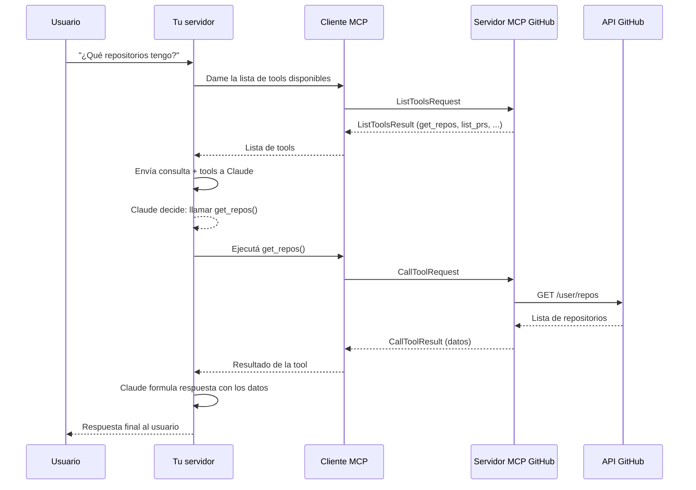
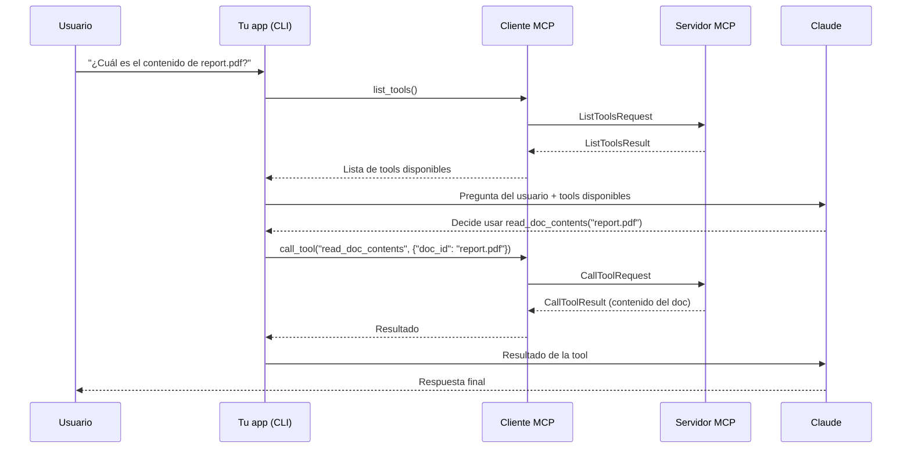
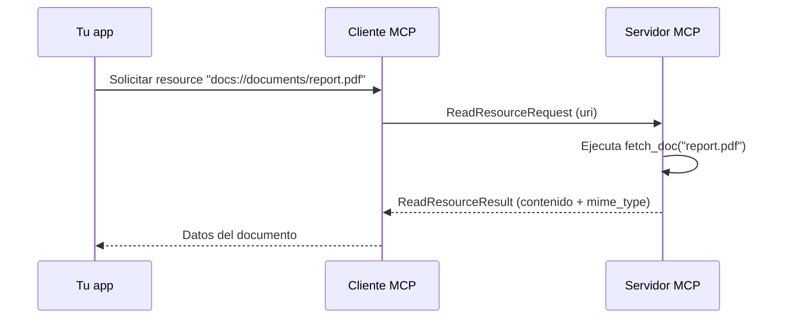
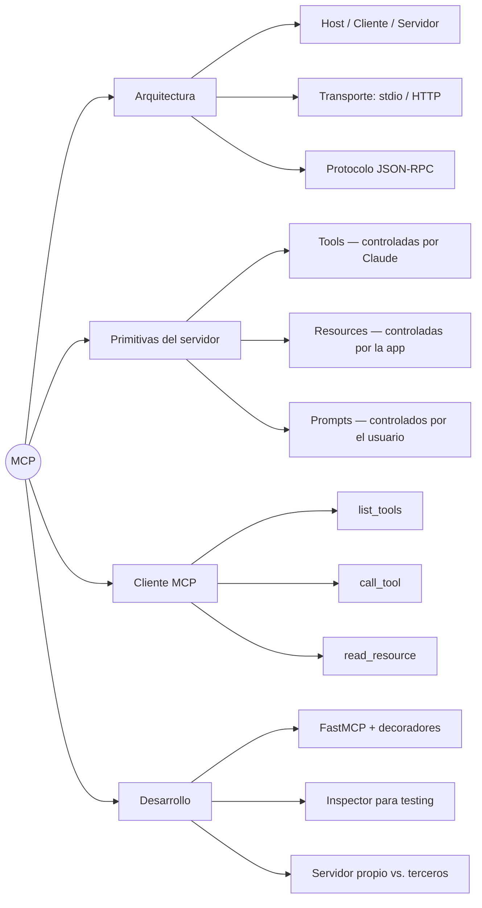

# MCP — Curso de Anthropic

> Resumen del curso oficial de Anthropic sobre el Protocolo de Contexto de Modelo

---

## Unidad 1 — Introducción a MCP

---

### Módulo 1 — ¿Qué es MCP y qué problema resuelve?

MCP (Model Context Protocol) es una **capa de comunicación estandarizada** que le da a Claude acceso a herramientas y datos externos sin que vos tengas que escribir todo el código de integración. En lugar de que tu servidor implemente cada tool desde cero, delegás esa responsabilidad a servidores MCP especializados.

La idea central: trasladar la carga de definir y ejecutar herramientas desde tu aplicación hacia servidores dedicados que ya hicieron ese trabajo.

---

#### El problema que resuelve

Imaginá que estás construyendo un chat donde los usuarios le preguntan a Claude sobre sus datos de GitHub. Un usuario pregunta: *"¿Qué pull requests abiertas tengo en todos mis repositorios?"*

Sin MCP, necesitarías:

- Definir manualmente los schemas de todas las tools de GitHub
- Escribir las funciones que ejecutan esas tools
- Conectarte directamente a la API de GitHub
- Mantener todo ese código a medida que la API cambia

GitHub tiene repositorios, pull requests, issues, proyectos, actions, releases... Eso es una cantidad enorme de código de integración que vos tendrías que escribir, testear y mantener.

**Con MCP:** un servidor MCP de GitHub ya implementó todo eso. Tu aplicación se conecta al servidor y listo — las tools ya están definidas y funcionando.

---

#### Cómo funciona en la práctica

```text
Tu aplicación (cliente MCP)
        ↕
Servidor MCP de GitHub
        ↕
API de GitHub
```

Tu servidor no habla directamente con GitHub. Habla con el servidor MCP, que actúa como intermediario especializado. El servidor MCP expone tools como `get_repos()`, `list_pull_requests()`, `create_issue()` — ya implementadas, con sus schemas, listas para que Claude las use.

---

#### Qué expone un servidor MCP

Cada servidor MCP puede exponer tres tipos de cosas:

| Tipo | Descripción | Ejemplo |
| --- | --- | --- |
| **Tools** | Funciones ejecutables que Claude puede invocar | `get_repos()`, `create_pr()` |
| **Resources** | Datos o contenido que Claude puede leer | Archivos, documentos, datasets |
| **Prompts** | Templates predefinidos para interacciones | Instrucciones de sistema especializadas |

---

#### Preguntas frecuentes del módulo

**¿Quién crea los servidores MCP?**
Cualquiera puede hacerlo. Frecuentemente los propios proveedores del servicio crean implementaciones oficiales — por ejemplo, AWS puede lanzar un servidor MCP con tools para sus servicios.

**¿No es lo mismo que llamar una API directamente?**
No. Llamar una API directamente implica que vos definís los schemas y las funciones. MCP te da todo eso ya hecho — alguien más ya implementó las tools.

**¿MCP es lo mismo que el uso de herramientas (tool use)?**
Son conceptos complementarios pero distintos. El **tool use** es cómo Claude llama herramientas. **MCP** es quién define e implementa esas herramientas. La diferencia clave: con MCP, otra persona ya hizo el trabajo de implementación — vos solo conectás.

---

> **Idea clave del módulo:** MCP no reemplaza el tool use — lo potencia. En lugar de que vos escribas y mantengas todas las integraciones, aprovechás servidores MCP que ya se encargan del trabajo pesado.

---

### Módulo 2 — El cliente MCP

El cliente MCP es el puente de comunicación entre tu servidor y los servidores MCP externos. Es la pieza de código que habla el protocolo MCP — gestiona el intercambio de mensajes y los detalles del protocolo para que tu aplicación no tenga que hacerlo.

---

#### Independencia del transporte

Una ventaja clave de MCP es que el cliente y el servidor pueden comunicarse por diferentes mecanismos según la configuración:

| Transporte | Cuándo se usa |
| --- | --- |
| **stdio (stdin/stdout)** | Cliente y servidor en la misma máquina — el caso más común en desarrollo local |
| **HTTP** | Servidor MCP remoto accesible por red |
| **WebSockets** | Comunicación bidireccional en tiempo real |

Tu código no cambia según el transporte — el cliente MCP abstrae esa diferencia.

---

#### Tipos de mensajes del protocolo

El cliente y el servidor intercambian mensajes definidos en la especificación MCP. Los dos más importantes:

| Mensaje | Dirección | Qué hace |
| --- | --- | --- |
| `ListToolsRequest` / `ListToolsResult` | Cliente → Servidor | El cliente pregunta "¿qué tools tenés?" y recibe la lista |
| `CallToolRequest` / `CallToolResult` | Cliente → Servidor | El cliente pide ejecutar una tool específica con sus argumentos y recibe el resultado |

---

#### El flujo completo — ejemplo con GitHub

Usuario pregunta: *"¿Qué repositorios tengo?"*



---

#### Los tres actores y su rol en el flujo

| Actor | Responsabilidad |
| --- | --- |
| **Tu servidor** | Recibe la pregunta del usuario, coordina con Claude, pide al cliente que ejecute tools |
| **Cliente MCP** | Habla el protocolo: envía `ListToolsRequest` y `CallToolRequest`, devuelve resultados |
| **Servidor MCP** | Tiene las tools implementadas, llama a la API externa, devuelve el resultado |

El cliente MCP es transparente para tu lógica de negocio — vos pedís "ejecutá esta tool con estos args" y él se encarga de todo el protocolo por debajo.

---

> **Idea clave del módulo:** El cliente MCP desacopla tu aplicación del protocolo. Tu servidor trabaja con herramientas como si fueran funciones locales — el cliente se encarga de que en realidad se ejecuten en un servidor remoto especializado.

---

## Unidad 3 — Experiencia práctica

---

### Módulo 1 — Definir herramientas con MCP

El SDK de Python para MCP transforma la creación de tools: en lugar de escribir schemas JSON complejos a mano, usás decoradores de Python y el SDK genera todo lo necesario automáticamente.

---

#### Configuración del servidor

Inicializar un servidor MCP toma una sola línea:

```python
from mcp.server.fastmcp import FastMCP

mcp = FastMCP("DocumentMCP", log_level="ERROR")
```

`FastMCP` es la clase del SDK que abstrae toda la infraestructura del protocolo. El primer argumento es el nombre del servidor; `log_level="ERROR"` silencia logs de debug que interferirían con el transporte stdio.

---

#### Estructura de datos del servidor

En este ejemplo, los documentos viven en un diccionario en memoria — las claves son los IDs y los valores son el contenido:

```python
docs = {
    "deposition.md": "This deposition covers the testimony of Angela Smith, P.E.",
    "report.pdf": "The report details the state of a 20m condenser tower.",
    "financials.docx": "These financials outline the project's budget and expenditures",
    "outlook.pdf": "This document presents the projected future performance of the system",
    "plan.md": "The plan outlines the steps for the project's implementation.",
    "spec.txt": "These specifications define the technical requirements for the equipment"
}
```

En producción esto sería una base de datos o un filesystem, pero el patrón de acceso que expone el servidor MCP es el mismo.

---

#### Definir tools con decoradores

El SDK usa el decorador `@mcp.tool()` para registrar funciones como tools. No necesitás escribir el schema JSON — el SDK lo genera a partir de los type hints y los `Field` de Pydantic.

**Tool de lectura:**

```python
@mcp.tool(
    name="read_doc_contents",
    description="Read the contents of a document and return it as a string."
)
def read_document(
    doc_id: str = Field(description="Id of the document to read")
):
    if doc_id not in docs:
        raise ValueError(f"Doc with id {doc_id} not found")

    return docs[doc_id]
```

**Tool de edición (búsqueda y reemplazo):**

```python
@mcp.tool(
    name="edit_document",
    description="Edit a document by replacing a string in the documents content with a new string."
)
def edit_document(
    doc_id: str = Field(description="Id of the document that will be edited"),
    old_str: str = Field(description="The text to replace. Must match exactly, including whitespace."),
    new_str: str = Field(description="The new text to insert in place of the old text.")
):
    if doc_id not in docs:
        raise ValueError(f"Doc with id {doc_id} not found")

    docs[doc_id] = docs[doc_id].replace(old_str, new_str)
```

---

#### Anatomía de una tool MCP

| Componente | Qué hace | Ejemplo |
| --- | --- | --- |
| `@mcp.tool(name=...)` | Registra la función como tool y define su nombre público | `"read_doc_contents"` |
| `description=` | Le dice a Claude para qué sirve la tool — es parte del schema | `"Read the contents..."` |
| Type hints (`str`) | Definen el tipo del parámetro — el SDK los convierte al schema JSON | `doc_id: str` |
| `Field(description=)` | Describe cada parámetro para que Claude entienda qué espera | `"Id of the document"` |
| Cuerpo de la función | La lógica real que se ejecuta cuando Claude invoca la tool | `return docs[doc_id]` |

---

#### Ventajas del enfoque con SDK

| Sin SDK | Con SDK |
| --- | --- |
| Escribir schema JSON manualmente | El SDK lo genera a partir de type hints |
| Registrar cada tool explícitamente | El decorador hace el registro automáticamente |
| Validar parámetros a mano | Pydantic valida automáticamente |
| Documentar parámetros en el schema | `Field(description=)` lo hace inline |

---

> **Idea clave del módulo:** Las descripciones importan. Tanto `description=` del decorador como `Field(description=)` de cada parámetro son lo que Claude lee para entender cuándo y cómo usar la tool. Escribirlas con claridad es tan importante como la implementación.

---

### Módulo 2 — El Inspector del servidor MCP

Al construir servidores MCP necesitás una forma de probarlos sin conectarte a una aplicación completa. El SDK de Python incluye un inspector integrado basado en navegador que te permite depurar y testear tu servidor en tiempo real.

---

#### Levantar el inspector

Con el entorno Python activado, ejecutar:

```bash
mcp dev mcp_server.py
```

Esto inicia un servidor de desarrollo y te da una URL local, típicamente `http://127.0.0.1:6274`. Abrís esa URL en el navegador y accedés al Inspector de MCP.

---

#### Interfaz del inspector

| Elemento | Qué hace |
| --- | --- |
| Botón **Connect** | Inicializa y conecta el servidor MCP |
| Tab **Tools** | Lista todas las tools disponibles y permite ejecutarlas |
| Tab **Resources** | Muestra los resources expuestos por el servidor |
| Tab **Prompts** | Muestra los prompt templates disponibles |
| Panel derecho | Muestra detalles y campos de input de la tool seleccionada |

Al hacer clic en **Connect** el estado pasa de "Disconnected" a "Connected" — recién ahí el servidor está listo para recibir llamadas.

---

#### Flujo de prueba de una tool

Para probar la tool `read_doc_contents` del módulo anterior:

1. Ir al tab **Tools** → clic en "List Tools"
2. Seleccionar `read_doc_contents` en la lista
3. Ingresar el ID del documento (ej. `"deposition.md"`) en el campo de input
4. Clic en "Run Tool"
5. Verificar el resultado: el inspector muestra el estado de éxito y los datos devueltos

Para testear un flujo completo de edición + lectura:

1. Ejecutar `edit_document` con un cambio específico
2. Ejecutar inmediatamente `read_doc_contents` sobre el mismo documento
3. Verificar que el cambio se aplicó — el inspector mantiene el estado del servidor entre llamadas

---

#### Por qué usar el inspector en lugar de scripts de prueba

| Enfoque | Problema |
| --- | --- |
| Scripts de prueba separados | Hay que escribirlos y mantenerlos |
| Conectar a la app completa | Ciclo lento: cambio → rebuild → prueba |
| **Inspector MCP** | Feedback inmediato, sin código extra, mantiene estado entre llamadas |

El inspector se convierte en la herramienta central del ciclo de desarrollo: implementás una tool, la probás en el inspector, ajustás, repetís. Esto permite detectar problemas de schema, validación o lógica antes de integrar con ningún cliente.

---

> **Idea clave del módulo:** El inspector es para servidores MCP lo que Postman es para APIs REST — te permite probar cada endpoint de forma aislada, con inputs controlados, antes de integrarlo en el sistema completo.

---

## Unidad 4 — Conectando con clientes MCP

---

### Módulo 1 — Implementación de un cliente

Con el servidor MCP funcionando, el siguiente paso es construir el cliente — la pieza que permite que tu aplicación se comunique con el servidor y acceda a sus tools.

---

#### Arquitectura del cliente

El cliente MCP tiene dos componentes que conviven en tu código:

| Componente | Qué es | Quién lo escribe |
| --- | --- | --- |
| **Clase cliente propia** | Wrapper que facilita el uso de la sesión y maneja la limpieza de recursos | Vos |
| **Sesión del cliente** | La conexión real con el servidor MCP | SDK de Python |

La sesión requiere gestión cuidadosa de recursos — hay que cerrar las conexiones correctamente al terminar. Por eso se encapsula en una clase propia que maneja esa limpieza automáticamente.

---

#### Las dos funciones esenciales del cliente

**`list_tools()` — obtener las tools disponibles del servidor:**

```python
async def list_tools(self) -> list[types.Tool]:
    result = await self.session().list_tools()
    return result.tools
```

Accede a la sesión, llama al método integrado `list_tools()` del SDK y devuelve la lista de tools. Esta lista es la que después se le pasa a Claude para que sepa qué puede usar.

**`call_tool()` — ejecutar una tool específica:**

```python
async def call_tool(
    self, tool_name: str, tool_input: dict
) -> types.CallToolResult | None:
    return await self.session().call_tool(tool_name, tool_input)
```

Recibe el nombre de la tool y sus parámetros (que Claude determina), los manda al servidor y devuelve el resultado.

---

#### Cómo encaja el cliente en el flujo completo

El cliente interviene en dos momentos clave del flujo de la aplicación:



---

#### Probar el cliente en aislamiento

Antes de correr la app completa, se puede verificar que el cliente conecta correctamente al servidor:

```bash
uv run mcp_client.py
```

Esto se conecta al servidor MCP e imprime las tools disponibles con sus schemas. Si la salida muestra las tools definidas en el servidor, el cliente está funcionando.

Luego, para probar el flujo completo con Claude:

```bash
uv run main.py
```

---

#### Resumen de responsabilidades

| Componente | Responsabilidad |
| --- | --- |
| **Tu app / CLI** | Coordina el flujo: recibe la pregunta, llama al cliente, pasa tools a Claude, ejecuta lo que Claude pide |
| **Cliente MCP** | Habla el protocolo: `list_tools()` y `call_tool()` — abstrae los detalles de la sesión |
| **Servidor MCP** | Ejecuta las tools reales y devuelve resultados |
| **Claude** | Decide qué tool usar y con qué argumentos según la pregunta del usuario |

---

> **Idea clave del módulo:** El cliente MCP tiene exactamente dos responsabilidades: obtener la lista de tools y ejecutarlas. Todo lo demás — decidir cuándo usarlas, con qué argumentos, cómo interpretar el resultado — es responsabilidad de Claude y de tu app.

---

### Módulo 2 — Definir recursos

Los recursos en MCP permiten exponer datos de solo lectura a los clientes — son el equivalente a los endpoints `GET` de una API REST. A diferencia de las tools (que ejecutan acciones), los resources simplemente devuelven datos cuando se los solicita.

---

#### Cuándo usar resources vs. tools

| Situación | Usar |
| --- | --- |
| Obtener información sin efectos secundarios | **Resource** |
| Ejecutar una acción o modificar algo | **Tool** |
| Listar elementos disponibles | **Resource** |
| Editar, crear, eliminar | **Tool** |

Un buen ejemplo: la feature de mencionar documentos con `@document_name`. Cuando el usuario escribe `@report.pdf`, el sistema necesita dos operaciones de solo lectura — listar los documentos disponibles (para autocompletar) y obtener el contenido del documento mencionado. Ambas son resources.

Cuando se menciona un documento, su contenido se inserta directamente en el mensaje a Claude — sin necesidad de que Claude llame una tool para obtenerlo.

---

#### Tipos de resources

**Resources directos** — URI estático, sin parámetros:

```python
@mcp.resource(
    "docs://documents",
    mime_type="application/json"
)
def list_docs() -> list[str]:
    return list(docs.keys())
```

Siempre devuelven lo mismo independientemente de qué se solicite. Ideales para listar colecciones.

**Resources con plantilla** — URI con parámetros:

```python
@mcp.resource(
    "docs://documents/{doc_id}",
    mime_type="text/plain"
)
def fetch_doc(doc_id: str) -> str:
    if doc_id not in docs:
        raise ValueError(f"Doc with id {doc_id} not found")
    return docs[doc_id]
```

El SDK parsea automáticamente los parámetros de la URI (`{doc_id}`) y los pasa como argumentos a la función.

---

#### Cómo funciona el protocolo de resources

El flujo es análogo al de tools pero con mensajes distintos:



---

#### Tipos MIME — qué devolver según el dato

| Dato | `mime_type` |
| --- | --- |
| Lista, objeto estructurado | `"application/json"` |
| Texto sin formato | `"text/plain"` |
| Archivo binario (PDF, imagen) | `"application/pdf"`, `"image/png"`, etc. |

El SDK serializa automáticamente el valor de retorno — no hace falta convertir a JSON manualmente. Simplemente devolvés la estructura de datos y el SDK se encarga.

---

#### Testear resources en el Inspector

```bash
uv run mcp dev mcp_server.py
```

En el Inspector aparecen dos secciones:

- **Resources** — lista los resources directos/estáticos
- **Resource Templates** — lista los resources con parámetros en la URI

Al hacer clic en un resource con plantilla, el inspector pide los valores de los parámetros antes de ejecutarlo. Muestra la respuesta completa incluyendo el tipo MIME y los datos serializados.

---

> **Idea clave del módulo:** Resources y tools resuelven problemas distintos. Si necesitás datos → resource. Si necesitás ejecutar algo → tool. La distinción es importante porque los clientes MCP pueden tratar estos dos tipos de primitivas de forma diferente — por ejemplo, insertando resources automáticamente en el contexto sin pasar por Claude.

---

### Módulo 3 — Acceso a recursos desde el cliente

Una vez definidos los resources en el servidor, el cliente necesita una función para leerlos. Los resources se incluyen directamente en el contexto del mensaje — sin que Claude tenga que hacer llamadas a tools para obtenerlos.

---

#### Implementar `read_resource()` en el cliente

Primero las importaciones necesarias:

```python
import json
from pydantic import AnyUrl
```

La función principal solicita el resource al servidor y procesa la respuesta según su tipo MIME:

```python
async def read_resource(self, uri: str) -> Any:
    result = await self.session().read_resource(AnyUrl(uri))
    resource = result.contents[0]   # normalmente se pide un resource a la vez

    if isinstance(resource, types.TextResourceContents):
        if resource.mimeType == "application/json":
            return json.loads(resource.text)   # parsea JSON si corresponde

    return resource.text   # texto plano en cualquier otro caso
```

---

#### Estructura de la respuesta del servidor

Cuando el servidor devuelve un resource, la respuesta tiene esta forma:

| Campo | Contenido |
| --- | --- |
| `result.contents` | Lista con el contenido del resource (normalmente un solo elemento) |
| `resource.mimeType` | Tipo de dato — determina cómo procesar el contenido |
| `resource.text` | El contenido en sí, como string |

La función chequea el `mimeType` para decidir cómo procesar:

- `application/json` → parsea el texto como JSON y devuelve el objeto
- cualquier otro → devuelve el texto sin procesar

---

#### Resources vs. tools — diferencia de experiencia de usuario

| Enfoque | Cómo llega el dato a Claude |
| --- | --- |
| **Tool** | Claude decide llamarla, espera el resultado, lo procesa — varios pasos |
| **Resource** | El contenido se inserta directamente en el mensaje antes de llamar a Claude — un solo paso |

Esto se traduce en una feature de mención tipo `@document_name`:

1. El usuario escribe `@` — el sistema muestra autocompletado con los resources disponibles (via `list_docs()`)
2. El usuario selecciona un documento con las flechas y espacio
3. El sistema lee el resource (`read_resource("docs://documents/report.pdf")`) e inserta el contenido directamente en el mensaje
4. El mensaje completo — pregunta + contenido del documento — se envía a Claude en una sola llamada

Claude recibe el contexto listo, sin necesidad de tool calls intermedias.

---

#### Cuándo insertar resources vs. dejar que Claude use tools

| Situación | Recomendación |
| --- | --- |
| El usuario menciona explícitamente un documento | Insertar el resource directo en el mensaje |
| Claude necesita buscar información según contexto | Dejar que Claude use la tool correspondiente |
| Datos de referencia siempre necesarios | Pre-cargar como resource en cada mensaje |
| Datos opcionales o condicionales | Tool — solo se buscan si Claude los necesita |

---

> **Idea clave del módulo:** Insertar resources directamente en el contexto es más eficiente que dejar que Claude los busque via tools — ahorrás una vuelta completa de ida y vuelta al modelo. Usalo cuando el usuario indica explícitamente qué dato necesita.

---

### Módulo 4 — Definir prompts (indicaciones)

Los prompts en MCP permiten definir instrucciones predefinidas y probadas que los clientes pueden invocar en lugar de escribir sus propias instrucciones desde cero. Son templates de alta calidad que encapsulan conocimiento del dominio.

---

#### Por qué definir prompts en el servidor

Un usuario puede pedirle directamente a Claude "reformateá el report.pdf en Markdown" y obtener resultados aceptables. Pero si el servidor expone un prompt `/format` cuidadosamente diseñado, con manejo de casos borde y mejores prácticas incorporadas, el resultado será consistentemente mejor.

La ventaja: vos como autor del servidor invertís tiempo en diseñar y testear el prompt una vez — todos los usuarios y clientes que usen el servidor se benefician de esa experiencia automáticamente.

---

#### Definir un prompt con decorador

El patrón es el mismo que tools y resources — un decorador sobre una función:

```python
@mcp.prompt(
    name="format",
    description="Rewrites the contents of the document in Markdown format."
)
def format_document(
    doc_id: str = Field(description="Id of the document to format")
) -> list[base.Message]:
    prompt = f"""
Your goal is to reformat a document to be written with markdown syntax.

The id of the document you need to reformat is:
<document_id>
{doc_id}
</document_id>

Add in headers, bullet points, tables, etc as necessary. Feel free to add in structure.
Use the 'edit_document' tool to edit the document after reformatting.
"""
    return [
        base.UserMessage(prompt)
    ]
```

La función devuelve una **lista de mensajes** (`list[base.Message]`) que se envían directamente a Claude. Podés incluir múltiples mensajes de usuario y asistente para crear flujos de conversación más complejos.

---

#### Flujo de uso desde el cliente

```text
Usuario escribe /          → el sistema muestra prompts disponibles
Usuario selecciona format  → especifica el doc_id
Sistema invoca el prompt   → genera los mensajes con el doc_id interpolado
Mensajes van a Claude      → Claude ejecuta el flujo definido en el prompt
Resultado: Markdown limpio con estructura, headers, listas y tablas
```

---

#### Comparación entre las tres primitivas del servidor

| Primitiva | Qué devuelve | Quién la invoca | Para qué |
| --- | --- | --- | --- |
| **Tool** | Resultado de una acción | Claude (decide cuándo usarla) | Ejecutar algo — editar, buscar, crear |
| **Resource** | Datos de solo lectura | El cliente directamente | Obtener contenido sin efectos secundarios |
| **Prompt** | Lista de mensajes listos | El cliente + usuario explícito | Templates de instrucciones predefinidas y probadas |

---

#### Testear prompts en el Inspector

El Inspector muestra exactamente qué mensajes se enviarán a Claude, con las variables ya interpoladas. Esto permite verificar que el prompt tiene la forma correcta antes de que los usuarios lo usen.

---

#### Ventajas de exponer prompts en el servidor

| Ventaja | Descripción |
| --- | --- |
| **Consistencia** | Resultados fiables en todos los usuarios y casos |
| **Conocimiento del dominio** | Encapsulás expertise en el prompt una vez |
| **Reutilización** | Múltiples clientes usan los mismos prompts sin duplicar |
| **Mantenimiento** | Mejorás el prompt en un solo lugar y todos los clientes se actualizan |

Los prompts funcionan mejor cuando son específicos al dominio del servidor. Un servidor de gestión documental tiene prompts para formatear, resumir o analizar. Un servidor de análisis de datos tiene prompts para generar reportes o visualizaciones.

---

> **Idea clave del módulo:** Un prompt MCP no es solo texto — es conocimiento del dominio empaquetado y reutilizable. El objetivo es que los usuarios prefieran el prompt del servidor a escribir sus propias instrucciones, porque el resultado es consistentemente mejor.

---

### Módulo 5 — Revisión: las tres primitivas y cuándo usar cada una

La distinción más importante de todo el curso: cada primitiva está controlada por una parte diferente de la aplicación.

---

#### Las tres primitivas y quién las controla

| Primitiva | Controlada por | Cuándo se activa | Para qué |
| --- | --- | --- | --- |
| **Tools** | El modelo (Claude) | Claude decide autónomamente cuándo llamarlas | Darle capacidades nuevas a Claude para que actúe por su cuenta |
| **Resources** | La aplicación | El código de tu app decide cuándo obtener los datos | Datos para UI o para agregar contexto a la conversación |
| **Prompts** | El usuario | El usuario los activa explícitamente (clic, comando, `/`) | Flujos de trabajo predefinidos que el usuario inicia cuando quiere |

---

#### En detalle

##### Tools — el modelo las controla

Claude decide cuándo usarlas sin que el usuario lo indique explícitamente. Si le pedís "calculá la raíz cuadrada de 3 en JavaScript", Claude decide por su cuenta usar la tool de ejecución de código. El usuario no sabe ni le importa qué tool se usó — solo recibe el resultado.

##### Resources — la aplicación los controla

Tu código decide cuándo pedir datos al servidor MCP y qué hacer con ellos. Dos usos típicos:

- Poblar opciones de autocompletado en la UI (listar documentos disponibles cuando el usuario escribe `@`)
- Agregar contexto a la conversación antes de llamar a Claude (insertar el contenido del documento mencionado)

El equivalente en Claude.ai es la función "Añadir desde Google Drive" — el código de la app determina qué mostrar e inserta el contenido en el chat.

##### Prompts — el usuario los controla

El usuario los activa explícitamente a través de la UI: un botón, un menú, un comando `/`. Los botones de flujo de trabajo que aparecen debajo del campo de chat en Claude.ai son ejemplos de prompts — flujos predefinidos que el usuario inicia con un clic.

---

#### Guía de decisión rápida

```text
¿Querés darle capacidades nuevas a Claude para que actúe solo?
    → Tool

¿Necesitás datos para la UI o para agregar contexto antes de llamar a Claude?
    → Resource

¿Querés crear flujos de trabajo que el usuario activa cuando quiere?
    → Prompt
```

---

#### Las tres primitivas en la interfaz de Claude.ai

| Feature de Claude.ai | Primitiva |
| --- | --- |
| Botones de flujo de trabajo debajo del chat | Prompts |
| "Añadir desde Google Drive" | Resources |
| Ejecución de código o cálculos en background | Tools |

---

#### Mapa conceptual del curso



---

> **Idea clave del curso:** MCP no es solo conectar herramientas — es una arquitectura que distribuye el control correctamente: Claude controla las tools, tu app controla los resources, el usuario controla los prompts. Entender quién controla qué es lo que permite diseñar servidores MCP bien estructurados.
