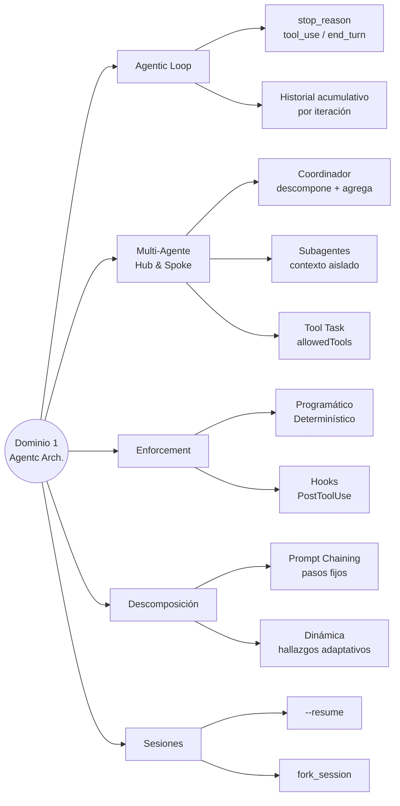

# Dominio 1 — Agentic Architecture & Orchestration

> **Peso en el examen: 27%** — el dominio más importante
> Task statements: 1.1 al 1.7

---

## 1.1 El Agentic Loop

### Ciclo de vida

Un agentic loop es el patrón fundamental donde Claude razona, decide qué tool usar, la ejecuta, observa el resultado y repite hasta completar la tarea.

```python
import anthropic

client = anthropic.Anthropic()

def run_agent(system_prompt: str, user_message: str, tools: list) -> str:
    messages = [{"role": "user", "content": user_message}]
    
    while True:
        response = client.messages.create(
            model="claude-opus-4-7",
            max_tokens=4096,
            system=system_prompt,
            tools=tools,
            messages=messages
        )
        
        # El stop_reason decide si continuar o terminar
        if response.stop_reason == "end_turn":
            # Claude terminó — extraer texto final
            return next(b.text for b in response.content if hasattr(b, "text"))
        
        elif response.stop_reason == "tool_use":
            # Agregar respuesta del asistente al historial
            messages.append({"role": "assistant", "content": response.content})
            
            # Ejecutar todas las tools solicitadas
            tool_results = []
            for block in response.content:
                if block.type == "tool_use":
                    result = execute_tool(block.name, block.input)
                    tool_results.append({
                        "type": "tool_result",
                        "tool_use_id": block.id,
                        "content": result
                    })
            
            # Agregar resultados al historial para la siguiente iteración
            messages.append({"role": "user", "content": tool_results})
```

### Valores de stop_reason

| Valor | Significado | Acción |
|-------|-------------|--------|
| `"end_turn"` | Claude terminó su respuesta | Extraer texto y finalizar |
| `"tool_use"` | Claude quiere ejecutar una o más tools | Ejecutar tools, agregar resultados, continuar |
| `"max_tokens"` | Se agotó el límite de tokens | Manejar como error o resumir |
| `"stop_sequence"` | Se encontró una secuencia de parada | Finalizar |

### Anti-patrones críticos

El examen pregunta mucho sobre qué **NO** hacer:

| Anti-patrón | Por qué falla |
|-------------|---------------|
| Parsear texto del asistente para decidir si continuar | No determinístico; Claude puede variar el wording |
| Poner límite de iteraciones como mecanismo principal de parada | El loop se corta arbitrariamente antes de completar |
| Revisar el contenido del texto para detectar "terminación" | Claude puede incluir frases de cierre aunque aún tenga tools pendientes |
| No agregar resultados de tools al historial | Claude pierde el contexto de lo que encontró |

---

## 1.2 Arquitectura Multi-Agente: Hub-and-Spoke

### Patrón coordinador–subagentes

```
    [Coordinador]
    /     |      \
[Sub A] [Sub B] [Sub C]
búsqueda análisis síntesis
```

El coordinador:
- Descompone la tarea
- Decide qué subagentes invocar según la complejidad
- Agrega resultados
- Maneja errores y hace retry

Los subagentes:
- Operan con contexto **aislado** — NO heredan el historial del coordinador
- Reciben el contexto necesario explícitamente en su prompt
- Retornan resultados estructurados

### Cuándo invocar qué subagentes

```python
# El coordinador analiza la consulta y decide dinámicamente
system_prompt_coordinador = """
Sos un coordinador de investigación. Según la consulta:
- Si requiere datos actuales: invocá al agente de búsqueda web
- Si hay documentos adjuntos: invocá al agente de análisis de documentos  
- Si la consulta es simple y factual: respondé directamente sin delegar
- Siempre invocá al agente de síntesis cuando tengas múltiples fuentes

NO siempre pases por todo el pipeline — elegí según lo que la tarea requiere.
"""
```

### Riesgo de descomposición estrecha

Si el coordinador descompone "impacto de la IA en las industrias creativas" como:
- "IA en arte digital"
- "IA en diseño gráfico"  
- "IA en fotografía"

...el resultado omitirá música, escritura y cine. El coordinador debe ser explícito en cubrir todo el espacio del problema.

---

## 1.3 Spawning de Subagentes: Tool `Task`

### Configuración requerida

Para que un coordinador pueda spawnear subagentes, `allowedTools` debe incluir `"Task"`:

```python
from anthropic import Anthropic
from anthropic.types.beta import (
    BetaToolUnionParam,
    BetaMessageParam
)

# Con el Agent SDK
agent_definition = {
    "name": "coordinator",
    "description": "Coordina investigación multi-agente",
    "system_prompt": "...",
    "allowed_tools": ["Task", "WebSearch"]  # "Task" es obligatorio para spawnear
}
```

### Paso de contexto explícito

Los subagentes NO heredan nada automáticamente. Hay que pasarles todo:

```python
# MAL — el subagente no sabe nada de los resultados anteriores
subagente_prompt = "Sintetizá los hallazgos de la investigación."

# BIEN — se pasa el contexto completo
subagente_prompt = f"""
Sintetizá estos hallazgos de investigación:

RESULTADOS DE BÚSQUEDA WEB:
{resultados_busqueda}

ANÁLISIS DE DOCUMENTOS:
{resultados_analisis}

Producí un reporte estructurado con secciones de hallazgos clave, 
contradicciones identificadas y conclusiones. Preservá la atribución de fuentes.
"""
```

### Ejecución paralela de subagentes

En lugar de ejecutar subagentes uno a la vez (secuencial), el coordinador puede emitir múltiples calls a `Task` en una única respuesta:

```python
# El coordinador emite esto en UNA sola respuesta (no en turnos separados):
[
    {"type": "tool_use", "name": "Task", "input": {"agent": "web_search", "prompt": "buscar X"}},
    {"type": "tool_use", "name": "Task", "input": {"agent": "doc_analysis", "prompt": "analizar Y"}},
    {"type": "tool_use", "name": "Task", "input": {"agent": "data_fetch", "prompt": "obtener Z"}}
]
```

Esto reduce latencia significativamente comparado con la ejecución secuencial.

### Formato estructurado para preservar atribución

```python
# Estructura recomendada para paso de contexto entre agentes
hallazgo = {
    "afirmacion": "El 73% de las empresas adoptó IA generativa en 2024",
    "extracto_evidencia": "According to the survey...",
    "fuente_url": "https://...",
    "nombre_documento": "McKinsey AI Survey 2024",
    "fecha_publicacion": "2024-11-15",
    "pagina": 12
}
```

---

## 1.4 Flujos Multi-Paso: Enforcement Programático

### Enforcement programático vs. prompts

| Mecanismo | Fiabilidad | Cuándo usarlo |
|-----------|-----------|---------------|
| Instrucción en prompt | Probabilístico (~99%) | Casos donde un fallo es recuperable |
| Gate programático | Determinístico (100%) | Reglas de negocio críticas (identidad, pagos) |
| Hook de intercepción | Determinístico (100%) | Límites de compliance, políticas de empresa |

**Regla de oro del examen:** Si una regla tiene consecuencias financieras, legales o de seguridad → enforcement programático, no prompts.

```python
# Ejemplo: bloquear lookup_order hasta que get_customer haya corrido
class AgentWithGate:
    def __init__(self):
        self.customer_verified = False
        self.customer_id = None
    
    def execute_tool(self, tool_name: str, tool_input: dict):
        # Gate programático
        if tool_name in ["lookup_order", "process_refund"]:
            if not self.customer_verified:
                return {
                    "error": "PREREQUISITE_NOT_MET",
                    "message": "Primero debés verificar la identidad del cliente con get_customer"
                }
        
        if tool_name == "get_customer":
            result = self._get_customer(tool_input)
            if result.get("verified"):
                self.customer_verified = True
                self.customer_id = result["customer_id"]
            return result
        
        # ... resto de tools
```

### Handoff estructurado para escalación

Cuando el agente escala a un humano, debe incluir todo lo necesario (el humano no tiene acceso al transcript):

```python
handoff = {
    "customer_id": "CUST-12345",
    "issue_summary": "Cliente reclama reembolso por producto dañado",
    "root_cause": "Daño en tránsito confirmado con foto adjunta",
    "actions_taken": ["lookup_order completado", "foto verificada"],
    "recommended_action": "Aprobar reembolso de $89.99 por exceder límite del agente",
    "policy_exception_required": True
}
```

---

## 1.5 Hooks del Agent SDK

### PostToolUse — normalización de datos

```python
def post_tool_use_hook(tool_name: str, tool_result: dict) -> dict:
    """Normaliza formatos heterogéneos antes de que el modelo los procese."""
    
    if tool_name == "get_customer":
        # Normalizar timestamp Unix → ISO 8601
        if "created_at" in tool_result:
            tool_result["created_at"] = datetime.fromtimestamp(
                tool_result["created_at"]
            ).isoformat()
    
    if tool_name == "lookup_order":
        # Normalizar código de estado numérico → descripción legible
        status_map = {1: "pending", 2: "shipped", 3: "delivered", 4: "returned"}
        tool_result["status"] = status_map.get(tool_result.get("status_code", 0), "unknown")
    
    return tool_result
```

### Hook de intercepción — enforcement de políticas

```python
def pre_tool_call_hook(tool_name: str, tool_input: dict) -> dict | None:
    """
    Intercepta llamadas salientes a tools.
    Retorna None para permitir, o un dict con error para bloquear.
    """
    if tool_name == "process_refund":
        amount = tool_input.get("amount", 0)
        if amount > 500:
            return {
                "blocked": True,
                "reason": f"Reembolso de ${amount} excede límite de $500",
                "action": "ESCALATE_TO_HUMAN",
                "escalation_data": tool_input
            }
    return None  # Permitir la llamada
```

### Tabla: Hooks vs. Prompts

| Necesidad | Usar hooks | Usar prompts |
|-----------|-----------|--------------|
| Compliance financiera | ✅ | ❌ |
| Normalización de datos entre tools | ✅ | ❌ |
| Límites de autorización | ✅ | ❌ |
| Guías de estilo de respuesta | ❌ | ✅ |
| Personalidad y tono | ❌ | ✅ |
| Sugerencias de herramienta preferida | ❌ | ✅ |

---

## 1.6 Descomposición de Tareas

### Prompt Chaining (secuencial fijo)

Para tareas predecibles con pasos bien definidos:

```
Archivo 1 → análisis local
Archivo 2 → análisis local
Archivo 3 → análisis local
         ↓
   Pase de integración cross-file
         ↓
   Reporte final
```

Útil para revisiones de código grandes, procesamiento de documentos en lotes.

### Descomposición dinámica (adaptativa)

Para investigación de extremo abierto donde los hallazgos intermedios determinan los pasos siguientes:

```
1. Mapear estructura del problema
2. Identificar subtemas
3. Investigar cada subtema (con posibilidad de descubrir nuevos)
4. Si se descubren brechas → agregar subtareas dinámicamente
5. Síntesis final
```

### Tabla de decisión

| Tipo de tarea | Patrón recomendado |
|---------------|-------------------|
| Revisión de código multi-archivo | Prompt chaining (análisis local + pase de integración) |
| Investigación de extremo abierto | Descomposición dinámica |
| Pipeline ETL con pasos conocidos | Prompt chaining |
| Análisis de mercado sin alcance fijo | Descomposición dinámica |
| Generación de tests para codebase | Descomposición dinámica (mapear → priorizar → generar) |

---

## 1.7 Gestión de Sesiones

### Comandos y patrones

| Mecanismo | Sintaxis | Cuándo usarlo |
|-----------|---------|---------------|
| Reanudar sesión nombrada | `--resume <session-name>` | El contexto previo sigue siendo válido |
| Fork de sesión | `fork_session` | Explorar enfoques divergentes desde base compartida |
| Nueva sesión con resumen | Nueva sesión + resumen inyectado | Resultados anteriores de tools están obsoletos |
| Compact | `/compact` | El contexto se está llenando con output verbose |

### Cuándo usar --resume vs. empezar de nuevo

```
¿Los archivos analizados antes cambiaron?
├── No → --resume (contexto válido)
└── Sí → Nueva sesión con resumen estructurado de hallazgos previos
          (los tool results obsoletos confunden más de lo que ayudan)
```

### Fork para exploración paralela

```python
# Escenario: comparar dos estrategias de testing desde análisis base compartido
base_session = analyze_codebase()  # Análisis inicial

# Rama A: probar con Jest
session_a = fork_session(base_session)
explore_jest_approach(session_a)

# Rama B: probar con Vitest  
session_b = fork_session(base_session)
explore_vitest_approach(session_b)

# Comparar resultados de ambas ramas
compare_approaches(session_a.result, session_b.result)
```

---

## Mapa Conceptual del Dominio 1



---

## Preguntas Clave para Repasar

1. ¿Qué hace el agente cuando `stop_reason == "tool_use"`?
2. ¿Por qué las instrucciones de prompt no son suficientes para verificación de identidad antes de procesar pagos?
3. ¿Qué debe incluir `allowedTools` del coordinador para poder spawnear subagentes?
4. ¿Cómo se ejecutan subagentes en paralelo?
5. ¿Cuál es la diferencia entre `--resume` y empezar desde cero con un resumen inyectado?
6. ¿Cuándo usar prompt chaining vs. descomposición dinámica?
7. ¿Qué tipo de hook intercepta resultados de tools antes de que el modelo los procese?
