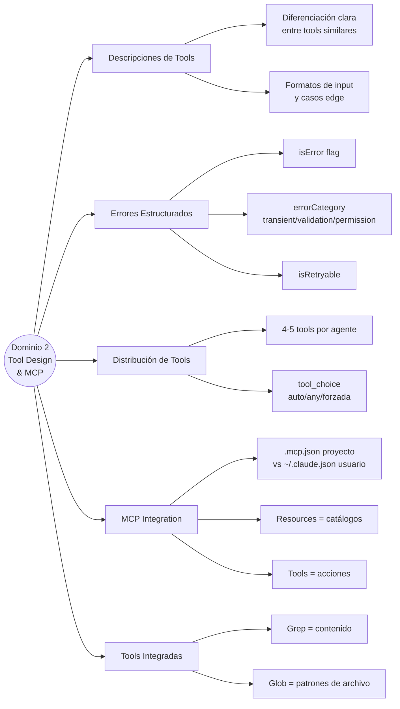

# Dominio 2 — Tool Design & MCP Integration

> **Peso en el examen: 18%**
> Task statements: 2.1 al 2.5

---

## 2.1 Diseño de Interfaces de Tools

### Las descripciones son el mecanismo de selección

Claude elige qué tool usar basándose principalmente en sus **descripciones**. Una descripción pobre → selección incorrecta, sin importar qué tan bien esté implementada la tool internamente.

#### Descripción mínima (MAL)

```python
tools = [
    {
        "name": "get_customer",
        "description": "Retrieves customer information",
        "input_schema": {"type": "object", "properties": {"id": {"type": "string"}}}
    },
    {
        "name": "lookup_order",
        "description": "Retrieves order details",
        "input_schema": {"type": "object", "properties": {"id": {"type": "string"}}}
    }
]
# Resultado: Claude confunde ambas tools cuando recibe "revisar mi orden #12345"
```

#### Descripción completa (BIEN)

```python
tools = [
    {
        "name": "get_customer",
        "description": (
            "Retrieves customer account information by customer ID or email. "
            "Use this FIRST to verify customer identity before any order operations. "
            "Input formats: customer ID (CUST-XXXXX) or email address. "
            "Do NOT use for order lookups — use lookup_order instead. "
            "Returns: customer_id, name, email, account_status, tier."
        ),
        "input_schema": {
            "type": "object",
            "properties": {
                "identifier": {
                    "type": "string",
                    "description": "Customer ID (CUST-XXXXX) or email address"
                }
            },
            "required": ["identifier"]
        }
    },
    {
        "name": "lookup_order",
        "description": (
            "Retrieves order details by order number or tracking number. "
            "Use when the customer asks about a specific order, shipment, or delivery. "
            "Requires a verified customer_id from get_customer first. "
            "Input formats: order number (ORD-XXXXX) or tracking number. "
            "Do NOT use for account or profile information — use get_customer instead."
        ),
        "input_schema": {
            "type": "object",
            "properties": {
                "order_identifier": {"type": "string"},
                "customer_id": {"type": "string", "description": "Verified customer ID from get_customer"}
            },
            "required": ["order_identifier", "customer_id"]
        }
    }
]
```

### Elementos de una buena descripción de tool

| Elemento | Ejemplo |
|----------|---------|
| Propósito claro | "Use this to retrieve X when Y" |
| Formatos de entrada | "Accepts: CUST-XXXXX or email address" |
| Cuándo usarla vs. alternativas | "Use for orders, NOT for customer accounts" |
| Qué devuelve | "Returns: status, amount, tracking_number" |
| Casos edge | "Returns empty if no results found (not an error)" |
| Límites | "Maximum 100 results; use pagination for more" |

### Cuándo dividir vs. consolidar tools

| Situación | Acción |
|-----------|--------|
| Dos tools con funciones similares causan confusión | Dividir con nombres y descripciones que diferencien claramente |
| Una tool genérica mal usada | Reemplazar por tools de propósito específico |
| Muchas tools especializadas con lógica duplicada | Consolidar si el propósito es realmente el mismo |

Ejemplo de división:
```
analyze_document (genérica, ambigua)
    ↓ dividir en
extract_data_points   → extrae campos estructurados
summarize_content     → genera resumen narrativo
verify_claim          → verifica afirmación contra el documento
```

---

## 2.2 Respuestas de Error Estructuradas

### El patrón isError de MCP

```python
# Respuesta de error estructurada correcta
def process_refund(amount: float, order_id: str) -> dict:
    if amount > 500:
        return {
            "isError": True,
            "errorCategory": "permission",
            "isRetryable": False,
            "message": f"Refund of ${amount} exceeds agent limit of $500",
            "action_required": "HUMAN_ESCALATION",
            "friendly_message": "Este reembolso requiere aprobación de un agente humano"
        }
    
    try:
        result = payment_system.refund(order_id, amount)
        return {"success": True, "refund_id": result.id}
    
    except TimeoutError:
        return {
            "isError": True,
            "errorCategory": "transient",
            "isRetryable": True,
            "message": "Payment system timeout",
            "retry_after_seconds": 30
        }
    
    except InvalidOrderError as e:
        return {
            "isError": True,
            "errorCategory": "validation",
            "isRetryable": False,
            "message": f"Invalid order: {str(e)}",
            "field": "order_id"
        }
```

### Categorías de error

| Categoría | `isRetryable` | Causa típica | Acción del agente |
|-----------|--------------|--------------|-------------------|
| `transient` | `True` | Timeout, servicio caído temporalmente | Reintentar con backoff |
| `validation` | `False` | Input inválido, formato incorrecto | Corregir input o pedir aclaración |
| `permission` | `False` | Excede límite, no autorizado | Escalar o explicar al usuario |
| `business` | `False` | Violación de política de negocio | Explicar política, ofrecer alternativas |

### Anti-patrón: error genérico

```python
# MAL — el agente no puede decidir qué hacer
return {"error": "Operation failed"}

# BIEN — el agente tiene contexto para recuperarse
return {
    "isError": True,
    "errorCategory": "transient",
    "isRetryable": True,
    "message": "Database connection timeout after 3 retries",
    "partial_results": resultados_parciales_si_hay
}
```

### Distinguir fallo vs. resultado vacío

```python
# Resultado vacío (exitoso — no hay coincidencias)
return {
    "success": True,
    "results": [],
    "message": "No orders found for customer in the last 90 days"
}

# Fallo de acceso (error real — no se pudo consultar)
return {
    "isError": True,
    "errorCategory": "transient",
    "isRetryable": True,
    "message": "Database unreachable"
}
```

---

## 2.3 Distribución de Tools entre Agentes

### El problema de demasiadas tools

Darle 18 tools a un agente degrada la confiabilidad de selección. Cada tool adicional aumenta la complejidad de decisión del modelo.

**Regla práctica:** 4-5 tools por agente. Si un rol necesita más, dividirlo en subagentes especializados.

### Distribución por rol

```python
# Agente de búsqueda web: solo tools de búsqueda
web_agent_tools = ["web_search", "fetch_url", "extract_web_results"]

# Agente de análisis de documentos: solo tools de documentos
doc_agent_tools = ["read_document", "extract_data_points", "summarize_content"]

# Agente de síntesis: tools limitadas + verify_fact para alta frecuencia
synthesis_agent_tools = ["verify_fact", "format_report"]
# Los casos complejos de verificación van al agente web a través del coordinador
```

### Configuración de tool_choice

| Valor | Comportamiento | Cuándo usarlo |
|-------|----------------|---------------|
| `"auto"` | Claude elige si usar tool o responder en texto | Default — casos generales |
| `"any"` | Claude DEBE usar una tool (puede elegir cuál) | Cuando siempre se necesita structured output |
| `{"type": "tool", "name": "X"}` | Claude DEBE usar la tool X específica | Cuando un paso específico debe ejecutarse primero |

```python
# Forzar que extract_metadata se ejecute primero
response = client.messages.create(
    model="claude-opus-4-7",
    tools=tools,
    tool_choice={"type": "tool", "name": "extract_metadata"},
    messages=messages
)

# Garantizar que se llame a alguna tool (no texto conversacional)
response = client.messages.create(
    model="claude-opus-4-7",
    tools=tools,
    tool_choice="any",
    messages=messages
)
```

---

## 2.4 Integración de Servidores MCP

### Alcance de configuración

| Archivo | Alcance | Compartido por VCS | Cuándo usarlo |
|---------|---------|-------------------|---------------|
| `.mcp.json` en el proyecto | Proyecto | ✅ Sí | Tools compartidas del equipo |
| `~/.claude.json` | Usuario | ❌ No | Servidores personales/experimentales |

### Configuración de .mcp.json

```json
{
  "mcpServers": {
    "github": {
      "command": "npx",
      "args": ["-y", "@modelcontextprotocol/server-github"],
      "env": {
        "GITHUB_TOKEN": "${GITHUB_TOKEN}"
      }
    },
    "jira": {
      "command": "npx",
      "args": ["-y", "@modelcontextprotocol/server-jira"],
      "env": {
        "JIRA_URL": "${JIRA_URL}",
        "JIRA_TOKEN": "${JIRA_TOKEN}"
      }
    }
  }
}
```

**Nota:** `${GITHUB_TOKEN}` es expansión de variable de entorno — el token no se hardcodea en el archivo (que va a VCS).

### Alcance simultáneo

Cuando hay configuración en `.mcp.json` **y** en `~/.claude.json`, **ambos conjuntos de tools** están disponibles simultáneamente. Claude puede usar tools de cualquier servidor configurado.

### Recursos MCP vs. Tools MCP

| Tipo | Cuándo usarlo | Ejemplo |
|------|---------------|---------|
| **Resources** | Exponer catálogos de contenido (lectura) | Schema de la DB, lista de issues, jerarquía de docs |
| **Tools** | Acciones y queries dinámicas | `query_database`, `create_issue`, `send_email` |

Los recursos permiten que el agente entienda qué datos existen sin hacer llamadas exploratorias a tools.

```python
# Recurso: el agente puede "ver" el schema sin hacer una query
@mcp.resource("db://schema", mime_type="application/json")
def get_schema() -> dict:
    return database.get_table_schema()

# Tool: acción real
@mcp.tool(description="Ejecuta una query SQL de solo lectura")
def query_database(sql: str) -> list[dict]:
    return database.execute_readonly(sql)
```

### Elegir servidor MCP existente vs. custom

| Situación | Decisión |
|-----------|----------|
| Existe servidor MCP de la comunidad para la integración | Usar el existente (Jira, GitHub, Slack, etc.) |
| Flujo de trabajo específico del equipo | Servidor MCP custom |
| Datos internos propietarios | Servidor MCP custom |
| Integración estándar + lógica custom | Servidor existente + wrapper |

---

## 2.5 Tools Integradas de Claude Code

### Guía de selección

| Tool | Para qué sirve | Cuándo usarla |
|------|----------------|---------------|
| **Grep** | Buscar dentro del contenido de archivos | Encontrar todas las llamadas a una función, buscar imports |
| **Glob** | Encontrar archivos por patrón de nombre | `**/*.test.tsx`, `src/**/*.py` |
| **Read** | Leer contenido completo de un archivo | Cuando necesitás ver todo el archivo |
| **Edit** | Modificaciones específicas (por coincidencia única) | Cambios puntuales, target preciso |
| **Write** | Crear o reescribir un archivo completo | Crear archivo nuevo o reescritura total |
| **Bash** | Ejecutar comandos del sistema | Tests, builds, comandos no cubiertos por otras tools |

### Estrategia de exploración de codebase

```
1. Grep → encontrar puntos de entrada (importaciones, referencias)
2. Read → seguir imports y trazar flujo
3. Glob → encontrar archivos relacionados por patrón
4. Read → profundizar en archivos específicos
```

No leer todos los archivos desde el principio — construir comprensión incrementalmente.

### Edit vs. Read + Write

```python
# Usar Edit cuando:
# - El texto a reemplazar es ÚNICO en el archivo
# - El cambio es puntual

# Usar Read + Write cuando:
# - Edit falla por coincidencias no únicas
# - La modificación es extensa
# - Se está reescribiendo la mayor parte del archivo
```

---

## Mapa Conceptual del Dominio 2



---

## Preguntas Clave para Repasar

1. ¿Cuál es el mecanismo principal que usa Claude para seleccionar entre tools similares?
2. ¿Cuándo usar `tool_choice: "any"` vs `tool_choice: {"type": "tool", "name": "X"}`?
3. ¿Qué diferencia hay entre un resultado vacío y un error de acceso? ¿Por qué importa?
4. ¿En qué archivo configurás un servidor MCP para que lo use todo el equipo? ¿Y uno personal?
5. ¿Para qué sirven los Resources MCP vs. las Tools MCP?
6. ¿Cuándo usarías Grep vs. Glob?
7. ¿Por qué darle 18 tools a un agente degrada su rendimiento?
