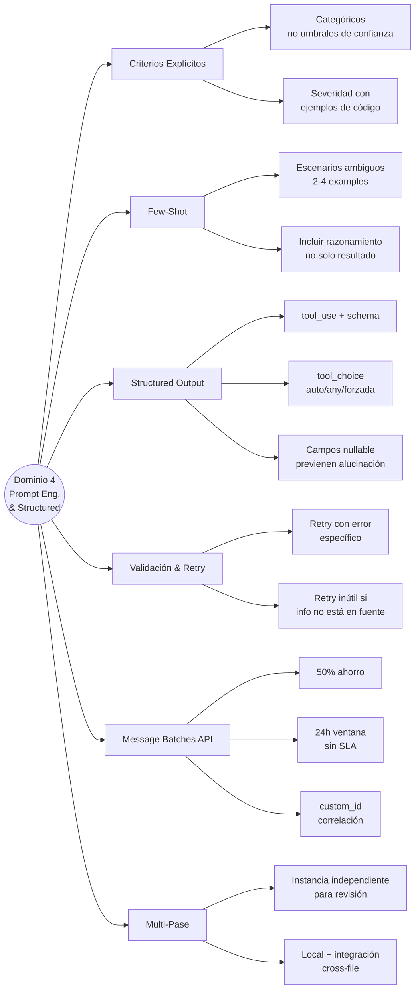

# Dominio 4 — Prompt Engineering & Structured Output

> **Peso en el examen: 20%**
> Task statements: 4.1 al 4.6

---

## 4.1 Criterios Explícitos para Reducir Falsos Positivos

### El problema con instrucciones vagas

```markdown
# VAGO — no funciona
"Verificar que los comentarios sean precisos"
"Ser conservador en los reportes"
"Reportar solo hallazgos de alta confianza"

# EXPLÍCITO — funciona
"Marcar un comentario SOLO cuando el comportamiento afirmado
 en el comentario contradice directamente el comportamiento
 real del código en la función correspondiente.
 NO marcar: comentarios desactualizados que son vagos,
 comentarios sobre comportamiento futuro previsto,
 o comentarios sobre lógica en otras funciones."
```

### Por qué "ser conservador" no reduce falsos positivos

La confianza auto-reportada del LLM está mal calibrada. El modelo puede:
- Tener alta confianza en casos incorrectos
- Tener baja confianza en casos correctos

La solución es **criterios categóricos concretos**, no umbrales de confianza.

### Estrategia para restaurar confianza del equipo

Si una categoría tiene alta tasa de falsos positivos:

```
1. Deshabilitar temporalmente esa categoría
   → los devs confían en las otras categorías
2. Mejorar el prompt para esa categoría con criterios más precisos
3. Validar en un conjunto de muestra
4. Rehabilitar la categoría con mejor precisión
```

### Definir severidad con ejemplos de código

```markdown
## Criterios de Severidad

**HIGH** — Bugs que causan comportamiento incorrecto en producción:
```python
# HIGH: off-by-one que silencia todos los errores del último elemento
for i in range(len(items) - 1):  # debería ser range(len(items))
    process(items[i])
```

**MEDIUM** — Issues que degradan confiabilidad bajo carga:
```python
# MEDIUM: conexión a DB no se cierra en caso de excepción
conn = db.connect()
result = conn.query(sql)  # si lanza, conn queda abierta
conn.close()
```

**LOW** — Mejoras que no afectan el comportamiento actual:
```python
# LOW: variable innecesaria que solo agrega ruido
temp = calculate_total()
return temp
```
```

---

## 4.2 Few-Shot Prompting

### Cuándo es más efectivo

| Situación | Impacto del few-shot |
|-----------|---------------------|
| Instrucciones detalladas dan resultados inconsistentes | Alto — los ejemplos muestran el patrón exacto |
| Escenarios ambiguos con múltiples respuestas válidas | Alto — demuestran el razonamiento esperado |
| Formato de output específico | Alto — Claude generaliza el patrón |
| Reducción de alucinaciones en extracción | Alto — ejemplos muestran cómo manejar datos faltantes |
| Tarea simple y bien definida | Bajo — las instrucciones son suficientes |

### Estructura de un buen few-shot example

Para escenarios ambiguos, incluir el **razonamiento** de por qué se eligió esa acción:

```python
system_prompt = """
Sos un agente de soporte. Decidí si resolver autónomamente o escalar.

Ejemplo 1:
Cliente: "Quiero hablar con una persona"
Razonamiento: El cliente solicitó explícitamente un humano.
Acción: ESCALAR — siempre honrar pedidos explícitos de agente humano.

Ejemplo 2:
Cliente: "Mi paquete llegó dañado, tengo las fotos"
Razonamiento: Caso estándar con evidencia clara. Está dentro de mi capacidad.
Acción: RESOLVER — procesar reemplazo estándar por daño documentado.

Ejemplo 3:
Cliente: "Quiero que igualen el precio de la competencia"
Razonamiento: La política solo cubre ajustes de precios propios del sitio.
                Esta solicitud no está contemplada → brecha de política.
Acción: ESCALAR — la política es ambigua para este caso.
"""
```

### Few-shot para extracción de documentos con formatos variados

```python
system_prompt = """
Extraé los autores y año de publicación de referencias bibliográficas.

Ejemplo 1 (cita inline):
Texto: "Como señalan García et al. (2023) en su análisis..."
Output: {"autores": ["García et al."], "año": 2023, "formato": "inline"}

Ejemplo 2 (bibliografía al final):
Texto: "García, M., López, R., & Martínez, P. (2023). Título del paper. Journal, 15(3), 45-67."
Output: {"autores": ["García, M.", "López, R.", "Martínez, P."], "año": 2023, "formato": "bibliografía"}

Ejemplo 3 (sin año explícito):
Texto: "Según un estudio reciente de Smith..."
Output: {"autores": ["Smith"], "año": null, "formato": "inline"}
"""
```

### Cantidad de examples

- **2-4 examples** es el rango óptimo
- Más no siempre es mejor — pueden ocupar tokens innecesariamente
- Priorizar los ejemplos **más ambiguos o difíciles**, no los más obvios

---

## 4.3 Salida Estructurada con tool_use y JSON Schemas

### Por qué tool_use es el enfoque más confiable

| Enfoque | Confiabilidad | Problema |
|---------|--------------|---------|
| Pedir JSON en el prompt | Media | Claude puede no seguir el formato, o incluir texto extra |
| `tool_choice: "auto"` | Media | Claude puede responder en texto en lugar de usar la tool |
| `tool_choice: "any"` | Alta | Claude debe llamar a una tool, pero elige cuál |
| Tool específica + JSON schema | Muy alta | Elimina errores de sintaxis JSON; schema validado |

### Implementación completa

```python
import anthropic
import json

client = anthropic.Anthropic()

# Definir la tool de extracción con schema completo
extraction_tool = {
    "name": "extract_invoice_data",
    "description": "Extraé datos estructurados de una factura",
    "input_schema": {
        "type": "object",
        "properties": {
            "invoice_number": {
                "type": "string",
                "description": "Número de factura"
            },
            "total_amount": {
                "type": ["number", "null"],  # nullable si puede no estar
                "description": "Monto total en la moneda indicada"
            },
            "currency": {
                "type": "string",
                "enum": ["USD", "EUR", "ARS", "BRL", "other"],
                "description": "Moneda de la factura"
            },
            "currency_detail": {
                "type": ["string", "null"],
                "description": "Si currency es 'other', especificar cuál"
            },
            "issue_date": {
                "type": ["string", "null"],
                "description": "Fecha de emisión en formato YYYY-MM-DD"
            },
            "line_items": {
                "type": "array",
                "items": {
                    "type": "object",
                    "properties": {
                        "description": {"type": "string"},
                        "quantity": {"type": ["number", "null"]},
                        "unit_price": {"type": ["number", "null"]},
                        "total": {"type": ["number", "null"]}
                    }
                }
            }
        },
        "required": ["invoice_number", "currency"]  # solo los verdaderamente obligatorios
    }
}

def extract_invoice(document_text: str) -> dict:
    response = client.messages.create(
        model="claude-opus-4-7",
        max_tokens=1024,
        tools=[extraction_tool],
        tool_choice={"type": "tool", "name": "extract_invoice_data"},  # forzar esta tool
        messages=[{
            "role": "user",
            "content": f"Extraé los datos de esta factura:\n\n{document_text}"
        }]
    )
    
    # La respuesta estructurada está en el tool_use block
    for block in response.content:
        if block.type == "tool_use" and block.name == "extract_invoice_data":
            return block.input
    
    raise ValueError("No se encontró tool_use en la respuesta")
```

### Errores sintácticos vs. semánticos

```
JSON schema estricto elimina:
✅ Errores de sintaxis — campos mal tipados, JSON malformado

JSON schema NO puede detectar:
❌ Errores semánticos — subtotales que no suman al total
❌ Valores en campos incorrectos — fecha en campo de monto
❌ Alucinación de valores — inventar datos no presentes en el documento
```

### Diseño de schema: campos nullable

```python
# MAL — fuerza al modelo a inventar el valor si no está en el documento
"phone": {"type": "string", "description": "Teléfono del cliente"}

# BIEN — permite null cuando la info no existe en la fuente
"phone": {
    "type": ["string", "null"],
    "description": "Teléfono del cliente. Null si no figura en el documento."
}
```

### Patrón enum + other para categorías extensibles

```python
"document_type": {
    "type": "string",
    "enum": ["invoice", "receipt", "purchase_order", "other"],
    "description": "Tipo de documento"
},
"document_type_detail": {
    "type": ["string", "null"],
    "description": "Si document_type es 'other', especificar qué tipo de documento es"
}
```

---

## 4.4 Loops de Validación y Retry

### El patrón retry-con-feedback

```python
def extract_with_retry(document: str, max_retries: int = 3) -> dict:
    extraction = extract_invoice(document)
    
    for attempt in range(max_retries):
        errors = validate_extraction(extraction)
        
        if not errors:
            return extraction  # Éxito
        
        # Retry con el error específico incluido en el prompt
        response = client.messages.create(
            model="claude-opus-4-7",
            max_tokens=1024,
            tools=[extraction_tool],
            tool_choice={"type": "tool", "name": "extract_invoice_data"},
            messages=[
                {"role": "user", "content": f"Documento original:\n{document}"},
                {"role": "assistant", "content": [{"type": "tool_use", "id": "...", "name": "extract_invoice_data", "input": extraction}]},
                {"role": "user", "content": [{"type": "tool_result", "tool_use_id": "...", "content": f"Error de validación: {errors}. Corregí la extracción."}]}
            ]
        )
        
        extraction = get_tool_result(response)
    
    return extraction  # Mejor intento después de N retries

def validate_extraction(data: dict) -> list[str]:
    errors = []
    
    # Validación semántica: verificar que los totales cuadren
    if data.get("line_items") and data.get("total_amount"):
        calculated = sum(item.get("total", 0) for item in data["line_items"] if item.get("total"))
        stated = data["total_amount"]
        if abs(calculated - stated) > 0.01:
            errors.append(f"Los ítems suman {calculated:.2f} pero el total declarado es {stated:.2f}")
    
    return errors
```

### Cuándo el retry NO va a funcionar

```python
# El retry es útil cuando:
# - Hay un error de formato (fecha en formato incorrecto)
# - Hay un error estructural (campo en lugar incorrecto)
# - El modelo no siguió el schema correctamente

# El retry NO va a funcionar cuando:
# - La información simplemente no está en el documento fuente
# - Se necesita un documento externo que no fue provisto
# - La fuente tiene datos internamente contradictorios
```

### Campos para análisis de patrones de error

```python
# Agregar detected_pattern para análisis de falsos positivos
finding = {
    "file": "src/utils/formatter.js",
    "line": 42,
    "issue": "Posible null pointer dereference",
    "severity": "HIGH",
    "detected_pattern": "chained_optional_access_without_null_check",
    # Este campo permite analizar qué patrones generan más falsos positivos
    # cuando los devs descartan hallazgos
}
```

---

## 4.5 Message Batches API

### Características clave

| Característica | Valor |
|----------------|-------|
| Ahorro de costo | 50% vs. API síncrona |
| Ventana de procesamiento | Hasta 24 horas |
| SLA de latencia | Sin garantía |
| Tool calling multi-turno | ❌ No soportado |
| Correlación de resultados | Campo `custom_id` |

### Cuándo usar batch vs. síncrona

| Flujo de trabajo | API recomendada | Por qué |
|-----------------|-----------------|---------|
| Verificación pre-merge bloqueante | Síncrona | El dev espera el resultado |
| Reporte noctuno de deuda técnica | Batch | Tolerante a latencia, ahorra 50% |
| Auditoría semanal de documentos | Batch | Puede correr de noche |
| Feedback en tiempo real al usuario | Síncrona | Requiere respuesta inmediata |
| Generación masiva de tests | Batch | No bloquea a nadie |

### Manejo de fallos con custom_id

```python
import anthropic

client = anthropic.Anthropic()

# Enviar lote
batch = client.messages.batches.create(
    requests=[
        {
            "custom_id": f"doc_{i}",
            "params": {
                "model": "claude-opus-4-7",
                "max_tokens": 1024,
                "messages": [{"role": "user", "content": f"Extraé datos de: {doc}"}]
            }
        }
        for i, doc in enumerate(documents)
    ]
)

# Procesar resultados
successful = []
failed = []

for result in client.messages.batches.results(batch.id):
    if result.result.type == "succeeded":
        successful.append(result)
    else:
        # Re-enviar solo los documentos fallidos
        failed.append(result.custom_id)

# Reenviar fallidos (con posibles modificaciones — ej: chunk más pequeño)
if failed:
    retry_batch = client.messages.batches.create(
        requests=[
            build_request(doc_id, chunk_size=smaller) 
            for doc_id in failed
        ]
    )
```

### Calcular frecuencia de envío de lotes

```
SLA requerido: resultados disponibles en 30 horas
Ventana de procesamiento batch: hasta 24 horas

Frecuencia de envío: cada 30 - 24 = 6 horas
→ Enviar un lote cada 6 horas máximo para cumplir el SLA
```

---

## 4.6 Revisión Multi-Instancia y Multi-Pase

### Limitaciones de auto-revisión

Una instancia que generó código **retiene el razonamiento** que llevó a las decisiones:
- Menos propensa a cuestionar sus propias elecciones
- Puede racionalizarlas en lugar de detectar errores
- Los sesgos de confirmación se amplifican

**Solución:** Instancia de revisión independiente sin contexto del generador.

### Revisión multi-pase para PRs grandes

```
PR con 14 archivos → un solo pase produce:
- Coverage desigual (algunos archivos detallados, otros superficiales)
- Hallazgos contradictorios (el mismo patrón marcado en un archivo, aprobado en otro)
- Bugs obvios omitidos (dilución de atención)

Pase 1: Analizar cada archivo individualmente (issues locales)
         → Profundidad consistente por archivo

Pase 2: Análisis cross-file (flujo de datos, dependencias, integración)
         → Detecta issues que requieren visión de conjunto
```

```python
def review_pr_multi_pass(pr_files: list[str]) -> dict:
    # Pase 1: análisis local por archivo
    local_findings = {}
    for file in pr_files:
        findings = analyze_file_locally(file)
        local_findings[file] = findings
    
    # Pase 2: análisis de integración cross-file
    integration_findings = analyze_integration(pr_files, local_findings)
    
    return {
        "local_issues": local_findings,
        "integration_issues": integration_findings
    }
```

### Puntaje de confianza por hallazgo

```python
# Incluir confianza para enrutamiento calibrado
finding = {
    "issue": "SQL injection en el parámetro user_id",
    "severity": "HIGH",
    "confidence": 0.95,  # → revisión automática, publicar directamente
    "file": "src/api/users.py",
    "line": 87
}

finding = {
    "issue": "Posible race condition en el update concurrente",
    "severity": "MEDIUM",
    "confidence": 0.60,  # → enrutar a revisión humana
    "file": "src/cache/manager.py",
    "line": 203
}
```

---

## Mapa Conceptual del Dominio 4



---

## Preguntas Clave para Repasar

1. ¿Por qué "ser conservador" o "reportar solo alta confianza" no reduce falsos positivos?
2. ¿Qué ventaja tienen los few-shot examples sobre instrucciones detalladas en texto?
3. ¿Qué tipo de errores elimina `tool_use` con JSON schema estricto? ¿Qué errores NO puede eliminar?
4. ¿Cuándo el retry va a ser inefectivo?
5. ¿Para qué tipo de flujo de trabajo es apropiada la Message Batches API? ¿Para cuál NO?
6. ¿Por qué la auto-revisión es menos efectiva que una instancia independiente?
7. ¿Qué diferencia hay entre `tool_choice: "any"` y forzar una tool específica?
