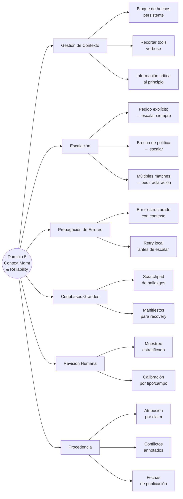

# Dominio 5 — Context Management & Reliability

> **Peso en el examen: 15%**
> Task statements: 5.1 al 5.6

---

## 5.1 Preservar Información Crítica en Conversaciones Largas

### Riesgos de la summarización progresiva

Cuando la conversación se summariza, se pueden perder:
- Valores numéricos exactos (montos, porcentajes, fechas)
- Expectativas declaradas por el cliente
- Datos transaccionales específicos (número de orden, estado)

```
Conversación real:
"El cliente reportó daño en el paquete #ORD-9872, pidió reembolso de $89.99"

Resumen condensado (MAL):
"El cliente tuvo problemas con un pedido y solicitó reembolso"
→ Se perdió el número de orden y el monto exacto
```

### El efecto "lost in the middle"

Los modelos procesan de forma más confiable la información al **principio** y al **final** de entradas largas. El contenido en el medio tiende a recibir menos atención.

```python
# Estrategia: colocar información crítica al principio
def build_context(case_facts: dict, conversation_history: list, tool_results: list) -> str:
    return f"""
=== HECHOS DEL CASO (NO resumir, mantener exacto) ===
Cliente ID: {case_facts['customer_id']}
Número de orden: {case_facts['order_number']}
Monto en disputa: ${case_facts['amount']}
Fecha de compra: {case_facts['purchase_date']}
Estado actual: {case_facts['status']}
=====================================================

{conversation_history_formatted}

{tool_results_formatted}
"""
```

### Recortar salidas de tools verbose

```python
# Tool devuelve 40+ campos por orden
raw_order = lookup_order("ORD-9872")

# Recortar a solo lo relevante antes de agregar al contexto
relevant_fields = {
    "order_id": raw_order["order_id"],
    "status": raw_order["status"],
    "total": raw_order["total_amount"],
    "items": raw_order["items"],
    "shipping_date": raw_order.get("shipping_date"),
    "delivery_date": raw_order.get("delivery_date")
}
# Los 35 campos restantes (metadata interna, IDs internos, flags) no se agregan al contexto
```

### Bloque de hechos persistente

```python
# En cada turno de la conversación multi-issue, incluir el bloque de hechos completo
case_facts_block = """
HECHOS CONFIRMADOS (actualizar cuando cambie el estado):
- Cliente: María García (ID: CUST-45821)
- Issue 1: Orden ORD-9872 — reembolso $89.99 (PENDIENTE)
- Issue 2: Orden ORD-9901 — cambio de dirección (RESUELTO)
- Issue 3: Cuenta bloqueada (EN PROCESO)
"""
```

---

## 5.2 Patrones de Escalación y Resolución de Ambigüedad

### Triggers de escalación correctos

| Trigger | Escalar | Por qué |
|---------|---------|---------|
| Cliente pide explícitamente hablar con un humano | ✅ Siempre | Honrar la preferencia explícita |
| Excepción de política (el caso no está contemplado) | ✅ Sí | La política tiene una brecha |
| El agente no puede hacer progreso significativo | ✅ Sí | Mejor que dar vueltas en círculos |
| Caso complejo con muchos issues | ❌ No necesariamente | La complejidad sola no justifica escalación |
| Cliente frustrado (sentimiento negativo) | ❌ No confiable | El sentimiento no mide la complejidad real |
| Puntaje de confianza del agente bajo | ❌ No confiable | La confianza auto-reportada está mal calibrada |

### La regla del pedido explícito

```python
# Si el cliente pide explícitamente un humano → escalar INMEDIATAMENTE
# No intentar investigar primero, no ofrecer resolver antes

system_prompt = """
Si en cualquier momento el cliente solicita explícitamente hablar con un agente humano
o ser transferido a una persona, escalá INMEDIATAMENTE sin intentar resolver primero.
"""

# Few-shot example para el prompt:
"""
Cliente: "Quiero hablar con una persona real"
Acción: ESCALAR — no intentar resolver ni preguntar el motivo primero.

Cliente: "Estoy muy frustrado con este servicio"
Acción: RECONOCER frustración → si el issue está dentro de mi capacidad, 
         intentar resolver → escalar solo si el cliente reitera el pedido de humano.
"""
```

### Múltiples coincidencias → pedir aclaración

```python
# Si get_customer devuelve múltiples matches → NO seleccionar heurísticamente
if len(customer_results) > 1:
    names = [c["name"] + " - " + c["email"] for c in customer_results]
    return {
        "action": "ASK_FOR_CLARIFICATION",
        "message": f"Encontré {len(customer_results)} clientes con ese nombre. ¿Cuál es tu email o número de cliente?",
        "options": names
    }
```

### Política ambigua → escalar

```python
# La política dice: "ajuste de precios para ítems del propio sitio con 30 días"
# Cliente pide: "igualación del precio de la competencia"
# → La política NO contempla este caso → escalar, no inventar una respuesta
```

---

## 5.3 Propagación de Errores en Sistemas Multi-Agente

### El error estructurado habilita recuperación inteligente

```python
# Subagente de búsqueda web — timeout
def search_web(query: str) -> dict:
    try:
        results = web_api.search(query, timeout=10)
        return {"success": True, "results": results}
    
    except TimeoutError:
        # Error estructurado con contexto completo
        return {
            "success": False,
            "error_type": "timeout",
            "query_attempted": query,
            "partial_results": [],  # lo que se obtuvo antes del timeout
            "alternatives": [
                "Reintentar con query más específica",
                "Usar caché de búsquedas anteriores",
                "Proceder sin esta fuente y anotar la brecha"
            ]
        }
```

### Cómo el coordinador usa el contexto de error

```python
# El coordinador recibe el error estructurado y puede:
# 1. Reintentar con query modificada (si alternatives lo sugiere)
# 2. Usar una fuente alternativa
# 3. Proceder con resultados parciales y anotar la brecha en el reporte

coordinator_prompt = f"""
El agente de búsqueda web falló para la consulta: {error['query_attempted']}
Tipo de fallo: {error['error_type']}

Opciones disponibles:
{error['alternatives']}

Decidí cómo proceder: ¿reintentar, usar alternativa, o continuar con brecha anotada?
"""
```

### Anti-patrones en propagación de errores

| Anti-patrón | Problema |
|-------------|---------|
| Devolver resultado vacío como éxito | El coordinador cree que no hay datos, no que hubo un error |
| Estado genérico "search unavailable" | El coordinador no sabe si puede reintentar o qué alternativas hay |
| Propagar excepción sin contexto | Termina todo el flujo de trabajo innecesariamente |
| Suprimir el error silenciosamente | El reporte final parece completo pero tiene brechas no anotadas |

### Recuperación local antes de escalar

```python
# El subagente intenta recuperación local para errores transitorios
def search_with_retry(query: str, max_retries: int = 2) -> dict:
    for attempt in range(max_retries):
        try:
            return web_api.search(query, timeout=10)
        except TimeoutError:
            if attempt < max_retries - 1:
                time.sleep(2 ** attempt)  # backoff exponencial
                continue
    
    # Solo después de agotar retries locales, propagar al coordinador con contexto
    return {
        "success": False,
        "error_type": "timeout",
        "retries_attempted": max_retries,
        "query_attempted": query
    }
```

---

## 5.4 Contexto en Exploración de Codebases Grandes

### Síntomas de degradación de contexto

- El agente empieza a referenciar "patrones típicos" en lugar de clases específicas descubiertas antes
- Respuestas inconsistentes sobre lo que se encontró en etapas anteriores
- Repite exploración que ya hizo

### Scratchpad para persistir hallazgos

```python
# El agente escribe hallazgos en un archivo scratchpad durante la exploración
scratchpad_content = """
# Hallazgos de Exploración — 2024-01-15

## Punto de entrada
- `src/main.py` → inicializa la app con `AppFactory.create()`
- `AppFactory` está en `src/core/factory.py`

## Flujo de autenticación
- `AuthMiddleware` en `src/middleware/auth.py:45`
- Llama a `UserRepository.find_by_token()` en `src/repos/user.py:123`
- Usa `JWTValidator` en `src/utils/jwt.py`

## Dependencias críticas
- PostgreSQL via `src/db/connection.py`
- Redis para caché en `src/cache/redis_client.py`

## TODOs de exploración
- [ ] Trazar el flujo de pagos desde `PaymentController`
- [ ] Revisar cómo se maneja la concurrencia en `OrderProcessor`
"""

with open("exploration_scratchpad.md", "w") as f:
    f.write(scratchpad_content)
```

### Delegación a subagentes para exploración

```
Sin delegación:
Agente principal explora profundamente → contexto se llena → degradación

Con delegación:
Subagente A → "encontrar todos los archivos de test"
Subagente B → "trazar dependencias del flujo de reembolso"
Agente principal → recibe resúmenes compactos, mantiene contexto limpio
```

### Recuperación de crashes con manifiestos

```python
# Cada agente exporta su estado a una ubicación conocida
agent_state = {
    "agent_id": "web_search_1",
    "completed_queries": ["query 1", "query 2"],
    "pending_queries": ["query 3", "query 4"],
    "partial_results": results_so_far,
    "last_checkpoint": "2024-01-15T14:30:00Z"
}

with open(f".agent_state/{agent_id}.json", "w") as f:
    json.dump(agent_state, f)

# Al reanudar, el coordinador carga el manifiesto y continúa desde donde se cortó
def resume_from_crash(manifest_path: str):
    with open(manifest_path) as f:
        state = json.load(f)
    
    # Inyectar estado en el prompt del agente que se reanuda
    resume_prompt = f"""
Estás retomando una investigación que fue interrumpida.

Completado hasta ahora:
{json.dumps(state['completed_queries'], indent=2)}

Resultados parciales obtenidos:
{json.dumps(state['partial_results'], indent=2)}

Pendiente:
{json.dumps(state['pending_queries'], indent=2)}

Continuá desde donde quedó.
"""
```

### /compact para sesiones largas

Cuando el contexto se llena con output verbose de exploración:
```
/compact
→ Reduce el uso de contexto summarizando la conversación
→ Preserva hechos críticos en el resumen
→ Libera espacio para continuar la tarea
```

---

## 5.5 Revisión Humana y Calibración de Confianza

### El riesgo de las métricas agregadas

```
Precisión general: 97% ✅ (parece bien)

Al desagregar por tipo de documento:
- Facturas estándar: 99.5% ✅
- Contratos complejos: 78%  ⚠️ — enmascarado por el volumen de facturas
- Remitos: 95%              ✅

→ La métrica agregada oculta el problema en contratos complejos
```

### Muestreo aleatorio estratificado

```python
# No solo revisar extracciones de baja confianza — también revisar alta confianza
# para detectar errores sistemáticos no detectados

def build_review_sample(extractions: list[dict]) -> list[dict]:
    high_confidence = [e for e in extractions if e["confidence"] >= 0.9]
    low_confidence = [e for e in extractions if e["confidence"] < 0.7]
    medium_confidence = [e for e in extractions if 0.7 <= e["confidence"] < 0.9]
    
    # Muestra estratificada: representación de cada segmento
    sample = (
        random.sample(high_confidence, min(50, len(high_confidence))) +
        random.sample(medium_confidence, min(30, len(medium_confidence))) +
        random.sample(low_confidence, min(20, len(low_confidence)))
    )
    
    return sample
```

### Calibración de puntajes de confianza

```python
# Los puntajes de confianza del modelo son útiles solo si están calibrados
# Proceso de calibración:
# 1. Extraer con confianza a nivel de campo
# 2. Revisar humanamente un conjunto de validación etiquetado
# 3. Ajustar el umbral de revisión según la precisión observada por nivel

# Antes de calibración:
# confidence >= 0.9 → auto-aprobar

# Después de calibración (si el 15% de alta confianza está mal):
# confidence >= 0.95 → auto-aprobar (umbral más estricto)
```

---

## 5.6 Procedencia y Manejo de Incertidumbre

### Preservar atribución a través de la síntesis

```python
# Estructura que preserva la procedencia
claim_with_source = {
    "claim": "La adopción de IA generativa en empresas creció 73% en 2024",
    "evidence_excerpt": "According to our survey of 500 enterprises...",
    "source_url": "https://mckinsey.com/ai-survey-2024",
    "source_name": "McKinsey AI Survey 2024",
    "publication_date": "2024-11-15",
    "page_number": 12,
    "confidence": "high"
}

# El agente de síntesis DEBE preservar esta estructura
# No puede resumir los hallazgos sin incluir la atribución de fuente
```

### Datos contradictorios de fuentes creíbles

```python
# MAL — seleccionar arbitrariamente un valor
synthesis = {
    "market_size": "$45B"  # ¿de cuál fuente?
}

# BIEN — anotar el conflicto con atribución
synthesis = {
    "market_size": {
        "gartner_2024": "$45B",
        "idc_2024": "$38B",
        "conflict_note": "Las metodologías de medición difieren: Gartner incluye..."
    }
}
```

### Datos temporales

```python
# Requirir fechas de publicación para evitar malinterpretar diferencias temporales
source_a = {
    "market_size": "$30B",
    "publication_date": "2022-01-01"  # dato de 2022
}

source_b = {
    "market_size": "$45B",
    "publication_date": "2024-01-01"  # dato de 2024
}

# Sin fechas, parecería una contradicción
# Con fechas, es simplemente crecimiento del mercado en 2 años
```

### Estructura de reporte con manejo de incertidumbre

```markdown
## Hallazgos Bien Establecidos
- [Fuente A, 2024] Adopción empresarial: 73%
- [Fuente B, 2024] Inversión total: $45B (confirmado por múltiples fuentes)

## Hallazgos con Evidencia Mixta
- Impacto en empleo: 
  - [MIT, 2024]: "reducción del 15% en roles de entrada"
  - [WEF, 2024]: "creación neta de empleos del 8%"
  - Nota: Las metodologías difieren significativamente

## Áreas con Brechas de Cobertura
- Adopción en LATAM: no encontramos datos confiables (búsqueda web falló con timeout)
- Impacto regulatorio en Europa: datos insuficientes al 2024-01-15
```

---

## Mapa Conceptual del Dominio 5



---

## Preguntas Clave para Repasar

1. ¿Qué información se pierde típicamente en la summarización progresiva?
2. ¿Cuándo debe escalar un agente a un humano aunque el cliente no lo pida?
3. ¿Cuál es el anti-patrón de devolver resultado vacío como éxito?
4. ¿Para qué sirven los archivos scratchpad en exploración de codebases grandes?
5. ¿Por qué una precisión del 97% puede enmascarar un problema serio?
6. ¿Cómo se manejan datos contradictorios de dos fuentes creíbles?
7. ¿Por qué son importantes las fechas de publicación en síntesis multi-fuente?
