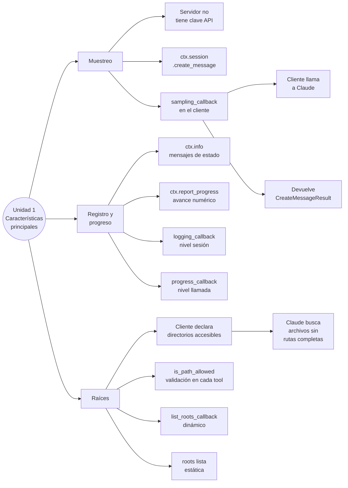
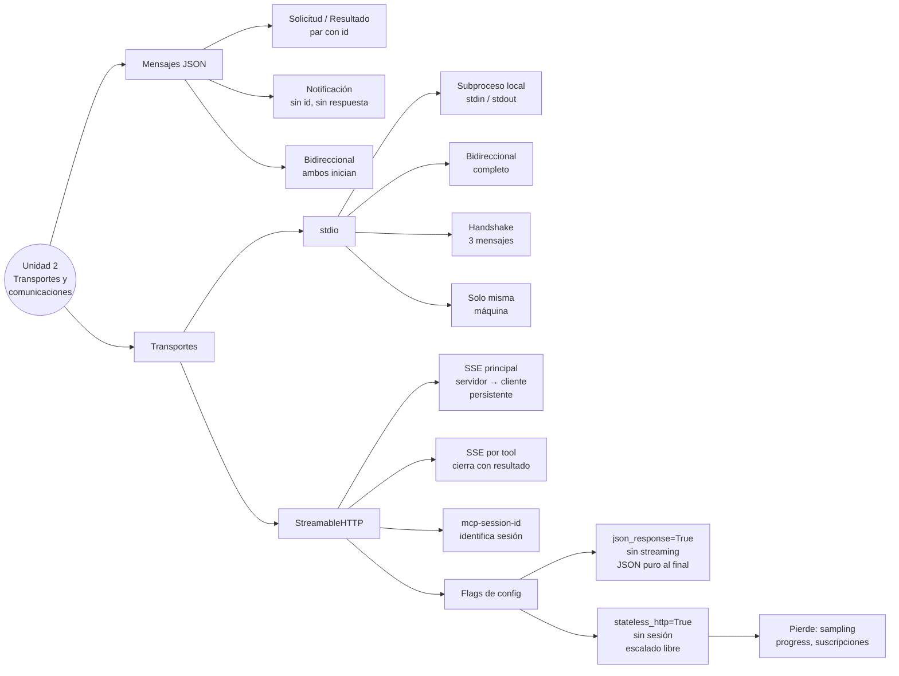
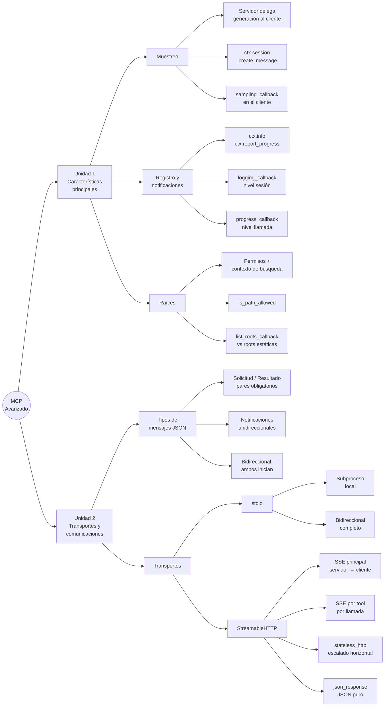

# Protocolo de Contexto del Modelo: Temas Avanzados

---

<!-- Unidades y módulos se irán agregando a medida que avance el curso -->

---

## Unidad 1: Características principales de MCP

---

### Módulo 1: Muestreo

#### ¿Qué es el muestreo?

El muestreo (*sampling*) es el mecanismo por el cual un **servidor MCP le pide al cliente** que realice una llamada a un modelo de lenguaje (como Claude) en su nombre. En lugar de que el servidor integre directamente la API de Claude, delega esa responsabilidad al cliente, que ya tiene las credenciales y la conexión establecida.

El nombre "muestreo" viene del término técnico *sampling* en LLMs: generar una muestra de texto a partir de una distribución de probabilidad. Acá se usa para referirse a ese proceso de generación delegada.

---

#### El problema que resuelve

Supongamos que tenés un servidor MCP con una herramienta de investigación que obtiene artículos de Wikipedia. Una vez que recopila los datos, necesita resumirlos. Tenés dos caminos:

| Opción | Descripción | Problema |
| --- | --- | --- |
| **Acceso directo a Claude** | El servidor tiene su propia clave API y llama directamente al modelo | Mayor complejidad, costos en el servidor, gestión de credenciales |
| **Muestreo (sampling)** | El servidor le pide al cliente que haga la llamada por él | El cliente ya tiene conexión; el servidor no necesita nada extra |

El muestreo es la segunda opción: el servidor simplemente dice "necesito texto generado para esto" y el cliente se encarga.

---

#### Cómo funciona paso a paso

```text
1. El servidor completa su trabajo (ej: obtiene artículos de Wikipedia)
2. El servidor construye un mensaje con la solicitud de generación
3. El servidor envía una "sampling request" al cliente via MCP
4. El cliente llama a Claude con ese mensaje
5. Claude genera el texto
6. El cliente devuelve el resultado al servidor
7. El servidor usa ese texto en su respuesta final
```

El flujo completo nunca requiere que el servidor conozca a Claude directamente.

---

#### Implementación

##### Lado del servidor

Dentro de una tool, usás `ctx.session.create_message()` para solicitar la generación:

```python
@mcp.tool()
async def summarize(text_to_summarize: str, ctx: Context):
    prompt = f"""
    Please summarize the following text:
    {text_to_summarize}
    """

    result = await ctx.session.create_message(
        messages=[
            SamplingMessage(
                role="user",
                content=TextContent(
                    type="text",
                    text=prompt
                )
            )
        ],
        max_tokens=4000,
        system_prompt="You are a helpful research assistant",
    )

    if result.content.type == "text":
        return result.content.text
    else:
        raise ValueError("Sampling failed")
```

##### Parámetros de `create_message`

| Parámetro | Tipo | Requerido | Descripción |
| --- | --- | --- | --- |
| `messages` | `list[SamplingMessage]` | Sí | Historial de mensajes para el modelo |
| `max_tokens` | `int` | Sí | Límite de tokens en la respuesta generada |
| `system_prompt` | `str` | No | Instrucción de sistema para el modelo |
| `model_preferences` | `ModelPreferences` | No | Preferencias de modelo (velocidad, costo, inteligencia) |
| `stop_sequences` | `list[str]` | No | Secuencias que detienen la generación |
| `temperature` | `float` | No | Creatividad de la respuesta (0.0–1.0) |

---

##### Lado del cliente

El cliente define una función de *callback* que se activa cuando el servidor hace una solicitud de muestreo:

```python
async def sampling_callback(
    context: RequestContext, params: CreateMessageRequestParams
):
    # Llama a Claude usando el SDK de Anthropic
    text = await chat(params.messages)

    return CreateMessageResult(
        role="assistant",
        model=model,
        content=TextContent(type="text", text=text),
    )
```

Luego, ese callback se pasa al inicializar la sesión:

```python
async with ClientSession(
    read,
    write,
    sampling_callback=sampling_callback  # <-- acá se conecta el callback
) as session:
    await session.initialize()
```

---

#### Beneficios del muestreo

| Beneficio | Explicación |
| --- | --- |
| **Menor complejidad en el servidor** | No necesita integrar ni mantener la SDK de Claude |
| **Sin claves API en el servidor** | Las credenciales quedan del lado del cliente |
| **Costos a cargo del cliente** | Cada cliente paga su propio uso de tokens |
| **Ideal para servidores públicos** | Evita que el servidor absorba costos masivos de muchos usuarios |

---

#### ¿Cuándo usar el muestreo?

- Cuando construís un servidor MCP **de acceso público** y no querés asumir los costos de generación de texto de todos los usuarios.
- Cuando el servidor ya tiene un rol definido (buscar, procesar datos) y querés que la inteligencia (resumir, redactar) quede del lado del cliente.
- Cuando querés mantener el servidor **simple y stateless**, sin gestión de credenciales ni lógica de integración con LLMs.

> **Regla práctica:** Si el servidor es privado y controlado, podés integrar Claude directamente. Si es público o multi-usuario, usá muestreo.

---

### Módulo 2: Recorrido práctico del proyecto de muestreo

Este módulo recorre el proyecto real de sampling incluido en el curso ([sampling/server.py](sampling/server.py) y [sampling/client.py](sampling/client.py)), paso a paso. El objetivo es ver cómo se conectan todas las piezas en la práctica.

---

#### Paso 1: Inicio del muestreo — `server.py`

Todo empieza en el servidor. La tool `summarize` recibe el texto a resumir, construye el prompt y llama a `ctx.session.create_message()`. Esta llamada **no va a Claude directamente** — viaja al cliente a través del protocolo MCP.

```python
# server.py
from mcp.server.fastmcp import FastMCP, Context
from mcp.types import SamplingMessage, TextContent

mcp = FastMCP(name="Demo Server")

@mcp.tool()
async def summarize(text_to_summarize: str, ctx: Context):
    prompt = f"""
        Please summarize the following text:
        {text_to_summarize}
    """

    result = await ctx.session.create_message(
        messages=[
            SamplingMessage(
                role="user", content=TextContent(type="text", text=prompt)
            )
        ],
        max_tokens=4000,
        system_prompt="You are a helpful research assistant.",
    )
```

El servidor no sabe qué modelo va a responder ni cómo. Eso lo decide el cliente. `ctx.session.create_message()` es el único punto de contacto del servidor con el sistema de generación.

---

#### Paso 2: La función de devolución de llamada — `client.py`

En el cliente, `sampling_callback` es la función que el protocolo MCP llama automáticamente cada vez que el servidor hace una solicitud de muestreo. Es el puente entre MCP y Claude.

```python
# client.py
async def sampling_callback(
    context: RequestContext, params: CreateMessageRequestParams
):
    # Llama a Claude usando el SDK de Anthropic
    text = await chat(params.messages)

    return CreateMessageResult(
        role="assistant",
        model=model,
        content=TextContent(type="text", text=text),
    )
```

| Parámetro de entrada | Tipo | Descripción |
| --- | --- | --- |
| `context` | `RequestContext` | Contexto de la sesión MCP actual |
| `params` | `CreateMessageRequestParams` | Mensajes, max_tokens y system_prompt enviados por el servidor |

---

#### Paso 3: Formato de los mensajes — función `chat()`

El callback delega la llamada a la función `chat()`, que convierte los `SamplingMessage` de MCP al formato de diccionarios que espera el SDK de Anthropic.

```python
# client.py
async def chat(input_messages: list[SamplingMessage], max_tokens=4000):
    messages = []
    for msg in input_messages:
        if msg.role == "user" and msg.content.type == "text":
            content = (
                msg.content.text
                if hasattr(msg.content, "text")
                else str(msg.content)
            )
            messages.append({"role": "user", "content": content})
        elif msg.role == "assistant" and msg.content.type == "text":
            content = (
                msg.content.text
                if hasattr(msg.content, "text")
                else str(msg.content)
            )
            messages.append({"role": "assistant", "content": content})
    ...
```

> La conversión es necesaria porque `SamplingMessage` es el tipo del protocolo MCP, pero el SDK de Anthropic espera diccionarios con `role` y `content`. Son representaciones del mismo concepto en dos sistemas distintos. El `hasattr` es una guarda defensiva: garantiza que funciona aunque el tipo de contenido no tenga atributo `.text` directamente.

---

#### Paso 4: Devolución del texto generado

Una vez que la función `chat()` llama a Claude y obtiene la respuesta, extrae el texto y lo devuelve. El callback lo empaqueta en un `CreateMessageResult` que viaja de vuelta al servidor vía MCP.

```python
# client.py — fin de la función chat()
    response = await anthropic_client.messages.create(
        model=model,
        messages=messages,
        max_tokens=max_tokens,
    )

    text = "".join([p.text for p in response.content if p.type == "text"])
    return text
```

```python
# client.py — fin de sampling_callback()
    return CreateMessageResult(
        role="assistant",
        model=model,                               # "claude-sonnet-4-0"
        content=TextContent(type="text", text=text),
    )
```

| Campo de `CreateMessageResult` | Descripción |
| --- | --- |
| `role` | Siempre `"assistant"` para respuestas del modelo |
| `model` | Identificador del modelo que generó la respuesta |
| `content` | `TextContent` con el texto generado |

---

#### Paso 5: Conectar la función de devolución de llamada

El callback se registra en `ClientSession` al inicializar la conexión. Sin este parámetro, el servidor no podría delegar la generación y la solicitud de muestreo fallaría.

```python
# client.py
async def run():
    async with stdio_client(server_params) as (read, write):
        async with ClientSession(
            read, write, sampling_callback=sampling_callback  # <-- registro del callback
        ) as session:
            await session.initialize()

            result = await session.call_tool(
                name="summarize",
                arguments={"text_to_summarize": "lots of text"},
            )
            print(result.content)
```

A partir de `session.initialize()`, cualquier solicitud de muestreo del servidor activa automáticamente el callback registrado.

---

#### Paso 6: Obtener el resultado — de vuelta en `server.py`

El `CreateMessageResult` que construyó el cliente llega de vuelta al servidor como valor de retorno de `ctx.session.create_message()`. El servidor lo usa para armar su respuesta final.

```python
# server.py — continuación de summarize()
    if result.content.type == "text":
        return result.content.text
    else:
        raise ValueError("Sampling failed")
```

Siempre validar `result.content.type` antes de acceder al texto: el protocolo MCP permite otros tipos de contenido (imagen, audio, etc.) y asumir que siempre es texto puede romper la tool en casos inesperados.

---

#### Visión completa del flujo

```text
CLIENT (client.py)                 SERVER (server.py)              CLAUDE
──────────────────                 ──────────────────              ──────
run()
  │
  ├─ stdio_client()
  ├─ ClientSession(sampling_callback=...)
  ├─ session.initialize()
  └─ session.call_tool("summarize", {...})
                              →    summarize(text_to_summarize, ctx)
                                     │
                                     └─ ctx.session.create_message()
  sampling_callback(params)   ←
    │
    └─ chat(params.messages)
         │
         └─ anthropic_client.messages.create()  →  genera texto
                                               ←   respuesta
         return text
    CreateMessageResult         →
                                     result = CreateMessageResult
                                     return result.content.text
  result = tool response       ←
  print(result.content)
```

El servidor nunca importa `anthropic`. El cliente nunca sabe qué hace la tool internamente. Cada archivo tiene una responsabilidad clara y separada.

---

### Módulo 3: Registro y notificaciones de progreso

#### ¿Por qué importa?

Cuando una tool tarda en completarse (investigar un tema, procesar archivos, llamar a APIs externas), el usuario no ve nada hasta que termina. Desde afuera, es imposible distinguir entre "está trabajando" y "se colgó".

El registro de eventos y las notificaciones de progreso resuelven esto: el servidor emite mensajes en tiempo real mientras ejecuta, y el cliente los muestra al usuario de la forma que mejor se adapte a su aplicación.

Son **completamente opcionales** — el protocolo funciona igual sin ellos — pero tienen un impacto significativo en la experiencia de uso.

---

#### Cómo funciona — lado del servidor

El objeto `Context` que recibe cada tool tiene dos métodos clave para comunicarse con el cliente durante la ejecución:

| Método | Cuándo usarlo |
| --- | --- |
| `await context.info(mensaje)` | Para enviar mensajes de estado ("Buscando fuentes...", "Generando reporte...") |
| `await context.report_progress(actual, total)` | Para reportar avance numérico (ej: 20 de 100) |

```python
@mcp.tool(
    name="research",
    description="Research a given topic"
)
async def research(
    topic: str = Field(description="Topic to research"),
    *,
    context: Context
):
    await context.info("About to do research...")
    await context.report_progress(20, 100)
    sources = await do_research(topic)

    await context.info("Writing report...")
    await context.report_progress(70, 100)
    results = await generate_report(sources)

    return results
```

El servidor no sabe cómo el cliente va a mostrar estos mensajes. Solo los emite. La presentación es responsabilidad del cliente.

> Otros métodos de logging disponibles en `Context`: `context.debug()`, `context.warning()`, `context.error()`. Todos siguen la misma firma que `context.info()` y mapean a los niveles estándar de logging.

---

#### Cómo funciona — lado del cliente

El cliente define dos callbacks separados: uno para los mensajes de registro y otro para el progreso. Cada uno se conecta en un lugar distinto.

##### Callback de logging

Se registra al crear la `ClientSession` y recibe **todos** los mensajes de registro que emita el servidor durante la sesión:

```python
async def logging_callback(params: LoggingMessageNotificationParams):
    print(params.data)

async with ClientSession(
    read,
    write,
    logging_callback=logging_callback   # <-- aplica a toda la sesión
) as session:
    await session.initialize()
```

##### Callback de progreso

Se pasa **por llamada individual** a `call_tool()`, lo que permite manejar el progreso diferente según la tool:

```python
async def print_progress_callback(
    progress: float, total: float | None, message: str | None
):
    if total is not None:
        percentage = (progress / total) * 100
        print(f"Progress: {progress}/{total} ({percentage:.1f}%)")
    else:
        print(f"Progress: {progress}")

await session.call_tool(
    name="research",
    arguments={"topic": "Python"},
    progress_callback=print_progress_callback,   # <-- solo para esta llamada
)
```

| Parámetro del progress callback | Tipo | Descripción |
| --- | --- | --- |
| `progress` | `float` | Valor actual del avance |
| `total` | `float \| None` | Valor total (puede ser None si el servidor no lo envía) |
| `message` | `str \| None` | Mensaje opcional junto al progreso |

> Siempre verificar si `total is not None` antes de calcular porcentaje: el servidor puede omitirlo si no conoce el total de antemano (ej: streaming de resultados de longitud variable).

---

#### Dónde se registra cada callback

| Callback | Se registra en | Alcance |
| --- | --- | --- |
| `logging_callback` | `ClientSession(...)` | Toda la sesión — recibe logs de cualquier tool |
| `progress_callback` | `session.call_tool(...)` | Solo esa llamada — permite customización por tool |

Esta separación es intencional: el logging es transversal (querés verlo siempre), el progreso es específico de cada operación.

---

#### Opciones de presentación según el tipo de aplicación

El cliente decide completamente cómo mostrar las notificaciones. El protocolo solo garantiza que lleguen.

| Tipo de app | Logging | Progreso |
| --- | --- | --- |
| **CLI** | `print()` directo a la terminal | Barra de texto o porcentaje en línea |
| **Web** | WebSockets o Server-Sent Events al browser | Barra de progreso en el frontend |
| **Desktop** | Log en panel lateral o consola de la app | Barra de progreso nativa del OS |

También es válido ignorar ciertos tipos selectivamente — por ejemplo, mostrar solo `warning` y `error`, o mostrar progreso solo para tools que tarden más de 2 segundos.

---

### Módulo 4: Tutorial práctico — proyecto de notificaciones

Este módulo recorre el proyecto real de notificaciones ([notifications/server.py](notifications/server.py) y [notifications/client.py](notifications/client.py)), paso a paso. Es el equivalente práctico del Módulo 3: la teoría aplicada a código real y minimalista.

---

#### Paso 1: La tool recibe el argumento `Context` — `server.py`

El `Context` se declara como parámetro de la tool. FastMCP lo inyecta automáticamente: no hay que pasarlo al llamar a la tool desde el cliente.

```python
# server.py
from mcp.server.fastmcp import FastMCP, Context
import asyncio

mcp = FastMCP(name="Demo Server")

@mcp.tool()
async def add(a: int, b: int, ctx: Context) -> int:
    ...
```

El nombre del parámetro puede ser `ctx` o `context` — lo que importa es que sea de tipo `Context`. FastMCP usa el type hint para saber qué inyectar.

---

#### Paso 2: Emitir logs y progreso desde el servidor

Dentro de la tool, `ctx.info()` y `ctx.report_progress()` se usan para comunicar el estado al cliente mientras la operación avanza. En este proyecto, `asyncio.sleep(2)` simula una operación lenta.

```python
# server.py
@mcp.tool()
async def add(a: int, b: int, ctx: Context) -> int:
    await ctx.info("Preparing to add...")
    await ctx.report_progress(20, 100)

    await asyncio.sleep(2)          # simula trabajo real que tarda

    await ctx.info("OK, adding...")
    await ctx.report_progress(80, 100)

    return a + b
```

El flujo de notificaciones durante la ejecución:

```text
[servidor] ctx.info("Preparing to add...")      → cliente recibe log
[servidor] ctx.report_progress(20, 100)         → cliente recibe progreso: 20%
[servidor] asyncio.sleep(2)                     → silencio durante 2 segundos
[servidor] ctx.info("OK, adding...")            → cliente recibe log
[servidor] ctx.report_progress(80, 100)         → cliente recibe progreso: 80%
[servidor] return a + b                         → cliente recibe resultado final
```

> Notá que no se emite un progreso final de 100/100. En la práctica conviene cerrarlo, pero el protocolo no lo requiere — el `return` ya señala que la tool terminó.

---

#### Paso 3: Definir los callbacks en el cliente — `client.py`

El cliente define las dos funciones que manejan cada tipo de notificación. Son funciones `async` independientes, sin acoplamiento entre sí.

```python
# client.py
from mcp.types import LoggingMessageNotificationParams

async def logging_callback(params: LoggingMessageNotificationParams):
    print(params.data)
```

```python
# client.py
async def print_progress_callback(
    progress: float, total: float | None, message: str | None
):
    if total is not None:
        percentage = (progress / total) * 100
        print(f"Progress: {progress}/{total} ({percentage:.1f}%)")
    else:
        print(f"Progress: {progress}")
```

`params.data` en el logging callback contiene el string que el servidor pasó a `ctx.info()`. Es el valor crudo — el cliente decide si imprimirlo, guardarlo en archivo, enviarlo por WebSocket, etc.

---

#### Paso 4: Pasar los callbacks a las funciones correctas

Cada callback se conecta en su lugar específico: `logging_callback` va en `ClientSession`, `print_progress_callback` va en `call_tool()`.

```python
# client.py
async def run():
    async with stdio_client(server_params) as (read, write):
        async with ClientSession(
            read, write, logging_callback=logging_callback   # <-- nivel sesión
        ) as session:
            await session.initialize()

            await session.call_tool(
                name="add",
                arguments={"a": 1, "b": 3},
                progress_callback=print_progress_callback,   # <-- nivel llamada
            )
```

La salida esperada en la terminal al ejecutar el cliente:

```text
Preparing to add...
Progress: 20.0/100 (20.0%)
OK, adding...
Progress: 80.0/100 (80.0%)
```

---

#### Flujo completo — Módulo 4

```text
CLIENT (client.py)                        SERVER (server.py)
──────────────────                        ──────────────────
ClientSession(logging_callback=...)
session.initialize()
session.call_tool("add", {a:1, b:3},
  progress_callback=...)
                                  →       add(a=1, b=3, ctx)
                                            ctx.info("Preparing...")
logging_callback("Preparing...")  ←
                                            ctx.report_progress(20, 100)
print_progress_callback(20, 100)  ←
                                            asyncio.sleep(2)
                                            ctx.info("OK, adding...")
logging_callback("OK, adding...")  ←
                                            ctx.report_progress(80, 100)
print_progress_callback(80, 100)  ←
                                            return 4
result = 4                         ←
```

El servidor emite — el cliente muestra. Ninguno sabe nada del otro más allá de los tipos del protocolo.

---

### Módulo 5: Raíces

#### ¿Qué son las raíces?

Las raíces (*roots*) son un mecanismo de MCP para otorgar a los servidores acceso explícito a archivos y carpetas específicas del sistema local del usuario. No son solo permisos: también son **contexto de búsqueda** — le dicen al modelo qué directorios puede explorar para encontrar los recursos que necesita.

---

#### El problema que resuelven

Supongamos que hay una tool de conversión de video que recibe una ruta de archivo y convierte un `.mp4` a `.mov`. Cuando el usuario dice "convertí biking.mp4", Claude llama a la tool con solo el nombre del archivo. El problema: Claude no sabe dónde vive ese archivo en el sistema.

Sin raíces, hay dos opciones malas:

| Alternativa | Problema |
| --- | --- |
| Exigir rutas completas al usuario | Mala experiencia: nadie quiere escribir `/Users/jerom/Movies/biking.mp4` |
| Buscar en todo el sistema de archivos | Peligroso y lento — accede a directorios que no deberían tocarse |

Las raíces dan una tercera opción: el usuario declara qué carpetas están disponibles, y Claude busca solo dentro de esas.

---

#### Cómo cambia el flujo con raíces

```text
Sin raíces:
  Usuario: "convertí biking.mp4"
  Claude: llama convert_video("biking.mp4")  →  error: archivo no encontrado

Con raíces:
  Usuario: "convertí biking.mp4"
  Claude: llama list_roots()                 →  ["/Users/jerom/Movies"]
  Claude: llama read_dir("/Users/jerom/Movies")  →  encuentra biking.mp4
  Claude: llama convert_video("/Users/jerom/Movies/biking.mp4")  →  éxito
```

El usuario sigue diciendo solo "convertí biking.mp4". El trabajo extra lo hace Claude automáticamente usando las raíces como punto de partida.

---

#### Seguridad mediante restricción de acceso

Las raíces también actúan como límite de seguridad. Si el cliente solo declara `~/Desktop` como raíz, el servidor no puede acceder a `~/Documents` ni a `~/Downloads`, aunque la tool intente hacerlo.

> **Importante:** el SDK de MCP **no aplica estas restricciones automáticamente**. Es responsabilidad del desarrollador del servidor validar cada ruta antes de operar sobre ella.

---

#### Implementación: `is_path_allowed()`

El patrón estándar es una función auxiliar que valida si una ruta solicitada está dentro de alguna de las raíces aprobadas. Se llama al inicio de cualquier tool que acceda al sistema de archivos.

```python
async def is_path_allowed(requested_path: str, ctx: Context) -> bool:
    # Obtener las raíces que el cliente declaró como accesibles
    roots_result = await ctx.session.list_roots()
    approved_roots = [root.uri for root in roots_result.roots]

    # Resolver la ruta solicitada a su forma absoluta y canónica
    resolved = Path(requested_path).resolve()

    # Verificar si está dentro de alguna raíz aprobada
    for root_uri in approved_roots:
        root_path = Path(root_uri.removeprefix("file://")).resolve()
        if resolved.is_relative_to(root_path):
            return True

    return False
```

Y su uso dentro de una tool:

```python
@mcp.tool()
async def convert_video(file_path: str, ctx: Context) -> str:
    if not await is_path_allowed(file_path, ctx):
        return f"Acceso denegado: '{file_path}' está fuera de los directorios autorizados."

    # Continuar con la conversión solo si el path es válido
    ...
```

---

#### Cómo el cliente declara las raíces

Las raíces se configuran del lado del cliente al inicializar la sesión. En Python:

```python
from mcp import ClientSession, StdioServerParameters
from mcp.types import Root

async with ClientSession(
    read,
    write,
    roots=[
        Root(uri="file:///Users/jerom/Movies", name="Movies"),
        Root(uri="file:///Users/jerom/Desktop", name="Desktop"),
    ]
) as session:
    await session.initialize()
```

| Campo de `Root` | Tipo | Descripción |
| --- | --- | --- |
| `uri` | `str` | Ruta en formato `file://` — siempre URI, nunca ruta directa |
| `name` | `str` | Nombre descriptivo para identificar la raíz |

> Las URIs siempre usan el prefijo `file://`. En Windows: `file:///C:/Users/jerom/Movies`.

---

#### Dos formas de usar las raíces

| Forma | Cómo | Cuándo usarla |
| --- | --- | --- |
| **Via tools** | El servidor expone `list_roots()` y Claude la llama cuando necesita context | Cuando Claude decide cuándo buscar archivos |
| **Via prompts** | Las raíces se inyectan directamente en el system prompt | Cuando querés que Claude siempre tenga el contexto sin llamadas extra |

La segunda forma es más directa: en lugar de que Claude llame `list_roots()`, el servidor ya sabe las rutas disponibles desde el inicio de la conversación.

---

#### Beneficios clave

| Beneficio | Descripción |
| --- | --- |
| **Mejor UX** | El usuario no necesita escribir rutas completas |
| **Búsqueda enfocada** | Claude solo explora directorios autorizados, la búsqueda es más rápida |
| **Seguridad** | Evita acceso accidental a áreas sensibles del sistema |
| **Flexibilidad** | Las raíces pueden cambiar por sesión o por usuario |

---

### Módulo 6: Guía paso a paso — proyecto roots

Este módulo recorre el proyecto real de roots ([roots/mcp_server.py](roots/mcp_server.py) y [roots/mcp_client.py](roots/mcp_client.py)), paso a paso. El proyecto implementa un convertidor de video que solo puede acceder a los directorios que el usuario autoriza al lanzar la app.

> Este proyecto usa un patrón diferente al de la teoría: en lugar de pasar `roots=[...]` directamente a `ClientSession`, usa un **`list_roots_callback`** — una función que el servidor puede invocar para pedir las raíces en cualquier momento. Es más flexible porque el servidor puede consultar las raíces cuando lo necesite, no solo al inicio.

---

#### Paso 1: Definir las raíces — `main.py`

Las raíces se reciben como argumentos de línea de comandos al lanzar la aplicación. El usuario decide qué carpetas expone al servidor en cada sesión.

```python
# main.py
root_paths = sys.argv[1:]
if not root_paths:
    print("Usage: uv run main.py <root1> [root2] ...")
    print("Example: uv run main.py /path/to/videos /another/path")
    sys.exit(1)
```

```bash
# Ejemplo de uso
uv run main.py /Users/jerom/Movies /Users/jerom/Desktop
```

Las rutas llegan como strings simples. El siguiente paso las convierte al formato que MCP espera.

---

#### Paso 2: Crear los objetos `Root` — `mcp_client.py`

El método `_create_roots()` convierte cada ruta string en un objeto `Root` con la URI en formato `file://`. `Path.resolve()` garantiza que la ruta sea absoluta y canónica antes de construir la URI.

```python
# mcp_client.py
from mcp.types import Root
from pathlib import Path
from pydantic import FileUrl

def _create_roots(self, root_paths: list[str]) -> list[Root]:
    """Convert path strings to Root objects."""
    roots = []
    for path in root_paths:
        p = Path(path).resolve()                      # ruta absoluta y canónica
        file_url = FileUrl(f"file://{p}")             # URI en formato file://
        roots.append(Root(uri=file_url, name=p.name or "Root"))
    return roots
```

`p.name` toma solo el nombre final del directorio (ej: `"Movies"`) como nombre descriptivo. El fallback `"Root"` cubre el caso raro de una ruta raíz como `/`.

---

#### Paso 3: El callback de roots — `mcp_client.py`

`_handle_list_roots()` es la función que el servidor llama cuando necesita saber qué directorios están disponibles. Simplemente devuelve la lista de raíces que el cliente ya tiene en memoria.

```python
# mcp_client.py
from mcp.types import ListRootsResult, ErrorData
from mcp.shared.context import RequestContext

async def _handle_list_roots(
    self, context: RequestContext["ClientSession", None]
) -> ListRootsResult | ErrorData:
    """Callback for when server requests roots."""
    return ListRootsResult(roots=self._roots)
```

El servidor puede llamar este callback en cualquier momento durante la sesión, no solo al inicio. Eso lo hace más flexible que pasar `roots` como lista estática.

---

#### Paso 4: Registrar el callback en la sesión — `mcp_client.py`

El callback se conecta a `ClientSession` mediante el parámetro `list_roots_callback`. Solo se registra si hay raíces definidas; si no hay ninguna, se pasa `None`.

```python
# mcp_client.py
async def connect(self):
    ...
    self._session = await self._exit_stack.enter_async_context(
        ClientSession(
            _stdio,
            _write,
            list_roots_callback=self._handle_list_roots if self._roots else None,
        )
    )
    await self._session.initialize()
```

| Parámetro | Cuándo usarlo |
| --- | --- |
| `list_roots_callback=fn` | Cuando el cliente quiere responder dinámicamente a pedidos del servidor |
| `roots=[...]` | Cuando las raíces son estáticas y se declaran una sola vez al inicio |

---

#### Paso 5: Acceder a las raíces desde el servidor — `mcp_server.py`

El servidor expone una tool `list_roots` que Claude puede llamar para descubrir qué directorios están disponibles. Internamente llama a `ctx.session.list_roots()`, que activa el callback del cliente.

```python
# mcp_server.py
from core.utils import file_url_to_path

@mcp.tool()
async def list_roots(ctx: Context):
    """List all directories accessible to this server."""
    roots_result = await ctx.session.list_roots()     # llama al callback del cliente
    client_roots = roots_result.roots
    return [file_url_to_path(root.uri) for root in client_roots]
```

`file_url_to_path()` convierte el URI `file://` de vuelta a un `Path`. Maneja el caso especial de Windows donde la URI tiene un slash extra antes de la letra de unidad:

```python
# core/utils.py
def file_url_to_path(file_url) -> Path:
    url_str = str(file_url)
    parsed = urlparse(url_str)
    path = unquote(parsed.path)
    # En Windows: "file:///C:/path" → parsed.path = "/C:/path" → hay que quitar el "/"
    if len(path) > 2 and path[0] == "/" and path[2] == ":":
        path = path[1:]
    return Path(path)
```

---

#### Paso 6: La función de autorización — `mcp_server.py`

`is_path_allowed()` es el guardián central del servidor. Antes de operar sobre cualquier archivo, las tools lo llaman para verificar que el path esté dentro de alguna raíz aprobada.

```python
# mcp_server.py
async def is_path_allowed(requested_path: Path, ctx: Context) -> bool:
    roots_result = await ctx.session.list_roots()
    client_roots = roots_result.roots

    if not requested_path.exists():
        return False

    # Si es un archivo, verificar que su directorio padre esté en una raíz
    if requested_path.is_file():
        requested_path = requested_path.parent

    for root in client_roots:
        root_path = file_url_to_path(root.uri)
        try:
            requested_path.relative_to(root_path)   # lanza ValueError si no es subpath
            return True
        except ValueError:
            continue

    return False
```

`Path.relative_to()` lanza `ValueError` si `requested_path` no es subdirectorio de `root_path` — el `try/except` lo convierte en un `False` limpio.

---

#### Paso 7: Usar la autorización en las tools — `mcp_server.py`

Cada tool que accede al sistema de archivos llama a `is_path_allowed()` antes de operar. Si la verificación falla, la tool rechaza la operación con un mensaje claro.

```python
# mcp_server.py
@mcp.tool()
async def convert_video(
    input_path: str = Field(description="Path to the input MP4 file"),
    format: str = Field(description="Output format (e.g. 'mov')"),
    *,
    ctx: Context,
):
    """Convert an MP4 video file to another format using ffmpeg"""
    input_file = VideoConverter.validate_input(input_path)

    if not await is_path_allowed(input_file, ctx):
        raise ValueError(f"Access to path is not allowed: {input_path}")

    return await VideoConverter.convert(input_path, format)


@mcp.tool()
async def read_dir(
    path: str = Field(description="Path to a directory to read"),
    *,
    ctx: Context,
):
    """Read directory contents. Path must be within one of the client's roots."""
    requested_path = Path(path).resolve()

    if not await is_path_allowed(requested_path, ctx):
        raise ValueError("Error: can only read directories within a root")

    return [entry.name for entry in requested_path.iterdir()]
```

---

#### Flujo completo — Módulo 6

```text
USUARIO         main.py            mcp_client.py          mcp_server.py          CLAUDE
───────         ───────            ─────────────          ─────────────          ──────
uv run main.py /Movies
                root_paths = ["/Movies"]
                _create_roots()
                  → Root(uri="file:///Movies")
                ClientSession(
                  list_roots_callback=_handle_list_roots)
                session.initialize()
                                                                            "convertí biking.mp4"
                                                           list_roots(ctx)
                                   _handle_list_roots()  ←
                                   → ListRootsResult(["/Movies"])
                                                           → [Path("/Movies")]
                                                                            read_dir("/Movies")
                                   _handle_list_roots()  ←  is_path_allowed()
                                   → ListRootsResult(...)
                                                           → ["biking.mp4", ...]
                                                                            convert_video("/Movies/biking.mp4")
                                   _handle_list_roots()  ←  is_path_allowed()
                                                           VideoConverter.convert()
                                                           → resultado
```

El usuario solo dice "convertí biking.mp4". Todo lo demás — descubrir directorios, verificar permisos, construir la ruta completa — lo resuelve Claude usando las tools del servidor y las raíces que el cliente declaró.

---

### Resumen — Unidad 1

Esta unidad presentó tres características avanzadas que amplían lo que un servidor MCP puede hacer más allá de exponer tools simples.

**Muestreo:** en lugar de integrar Claude directamente, el servidor delega la generación de texto al cliente mediante `ctx.session.create_message()`. El cliente responde con un `sampling_callback` que llama a Claude con sus propias credenciales. Resultado: el servidor no necesita clave API, y los costos de generación quedan del lado de cada cliente. Es el patrón obligado para servidores públicos.

**Registro y progreso:** el objeto `Context` inyectado en cada tool permite emitir mensajes de estado (`ctx.info()`) y avance numérico (`ctx.report_progress()`) mientras la operación ejecuta. El cliente los recibe en callbacks separados — `logging_callback` a nivel sesión y `progress_callback` a nivel llamada — y decide cómo mostrarlos. Son opcionales pero críticos para la experiencia en operaciones largas.

**Raíces:** el cliente declara qué directorios puede acceder el servidor. Claude puede explorar esas carpetas para encontrar archivos sin que el usuario escriba rutas completas. El SDK no aplica los límites automáticamente: el desarrollador implementa `is_path_allowed()` en cada tool. Las raíces se pueden declarar como lista estática o como callback dinámico — este último permite que el servidor consulte las raíces en cualquier momento de la sesión.

| Feature | Iniciado por | Implementado en | Propósito principal |
| --- | --- | --- | --- |
| Muestreo | Servidor → Cliente | `sampling_callback` | Delegar generación de texto |
| Logging | Servidor → Cliente | `logging_callback` | Comunicar estado en texto |
| Progreso | Servidor → Cliente | `progress_callback` | Comunicar avance numérico |
| Raíces | Cliente → Servidor | `list_roots_callback` | Declarar acceso al filesystem |

---

### Mapa conceptual — Unidad 1



---

## Unidad 2: Transportes y comunicaciones

---

### Módulo 1: Tipos de mensajes JSON

#### ¿Por qué importa entender los mensajes?

MCP es un protocolo de comunicación: todo lo que ocurre entre cliente y servidor pasa por mensajes JSON. Entender sus tipos y categorías es especialmente importante al trabajar con transportes distintos al stdio (como HTTP en streaming), donde las restricciones del canal afectan qué mensajes pueden circular y en qué dirección.

La especificación completa de los tipos de mensajes vive en el repositorio oficial de la especificación MCP en GitHub — separado de los SDKs de Python o TypeScript. Está escrita en TypeScript por conveniencia (claridad de tipos), no porque se ejecute como código TypeScript.

---

#### Las dos categorías de mensajes

##### 1. Mensajes de solicitud-resultado (request/result)

Siempre vienen en pares: se envía una solicitud y se espera una respuesta. Son el mecanismo principal de interacción.

| Solicitud | Resultado esperado |
| --- | --- |
| `CallToolRequest` | `CallToolResult` |
| `ListPromptsRequest` | `ListPromptsResult` |
| `ReadResourceRequest` | `ReadResourceResult` |
| `InitializeRequest` | `InitializeResult` |
| `ListRootsRequest` | `ListRootsResult` |

Ejemplo del flujo más común: Claude necesita llamar a una tool, el cliente envía `CallToolRequest`, el servidor ejecuta la tool y responde con `CallToolResult` que contiene la salida.

##### 2. Mensajes de notificación

Son mensajes unidireccionales: se emiten para informar sobre un evento pero no requieren respuesta. No se puede asumir que el receptor hará algo con ellos.

| Notificación | Cuándo se emite |
| --- | --- |
| `ProgressNotification` | Actualización de progreso en operaciones largas |
| `LoggingMessageNotification` | Mensajes de registro del sistema |
| `ToolListChangedNotification` | Las tools disponibles cambiaron en el servidor |
| `ResourceUpdatedNotification` | Un recurso fue modificado |

---

#### Mensajes del cliente vs. mensajes del servidor

Un detalle crítico del protocolo: **tanto clientes como servidores pueden iniciar mensajes**. No es un modelo de solo petición-respuesta donde el cliente siempre habla primero.

| Dirección | Ejemplos |
| --- | --- |
| **Cliente → Servidor** | `CallToolRequest`, `ListPromptsRequest`, `ReadResourceRequest` |
| **Servidor → Cliente** | `CreateMessageRequest` (sampling), `ListRootsRequest` |
| **Servidor → Cliente (notif.)** | `ProgressNotification`, `LoggingMessageNotification` |
| **Cliente → Servidor (notif.)** | `RootsListChangedNotification` |

El sampling (Módulo 1 de esta unidad) y las roots (Módulos 5 y 6) son ejemplos concretos de mensajes que el **servidor inicia hacia el cliente** — algo que no todos los transportes soportan.

---

#### Por qué esto afecta la elección del transporte

El hecho de que MCP sea **bidireccional** — ambos lados pueden iniciar mensajes — tiene consecuencias directas al elegir el transporte:

- **stdio**: canal completamente bidireccional, soporta todos los tipos de mensajes en ambas direcciones sin restricciones.
- **HTTP con streaming**: el servidor puede hacer streaming hacia el cliente, pero hay limitaciones en cuándo y cómo el servidor puede iniciar mensajes (como solicitudes de sampling o roots).

> La regla de oro: si tu servidor necesita hacer solicitudes al cliente (sampling, list_roots), verificá que el transporte que elegís soporte comunicación bidireccional completa. HTTP streaming puede no ser suficiente dependiendo de la implementación.

---

#### Estructura interna de un mensaje JSON

Aunque los SDKs abstraen la serialización, todos los mensajes MCP comparten una estructura base:

```json
{
  "jsonrpc": "2.0",
  "id": "abc-123",
  "method": "tools/call",
  "params": {
    "name": "convert_video",
    "arguments": {
      "input_path": "/Movies/biking.mp4",
      "format": "mov"
    }
  }
}
```

| Campo | Presente en | Descripción |
| --- | --- | --- |
| `jsonrpc` | Todos | Siempre `"2.0"` — MCP usa JSON-RPC 2.0 |
| `id` | Solicitudes y resultados | Identifica el par solicitud/respuesta; ausente en notificaciones |
| `method` | Solicitudes y notificaciones | El tipo de operación (`tools/call`, `prompts/list`, etc.) |
| `params` | Solicitudes y notificaciones | Datos específicos de cada tipo de mensaje |
| `result` / `error` | Solo resultados | La respuesta a una solicitud previa |

Las notificaciones no tienen `id` porque no esperan respuesta. Los resultados tienen `id` para correlacionarlos con su solicitud original.

---

### Módulo 2: El transporte STDIO

#### ¿Qué es un transporte?

Los mensajes JSON de MCP necesitan un canal físico por el cual viajar. Ese canal es el **transporte**. Hay varias opciones — HTTP, WebSockets, stdio — y cada una tiene sus propias características de bidireccionalidad, alcance y complejidad.

El transporte más simple y el punto de partida para entender MCP es **stdio**.

---

#### Cómo funciona stdio

El cliente inicia el servidor MCP como un **subproceso** y se comunica con él a través de los flujos estándar del sistema operativo:

```text
CLIENTE                              SERVIDOR (subproceso)
───────                              ─────────────────────
escribe en server.stdin     →        lee desde stdin
lee desde server.stdout     ←        escribe en stdout
```

| Característica | Detalle |
| --- | --- |
| **Iniciación** | El cliente lanza el servidor como subproceso |
| **Canal cliente→servidor** | `server.stdin` |
| **Canal servidor→cliente** | `stdout` |
| **Bidireccionalidad** | Completa — cualquiera puede iniciar en cualquier momento |
| **Restricción** | Solo funciona cuando ambos corren en la misma máquina |

En el SDK de Python, la configuración es mínima:

```python
from mcp import StdioServerParameters
from mcp.client.stdio import stdio_client

server_params = StdioServerParameters(
    command="uv",
    args=["run", "server.py"],
)

async with stdio_client(server_params) as (read, write):
    async with ClientSession(read, write) as session:
        await session.initialize()
```

---

#### El handshake de inicialización

Cada conexión MCP — independientemente del transporte — debe comenzar con una secuencia de tres mensajes antes de poder hacer cualquier otra cosa:

```text
Cliente                                    Servidor
───────                                    ────────
InitializeRequest       →
                        ←                 InitializeResult (capacidades del servidor)
InitializedNotification →
                        (sin respuesta)

── conexión establecida, ya se pueden enviar requests ──
```

| Mensaje | Dirección | Propósito |
| --- | --- | --- |
| `InitializeRequest` | Cliente → Servidor | Presenta el cliente y declara sus capacidades |
| `InitializeResult` | Servidor → Cliente | Responde con las capacidades del servidor |
| `InitializedNotification` | Cliente → Servidor | Confirma que el cliente está listo (sin respuesta esperada) |

> Si intentás enviar un `CallToolRequest` antes de completar este handshake, el servidor lo rechazará. El handshake no es opcional.

---

#### Los cuatro patrones de comunicación

Con stdio, la bidireccionalidad es completa. Esto significa que hay cuatro patrones posibles, todos válidos:

| Patrón | Quién inicia | Canal usado | Ejemplo |
| --- | --- | --- | --- |
| **Cliente solicita al servidor** | Cliente | escribe en stdin | `CallToolRequest` |
| **Servidor responde al cliente** | Servidor | escribe en stdout | `CallToolResult` |
| **Servidor solicita al cliente** | Servidor | escribe en stdout | `CreateMessageRequest` (sampling) |
| **Cliente responde al servidor** | Cliente | escribe en stdin | `CreateMessageResult` |

Los patrones 3 y 4 — el servidor iniciando hacia el cliente — son los que distinguen a stdio de los transportes más limitados. Sampling y list_roots dependen de esta capacidad.

---

#### Probar un servidor sin cliente

Dado que stdio usa stdin/stdout estándar, podés interactuar directamente con un servidor desde la terminal pegando mensajes JSON. Esto es útil para depurar sin necesidad de un cliente completo.

```bash
# Iniciar el servidor
uv run server.py

# Pegar el handshake manualmente (tres mensajes seguidos):
{"jsonrpc":"2.0","id":1,"method":"initialize","params":{"protocolVersion":"2024-11-05","capabilities":{},"clientInfo":{"name":"test","version":"0.1"}}}
{"jsonrpc":"2.0","method":"notifications/initialized"}

# Luego llamar a una tool:
{"jsonrpc":"2.0","id":2,"method":"tools/call","params":{"name":"add","arguments":{"a":1,"b":3}}}
```

El servidor responde en stdout con los resultados correspondientes.

---

#### Cuándo usar stdio vs. otros transportes

| Criterio | stdio | HTTP / WebSockets |
| --- | --- | --- |
| **Configuración** | Mínima — un subproceso | Requiere servidor HTTP, red, puertos |
| **Alcance** | Solo misma máquina | Cliente y servidor en máquinas distintas |
| **Bidireccionalidad** | Completa | Parcial (depende de la implementación) |
| **Ideal para** | Desarrollo, testing, apps locales | Producción, servicios remotos, multi-cliente |
| **Sampling / roots** | Soportado sin restricciones | Puede requerir configuración adicional |

Stdio es el punto de partida natural: simple, sin infraestructura, completamente bidireccional. Una vez que el servidor necesita ser accesible desde otra máquina o desde múltiples clientes simultáneos, es el momento de evaluar HTTP con streaming u otros transportes.

---

### Módulo 3: El transporte StreamableHTTP

#### ¿Qué es y para qué sirve?

El transporte **StreamableHTTP** permite que clientes MCP se conecten a servidores alojados remotamente a través de HTTP. A diferencia de stdio — que requiere que ambos corran en la misma máquina — este transporte habilita servidores MCP públicos accesibles desde cualquier lugar.

El precio de esa flexibilidad es una limitación estructural: HTTP no fue diseñado para comunicación bidireccional libre. Eso se traduce en restricciones concretas sobre qué mensajes MCP pueden funcionar.

---

#### El problema raíz: HTTP no es bidireccional

En stdio, cualquiera de los dos lados puede iniciar un mensaje en cualquier momento. HTTP funciona distinto:

```text
stdio:
  Cliente  ←──────────────────→  Servidor   (cualquiera inicia)

HTTP estándar:
  Cliente  ──────────────────→   Servidor   (cliente inicia)
  Cliente  ←──────────────────   Servidor   (servidor solo responde)
```

| Operación | stdio | HTTP estándar |
| --- | --- | --- |
| Cliente solicita al servidor | ✓ | ✓ |
| Servidor responde al cliente | ✓ | ✓ |
| Servidor inicia solicitud al cliente | ✓ | ✗ (cliente no tiene URL conocida) |
| Notificaciones del servidor al cliente | ✓ | ✗ (requiere conexión abierta) |

El servidor MCP no tiene forma de conocer la URL del cliente para iniciarte una solicitud. Y sin una conexión persistente, tampoco puede enviar notificaciones de forma confiable.

---

#### Las dos configuraciones que cambian el comportamiento

El SDK de Python expone dos parámetros en el servidor HTTP que controlan cómo manejar estas restricciones:

| Parámetro | Valor por defecto | Qué controla |
| --- | --- | --- |
| `stateless_http` | `False` | Si el servidor mantiene estado de conexión entre requests |
| `json_response` | `False` | Si las respuestas se envían como JSON puro (sin streaming) |

```python
mcp.run(
    transport="streamable-http",
    stateless_http=False,   # por defecto — mantiene estado, habilita streaming
    json_response=False,    # por defecto — usa SSE/streaming para respuestas
)
```

Ambos son `False` por defecto porque esa configuración es la que preserva la mayor funcionalidad posible. Cambiarlos a `True` simplifica la infraestructura de deploy, pero a un costo importante.

---

#### Qué se rompe al activar las configuraciones restrictivas

Cuando `stateless_http=True` o `json_response=True`, el servidor opera dentro de las restricciones HTTP puras en lugar de sortearlas. Esto hace que fallen:

| Funcionalidad | Se rompe con | Por qué |
| --- | --- | --- |
| `ProgressNotification` | `json_response=True` | Requiere streaming — JSON puro envía todo al final |
| `LoggingMessageNotification` | `json_response=True` | Igual — no hay canal abierto para notificaciones intermedias |
| `CreateMessageRequest` (sampling) | `stateless_http=True` | El servidor no puede iniciar una solicitud al cliente sin conexión persistente |
| `ListRootsRequest` | `stateless_http=True` | Igual — iniciado por el servidor |
| `InitializedNotification` | `stateless_http=True` | La sesión no persiste entre requests |

> Si tu servidor funciona perfectamente con stdio pero falla al migrar a HTTP, estos parámetros son el primer lugar donde buscar.

---

#### Cómo StreamableHTTP resuelve el problema (parcialmente)

El transporte StreamableHTTP usa **Server-Sent Events (SSE)** para mantener una conexión unidireccional abierta del servidor al cliente, lo que permite:

- Enviar notificaciones de progreso y logging mientras la tool ejecuta
- Hacer streaming de respuestas largas por partes

```text
StreamableHTTP con SSE (configuración por defecto):
  Cliente  ──── POST /mcp ────→   Servidor   (cliente inicia request)
  Cliente  ←── SSE stream ────    Servidor   (servidor envía notificaciones mientras procesa)
  Cliente  ←── SSE: result ───    Servidor   (resultado final al terminar)
```

Pero SSE sigue siendo **unidireccional** (servidor→cliente). Por eso el servidor no puede iniciar solicitudes propias al cliente como lo hace en stdio — no hay canal para la respuesta del cliente.

---

#### Árbol de decisión para elegir el transporte

```text
¿Necesitás que cliente y servidor corran en máquinas distintas?
  └─ No → usá stdio (más simple, completamente bidireccional)
  └─ Sí
      └─ ¿El servidor necesita hacer sampling o list_roots?
            └─ No → StreamableHTTP con stateless_http=False, json_response=False
            └─ Sí → StreamableHTTP con SSE + arquitectura alternativa,
                    o WebSockets para bidireccionalidad completa

¿El entorno de deploy no soporta conexiones persistentes (serverless, edge)?
  └─ Sí → StreamableHTTP con stateless_http=True + json_response=True
           (funcionalidad reducida: sin progress, sin logging, sin sampling)
```

| Escenario | Configuración recomendada | Limitaciones |
| --- | --- | --- |
| Desarrollo local | `stdio` | Solo misma máquina |
| Servidor remoto con features completas | `streamable-http`, defaults | Requiere conexión persistente |
| Deploy serverless / edge | `streamable-http`, `stateless_http=True`, `json_response=True` | Sin notificaciones ni sampling |
| Bidireccionalidad completa remota | WebSockets | Mayor complejidad de infraestructura |

---

### Módulo 4: StreamableHTTP en profundidad

#### El problema central, otra vez

El Módulo 3 presentó la limitación estructural de HTTP: el servidor no puede iniciar solicitudes al cliente porque el cliente no tiene una URL conocida. StreamableHTTP no elimina esa limitación — la **rodea** usando una conexión persistente que el cliente establece proactivamente.

Este módulo explica exactamente cómo funciona ese mecanismo por dentro.

---

#### Fase 1: El handshake con ID de sesión

La inicialización en StreamableHTTP agrega un elemento que stdio no tiene: el **`mcp-session-id`**.

```text
Cliente                                    Servidor
───────                                    ────────
POST /mcp
  InitializeRequest           →
                              ←            HTTP 200
                                           Header: mcp-session-id: abc-123
                                           Body: InitializeResult

POST /mcp
  Header: mcp-session-id: abc-123
  InitializedNotification     →
                              ←            HTTP 200 (sin body)

── sesión establecida ──
```

El `mcp-session-id` identifica de forma única a este cliente en el servidor. Todas las requests posteriores deben incluirlo como header — sin él, el servidor no puede correlacionar la request con el estado de sesión correspondiente.

---

#### Fase 2: Abrir la conexión SSE persistente

Después del handshake, el cliente hace un `GET /mcp` para establecer la **conexión SSE principal**. Esta es la solución alternativa al problema de bidireccionalidad:

```text
Cliente                                    Servidor
───────                                    ────────
GET /mcp
  Header: mcp-session-id: abc-123  →

                              ←            HTTP 200
                                           Content-Type: text/event-stream
                                           [conexión abierta indefinidamente]
```

Esta conexión permanece abierta. Ahora el servidor tiene un canal activo para enviar mensajes al cliente en cualquier momento, incluyendo:

- Solicitudes iniciadas por el servidor (`CreateMessageRequest` para sampling, `ListRootsRequest`)
- `ProgressNotification` mientras ejecuta tools de larga duración

---

#### Fase 3: Llamada a una tool — doble conexión SSE

Cuando el cliente llama a una tool, el sistema crea **dos conexiones SSE paralelas**:

```text
Cliente                                    Servidor
───────                                    ────────

[SSE principal — ya abierta desde la Fase 2]
GET /mcp  ←─────────────────────────────── abierta indefinidamente

[SSE específica de la tool — nueva]
POST /mcp
  CallToolRequest             →
                              ←            HTTP 200 (SSE stream)
                                             data: ProgressNotification (20%)
                                             data: LoggingMessageNotification
                                             data: ProgressNotification (80%)
                                             data: CallToolResult          ← cierra
```

| Conexión SSE | Cuándo se crea | Cuándo se cierra | Qué transporta |
| --- | --- | --- | --- |
| **Principal** (`GET /mcp`) | Después del handshake | Fin de la sesión | Solicitudes servidor→cliente, `ProgressNotification` |
| **Por tool** (`POST /mcp`) | En cada `CallToolRequest` | Al enviar el `CallToolResult` | Notificaciones de la tool, resultado final |

El enrutamiento es importante: las notificaciones de progreso van por la SSE principal, los logs y el resultado de la tool van por la SSE específica de esa llamada.

---

#### Por qué son dos conexiones y no una

Una sola conexión SSE no alcanza porque los tipos de mensajes tienen ciclos de vida distintos:

- La SSE principal debe sobrevivir a cualquier llamada individual — el servidor necesita poder hacer sampling o list_roots en cualquier momento, no solo mientras una tool está ejecutando.
- La SSE por tool tiene un ciclo de vida acotado: nace con el request y muere cuando el resultado está listo.

Mezclar ambos en un solo canal haría imposible saber cuándo cerrar la conexión o correlacionar mensajes con sus llamadas correspondientes.

---

#### Cómo `stateless_http` y `json_response` rompen este mecanismo

Ambas flags deshabilitan partes del mecanismo de SSE:

| Flag en `True` | Qué deshabilita | Consecuencia |
| --- | --- | --- |
| `json_response=True` | El servidor responde con JSON puro en lugar de SSE | Sin streaming: no hay notificaciones intermedias, solo resultado final |
| `stateless_http=True` | El servidor no mantiene estado entre requests | Sin `mcp-session-id`: cada request es independiente, sin sesión persistente |

Cuando ambas están en `True`, StreamableHTTP se comporta como HTTP puro clásico: una request, una response, nada más. Útil para serverless, pero sin ninguna de las features que dependen de comunicación servidor→cliente.

---

#### Resumen visual del modelo completo

```text
CLIENTE                                        SERVIDOR
───────                                        ────────
── Fase 1: Handshake ──
POST /mcp  InitializeRequest         →
                                     ←         mcp-session-id: abc-123
                                               InitializeResult
POST /mcp  InitializedNotification   →

── Fase 2: SSE principal ──
GET /mcp (sesión: abc-123)           →
                                     ←         [stream abierto indefinidamente]
                                               (por aquí llegan: sampling, list_roots, progress)

── Fase 3: Llamada a tool ──
POST /mcp  CallToolRequest           →
                                     ←         [SSE específica de esta llamada]
                                               data: ProgressNotification
                                               data: LoggingMessage
                                               data: CallToolResult  → [cierra SSE de tool]

── La SSE principal sigue abierta para la próxima operación ──
```

La complejidad de StreamableHTTP es el precio de tener funcionalidad MCP completa sobre un protocolo que no fue diseñado para eso.

---

### Módulo 5: Estado y transporte StreamableHTTP

#### Por qué el estado es un problema de escala

Con una sola instancia de servidor, el estado de sesión (el `mcp-session-id`, la conexión SSE abierta) vive en memoria y todo funciona bien. El problema aparece cuando el servidor crece:

```text
Una instancia (sin problema):
  Cliente A ──→ Servidor 1  (SSE GET + POST van al mismo servidor)

Escalado horizontal (problema):
  Cliente A ──→ Load Balancer ──→ Servidor 1  (SSE GET: conexión abierta acá)
  Cliente A ──→ Load Balancer ──→ Servidor 2  (POST de tool: llega acá)

  Servidor 2 quiere hacer sampling → necesita la SSE de Cliente A → está en Servidor 1
  → coordinación entre instancias → complejidad enorme
```

El balanceador de carga distribuye las requests entre instancias sin garantizar que la SSE GET y el POST de la misma sesión lleguen al mismo servidor. Eso rompe el modelo de doble conexión del Módulo 4.

---

#### `stateless_http=True`: sacrificar estado para ganar escala

Activar `stateless_http=True` elimina el problema de coordinación eliminando el estado de sesión por completo. Cada request es independiente — el servidor no necesita saber nada de requests anteriores.

```python
mcp.run(
    transport="streamable-http",
    stateless_http=True,   # sin estado de sesión
)
```

**Lo que se gana:**

- Escalado horizontal libre: cualquier instancia puede atender cualquier request
- Sin coordinación entre servidores
- No se requiere handshake de inicialización: los clientes pueden llamar tools directamente

**Lo que se pierde:**

| Funcionalidad perdida | Por qué se pierde |
| --- | --- |
| `mcp-session-id` | El servidor ya no rastrea clientes individualmente |
| Conexión SSE GET principal | No hay sesión persistente que mantener |
| Sampling (`CreateMessageRequest`) | Requiere conexión servidor→cliente — no existe sin SSE |
| `ProgressNotification` | Se envían por la SSE principal — que ya no existe |
| Suscripciones a recursos | El servidor no puede notificar cambios sin canal abierto |

---

#### `json_response=True`: sacrificar streaming para ganar simplicidad

`json_response=True` es más acotado: solo afecta cómo se devuelven las respuestas a los POST. En lugar de un stream SSE con mensajes intermedios, el servidor espera a que la tool termine y devuelve todo en una única respuesta JSON.

```python
mcp.run(
    transport="streamable-http",
    json_response=True,   # respuesta única al final
)
```

```text
Con json_response=False (por defecto):
  POST CallToolRequest →
                       ← data: ProgressNotification (20%)
                       ← data: LoggingMessage
                       ← data: ProgressNotification (80%)
                       ← data: CallToolResult        [fin del stream]

Con json_response=True:
  POST CallToolRequest →
                       ← { "result": ... }           [una sola respuesta al final]
```

**Lo que se pierde con `json_response=True`:**

- Notificaciones de progreso intermedias
- Mensajes de logging durante la ejecución
- El resultado se recibe solo cuando la tool ya terminó completamente

**Cuándo vale la pena:** integración con sistemas que solo entienden JSON plano (proxies, gateways, algunos clientes HTTP simples).

---

#### Comparación de configuraciones

| Configuración | `stateless_http` | `json_response` | Estado de sesión | SSE principal | Streaming en tools | Sampling |
| --- | --- | --- | --- | --- | --- | --- |
| **Máxima funcionalidad** | `False` | `False` | ✓ | ✓ | ✓ | ✓ |
| **Sin streaming** | `False` | `True` | ✓ | ✓ | ✗ | ✓ |
| **Sin estado** | `True` | `False` | ✗ | ✗ | ✓ (por tool) | ✗ |
| **HTTP puro** | `True` | `True` | ✗ | ✗ | ✗ | ✗ |

> `stateless_http=True` con `json_response=False` es una combinación válida: las tools siguen teniendo su SSE propia por llamada, pero no hay SSE principal de sesión. El streaming de notificaciones por tool funciona; el sampling y las notificaciones de sesión no.

---

#### Guía de decisión para producción

```text
¿Tu servidor necesita escalar horizontalmente (múltiples instancias)?
  └─ Sí → stateless_http=True
           ¿Tus tools usan sampling o list_roots?
             └─ Sí → este diseño no es compatible — reconsiderar arquitectura
             └─ No → stateless_http=True funciona, las tools siguen operando

¿Tus clientes necesitan ver el progreso en tiempo real?
  └─ Sí → json_response=False (default)
  └─ No → json_response=True simplifica la integración

¿Estás en serverless (Lambda, Cloud Functions, Cloudflare Workers)?
  └─ stateless_http=True + json_response=True — sin conexiones persistentes
     funcionalidad reducida al mínimo: solo CallToolRequest/Result
```

---

#### Desarrollo vs. producción

Una advertencia práctica: si desarrollás localmente con stdio y desplegás con StreamableHTTP, el comportamiento puede diferir significativamente según las flags que uses.

| Aspecto | stdio (desarrollo) | StreamableHTTP stateful (prod) | StreamableHTTP stateless (prod) |
| --- | --- | --- | --- |
| Sampling | Funciona | Funciona | No disponible |
| Progress notifications | Funciona | Funciona | No disponible |
| Escalado horizontal | No aplica | Requiere sticky sessions | Libre |
| Handshake requerido | Sí | Sí | No |

La recomendación es **probar con el mismo transporte que vas a usar en producción**, no solo con stdio. Los problemas de compatibilidad aparecen exactamente cuando las features que usaste en desarrollo no están disponibles en el entorno de deploy.

---

### Resumen — Unidad 2

Esta unidad explicó cómo viajan físicamente los mensajes MCP entre cliente y servidor, y qué implicaciones tiene eso para el diseño y el deploy.

**Tipos de mensajes JSON:** MCP usa JSON-RPC 2.0. Hay dos categorías: pares solicitud/resultado (con `id` para correlacionarlos) y notificaciones unidireccionales (sin `id`, sin respuesta esperada). El detalle crítico es que **ambos lados pueden iniciar mensajes** — el servidor puede hacer `CreateMessageRequest` (sampling) y `ListRootsRequest`, no solo responder al cliente.

**Transporte stdio:** el más simple. El cliente lanza el servidor como subproceso y se comunican por stdin/stdout. Completamente bidireccional, sin infraestructura adicional. Requiere un handshake de tres mensajes antes de cualquier operación. Solo funciona en la misma máquina — ideal para desarrollo y apps locales.

**StreamableHTTP:** permite servidores remotos. HTTP no es bidireccional por diseño, así que StreamableHTTP lo rodea con Server-Sent Events. Se establecen dos conexiones SSE paralelas: una principal persistente (para mensajes servidor→cliente) y una por cada llamada a tool (para notificaciones y el resultado). Dos flags controlan el nivel de funcionalidad:

- `json_response=True`: deshabilita el streaming SSE — respuesta JSON única al final, sin notificaciones intermedias
- `stateless_http=True`: deshabilita el estado de sesión — habilita escalado horizontal, pero elimina sampling, progress y suscripciones

| Transporte | Misma máquina | Bidireccional | Sampling | Escalado horizontal |
| --- | --- | --- | --- | --- |
| stdio | Solo | Completo | ✓ | No aplica |
| StreamableHTTP (defaults) | No requerida | Vía SSE | ✓ | Requiere sticky sessions |
| StreamableHTTP `stateless` | No requerida | Parcial | ✗ | ✓ libre |
| StreamableHTTP ambas flags | No requerida | Ninguna | ✗ | ✓ libre |

---

### Mapa conceptual — Unidad 2



---

## Resumen General del Curso

Este curso amplía los fundamentos de MCP hacia sus características más avanzadas: cómo los servidores pueden delegar generación de texto, comunicar su estado en tiempo real, controlar el acceso al sistema de archivos, y finalmente cómo elegir el canal de comunicación correcto para cada escenario de deploy.

---

### Unidad 1 — Características principales de MCP

#### Muestreo (Módulos 1 y 2)

El muestreo es el mecanismo por el cual un servidor MCP le pide al **cliente** que haga una llamada a Claude en su nombre. El servidor construye el prompt y llama a `ctx.session.create_message()`; el cliente lo recibe a través de un `sampling_callback`, llama a Claude con su propia clave API, y devuelve el resultado.

| Responsabilidad | Quién la tiene |
| --- | --- |
| Obtener datos, construir el prompt | Servidor |
| Credenciales de Claude, costos de tokens | Cliente |
| Ejecutar la generación de texto | Cliente (vía SDK de Anthropic) |

**Cuándo usarlo:** siempre que el servidor sea público o multi-usuario — evita que el servidor absorba costos de generación de todos los clientes.

---

#### Registro y notificaciones de progreso (Módulos 3 y 4)

El objeto `Context` inyectado en cada tool expone dos métodos para comunicar estado en tiempo real:

- `await ctx.info(mensaje)` — mensajes de estado
- `await ctx.report_progress(actual, total)` — avance numérico

Del lado del cliente, se definen dos callbacks con alcances distintos:

| Callback | Se registra en | Alcance |
| --- | --- | --- |
| `logging_callback` | `ClientSession(...)` | Toda la sesión |
| `progress_callback` | `session.call_tool(...)` | Solo esa llamada |

Son opcionales, pero hacen la diferencia en operaciones largas donde el usuario necesita saber que el servidor está trabajando.

---

#### Raíces (Módulos 5 y 6)

Las raíces son un sistema de **permisos + contexto de búsqueda**: el cliente declara qué directorios puede usar el servidor, y Claude busca archivos dentro de esas carpetas sin necesitar rutas completas del usuario.

El SDK no aplica las restricciones automáticamente — el desarrollador debe implementar `is_path_allowed()` en cada tool que acceda al sistema de archivos. El patrón estándar usa `Path.relative_to()` para verificar que el path solicitado sea subpath de alguna raíz aprobada.

El cliente puede declarar raíces de dos formas:

- **Lista estática:** `ClientSession(roots=[...])`
- **Callback dinámico:** `ClientSession(list_roots_callback=fn)` — más flexible para servidores que consultan las raíces en cualquier momento

---

### Unidad 2 — Transportes y comunicaciones

#### Tipos de mensajes JSON (Módulo 1)

MCP usa JSON-RPC 2.0. Los mensajes se dividen en dos categorías:

- **Solicitud/Resultado:** pares obligatorios — `CallToolRequest → CallToolResult`, `InitializeRequest → InitializeResult`
- **Notificaciones:** unidireccionales, sin respuesta — `ProgressNotification`, `LoggingMessageNotification`

El punto crítico: **ambos lados pueden iniciar mensajes**. El servidor puede hacer `CreateMessageRequest` (sampling) y `ListRootsRequest`. Esto no es posible en todos los transportes.

---

#### Transporte STDIO (Módulo 2)

El cliente lanza el servidor como subproceso y se comunican por stdin/stdout. Es completamente bidireccional: cualquiera puede iniciar un mensaje en cualquier momento.

Toda conexión MCP requiere un handshake de tres mensajes antes de cualquier operación: `InitializeRequest → InitializeResult → InitializedNotification`.

**Ideal para:** desarrollo, testing, apps locales. **Limitación:** solo misma máquina.

---

#### StreamableHTTP (Módulos 3, 4 y 5)

HTTP no es bidireccional por diseño. StreamableHTTP lo resuelve con **Server-Sent Events (SSE)**:

1. **Handshake** con `mcp-session-id` — identifica la sesión del cliente
2. **SSE principal** (`GET /mcp`) — conexión persistente para mensajes servidor→cliente
3. **SSE por tool** (`POST /mcp`) — stream específico de cada llamada, se cierra con el resultado

Dos flags controlan el nivel de funcionalidad:

| Flag | Efecto al activar | Pierde |
| --- | --- | --- |
| `json_response=True` | Sin streaming SSE — respuesta JSON al final | Progress, logging en tiempo real |
| `stateless_http=True` | Sin estado de sesión | SSE principal, sampling, suscripciones |

`stateless_http=True` es la solución para **escalado horizontal** con balanceadores de carga: cada request es independiente y puede atenderla cualquier instancia. El precio es perder toda comunicación servidor→cliente.

---

### Tabla de decisión global

| Necesito... | Solución |
| --- | --- |
| Servidor sin clave API propia que genere texto | Muestreo (sampling) |
| Mostrar progreso durante operaciones largas | `ctx.report_progress()` + `progress_callback` |
| Limitar acceso a directorios específicos | Raíces (roots) + `is_path_allowed()` |
| Desarrollar y probar localmente | Transporte stdio |
| Deploy remoto con funcionalidad completa | StreamableHTTP (defaults) |
| Deploy remoto sin progress/logging | StreamableHTTP + `json_response=True` |
| Escalado horizontal sin estado | StreamableHTTP + `stateless_http=True` |
| Escalado horizontal + serverless | StreamableHTTP + ambas flags en `True` |

---

## Mapa conceptual


